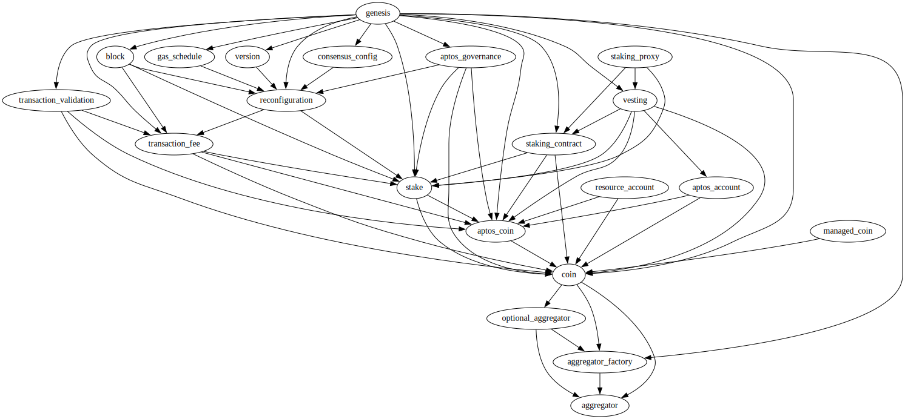
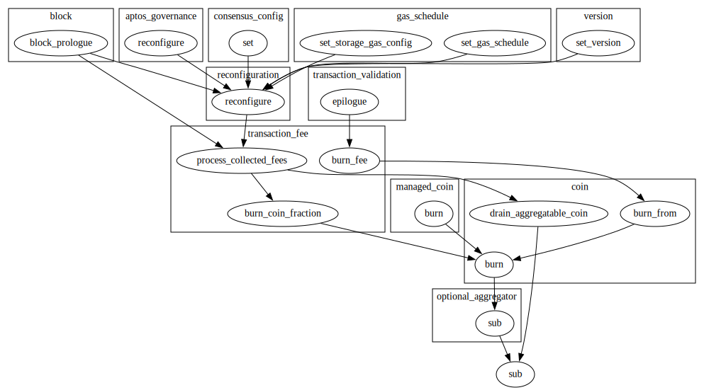
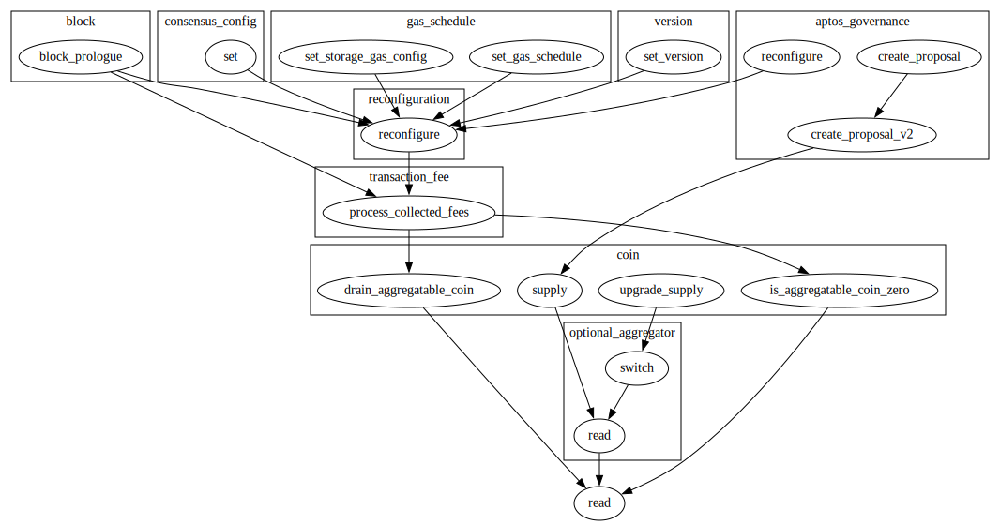

# Module `0x1::aggregator`

This module provides an interface for aggregators. Aggregators are similar to
unsigned integers and support addition and subtraction (aborting on underflow
or on overflowing a custom upper limit). The difference from integers is that
aggregators allow to perform both additions and subtractions in parallel across
multiple transactions, enabling parallel execution. For example, if the first
transaction is doing <code><a href="aggregator.md#0x1_aggregator_add">add</a>(X, 1)</code> for aggregator resource <code>X</code>, and the second
is doing <code><a href="aggregator.md#0x1_aggregator_sub">sub</a>(X,3)</code>, they can be executed in parallel avoiding a read-modify-write
dependency.
However, reading the aggregator value (i.e. calling <code><a href="aggregator.md#0x1_aggregator_read">read</a>(X)</code>) is an expensive
operation and should be avoided as much as possible because it reduces the
parallelism. Moreover, **aggregators can only be created by Aptos Framework (0x1)
at the moment.**

-  [Struct `Aggregator`](#0x1_aggregator_Aggregator)
-  [Constants](#@Constants_0)
-  [Function `limit`](#0x1_aggregator_limit)
-  [Function `add`](#0x1_aggregator_add)
-  [Function `sub`](#0x1_aggregator_sub)
-  [Function `read`](#0x1_aggregator_read)
-  [Function `destroy`](#0x1_aggregator_destroy)
-  [Specification](#@Specification_1)
    -  [Function `add`](#@Specification_1_add)
    -  [Function `sub`](#@Specification_1_sub)
    -  [Function `read`](#@Specification_1_read)
    -  [Function `destroy`](#@Specification_1_destroy)

<pre><code></code></pre>

Show all the modules that "aggregator" depends on directly or indirectly

Show all the modules that depend on "aggregator" directly or indirectly

## Struct `Aggregator`

Represents an integer which supports parallel additions and subtractions
across multiple transactions. See the module description for more details.

<pre><code><b>struct</b> <a href="aggregator.md#0x1_aggregator_Aggregator">Aggregator</a> <b>has</b> store
</code></pre>

Fields

<dl>
<dt>
<code>handle: <b>address</b></code>
</dt>
<dd>

</dd>
<dt>
<code>key: <b>address</b></code>
</dt>
<dd>

</dd>
<dt>
<code>limit: u128</code>
</dt>
<dd>

</dd>
</dl>

## Constants

The value of aggregator overflows. Raised by native code.

<pre><code><b>const</b> <a href="aggregator.md#0x1_aggregator_EAGGREGATOR_OVERFLOW">EAGGREGATOR_OVERFLOW</a>: u64 = 1;
</code></pre>

The value of aggregator underflows (goes below zero). Raised by native code.

<pre><code><b>const</b> <a href="aggregator.md#0x1_aggregator_EAGGREGATOR_UNDERFLOW">EAGGREGATOR_UNDERFLOW</a>: u64 = 2;
</code></pre>

Aggregator feature is not supported. Raised by native code.

<pre><code><b>const</b> <a href="aggregator.md#0x1_aggregator_ENOT_SUPPORTED">ENOT_SUPPORTED</a>: u64 = 3;
</code></pre>

## Function `limit`

Returns <code>limit</code> exceeding which aggregator overflows.

<pre><code><b>public</b> <b>fun</b> <a href="aggregator.md#0x1_aggregator_limit">limit</a>(<a href="aggregator.md#0x1_aggregator">aggregator</a>: &<a href="aggregator.md#0x1_aggregator_Aggregator">aggregator::Aggregator</a>): u128
</code></pre>

Implementation

<pre><code><b>public</b> <b>fun</b> <a href="aggregator.md#0x1_aggregator_limit">limit</a>(<a href="aggregator.md#0x1_aggregator">aggregator</a>: &<a href="aggregator.md#0x1_aggregator_Aggregator">Aggregator</a>): u128 {
    <a href="aggregator.md#0x1_aggregator">aggregator</a>.limit
}
</code></pre>

Show all the functions that "limit" calls

Show all the functions that call "limit"

## Function `add`

Adds <code>value</code> to aggregator. Aborts on overflowing the limit.

<pre><code><b>public</b> <b>fun</b> <a href="aggregator.md#0x1_aggregator_add">add</a>(<a href="aggregator.md#0x1_aggregator">aggregator</a>: &<b>mut</b> <a href="aggregator.md#0x1_aggregator_Aggregator">aggregator::Aggregator</a>, value: u128)
</code></pre>

Implementation

<pre><code><b>public</b> <b>native</b> <b>fun</b> <a href="aggregator.md#0x1_aggregator_add">add</a>(<a href="aggregator.md#0x1_aggregator">aggregator</a>: &<b>mut</b> <a href="aggregator.md#0x1_aggregator_Aggregator">Aggregator</a>, value: u128);
</code></pre>

Show all the functions that "add" calls

Show all the functions that call "add"

## Function `sub`

Subtracts <code>value</code> from aggregator. Aborts on going below zero.

<pre><code><b>public</b> <b>fun</b> <a href="aggregator.md#0x1_aggregator_sub">sub</a>(<a href="aggregator.md#0x1_aggregator">aggregator</a>: &<b>mut</b> <a href="aggregator.md#0x1_aggregator_Aggregator">aggregator::Aggregator</a>, value: u128)
</code></pre>

Implementation

<pre><code><b>public</b> <b>native</b> <b>fun</b> <a href="aggregator.md#0x1_aggregator_sub">sub</a>(<a href="aggregator.md#0x1_aggregator">aggregator</a>: &<b>mut</b> <a href="aggregator.md#0x1_aggregator_Aggregator">Aggregator</a>, value: u128);
</code></pre>

Show all the functions that "sub" calls

Show all the functions that call "sub"

## Function `read`

Returns a value stored in this aggregator.

<pre><code><b>public</b> <b>fun</b> <a href="aggregator.md#0x1_aggregator_read">read</a>(<a href="aggregator.md#0x1_aggregator">aggregator</a>: &<a href="aggregator.md#0x1_aggregator_Aggregator">aggregator::Aggregator</a>): u128
</code></pre>

Implementation

<pre><code><b>public</b> <b>native</b> <b>fun</b> <a href="aggregator.md#0x1_aggregator_read">read</a>(<a href="aggregator.md#0x1_aggregator">aggregator</a>: &<a href="aggregator.md#0x1_aggregator_Aggregator">Aggregator</a>): u128;
</code></pre>

Show all the functions that "read" calls

Show all the functions that call "read"

## Function `destroy`

Destroys an aggregator and removes it from its <code>AggregatorFactory</code>.

<pre><code><b>public</b> <b>fun</b> <a href="aggregator.md#0x1_aggregator_destroy">destroy</a>(<a href="aggregator.md#0x1_aggregator">aggregator</a>: <a href="aggregator.md#0x1_aggregator_Aggregator">aggregator::Aggregator</a>)
</code></pre>

Implementation

<pre><code><b>public</b> <b>native</b> <b>fun</b> <a href="aggregator.md#0x1_aggregator_destroy">destroy</a>(<a href="aggregator.md#0x1_aggregator">aggregator</a>: <a href="aggregator.md#0x1_aggregator_Aggregator">Aggregator</a>);
</code></pre>

Show all the functions that "destroy" calls

Show all the functions that call "destroy"

## Specification

<pre><code><b>pragma</b> verify = <b>true</b>;
</code></pre>

### Function `add`

<pre><code><b>public</b> <b>fun</b> <a href="aggregator.md#0x1_aggregator_add">add</a>(<a href="aggregator.md#0x1_aggregator">aggregator</a>: &<b>mut</b> <a href="aggregator.md#0x1_aggregator_Aggregator">aggregator::Aggregator</a>, value: u128)
</code></pre>

<pre><code><b>pragma</b> opaque;
<b>aborts_if</b> !<a href="aggregator.md#0x1_aggregator_spec_aggreator_exists">spec_aggreator_exists</a>(<a href="aggregator.md#0x1_aggregator">aggregator</a>);
</code></pre>

### Function `sub`

<pre><code><b>public</b> <b>fun</b> <a href="aggregator.md#0x1_aggregator_sub">sub</a>(<a href="aggregator.md#0x1_aggregator">aggregator</a>: &<b>mut</b> <a href="aggregator.md#0x1_aggregator_Aggregator">aggregator::Aggregator</a>, value: u128)
</code></pre>

<pre><code><b>pragma</b> opaque;
<b>aborts_if</b> !<a href="aggregator.md#0x1_aggregator_spec_aggreator_exists">spec_aggreator_exists</a>(<a href="aggregator.md#0x1_aggregator">aggregator</a>);
</code></pre>

### Function `read`

<pre><code><b>public</b> <b>fun</b> <a href="aggregator.md#0x1_aggregator_read">read</a>(<a href="aggregator.md#0x1_aggregator">aggregator</a>: &<a href="aggregator.md#0x1_aggregator_Aggregator">aggregator::Aggregator</a>): u128
</code></pre>

<pre><code><b>pragma</b> opaque;
<b>aborts_if</b> !<a href="aggregator.md#0x1_aggregator_spec_aggreator_exists">spec_aggreator_exists</a>(<a href="aggregator.md#0x1_aggregator">aggregator</a>);
</code></pre>

### Function `destroy`

<pre><code><b>public</b> <b>fun</b> <a href="aggregator.md#0x1_aggregator_destroy">destroy</a>(<a href="aggregator.md#0x1_aggregator">aggregator</a>: <a href="aggregator.md#0x1_aggregator_Aggregator">aggregator::Aggregator</a>)
</code></pre>

<pre><code><b>pragma</b> opaque;
<b>aborts_if</b> <b>false</b>;
</code></pre>

<pre><code><b>fun</b> <a href="aggregator.md#0x1_aggregator_spec_aggreator_exists">spec_aggreator_exists</a>(<a href="aggregator.md#0x1_aggregator">aggregator</a>: <a href="aggregator.md#0x1_aggregator_Aggregator">Aggregator</a>): bool;
</code></pre>

[move-book]: https://move-language.github.io/move/introduction.html
