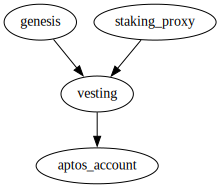
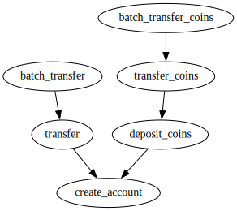
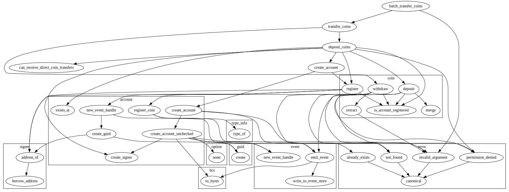
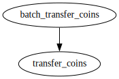
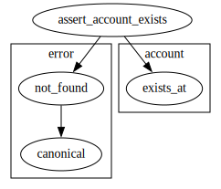
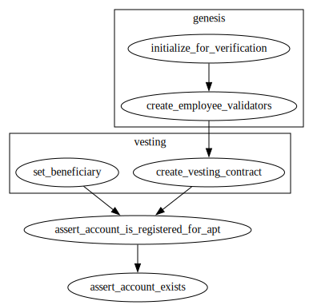
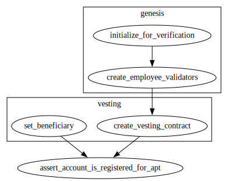
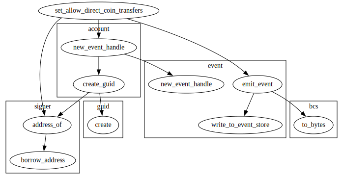

# Module `0x1::aptos_account`

-  [Resource `DirectTransferConfig`](#0x1_aptos_account_DirectTransferConfig)
-  [Struct `DirectCoinTransferConfigUpdatedEvent`](#0x1_aptos_account_DirectCoinTransferConfigUpdatedEvent)
-  [Constants](#@Constants_0)
-  [Function `create_account`](#0x1_aptos_account_create_account)
-  [Function `batch_transfer`](#0x1_aptos_account_batch_transfer)
-  [Function `transfer`](#0x1_aptos_account_transfer)
-  [Function `batch_transfer_coins`](#0x1_aptos_account_batch_transfer_coins)
-  [Function `transfer_coins`](#0x1_aptos_account_transfer_coins)
-  [Function `deposit_coins`](#0x1_aptos_account_deposit_coins)
-  [Function `assert_account_exists`](#0x1_aptos_account_assert_account_exists)
-  [Function `assert_account_is_registered_for_apt`](#0x1_aptos_account_assert_account_is_registered_for_apt)
-  [Function `set_allow_direct_coin_transfers`](#0x1_aptos_account_set_allow_direct_coin_transfers)
-  [Function `can_receive_direct_coin_transfers`](#0x1_aptos_account_can_receive_direct_coin_transfers)
-  [Specification](#@Specification_1)
    -  [Function `create_account`](#@Specification_1_create_account)
    -  [Function `transfer`](#@Specification_1_transfer)
    -  [Function `assert_account_exists`](#@Specification_1_assert_account_exists)
    -  [Function `assert_account_is_registered_for_apt`](#@Specification_1_assert_account_is_registered_for_apt)

<pre><code><b>use</b> <a href="account.md#0x1_account">0x1::account</a>;
<b>use</b> <a href="aptos_coin.md#0x1_aptos_coin">0x1::aptos_coin</a>;
<b>use</b> <a href="coin.md#0x1_coin">0x1::coin</a>;
<b>use</b> <a href="../../aptos-stdlib/../move-stdlib/doc/error.md#0x1_error">0x1::error</a>;
<b>use</b> <a href="event.md#0x1_event">0x1::event</a>;
<b>use</b> <a href="../../aptos-stdlib/../move-stdlib/doc/signer.md#0x1_signer">0x1::signer</a>;
</code></pre>

Show all the modules that "aptos_account" depends on directly or indirectly

Show all the modules that depend on "aptos_account" directly or indirectly

## Resource `DirectTransferConfig`

Configuration for whether an account can receive direct transfers of coins that they have not registered.

By default, this is enabled. Users can opt-out by disabling at any time.

<pre><code><b>struct</b> <a href="aptos_account.md#0x1_aptos_account_DirectTransferConfig">DirectTransferConfig</a> <b>has</b> key
</code></pre>

Fields

<dl>
<dt>
<code>allow_arbitrary_coin_transfers: bool</code>
</dt>
<dd>

</dd>
<dt>
<code>update_coin_transfer_events: <a href="event.md#0x1_event_EventHandle">event::EventHandle</a>&lt;<a href="aptos_account.md#0x1_aptos_account_DirectCoinTransferConfigUpdatedEvent">aptos_account::DirectCoinTransferConfigUpdatedEvent</a>&gt;</code>
</dt>
<dd>

</dd>
</dl>

## Struct `DirectCoinTransferConfigUpdatedEvent`

Event emitted when an account's direct coins transfer config is updated.

<pre><code><b>struct</b> <a href="aptos_account.md#0x1_aptos_account_DirectCoinTransferConfigUpdatedEvent">DirectCoinTransferConfigUpdatedEvent</a> <b>has</b> drop, store
</code></pre>

Fields

<dl>
<dt>
<code>new_allow_direct_transfers: bool</code>
</dt>
<dd>

</dd>
</dl>

## Constants

Account opted out of receiving coins that they did not register to receive.

<pre><code><b>const</b> <a href="aptos_account.md#0x1_aptos_account_EACCOUNT_DOES_NOT_ACCEPT_DIRECT_COIN_TRANSFERS">EACCOUNT_DOES_NOT_ACCEPT_DIRECT_COIN_TRANSFERS</a>: u64 = 3;
</code></pre>

Account opted out of directly receiving NFT tokens.

<pre><code><b>const</b> <a href="aptos_account.md#0x1_aptos_account_EACCOUNT_DOES_NOT_ACCEPT_DIRECT_TOKEN_TRANSFERS">EACCOUNT_DOES_NOT_ACCEPT_DIRECT_TOKEN_TRANSFERS</a>: u64 = 4;
</code></pre>

Account does not exist.

<pre><code><b>const</b> <a href="aptos_account.md#0x1_aptos_account_EACCOUNT_NOT_FOUND">EACCOUNT_NOT_FOUND</a>: u64 = 1;
</code></pre>

Account is not registered to receive APT.

<pre><code><b>const</b> <a href="aptos_account.md#0x1_aptos_account_EACCOUNT_NOT_REGISTERED_FOR_APT">EACCOUNT_NOT_REGISTERED_FOR_APT</a>: u64 = 2;
</code></pre>

The lengths of the recipients and amounts lists don't match.

<pre><code><b>const</b> <a href="aptos_account.md#0x1_aptos_account_EMISMATCHING_RECIPIENTS_AND_AMOUNTS_LENGTH">EMISMATCHING_RECIPIENTS_AND_AMOUNTS_LENGTH</a>: u64 = 5;
</code></pre>

## Function `create_account`

Basic account creation methods.

<pre><code><b>public</b> entry <b>fun</b> <a href="aptos_account.md#0x1_aptos_account_create_account">create_account</a>(auth_key: <b>address</b>)
</code></pre>

Implementation

<pre><code><b>public</b> entry <b>fun</b> <a href="aptos_account.md#0x1_aptos_account_create_account">create_account</a>(auth_key: <b>address</b>) {
    <b>let</b> <a href="../../aptos-stdlib/../move-stdlib/doc/signer.md#0x1_signer">signer</a> = <a href="account.md#0x1_account_create_account">account::create_account</a>(auth_key);
    <a href="coin.md#0x1_coin_register">coin::register</a>&lt;AptosCoin&gt;(&<a href="../../aptos-stdlib/../move-stdlib/doc/signer.md#0x1_signer">signer</a>);
}
</code></pre>

Show all the functions that "create_account" calls

Show all the functions that call "create_account"

## Function `batch_transfer`

Batch version of APT transfer.

<pre><code><b>public</b> entry <b>fun</b> <a href="aptos_account.md#0x1_aptos_account_batch_transfer">batch_transfer</a>(source: &<a href="../../aptos-stdlib/../move-stdlib/doc/signer.md#0x1_signer">signer</a>, recipients: <a href="../../aptos-stdlib/../move-stdlib/doc/vector.md#0x1_vector">vector</a>&lt;<b>address</b>&gt;, amounts: <a href="../../aptos-stdlib/../move-stdlib/doc/vector.md#0x1_vector">vector</a>&lt;u64&gt;)
</code></pre>

Implementation

<pre><code><b>public</b> entry <b>fun</b> <a href="aptos_account.md#0x1_aptos_account_batch_transfer">batch_transfer</a>(source: &<a href="../../aptos-stdlib/../move-stdlib/doc/signer.md#0x1_signer">signer</a>, recipients: <a href="../../aptos-stdlib/../move-stdlib/doc/vector.md#0x1_vector">vector</a>&lt;<b>address</b>&gt;, amounts: <a href="../../aptos-stdlib/../move-stdlib/doc/vector.md#0x1_vector">vector</a>&lt;u64&gt;) {
    <b>let</b> recipients_len = <a href="../../aptos-stdlib/../move-stdlib/doc/vector.md#0x1_vector_length">vector::length</a>(&recipients);
    <b>assert</b>!(
        recipients_len == <a href="../../aptos-stdlib/../move-stdlib/doc/vector.md#0x1_vector_length">vector::length</a>(&amounts),
        <a href="../../aptos-stdlib/../move-stdlib/doc/error.md#0x1_error_invalid_argument">error::invalid_argument</a>(<a href="aptos_account.md#0x1_aptos_account_EMISMATCHING_RECIPIENTS_AND_AMOUNTS_LENGTH">EMISMATCHING_RECIPIENTS_AND_AMOUNTS_LENGTH</a>),
    );

    <b>let</b> i = 0;
    <b>while</b> (i &lt; recipients_len) {
        <b>let</b> <b>to</b> = *<a href="../../aptos-stdlib/../move-stdlib/doc/vector.md#0x1_vector_borrow">vector::borrow</a>(&recipients, i);
        <b>let</b> amount = *<a href="../../aptos-stdlib/../move-stdlib/doc/vector.md#0x1_vector_borrow">vector::borrow</a>(&amounts, i);
        <a href="aptos_account.md#0x1_aptos_account_transfer">transfer</a>(source, <b>to</b>, amount);
        i = i + 1;
    };
}
</code></pre>

Show all the functions that "batch_transfer" calls

Show all the functions that call "batch_transfer"

## Function `transfer`

Convenient function to transfer APT to a recipient account that might not exist.
This would create the recipient account first, which also registers it to receive APT, before transferring.

<pre><code><b>public</b> entry <b>fun</b> <a href="aptos_account.md#0x1_aptos_account_transfer">transfer</a>(source: &<a href="../../aptos-stdlib/../move-stdlib/doc/signer.md#0x1_signer">signer</a>, <b>to</b>: <b>address</b>, amount: u64)
</code></pre>

Implementation

<pre><code><b>public</b> entry <b>fun</b> <a href="aptos_account.md#0x1_aptos_account_transfer">transfer</a>(source: &<a href="../../aptos-stdlib/../move-stdlib/doc/signer.md#0x1_signer">signer</a>, <b>to</b>: <b>address</b>, amount: u64) {
    <b>if</b> (!<a href="account.md#0x1_account_exists_at">account::exists_at</a>(<b>to</b>)) {
        <a href="aptos_account.md#0x1_aptos_account_create_account">create_account</a>(<b>to</b>)
    };
    <a href="coin.md#0x1_coin_transfer">coin::transfer</a>&lt;AptosCoin&gt;(source, <b>to</b>, amount)
}
</code></pre>

Show all the functions that "transfer" calls

Show all the functions that call "transfer"

## Function `batch_transfer_coins`

Batch version of transfer_coins.

<pre><code><b>public</b> entry <b>fun</b> <a href="aptos_account.md#0x1_aptos_account_batch_transfer_coins">batch_transfer_coins</a>&lt;CoinType&gt;(from: &<a href="../../aptos-stdlib/../move-stdlib/doc/signer.md#0x1_signer">signer</a>, recipients: <a href="../../aptos-stdlib/../move-stdlib/doc/vector.md#0x1_vector">vector</a>&lt;<b>address</b>&gt;, amounts: <a href="../../aptos-stdlib/../move-stdlib/doc/vector.md#0x1_vector">vector</a>&lt;u64&gt;)
</code></pre>

Implementation

<pre><code><b>public</b> entry <b>fun</b> <a href="aptos_account.md#0x1_aptos_account_batch_transfer_coins">batch_transfer_coins</a>&lt;CoinType&gt;(
    from: &<a href="../../aptos-stdlib/../move-stdlib/doc/signer.md#0x1_signer">signer</a>, recipients: <a href="../../aptos-stdlib/../move-stdlib/doc/vector.md#0x1_vector">vector</a>&lt;<b>address</b>&gt;, amounts: <a href="../../aptos-stdlib/../move-stdlib/doc/vector.md#0x1_vector">vector</a>&lt;u64&gt;) <b>acquires</b> <a href="aptos_account.md#0x1_aptos_account_DirectTransferConfig">DirectTransferConfig</a> {
    <b>let</b> recipients_len = <a href="../../aptos-stdlib/../move-stdlib/doc/vector.md#0x1_vector_length">vector::length</a>(&recipients);
    <b>assert</b>!(
        recipients_len == <a href="../../aptos-stdlib/../move-stdlib/doc/vector.md#0x1_vector_length">vector::length</a>(&amounts),
        <a href="../../aptos-stdlib/../move-stdlib/doc/error.md#0x1_error_invalid_argument">error::invalid_argument</a>(<a href="aptos_account.md#0x1_aptos_account_EMISMATCHING_RECIPIENTS_AND_AMOUNTS_LENGTH">EMISMATCHING_RECIPIENTS_AND_AMOUNTS_LENGTH</a>),
    );

    <b>let</b> i = 0;
    <b>while</b> (i &lt; recipients_len) {
        <b>let</b> <b>to</b> = *<a href="../../aptos-stdlib/../move-stdlib/doc/vector.md#0x1_vector_borrow">vector::borrow</a>(&recipients, i);
        <b>let</b> amount = *<a href="../../aptos-stdlib/../move-stdlib/doc/vector.md#0x1_vector_borrow">vector::borrow</a>(&amounts, i);
        <a href="aptos_account.md#0x1_aptos_account_transfer_coins">transfer_coins</a>&lt;CoinType&gt;(from, <b>to</b>, amount);
        i = i + 1;
    };
}
</code></pre>

Show all the functions that "batch_transfer_coins" calls

Show all the functions that call "batch_transfer_coins"

## Function `transfer_coins`

Convenient function to transfer a custom CoinType to a recipient account that might not exist.
This would create the recipient account first and register it to receive the CoinType, before transferring.

<pre><code><b>public</b> entry <b>fun</b> <a href="aptos_account.md#0x1_aptos_account_transfer_coins">transfer_coins</a>&lt;CoinType&gt;(from: &<a href="../../aptos-stdlib/../move-stdlib/doc/signer.md#0x1_signer">signer</a>, <b>to</b>: <b>address</b>, amount: u64)
</code></pre>

Implementation

<pre><code><b>public</b> entry <b>fun</b> <a href="aptos_account.md#0x1_aptos_account_transfer_coins">transfer_coins</a>&lt;CoinType&gt;(from: &<a href="../../aptos-stdlib/../move-stdlib/doc/signer.md#0x1_signer">signer</a>, <b>to</b>: <b>address</b>, amount: u64) <b>acquires</b> <a href="aptos_account.md#0x1_aptos_account_DirectTransferConfig">DirectTransferConfig</a> {
    <a href="aptos_account.md#0x1_aptos_account_deposit_coins">deposit_coins</a>(<b>to</b>, <a href="coin.md#0x1_coin_withdraw">coin::withdraw</a>&lt;CoinType&gt;(from, amount));
}
</code></pre>

Show all the functions that "transfer_coins" calls

Show all the functions that call "transfer_coins"

## Function `deposit_coins`

Convenient function to deposit a custom CoinType into a recipient account that might not exist.
This would create the recipient account first and register it to receive the CoinType, before transferring.

<pre><code><b>public</b> <b>fun</b> <a href="aptos_account.md#0x1_aptos_account_deposit_coins">deposit_coins</a>&lt;CoinType&gt;(<b>to</b>: <b>address</b>, coins: <a href="coin.md#0x1_coin_Coin">coin::Coin</a>&lt;CoinType&gt;)
</code></pre>

Implementation

<pre><code><b>public</b> <b>fun</b> <a href="aptos_account.md#0x1_aptos_account_deposit_coins">deposit_coins</a>&lt;CoinType&gt;(<b>to</b>: <b>address</b>, coins: Coin&lt;CoinType&gt;) <b>acquires</b> <a href="aptos_account.md#0x1_aptos_account_DirectTransferConfig">DirectTransferConfig</a> {
    <b>if</b> (!<a href="account.md#0x1_account_exists_at">account::exists_at</a>(<b>to</b>)) {
        <a href="aptos_account.md#0x1_aptos_account_create_account">create_account</a>(<b>to</b>);
    };
    <b>if</b> (!<a href="coin.md#0x1_coin_is_account_registered">coin::is_account_registered</a>&lt;CoinType&gt;(<b>to</b>)) {
        <b>assert</b>!(
            <a href="aptos_account.md#0x1_aptos_account_can_receive_direct_coin_transfers">can_receive_direct_coin_transfers</a>(<b>to</b>),
            <a href="../../aptos-stdlib/../move-stdlib/doc/error.md#0x1_error_permission_denied">error::permission_denied</a>(<a href="aptos_account.md#0x1_aptos_account_EACCOUNT_DOES_NOT_ACCEPT_DIRECT_COIN_TRANSFERS">EACCOUNT_DOES_NOT_ACCEPT_DIRECT_COIN_TRANSFERS</a>),
        );
        <a href="coin.md#0x1_coin_register">coin::register</a>&lt;CoinType&gt;(&<a href="account.md#0x1_account_create_signer">account::create_signer</a>(<b>to</b>));
    };
    <a href="coin.md#0x1_coin_deposit">coin::deposit</a>&lt;CoinType&gt;(<b>to</b>, coins)
}
</code></pre>

Show all the functions that "deposit_coins" calls

Show all the functions that call "deposit_coins"

## Function `assert_account_exists`

<pre><code><b>public</b> <b>fun</b> <a href="aptos_account.md#0x1_aptos_account_assert_account_exists">assert_account_exists</a>(addr: <b>address</b>)
</code></pre>

Implementation

<pre><code><b>public</b> <b>fun</b> <a href="aptos_account.md#0x1_aptos_account_assert_account_exists">assert_account_exists</a>(addr: <b>address</b>) {
    <b>assert</b>!(<a href="account.md#0x1_account_exists_at">account::exists_at</a>(addr), <a href="../../aptos-stdlib/../move-stdlib/doc/error.md#0x1_error_not_found">error::not_found</a>(<a href="aptos_account.md#0x1_aptos_account_EACCOUNT_NOT_FOUND">EACCOUNT_NOT_FOUND</a>));
}
</code></pre>

Show all the functions that "assert_account_exists" calls

Show all the functions that call "assert_account_exists"

## Function `assert_account_is_registered_for_apt`

<pre><code><b>public</b> <b>fun</b> <a href="aptos_account.md#0x1_aptos_account_assert_account_is_registered_for_apt">assert_account_is_registered_for_apt</a>(addr: <b>address</b>)
</code></pre>

Implementation

<pre><code><b>public</b> <b>fun</b> <a href="aptos_account.md#0x1_aptos_account_assert_account_is_registered_for_apt">assert_account_is_registered_for_apt</a>(addr: <b>address</b>) {
    <a href="aptos_account.md#0x1_aptos_account_assert_account_exists">assert_account_exists</a>(addr);
    <b>assert</b>!(<a href="coin.md#0x1_coin_is_account_registered">coin::is_account_registered</a>&lt;AptosCoin&gt;(addr), <a href="../../aptos-stdlib/../move-stdlib/doc/error.md#0x1_error_not_found">error::not_found</a>(<a href="aptos_account.md#0x1_aptos_account_EACCOUNT_NOT_REGISTERED_FOR_APT">EACCOUNT_NOT_REGISTERED_FOR_APT</a>));
}
</code></pre>

Show all the functions that "assert_account_is_registered_for_apt" calls

Show all the functions that call "assert_account_is_registered_for_apt"

## Function `set_allow_direct_coin_transfers`

Set whether <code><a href="account.md#0x1_account">account</a></code> can receive direct transfers of coins that they have not explicitly registered to receive.

<pre><code><b>public</b> entry <b>fun</b> <a href="aptos_account.md#0x1_aptos_account_set_allow_direct_coin_transfers">set_allow_direct_coin_transfers</a>(<a href="account.md#0x1_account">account</a>: &<a href="../../aptos-stdlib/../move-stdlib/doc/signer.md#0x1_signer">signer</a>, allow: bool)
</code></pre>

Implementation

<pre><code><b>public</b> entry <b>fun</b> <a href="aptos_account.md#0x1_aptos_account_set_allow_direct_coin_transfers">set_allow_direct_coin_transfers</a>(<a href="account.md#0x1_account">account</a>: &<a href="../../aptos-stdlib/../move-stdlib/doc/signer.md#0x1_signer">signer</a>, allow: bool) <b>acquires</b> <a href="aptos_account.md#0x1_aptos_account_DirectTransferConfig">DirectTransferConfig</a> {
    <b>let</b> addr = <a href="../../aptos-stdlib/../move-stdlib/doc/signer.md#0x1_signer_address_of">signer::address_of</a>(<a href="account.md#0x1_account">account</a>);
    <b>if</b> (<b>exists</b>&lt;<a href="aptos_account.md#0x1_aptos_account_DirectTransferConfig">DirectTransferConfig</a>&gt;(addr)) {
        <b>let</b> direct_transfer_config = <b>borrow_global_mut</b>&lt;<a href="aptos_account.md#0x1_aptos_account_DirectTransferConfig">DirectTransferConfig</a>&gt;(addr);
        // Short-circuit <b>to</b> avoid emitting an <a href="event.md#0x1_event">event</a> <b>if</b> direct transfer config is not changing.
        <b>if</b> (direct_transfer_config.allow_arbitrary_coin_transfers == allow) {
            <b>return</b>
        };

        direct_transfer_config.allow_arbitrary_coin_transfers = allow;
        emit_event(
            &<b>mut</b> direct_transfer_config.update_coin_transfer_events,
            <a href="aptos_account.md#0x1_aptos_account_DirectCoinTransferConfigUpdatedEvent">DirectCoinTransferConfigUpdatedEvent</a> { new_allow_direct_transfers: allow });
    } <b>else</b> {
        <b>let</b> direct_transfer_config = <a href="aptos_account.md#0x1_aptos_account_DirectTransferConfig">DirectTransferConfig</a> {
            allow_arbitrary_coin_transfers: allow,
            update_coin_transfer_events: new_event_handle&lt;<a href="aptos_account.md#0x1_aptos_account_DirectCoinTransferConfigUpdatedEvent">DirectCoinTransferConfigUpdatedEvent</a>&gt;(<a href="account.md#0x1_account">account</a>),
        };
        emit_event(
            &<b>mut</b> direct_transfer_config.update_coin_transfer_events,
            <a href="aptos_account.md#0x1_aptos_account_DirectCoinTransferConfigUpdatedEvent">DirectCoinTransferConfigUpdatedEvent</a> { new_allow_direct_transfers: allow });
        <b>move_to</b>(<a href="account.md#0x1_account">account</a>, direct_transfer_config);
    };
}
</code></pre>

Show all the functions that "set_allow_direct_coin_transfers" calls

Show all the functions that call "set_allow_direct_coin_transfers"

## Function `can_receive_direct_coin_transfers`

Return true if <code><a href="account.md#0x1_account">account</a></code> can receive direct transfers of coins that they have not explicitly registered to
receive.

By default, this returns true if an account has not explicitly set whether the can receive direct transfers.

<pre><code><b>public</b> <b>fun</b> <a href="aptos_account.md#0x1_aptos_account_can_receive_direct_coin_transfers">can_receive_direct_coin_transfers</a>(<a href="account.md#0x1_account">account</a>: <b>address</b>): bool
</code></pre>

Implementation

<pre><code><b>public</b> <b>fun</b> <a href="aptos_account.md#0x1_aptos_account_can_receive_direct_coin_transfers">can_receive_direct_coin_transfers</a>(<a href="account.md#0x1_account">account</a>: <b>address</b>): bool <b>acquires</b> <a href="aptos_account.md#0x1_aptos_account_DirectTransferConfig">DirectTransferConfig</a> {
    !<b>exists</b>&lt;<a href="aptos_account.md#0x1_aptos_account_DirectTransferConfig">DirectTransferConfig</a>&gt;(<a href="account.md#0x1_account">account</a>) ||
        <b>borrow_global</b>&lt;<a href="aptos_account.md#0x1_aptos_account_DirectTransferConfig">DirectTransferConfig</a>&gt;(<a href="account.md#0x1_account">account</a>).allow_arbitrary_coin_transfers
}
</code></pre>

Show all the functions that "can_receive_direct_coin_transfers" calls

Show all the functions that call "can_receive_direct_coin_transfers"

## Specification

<pre><code><b>pragma</b> verify = <b>true</b>;
<b>pragma</b> aborts_if_is_strict;
</code></pre>

### Function `create_account`

<pre><code><b>public</b> entry <b>fun</b> <a href="aptos_account.md#0x1_aptos_account_create_account">create_account</a>(auth_key: <b>address</b>)
</code></pre>

Check if the bytes of the auth_key is 32.
The Account does not exist under the auth_key before creating the account.
Limit the address of auth_key is not @vm_reserved / @aptos_framework / @aptos_toke.

<pre><code><b>include</b> <a href="aptos_account.md#0x1_aptos_account_CreateAccount">CreateAccount</a>;
<b>ensures</b> <b>exists</b>&lt;<a href="account.md#0x1_account_Account">account::Account</a>&gt;(auth_key);
<b>ensures</b> <b>exists</b>&lt;<a href="coin.md#0x1_coin_CoinStore">coin::CoinStore</a>&lt;AptosCoin&gt;&gt;(auth_key);
</code></pre>

<pre><code><b>schema</b> <a href="aptos_account.md#0x1_aptos_account_CreateAccount">CreateAccount</a> {
    auth_key: <b>address</b>;
    <b>aborts_if</b> <b>exists</b>&lt;<a href="account.md#0x1_account_Account">account::Account</a>&gt;(auth_key);
    <b>aborts_if</b> <a href="aptos_account.md#0x1_aptos_account_length_judgment">length_judgment</a>(auth_key);
    <b>aborts_if</b> auth_key == @vm_reserved || auth_key == @aptos_framework || auth_key == @aptos_token;
    <b>aborts_if</b> <b>exists</b>&lt;<a href="coin.md#0x1_coin_CoinStore">coin::CoinStore</a>&lt;AptosCoin&gt;&gt;(auth_key);
}
</code></pre>

<pre><code><b>fun</b> <a href="aptos_account.md#0x1_aptos_account_length_judgment">length_judgment</a>(auth_key: <b>address</b>): bool {
   <b>use</b> std::bcs;

   <b>let</b> authentication_key = <a href="../../aptos-stdlib/../move-stdlib/doc/bcs.md#0x1_bcs_to_bytes">bcs::to_bytes</a>(auth_key);
   len(authentication_key) != 32
}
</code></pre>

### Function `transfer`

<pre><code><b>public</b> entry <b>fun</b> <a href="aptos_account.md#0x1_aptos_account_transfer">transfer</a>(source: &<a href="../../aptos-stdlib/../move-stdlib/doc/signer.md#0x1_signer">signer</a>, <b>to</b>: <b>address</b>, amount: u64)
</code></pre>

<pre><code><b>pragma</b> verify = <b>false</b>;
</code></pre>

### Function `assert_account_exists`

<pre><code><b>public</b> <b>fun</b> <a href="aptos_account.md#0x1_aptos_account_assert_account_exists">assert_account_exists</a>(addr: <b>address</b>)
</code></pre>

<pre><code><b>aborts_if</b> !<a href="account.md#0x1_account_exists_at">account::exists_at</a>(addr);
</code></pre>

### Function `assert_account_is_registered_for_apt`

<pre><code><b>public</b> <b>fun</b> <a href="aptos_account.md#0x1_aptos_account_assert_account_is_registered_for_apt">assert_account_is_registered_for_apt</a>(addr: <b>address</b>)
</code></pre>

Check if the address existed.
Check if the AptosCoin under the address existed.

<pre><code><b>aborts_if</b> !<a href="account.md#0x1_account_exists_at">account::exists_at</a>(addr);
<b>aborts_if</b> !<a href="coin.md#0x1_coin_is_account_registered">coin::is_account_registered</a>&lt;AptosCoin&gt;(addr);
</code></pre>

[move-book]: https://move-language.github.io/move/introduction.html
