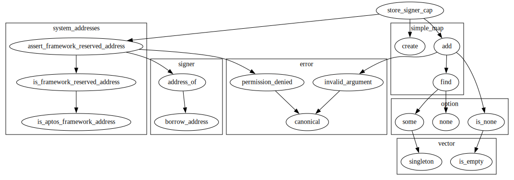
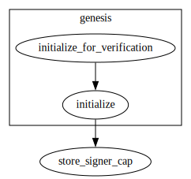
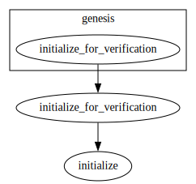
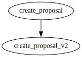
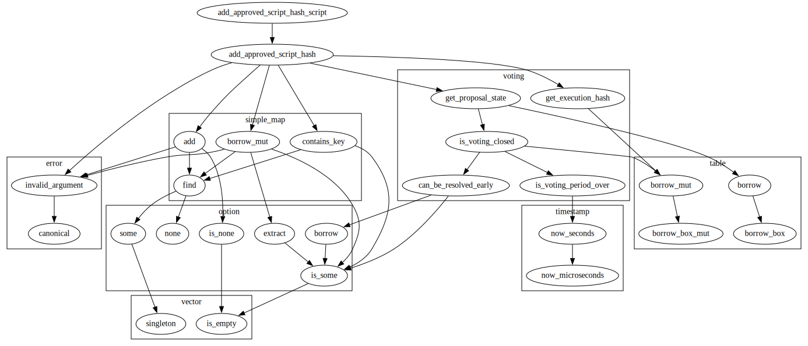
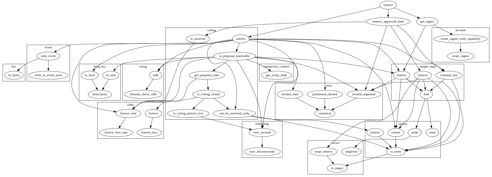
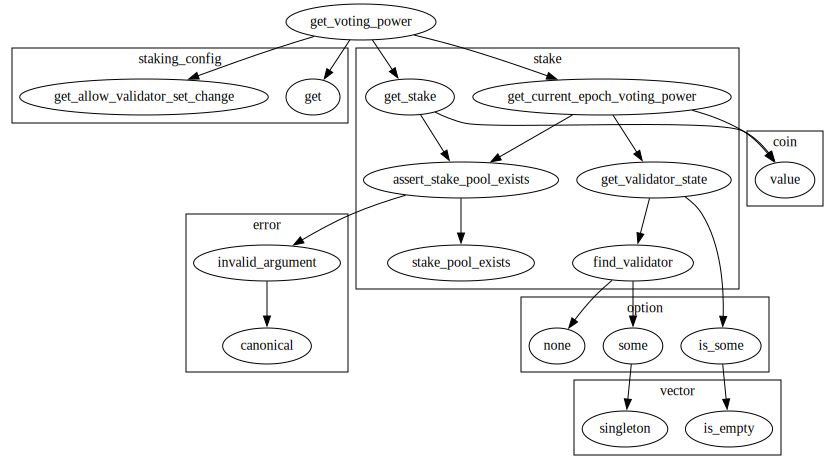
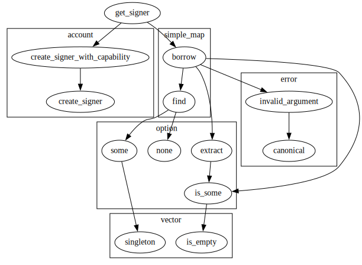
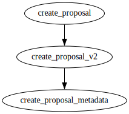
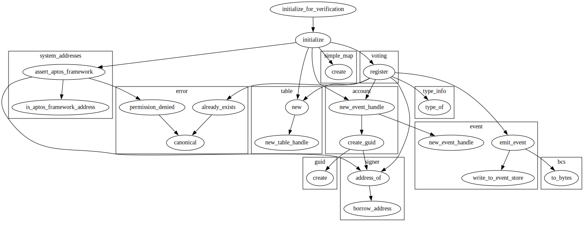

# Module `0x1::aptos_governance`

* AptosGovernance represents the on-chain governance of the Aptos network. Voting power is calculated based on the
* current epoch's voting power of the proposer or voter's backing stake pool. In addition, for it to count,
* the stake pool's lockup needs to be at least as long as the proposal's duration.
*
* It provides the following flow:
* 1. Proposers can create a proposal by calling AptosGovernance::create_proposal. The proposer's backing stake pool
* needs to have the minimum proposer stake required. Off-chain components can subscribe to CreateProposalEvent to
* track proposal creation and proposal ids.
* 2. Voters can vote on a proposal. Their voting power is derived from the backing stake pool. Each stake pool can
* only be used to vote on each proposal exactly once.
*

-  [Resource `GovernanceResponsbility`](#0x1_aptos_governance_GovernanceResponsbility)
-  [Resource `GovernanceConfig`](#0x1_aptos_governance_GovernanceConfig)
-  [Struct `RecordKey`](#0x1_aptos_governance_RecordKey)
-  [Resource `VotingRecords`](#0x1_aptos_governance_VotingRecords)
-  [Resource `ApprovedExecutionHashes`](#0x1_aptos_governance_ApprovedExecutionHashes)
-  [Resource `GovernanceEvents`](#0x1_aptos_governance_GovernanceEvents)
-  [Struct `CreateProposalEvent`](#0x1_aptos_governance_CreateProposalEvent)
-  [Struct `VoteEvent`](#0x1_aptos_governance_VoteEvent)
-  [Struct `UpdateConfigEvent`](#0x1_aptos_governance_UpdateConfigEvent)
-  [Constants](#@Constants_0)
-  [Function `store_signer_cap`](#0x1_aptos_governance_store_signer_cap)
-  [Function `initialize`](#0x1_aptos_governance_initialize)
-  [Function `update_governance_config`](#0x1_aptos_governance_update_governance_config)
-  [Function `get_voting_duration_secs`](#0x1_aptos_governance_get_voting_duration_secs)
-  [Function `get_min_voting_threshold`](#0x1_aptos_governance_get_min_voting_threshold)
-  [Function `get_required_proposer_stake`](#0x1_aptos_governance_get_required_proposer_stake)
-  [Function `create_proposal`](#0x1_aptos_governance_create_proposal)
-  [Function `create_proposal_v2`](#0x1_aptos_governance_create_proposal_v2)
-  [Function `vote`](#0x1_aptos_governance_vote)
-  [Function `add_approved_script_hash_script`](#0x1_aptos_governance_add_approved_script_hash_script)
-  [Function `add_approved_script_hash`](#0x1_aptos_governance_add_approved_script_hash)
-  [Function `resolve`](#0x1_aptos_governance_resolve)
-  [Function `resolve_multi_step_proposal`](#0x1_aptos_governance_resolve_multi_step_proposal)
-  [Function `remove_approved_hash`](#0x1_aptos_governance_remove_approved_hash)
-  [Function `reconfigure`](#0x1_aptos_governance_reconfigure)
-  [Function `get_signer_testnet_only`](#0x1_aptos_governance_get_signer_testnet_only)
-  [Function `get_voting_power`](#0x1_aptos_governance_get_voting_power)
-  [Function `get_signer`](#0x1_aptos_governance_get_signer)
-  [Function `create_proposal_metadata`](#0x1_aptos_governance_create_proposal_metadata)
-  [Function `initialize_for_verification`](#0x1_aptos_governance_initialize_for_verification)
-  [Specification](#@Specification_1)
    -  [Function `reconfigure`](#@Specification_1_reconfigure)

<pre><code><b>use</b> <a href="account.md#0x1_account">0x1::account</a>;
<b>use</b> <a href="aptos_coin.md#0x1_aptos_coin">0x1::aptos_coin</a>;
<b>use</b> <a href="coin.md#0x1_coin">0x1::coin</a>;
<b>use</b> <a href="../../aptos-stdlib/../move-stdlib/doc/error.md#0x1_error">0x1::error</a>;
<b>use</b> <a href="event.md#0x1_event">0x1::event</a>;
<b>use</b> <a href="governance_proposal.md#0x1_governance_proposal">0x1::governance_proposal</a>;
<b>use</b> <a href="../../aptos-stdlib/../move-stdlib/doc/option.md#0x1_option">0x1::option</a>;
<b>use</b> <a href="reconfiguration.md#0x1_reconfiguration">0x1::reconfiguration</a>;
<b>use</b> <a href="../../aptos-stdlib/../move-stdlib/doc/signer.md#0x1_signer">0x1::signer</a>;
<b>use</b> <a href="../../aptos-stdlib/doc/simple_map.md#0x1_simple_map">0x1::simple_map</a>;
<b>use</b> <a href="stake.md#0x1_stake">0x1::stake</a>;
<b>use</b> <a href="staking_config.md#0x1_staking_config">0x1::staking_config</a>;
<b>use</b> <a href="../../aptos-stdlib/../move-stdlib/doc/string.md#0x1_string">0x1::string</a>;
<b>use</b> <a href="system_addresses.md#0x1_system_addresses">0x1::system_addresses</a>;
<b>use</b> <a href="../../aptos-stdlib/doc/table.md#0x1_table">0x1::table</a>;
<b>use</b> <a href="timestamp.md#0x1_timestamp">0x1::timestamp</a>;
<b>use</b> <a href="voting.md#0x1_voting">0x1::voting</a>;
</code></pre>

Show all the modules that "aptos_governance" depends on directly or indirectly

Show all the modules that depend on "aptos_governance" directly or indirectly

## Resource `GovernanceResponsbility`

Store the SignerCapabilities of accounts under the on-chain governance's control.

<pre><code><b>struct</b> <a href="aptos_governance.md#0x1_aptos_governance_GovernanceResponsbility">GovernanceResponsbility</a> <b>has</b> key
</code></pre>

Fields

<dl>
<dt>
<code>signer_caps: <a href="../../aptos-stdlib/doc/simple_map.md#0x1_simple_map_SimpleMap">simple_map::SimpleMap</a>&lt;<b>address</b>, <a href="account.md#0x1_account_SignerCapability">account::SignerCapability</a>&gt;</code>
</dt>
<dd>

</dd>
</dl>

## Resource `GovernanceConfig`

Configurations of the AptosGovernance, set during Genesis and can be updated by the same process offered
by this AptosGovernance module.

<pre><code><b>struct</b> <a href="aptos_governance.md#0x1_aptos_governance_GovernanceConfig">GovernanceConfig</a> <b>has</b> key
</code></pre>

Fields

<dl>
<dt>
<code>min_voting_threshold: u128</code>
</dt>
<dd>

</dd>
<dt>
<code>required_proposer_stake: u64</code>
</dt>
<dd>

</dd>
<dt>
<code>voting_duration_secs: u64</code>
</dt>
<dd>

</dd>
</dl>

## Struct `RecordKey`

<pre><code><b>struct</b> <a href="aptos_governance.md#0x1_aptos_governance_RecordKey">RecordKey</a> <b>has</b> <b>copy</b>, drop, store
</code></pre>

Fields

<dl>
<dt>
<code>stake_pool: <b>address</b></code>
</dt>
<dd>

</dd>
<dt>
<code>proposal_id: u64</code>
</dt>
<dd>

</dd>
</dl>

## Resource `VotingRecords`

Records to track the proposals each stake pool has been used to vote on.

<pre><code><b>struct</b> <a href="aptos_governance.md#0x1_aptos_governance_VotingRecords">VotingRecords</a> <b>has</b> key
</code></pre>

Fields

<dl>
<dt>
<code>votes: <a href="../../aptos-stdlib/doc/table.md#0x1_table_Table">table::Table</a>&lt;<a href="aptos_governance.md#0x1_aptos_governance_RecordKey">aptos_governance::RecordKey</a>, bool&gt;</code>
</dt>
<dd>

</dd>
</dl>

## Resource `ApprovedExecutionHashes`

Used to track which execution script hashes have been approved by governance.
This is required to bypass cases where the execution scripts exceed the size limit imposed by mempool.

<pre><code><b>struct</b> <a href="aptos_governance.md#0x1_aptos_governance_ApprovedExecutionHashes">ApprovedExecutionHashes</a> <b>has</b> key
</code></pre>

Fields

<dl>
<dt>
<code>hashes: <a href="../../aptos-stdlib/doc/simple_map.md#0x1_simple_map_SimpleMap">simple_map::SimpleMap</a>&lt;u64, <a href="../../aptos-stdlib/../move-stdlib/doc/vector.md#0x1_vector">vector</a>&lt;u8&gt;&gt;</code>
</dt>
<dd>

</dd>
</dl>

## Resource `GovernanceEvents`

Events generated by interactions with the AptosGovernance module.

<pre><code><b>struct</b> <a href="aptos_governance.md#0x1_aptos_governance_GovernanceEvents">GovernanceEvents</a> <b>has</b> key
</code></pre>

Fields

<dl>
<dt>
<code>create_proposal_events: <a href="event.md#0x1_event_EventHandle">event::EventHandle</a>&lt;<a href="aptos_governance.md#0x1_aptos_governance_CreateProposalEvent">aptos_governance::CreateProposalEvent</a>&gt;</code>
</dt>
<dd>

</dd>
<dt>
<code>update_config_events: <a href="event.md#0x1_event_EventHandle">event::EventHandle</a>&lt;<a href="aptos_governance.md#0x1_aptos_governance_UpdateConfigEvent">aptos_governance::UpdateConfigEvent</a>&gt;</code>
</dt>
<dd>

</dd>
<dt>
<code>vote_events: <a href="event.md#0x1_event_EventHandle">event::EventHandle</a>&lt;<a href="aptos_governance.md#0x1_aptos_governance_VoteEvent">aptos_governance::VoteEvent</a>&gt;</code>
</dt>
<dd>

</dd>
</dl>

## Struct `CreateProposalEvent`

Event emitted when a proposal is created.

<pre><code><b>struct</b> <a href="aptos_governance.md#0x1_aptos_governance_CreateProposalEvent">CreateProposalEvent</a> <b>has</b> drop, store
</code></pre>

Fields

<dl>
<dt>
<code>proposer: <b>address</b></code>
</dt>
<dd>

</dd>
<dt>
<code>stake_pool: <b>address</b></code>
</dt>
<dd>

</dd>
<dt>
<code>proposal_id: u64</code>
</dt>
<dd>

</dd>
<dt>
<code>execution_hash: <a href="../../aptos-stdlib/../move-stdlib/doc/vector.md#0x1_vector">vector</a>&lt;u8&gt;</code>
</dt>
<dd>

</dd>
<dt>
<code>proposal_metadata: <a href="../../aptos-stdlib/doc/simple_map.md#0x1_simple_map_SimpleMap">simple_map::SimpleMap</a>&lt;<a href="../../aptos-stdlib/../move-stdlib/doc/string.md#0x1_string_String">string::String</a>, <a href="../../aptos-stdlib/../move-stdlib/doc/vector.md#0x1_vector">vector</a>&lt;u8&gt;&gt;</code>
</dt>
<dd>

</dd>
</dl>

## Struct `VoteEvent`

Event emitted when there's a vote on a proposa;

<pre><code><b>struct</b> <a href="aptos_governance.md#0x1_aptos_governance_VoteEvent">VoteEvent</a> <b>has</b> drop, store
</code></pre>

Fields

<dl>
<dt>
<code>proposal_id: u64</code>
</dt>
<dd>

</dd>
<dt>
<code>voter: <b>address</b></code>
</dt>
<dd>

</dd>
<dt>
<code>stake_pool: <b>address</b></code>
</dt>
<dd>

</dd>
<dt>
<code>num_votes: u64</code>
</dt>
<dd>

</dd>
<dt>
<code>should_pass: bool</code>
</dt>
<dd>

</dd>
</dl>

## Struct `UpdateConfigEvent`

Event emitted when the governance configs are updated.

<pre><code><b>struct</b> <a href="aptos_governance.md#0x1_aptos_governance_UpdateConfigEvent">UpdateConfigEvent</a> <b>has</b> drop, store
</code></pre>

Fields

<dl>
<dt>
<code>min_voting_threshold: u128</code>
</dt>
<dd>

</dd>
<dt>
<code>required_proposer_stake: u64</code>
</dt>
<dd>

</dd>
<dt>
<code>voting_duration_secs: u64</code>
</dt>
<dd>

</dd>
</dl>

## Constants

This matches the same enum const in voting. We have to duplicate it as Move doesn't have support for enums yet.

<pre><code><b>const</b> <a href="aptos_governance.md#0x1_aptos_governance_PROPOSAL_STATE_SUCCEEDED">PROPOSAL_STATE_SUCCEEDED</a>: u64 = 1;
</code></pre>

The specified stake pool has already been used to vote on the same proposal

<pre><code><b>const</b> <a href="aptos_governance.md#0x1_aptos_governance_EALREADY_VOTED">EALREADY_VOTED</a>: u64 = 4;
</code></pre>

The specified stake pool does not have sufficient stake to create a proposal

<pre><code><b>const</b> <a href="aptos_governance.md#0x1_aptos_governance_EINSUFFICIENT_PROPOSER_STAKE">EINSUFFICIENT_PROPOSER_STAKE</a>: u64 = 1;
</code></pre>

The specified stake pool does not have long enough remaining lockup to create a proposal or vote

<pre><code><b>const</b> <a href="aptos_governance.md#0x1_aptos_governance_EINSUFFICIENT_STAKE_LOCKUP">EINSUFFICIENT_STAKE_LOCKUP</a>: u64 = 3;
</code></pre>

Metadata hash cannot be longer than 256 chars

<pre><code><b>const</b> <a href="aptos_governance.md#0x1_aptos_governance_EMETADATA_HASH_TOO_LONG">EMETADATA_HASH_TOO_LONG</a>: u64 = 10;
</code></pre>

Metadata location cannot be longer than 256 chars

<pre><code><b>const</b> <a href="aptos_governance.md#0x1_aptos_governance_EMETADATA_LOCATION_TOO_LONG">EMETADATA_LOCATION_TOO_LONG</a>: u64 = 9;
</code></pre>

This account is not the designated voter of the specified stake pool

<pre><code><b>const</b> <a href="aptos_governance.md#0x1_aptos_governance_ENOT_DELEGATED_VOTER">ENOT_DELEGATED_VOTER</a>: u64 = 2;
</code></pre>

The specified stake pool must be part of the validator set

<pre><code><b>const</b> <a href="aptos_governance.md#0x1_aptos_governance_ENO_VOTING_POWER">ENO_VOTING_POWER</a>: u64 = 5;
</code></pre>

Proposal is not ready to be resolved. Waiting on time or votes

<pre><code><b>const</b> <a href="aptos_governance.md#0x1_aptos_governance_EPROPOSAL_NOT_RESOLVABLE_YET">EPROPOSAL_NOT_RESOLVABLE_YET</a>: u64 = 6;
</code></pre>

The proposal has not been resolved yet

<pre><code><b>const</b> <a href="aptos_governance.md#0x1_aptos_governance_EPROPOSAL_NOT_RESOLVED_YET">EPROPOSAL_NOT_RESOLVED_YET</a>: u64 = 8;
</code></pre>

Account is not authorized to call this function.

<pre><code><b>const</b> <a href="aptos_governance.md#0x1_aptos_governance_EUNAUTHORIZED">EUNAUTHORIZED</a>: u64 = 11;
</code></pre>

<pre><code><b>const</b> <a href="aptos_governance.md#0x1_aptos_governance_METADATA_HASH_KEY">METADATA_HASH_KEY</a>: <a href="../../aptos-stdlib/../move-stdlib/doc/vector.md#0x1_vector">vector</a>&lt;u8&gt; = [109, 101, 116, 97, 100, 97, 116, 97, 95, 104, 97, 115, 104];
</code></pre>

Proposal metadata attribute keys.

<pre><code><b>const</b> <a href="aptos_governance.md#0x1_aptos_governance_METADATA_LOCATION_KEY">METADATA_LOCATION_KEY</a>: <a href="../../aptos-stdlib/../move-stdlib/doc/vector.md#0x1_vector">vector</a>&lt;u8&gt; = [109, 101, 116, 97, 100, 97, 116, 97, 95, 108, 111, 99, 97, 116, 105, 111, 110];
</code></pre>

## Function `store_signer_cap`

Can be called during genesis or by the governance itself.
Stores the signer capability for a given address.

<pre><code><b>public</b> <b>fun</b> <a href="aptos_governance.md#0x1_aptos_governance_store_signer_cap">store_signer_cap</a>(aptos_framework: &<a href="../../aptos-stdlib/../move-stdlib/doc/signer.md#0x1_signer">signer</a>, signer_address: <b>address</b>, signer_cap: <a href="account.md#0x1_account_SignerCapability">account::SignerCapability</a>)
</code></pre>

Implementation

<pre><code><b>public</b> <b>fun</b> <a href="aptos_governance.md#0x1_aptos_governance_store_signer_cap">store_signer_cap</a>(
    aptos_framework: &<a href="../../aptos-stdlib/../move-stdlib/doc/signer.md#0x1_signer">signer</a>,
    signer_address: <b>address</b>,
    signer_cap: SignerCapability,
) <b>acquires</b> <a href="aptos_governance.md#0x1_aptos_governance_GovernanceResponsbility">GovernanceResponsbility</a> {
    <a href="system_addresses.md#0x1_system_addresses_assert_framework_reserved_address">system_addresses::assert_framework_reserved_address</a>(aptos_framework);

    <b>if</b> (!<b>exists</b>&lt;<a href="aptos_governance.md#0x1_aptos_governance_GovernanceResponsbility">GovernanceResponsbility</a>&gt;(@aptos_framework)) {
        <b>move_to</b>(aptos_framework, <a href="aptos_governance.md#0x1_aptos_governance_GovernanceResponsbility">GovernanceResponsbility</a> { signer_caps: <a href="../../aptos-stdlib/doc/simple_map.md#0x1_simple_map_create">simple_map::create</a>&lt;<b>address</b>, SignerCapability&gt;() });
    };

    <b>let</b> signer_caps = &<b>mut</b> <b>borrow_global_mut</b>&lt;<a href="aptos_governance.md#0x1_aptos_governance_GovernanceResponsbility">GovernanceResponsbility</a>&gt;(@aptos_framework).signer_caps;
    <a href="../../aptos-stdlib/doc/simple_map.md#0x1_simple_map_add">simple_map::add</a>(signer_caps, signer_address, signer_cap);
}
</code></pre>

Show all the functions that "store_signer_cap" calls

Show all the functions that call "store_signer_cap"

## Function `initialize`

Initializes the state for Aptos Governance. Can only be called during Genesis with a signer
for the aptos_framework (0x1) account.
This function is private because it's called directly from the vm.

<pre><code><b>fun</b> <a href="aptos_governance.md#0x1_aptos_governance_initialize">initialize</a>(aptos_framework: &<a href="../../aptos-stdlib/../move-stdlib/doc/signer.md#0x1_signer">signer</a>, min_voting_threshold: u128, required_proposer_stake: u64, voting_duration_secs: u64)
</code></pre>

Implementation

<pre><code><b>fun</b> <a href="aptos_governance.md#0x1_aptos_governance_initialize">initialize</a>(
    aptos_framework: &<a href="../../aptos-stdlib/../move-stdlib/doc/signer.md#0x1_signer">signer</a>,
    min_voting_threshold: u128,
    required_proposer_stake: u64,
    voting_duration_secs: u64,
) {
    <a href="system_addresses.md#0x1_system_addresses_assert_aptos_framework">system_addresses::assert_aptos_framework</a>(aptos_framework);

    <a href="voting.md#0x1_voting_register">voting::register</a>&lt;GovernanceProposal&gt;(aptos_framework);
    <b>move_to</b>(aptos_framework, <a href="aptos_governance.md#0x1_aptos_governance_GovernanceConfig">GovernanceConfig</a> {
        voting_duration_secs,
        min_voting_threshold,
        required_proposer_stake,
    });
    <b>move_to</b>(aptos_framework, <a href="aptos_governance.md#0x1_aptos_governance_GovernanceEvents">GovernanceEvents</a> {
        create_proposal_events: <a href="account.md#0x1_account_new_event_handle">account::new_event_handle</a>&lt;<a href="aptos_governance.md#0x1_aptos_governance_CreateProposalEvent">CreateProposalEvent</a>&gt;(aptos_framework),
        update_config_events: <a href="account.md#0x1_account_new_event_handle">account::new_event_handle</a>&lt;<a href="aptos_governance.md#0x1_aptos_governance_UpdateConfigEvent">UpdateConfigEvent</a>&gt;(aptos_framework),
        vote_events: <a href="account.md#0x1_account_new_event_handle">account::new_event_handle</a>&lt;<a href="aptos_governance.md#0x1_aptos_governance_VoteEvent">VoteEvent</a>&gt;(aptos_framework),
    });
    <b>move_to</b>(aptos_framework, <a href="aptos_governance.md#0x1_aptos_governance_VotingRecords">VotingRecords</a> {
        votes: <a href="../../aptos-stdlib/doc/table.md#0x1_table_new">table::new</a>(),
    });
    <b>move_to</b>(aptos_framework, <a href="aptos_governance.md#0x1_aptos_governance_ApprovedExecutionHashes">ApprovedExecutionHashes</a> {
        hashes: <a href="../../aptos-stdlib/doc/simple_map.md#0x1_simple_map_create">simple_map::create</a>&lt;u64, <a href="../../aptos-stdlib/../move-stdlib/doc/vector.md#0x1_vector">vector</a>&lt;u8&gt;&gt;(),
    })
}
</code></pre>

Show all the functions that "initialize" calls

Show all the functions that call "initialize"

## Function `update_governance_config`

Update the governance configurations. This can only be called as part of resolving a proposal in this same
AptosGovernance.

<pre><code><b>public</b> <b>fun</b> <a href="aptos_governance.md#0x1_aptos_governance_update_governance_config">update_governance_config</a>(aptos_framework: &<a href="../../aptos-stdlib/../move-stdlib/doc/signer.md#0x1_signer">signer</a>, min_voting_threshold: u128, required_proposer_stake: u64, voting_duration_secs: u64)
</code></pre>

Implementation

<pre><code><b>public</b> <b>fun</b> <a href="aptos_governance.md#0x1_aptos_governance_update_governance_config">update_governance_config</a>(
    aptos_framework: &<a href="../../aptos-stdlib/../move-stdlib/doc/signer.md#0x1_signer">signer</a>,
    min_voting_threshold: u128,
    required_proposer_stake: u64,
    voting_duration_secs: u64,
) <b>acquires</b> <a href="aptos_governance.md#0x1_aptos_governance_GovernanceConfig">GovernanceConfig</a>, <a href="aptos_governance.md#0x1_aptos_governance_GovernanceEvents">GovernanceEvents</a> {
    <a href="system_addresses.md#0x1_system_addresses_assert_aptos_framework">system_addresses::assert_aptos_framework</a>(aptos_framework);

    <b>let</b> governance_config = <b>borrow_global_mut</b>&lt;<a href="aptos_governance.md#0x1_aptos_governance_GovernanceConfig">GovernanceConfig</a>&gt;(@aptos_framework);
    governance_config.voting_duration_secs = voting_duration_secs;
    governance_config.min_voting_threshold = min_voting_threshold;
    governance_config.required_proposer_stake = required_proposer_stake;

    <b>let</b> events = <b>borrow_global_mut</b>&lt;<a href="aptos_governance.md#0x1_aptos_governance_GovernanceEvents">GovernanceEvents</a>&gt;(@aptos_framework);
    <a href="event.md#0x1_event_emit_event">event::emit_event</a>&lt;<a href="aptos_governance.md#0x1_aptos_governance_UpdateConfigEvent">UpdateConfigEvent</a>&gt;(
        &<b>mut</b> events.update_config_events,
        <a href="aptos_governance.md#0x1_aptos_governance_UpdateConfigEvent">UpdateConfigEvent</a> {
            min_voting_threshold,
            required_proposer_stake,
            voting_duration_secs
        },
    );
}
</code></pre>

Show all the functions that "update_governance_config" calls

Show all the functions that call "update_governance_config"

## Function `get_voting_duration_secs`

<pre><code><b>public</b> <b>fun</b> <a href="aptos_governance.md#0x1_aptos_governance_get_voting_duration_secs">get_voting_duration_secs</a>(): u64
</code></pre>

Implementation

<pre><code><b>public</b> <b>fun</b> <a href="aptos_governance.md#0x1_aptos_governance_get_voting_duration_secs">get_voting_duration_secs</a>(): u64 <b>acquires</b> <a href="aptos_governance.md#0x1_aptos_governance_GovernanceConfig">GovernanceConfig</a> {
    <b>borrow_global</b>&lt;<a href="aptos_governance.md#0x1_aptos_governance_GovernanceConfig">GovernanceConfig</a>&gt;(@aptos_framework).voting_duration_secs
}
</code></pre>

Show all the functions that "get_voting_duration_secs" calls

Show all the functions that call "get_voting_duration_secs"

## Function `get_min_voting_threshold`

<pre><code><b>public</b> <b>fun</b> <a href="aptos_governance.md#0x1_aptos_governance_get_min_voting_threshold">get_min_voting_threshold</a>(): u128
</code></pre>

Implementation

<pre><code><b>public</b> <b>fun</b> <a href="aptos_governance.md#0x1_aptos_governance_get_min_voting_threshold">get_min_voting_threshold</a>(): u128 <b>acquires</b> <a href="aptos_governance.md#0x1_aptos_governance_GovernanceConfig">GovernanceConfig</a> {
    <b>borrow_global</b>&lt;<a href="aptos_governance.md#0x1_aptos_governance_GovernanceConfig">GovernanceConfig</a>&gt;(@aptos_framework).min_voting_threshold
}
</code></pre>

Show all the functions that "get_min_voting_threshold" calls

Show all the functions that call "get_min_voting_threshold"

## Function `get_required_proposer_stake`

<pre><code><b>public</b> <b>fun</b> <a href="aptos_governance.md#0x1_aptos_governance_get_required_proposer_stake">get_required_proposer_stake</a>(): u64
</code></pre>

Implementation

<pre><code><b>public</b> <b>fun</b> <a href="aptos_governance.md#0x1_aptos_governance_get_required_proposer_stake">get_required_proposer_stake</a>(): u64 <b>acquires</b> <a href="aptos_governance.md#0x1_aptos_governance_GovernanceConfig">GovernanceConfig</a> {
    <b>borrow_global</b>&lt;<a href="aptos_governance.md#0x1_aptos_governance_GovernanceConfig">GovernanceConfig</a>&gt;(@aptos_framework).required_proposer_stake
}
</code></pre>

Show all the functions that "get_required_proposer_stake" calls

Show all the functions that call "get_required_proposer_stake"

## Function `create_proposal`

Create a single-step proposal with the backing <code>stake_pool</code>.
@param execution_hash Required. This is the hash of the resolution script. When the proposal is resolved,
only the exact script with matching hash can be successfully executed.

<pre><code><b>public</b> entry <b>fun</b> <a href="aptos_governance.md#0x1_aptos_governance_create_proposal">create_proposal</a>(proposer: &<a href="../../aptos-stdlib/../move-stdlib/doc/signer.md#0x1_signer">signer</a>, stake_pool: <b>address</b>, execution_hash: <a href="../../aptos-stdlib/../move-stdlib/doc/vector.md#0x1_vector">vector</a>&lt;u8&gt;, metadata_location: <a href="../../aptos-stdlib/../move-stdlib/doc/vector.md#0x1_vector">vector</a>&lt;u8&gt;, metadata_hash: <a href="../../aptos-stdlib/../move-stdlib/doc/vector.md#0x1_vector">vector</a>&lt;u8&gt;)
</code></pre>

Implementation

<pre><code><b>public</b> entry <b>fun</b> <a href="aptos_governance.md#0x1_aptos_governance_create_proposal">create_proposal</a>(
    proposer: &<a href="../../aptos-stdlib/../move-stdlib/doc/signer.md#0x1_signer">signer</a>,
    stake_pool: <b>address</b>,
    execution_hash: <a href="../../aptos-stdlib/../move-stdlib/doc/vector.md#0x1_vector">vector</a>&lt;u8&gt;,
    metadata_location: <a href="../../aptos-stdlib/../move-stdlib/doc/vector.md#0x1_vector">vector</a>&lt;u8&gt;,
    metadata_hash: <a href="../../aptos-stdlib/../move-stdlib/doc/vector.md#0x1_vector">vector</a>&lt;u8&gt;,
) <b>acquires</b> <a href="aptos_governance.md#0x1_aptos_governance_GovernanceConfig">GovernanceConfig</a>, <a href="aptos_governance.md#0x1_aptos_governance_GovernanceEvents">GovernanceEvents</a> {
    <a href="aptos_governance.md#0x1_aptos_governance_create_proposal_v2">create_proposal_v2</a>(proposer, stake_pool, execution_hash, metadata_location, metadata_hash, <b>false</b>);
}
</code></pre>

Show all the functions that "create_proposal" calls

Show all the functions that call "create_proposal"

## Function `create_proposal_v2`

Create a single-step or multi-step proposal with the backing <code>stake_pool</code>.
@param execution_hash Required. This is the hash of the resolution script. When the proposal is resolved,
only the exact script with matching hash can be successfully executed.

<pre><code><b>public</b> entry <b>fun</b> <a href="aptos_governance.md#0x1_aptos_governance_create_proposal_v2">create_proposal_v2</a>(proposer: &<a href="../../aptos-stdlib/../move-stdlib/doc/signer.md#0x1_signer">signer</a>, stake_pool: <b>address</b>, execution_hash: <a href="../../aptos-stdlib/../move-stdlib/doc/vector.md#0x1_vector">vector</a>&lt;u8&gt;, metadata_location: <a href="../../aptos-stdlib/../move-stdlib/doc/vector.md#0x1_vector">vector</a>&lt;u8&gt;, metadata_hash: <a href="../../aptos-stdlib/../move-stdlib/doc/vector.md#0x1_vector">vector</a>&lt;u8&gt;, is_multi_step_proposal: bool)
</code></pre>

Implementation

<pre><code><b>public</b> entry <b>fun</b> <a href="aptos_governance.md#0x1_aptos_governance_create_proposal_v2">create_proposal_v2</a>(
    proposer: &<a href="../../aptos-stdlib/../move-stdlib/doc/signer.md#0x1_signer">signer</a>,
    stake_pool: <b>address</b>,
    execution_hash: <a href="../../aptos-stdlib/../move-stdlib/doc/vector.md#0x1_vector">vector</a>&lt;u8&gt;,
    metadata_location: <a href="../../aptos-stdlib/../move-stdlib/doc/vector.md#0x1_vector">vector</a>&lt;u8&gt;,
    metadata_hash: <a href="../../aptos-stdlib/../move-stdlib/doc/vector.md#0x1_vector">vector</a>&lt;u8&gt;,
    is_multi_step_proposal: bool,
) <b>acquires</b> <a href="aptos_governance.md#0x1_aptos_governance_GovernanceConfig">GovernanceConfig</a>, <a href="aptos_governance.md#0x1_aptos_governance_GovernanceEvents">GovernanceEvents</a> {
    <b>let</b> proposer_address = <a href="../../aptos-stdlib/../move-stdlib/doc/signer.md#0x1_signer_address_of">signer::address_of</a>(proposer);
    <b>assert</b>!(<a href="stake.md#0x1_stake_get_delegated_voter">stake::get_delegated_voter</a>(stake_pool) == proposer_address, <a href="../../aptos-stdlib/../move-stdlib/doc/error.md#0x1_error_invalid_argument">error::invalid_argument</a>(<a href="aptos_governance.md#0x1_aptos_governance_ENOT_DELEGATED_VOTER">ENOT_DELEGATED_VOTER</a>));

    // The proposer's <a href="stake.md#0x1_stake">stake</a> needs <b>to</b> be at least the required bond amount.
    <b>let</b> governance_config = <b>borrow_global</b>&lt;<a href="aptos_governance.md#0x1_aptos_governance_GovernanceConfig">GovernanceConfig</a>&gt;(@aptos_framework);
    <b>let</b> stake_balance = <a href="aptos_governance.md#0x1_aptos_governance_get_voting_power">get_voting_power</a>(stake_pool);
    <b>assert</b>!(
        stake_balance &gt;= governance_config.required_proposer_stake,
        <a href="../../aptos-stdlib/../move-stdlib/doc/error.md#0x1_error_invalid_argument">error::invalid_argument</a>(<a href="aptos_governance.md#0x1_aptos_governance_EINSUFFICIENT_PROPOSER_STAKE">EINSUFFICIENT_PROPOSER_STAKE</a>),
    );

    // The proposer's <a href="stake.md#0x1_stake">stake</a> needs <b>to</b> be locked up at least <b>as</b> long <b>as</b> the proposal's <a href="voting.md#0x1_voting">voting</a> period.
    <b>let</b> current_time = <a href="timestamp.md#0x1_timestamp_now_seconds">timestamp::now_seconds</a>();
    <b>let</b> proposal_expiration = current_time + governance_config.voting_duration_secs;
    <b>assert</b>!(
        <a href="stake.md#0x1_stake_get_lockup_secs">stake::get_lockup_secs</a>(stake_pool) &gt;= proposal_expiration,
        <a href="../../aptos-stdlib/../move-stdlib/doc/error.md#0x1_error_invalid_argument">error::invalid_argument</a>(<a href="aptos_governance.md#0x1_aptos_governance_EINSUFFICIENT_STAKE_LOCKUP">EINSUFFICIENT_STAKE_LOCKUP</a>),
    );

    // Create and validate proposal metadata.
    <b>let</b> proposal_metadata = <a href="aptos_governance.md#0x1_aptos_governance_create_proposal_metadata">create_proposal_metadata</a>(metadata_location, metadata_hash);

    // We want <b>to</b> allow early resolution of proposals <b>if</b> more than 50% of the total supply of the network coins
    // <b>has</b> voted. This doesn't take into subsequent inflation/deflation (rewards are issued every epoch and gas fees
    // are burnt after every transaction), but inflation/delation is very unlikely <b>to</b> have a major impact on total
    // supply during the <a href="voting.md#0x1_voting">voting</a> period.
    <b>let</b> total_voting_token_supply = <a href="coin.md#0x1_coin_supply">coin::supply</a>&lt;AptosCoin&gt;();
    <b>let</b> early_resolution_vote_threshold = <a href="../../aptos-stdlib/../move-stdlib/doc/option.md#0x1_option_none">option::none</a>&lt;u128&gt;();
    <b>if</b> (<a href="../../aptos-stdlib/../move-stdlib/doc/option.md#0x1_option_is_some">option::is_some</a>(&total_voting_token_supply)) {
        <b>let</b> total_supply = *<a href="../../aptos-stdlib/../move-stdlib/doc/option.md#0x1_option_borrow">option::borrow</a>(&total_voting_token_supply);
        // 50% + 1 <b>to</b> avoid rounding errors.
        early_resolution_vote_threshold = <a href="../../aptos-stdlib/../move-stdlib/doc/option.md#0x1_option_some">option::some</a>(total_supply / 2 + 1);
    };

    <b>let</b> proposal_id = <a href="voting.md#0x1_voting_create_proposal_v2">voting::create_proposal_v2</a>(
        proposer_address,
        @aptos_framework,
        <a href="governance_proposal.md#0x1_governance_proposal_create_proposal">governance_proposal::create_proposal</a>(),
        execution_hash,
        governance_config.min_voting_threshold,
        proposal_expiration,
        early_resolution_vote_threshold,
        proposal_metadata,
        is_multi_step_proposal,
    );

    <b>let</b> events = <b>borrow_global_mut</b>&lt;<a href="aptos_governance.md#0x1_aptos_governance_GovernanceEvents">GovernanceEvents</a>&gt;(@aptos_framework);
    <a href="event.md#0x1_event_emit_event">event::emit_event</a>&lt;<a href="aptos_governance.md#0x1_aptos_governance_CreateProposalEvent">CreateProposalEvent</a>&gt;(
        &<b>mut</b> events.create_proposal_events,
        <a href="aptos_governance.md#0x1_aptos_governance_CreateProposalEvent">CreateProposalEvent</a> {
            proposal_id,
            proposer: proposer_address,
            stake_pool,
            execution_hash,
            proposal_metadata,
        },
    );
}
</code></pre>

Show all the functions that "create_proposal_v2" calls

Show all the functions that call "create_proposal_v2"

## Function `vote`

Vote on proposal with <code>proposal_id</code> and voting power from <code>stake_pool</code>.

<pre><code><b>public</b> entry <b>fun</b> <a href="aptos_governance.md#0x1_aptos_governance_vote">vote</a>(voter: &<a href="../../aptos-stdlib/../move-stdlib/doc/signer.md#0x1_signer">signer</a>, stake_pool: <b>address</b>, proposal_id: u64, should_pass: bool)
</code></pre>

Implementation

<pre><code><b>public</b> entry <b>fun</b> <a href="aptos_governance.md#0x1_aptos_governance_vote">vote</a>(
    voter: &<a href="../../aptos-stdlib/../move-stdlib/doc/signer.md#0x1_signer">signer</a>,
    stake_pool: <b>address</b>,
    proposal_id: u64,
    should_pass: bool,
) <b>acquires</b> <a href="aptos_governance.md#0x1_aptos_governance_ApprovedExecutionHashes">ApprovedExecutionHashes</a>, <a href="aptos_governance.md#0x1_aptos_governance_GovernanceEvents">GovernanceEvents</a>, <a href="aptos_governance.md#0x1_aptos_governance_VotingRecords">VotingRecords</a> {
    <b>let</b> voter_address = <a href="../../aptos-stdlib/../move-stdlib/doc/signer.md#0x1_signer_address_of">signer::address_of</a>(voter);
    <b>assert</b>!(<a href="stake.md#0x1_stake_get_delegated_voter">stake::get_delegated_voter</a>(stake_pool) == voter_address, <a href="../../aptos-stdlib/../move-stdlib/doc/error.md#0x1_error_invalid_argument">error::invalid_argument</a>(<a href="aptos_governance.md#0x1_aptos_governance_ENOT_DELEGATED_VOTER">ENOT_DELEGATED_VOTER</a>));

    // Ensure the voter doesn't double vote <b>with</b> the same <a href="stake.md#0x1_stake">stake</a> pool.
    <b>let</b> voting_records = <b>borrow_global_mut</b>&lt;<a href="aptos_governance.md#0x1_aptos_governance_VotingRecords">VotingRecords</a>&gt;(@aptos_framework);
    <b>let</b> record_key = <a href="aptos_governance.md#0x1_aptos_governance_RecordKey">RecordKey</a> {
        stake_pool,
        proposal_id,
    };
    <b>assert</b>!(
        !<a href="../../aptos-stdlib/doc/table.md#0x1_table_contains">table::contains</a>(&voting_records.votes, record_key),
        <a href="../../aptos-stdlib/../move-stdlib/doc/error.md#0x1_error_invalid_argument">error::invalid_argument</a>(<a href="aptos_governance.md#0x1_aptos_governance_EALREADY_VOTED">EALREADY_VOTED</a>));
    <a href="../../aptos-stdlib/doc/table.md#0x1_table_add">table::add</a>(&<b>mut</b> voting_records.votes, record_key, <b>true</b>);

    <b>let</b> voting_power = <a href="aptos_governance.md#0x1_aptos_governance_get_voting_power">get_voting_power</a>(stake_pool);
    // Short-circuit <b>if</b> the voter <b>has</b> no <a href="voting.md#0x1_voting">voting</a> power.
    <b>assert</b>!(voting_power &gt; 0, <a href="../../aptos-stdlib/../move-stdlib/doc/error.md#0x1_error_invalid_argument">error::invalid_argument</a>(<a href="aptos_governance.md#0x1_aptos_governance_ENO_VOTING_POWER">ENO_VOTING_POWER</a>));

    // The voter's <a href="stake.md#0x1_stake">stake</a> needs <b>to</b> be locked up at least <b>as</b> long <b>as</b> the proposal's expiration.
    <b>let</b> proposal_expiration = <a href="voting.md#0x1_voting_get_proposal_expiration_secs">voting::get_proposal_expiration_secs</a>&lt;GovernanceProposal&gt;(@aptos_framework, proposal_id);
    <b>assert</b>!(
        <a href="stake.md#0x1_stake_get_lockup_secs">stake::get_lockup_secs</a>(stake_pool) &gt;= proposal_expiration,
        <a href="../../aptos-stdlib/../move-stdlib/doc/error.md#0x1_error_invalid_argument">error::invalid_argument</a>(<a href="aptos_governance.md#0x1_aptos_governance_EINSUFFICIENT_STAKE_LOCKUP">EINSUFFICIENT_STAKE_LOCKUP</a>),
    );

    <a href="voting.md#0x1_voting_vote">voting::vote</a>&lt;GovernanceProposal&gt;(
        &<a href="governance_proposal.md#0x1_governance_proposal_create_empty_proposal">governance_proposal::create_empty_proposal</a>(),
        @aptos_framework,
        proposal_id,
        voting_power,
        should_pass,
    );

    <b>let</b> events = <b>borrow_global_mut</b>&lt;<a href="aptos_governance.md#0x1_aptos_governance_GovernanceEvents">GovernanceEvents</a>&gt;(@aptos_framework);
    <a href="event.md#0x1_event_emit_event">event::emit_event</a>&lt;<a href="aptos_governance.md#0x1_aptos_governance_VoteEvent">VoteEvent</a>&gt;(
        &<b>mut</b> events.vote_events,
        <a href="aptos_governance.md#0x1_aptos_governance_VoteEvent">VoteEvent</a> {
            proposal_id,
            voter: voter_address,
            stake_pool,
            num_votes: voting_power,
            should_pass,
        },
    );

    <b>let</b> proposal_state = <a href="voting.md#0x1_voting_get_proposal_state">voting::get_proposal_state</a>&lt;GovernanceProposal&gt;(@aptos_framework, proposal_id);
    <b>if</b> (proposal_state == <a href="aptos_governance.md#0x1_aptos_governance_PROPOSAL_STATE_SUCCEEDED">PROPOSAL_STATE_SUCCEEDED</a>) {
        <a href="aptos_governance.md#0x1_aptos_governance_add_approved_script_hash">add_approved_script_hash</a>(proposal_id);
    }
}
</code></pre>

Show all the functions that "vote" calls

Show all the functions that call "vote"

## Function `add_approved_script_hash_script`

<pre><code><b>public</b> entry <b>fun</b> <a href="aptos_governance.md#0x1_aptos_governance_add_approved_script_hash_script">add_approved_script_hash_script</a>(proposal_id: u64)
</code></pre>

Implementation

<pre><code><b>public</b> entry <b>fun</b> <a href="aptos_governance.md#0x1_aptos_governance_add_approved_script_hash_script">add_approved_script_hash_script</a>(proposal_id: u64) <b>acquires</b> <a href="aptos_governance.md#0x1_aptos_governance_ApprovedExecutionHashes">ApprovedExecutionHashes</a> {
    <a href="aptos_governance.md#0x1_aptos_governance_add_approved_script_hash">add_approved_script_hash</a>(proposal_id)
}
</code></pre>

Show all the functions that "add_approved_script_hash_script" calls

Show all the functions that call "add_approved_script_hash_script"

## Function `add_approved_script_hash`

Add the execution script hash of a successful governance proposal to the approved list.
This is needed to bypass the mempool transaction size limit for approved governance proposal transactions that
are too large (e.g. module upgrades).

<pre><code><b>public</b> <b>fun</b> <a href="aptos_governance.md#0x1_aptos_governance_add_approved_script_hash">add_approved_script_hash</a>(proposal_id: u64)
</code></pre>

Implementation

<pre><code><b>public</b> <b>fun</b> <a href="aptos_governance.md#0x1_aptos_governance_add_approved_script_hash">add_approved_script_hash</a>(proposal_id: u64) <b>acquires</b> <a href="aptos_governance.md#0x1_aptos_governance_ApprovedExecutionHashes">ApprovedExecutionHashes</a> {
    <b>let</b> approved_hashes = <b>borrow_global_mut</b>&lt;<a href="aptos_governance.md#0x1_aptos_governance_ApprovedExecutionHashes">ApprovedExecutionHashes</a>&gt;(@aptos_framework);

    // Ensure the proposal can be resolved.
    <b>let</b> proposal_state = <a href="voting.md#0x1_voting_get_proposal_state">voting::get_proposal_state</a>&lt;GovernanceProposal&gt;(@aptos_framework, proposal_id);
    <b>assert</b>!(proposal_state == <a href="aptos_governance.md#0x1_aptos_governance_PROPOSAL_STATE_SUCCEEDED">PROPOSAL_STATE_SUCCEEDED</a>, <a href="../../aptos-stdlib/../move-stdlib/doc/error.md#0x1_error_invalid_argument">error::invalid_argument</a>(<a href="aptos_governance.md#0x1_aptos_governance_EPROPOSAL_NOT_RESOLVABLE_YET">EPROPOSAL_NOT_RESOLVABLE_YET</a>));

    <b>let</b> execution_hash = <a href="voting.md#0x1_voting_get_execution_hash">voting::get_execution_hash</a>&lt;GovernanceProposal&gt;(@aptos_framework, proposal_id);

    // If this is a multi-step proposal, the proposal id will already exist in the <a href="aptos_governance.md#0x1_aptos_governance_ApprovedExecutionHashes">ApprovedExecutionHashes</a> map.
    // We will <b>update</b> execution <a href="../../aptos-stdlib/doc/hash.md#0x1_hash">hash</a> in <a href="aptos_governance.md#0x1_aptos_governance_ApprovedExecutionHashes">ApprovedExecutionHashes</a> <b>to</b> be the next_execution_hash.
    <b>if</b> (<a href="../../aptos-stdlib/doc/simple_map.md#0x1_simple_map_contains_key">simple_map::contains_key</a>(&approved_hashes.hashes, &proposal_id)) {
        <b>let</b> current_execution_hash = <a href="../../aptos-stdlib/doc/simple_map.md#0x1_simple_map_borrow_mut">simple_map::borrow_mut</a>(&<b>mut</b> approved_hashes.hashes, &proposal_id);
        *current_execution_hash = execution_hash;
    } <b>else</b> {
        <a href="../../aptos-stdlib/doc/simple_map.md#0x1_simple_map_add">simple_map::add</a>(&<b>mut</b> approved_hashes.hashes, proposal_id, execution_hash);
    }
}
</code></pre>

Show all the functions that "add_approved_script_hash" calls

Show all the functions that call "add_approved_script_hash"

## Function `resolve`

Resolve a successful single-step proposal. This would fail if the proposal is not successful (not enough votes or more no
than yes).

<pre><code><b>public</b> <b>fun</b> <a href="aptos_governance.md#0x1_aptos_governance_resolve">resolve</a>(proposal_id: u64, signer_address: <b>address</b>): <a href="../../aptos-stdlib/../move-stdlib/doc/signer.md#0x1_signer">signer</a>
</code></pre>

Implementation

<pre><code><b>public</b> <b>fun</b> <a href="aptos_governance.md#0x1_aptos_governance_resolve">resolve</a>(proposal_id: u64, signer_address: <b>address</b>): <a href="../../aptos-stdlib/../move-stdlib/doc/signer.md#0x1_signer">signer</a> <b>acquires</b> <a href="aptos_governance.md#0x1_aptos_governance_ApprovedExecutionHashes">ApprovedExecutionHashes</a>, <a href="aptos_governance.md#0x1_aptos_governance_GovernanceResponsbility">GovernanceResponsbility</a> {
    <a href="voting.md#0x1_voting_resolve">voting::resolve</a>&lt;GovernanceProposal&gt;(@aptos_framework, proposal_id);
    <a href="aptos_governance.md#0x1_aptos_governance_remove_approved_hash">remove_approved_hash</a>(proposal_id);
    <a href="aptos_governance.md#0x1_aptos_governance_get_signer">get_signer</a>(signer_address)
}
</code></pre>

Show all the functions that "resolve" calls

Show all the functions that call "resolve"

## Function `resolve_multi_step_proposal`

Resolve a successful multi-step proposal. This would fail if the proposal is not successful.

<pre><code><b>public</b> <b>fun</b> <a href="aptos_governance.md#0x1_aptos_governance_resolve_multi_step_proposal">resolve_multi_step_proposal</a>(proposal_id: u64, signer_address: <b>address</b>, next_execution_hash: <a href="../../aptos-stdlib/../move-stdlib/doc/vector.md#0x1_vector">vector</a>&lt;u8&gt;): <a href="../../aptos-stdlib/../move-stdlib/doc/signer.md#0x1_signer">signer</a>
</code></pre>

Implementation

<pre><code><b>public</b> <b>fun</b> <a href="aptos_governance.md#0x1_aptos_governance_resolve_multi_step_proposal">resolve_multi_step_proposal</a>(proposal_id: u64, signer_address: <b>address</b>, next_execution_hash: <a href="../../aptos-stdlib/../move-stdlib/doc/vector.md#0x1_vector">vector</a>&lt;u8&gt;): <a href="../../aptos-stdlib/../move-stdlib/doc/signer.md#0x1_signer">signer</a> <b>acquires</b> <a href="aptos_governance.md#0x1_aptos_governance_GovernanceResponsbility">GovernanceResponsbility</a>, <a href="aptos_governance.md#0x1_aptos_governance_ApprovedExecutionHashes">ApprovedExecutionHashes</a> {
    <a href="voting.md#0x1_voting_resolve_proposal_v2">voting::resolve_proposal_v2</a>&lt;GovernanceProposal&gt;(@aptos_framework, proposal_id, next_execution_hash);
    // If the current step is the last step of this multi-step proposal,
    // we will remove the execution <a href="../../aptos-stdlib/doc/hash.md#0x1_hash">hash</a> from the <a href="aptos_governance.md#0x1_aptos_governance_ApprovedExecutionHashes">ApprovedExecutionHashes</a> map.
    <b>if</b> (<a href="../../aptos-stdlib/../move-stdlib/doc/vector.md#0x1_vector_length">vector::length</a>(&next_execution_hash) == 0) {
        <a href="aptos_governance.md#0x1_aptos_governance_remove_approved_hash">remove_approved_hash</a>(proposal_id);
    } <b>else</b> {
        // If the current step is not the last step of this proposal,
        // we replace the current execution <a href="../../aptos-stdlib/doc/hash.md#0x1_hash">hash</a> <b>with</b> the next execution <a href="../../aptos-stdlib/doc/hash.md#0x1_hash">hash</a>
        // in the <a href="aptos_governance.md#0x1_aptos_governance_ApprovedExecutionHashes">ApprovedExecutionHashes</a> map.
        <a href="aptos_governance.md#0x1_aptos_governance_add_approved_script_hash">add_approved_script_hash</a>(proposal_id)
    };
    <a href="aptos_governance.md#0x1_aptos_governance_get_signer">get_signer</a>(signer_address)
}
</code></pre>

Show all the functions that "resolve_multi_step_proposal" calls

Show all the functions that call "resolve_multi_step_proposal"

## Function `remove_approved_hash`

Remove an approved proposal's execution script hash.

<pre><code><b>public</b> <b>fun</b> <a href="aptos_governance.md#0x1_aptos_governance_remove_approved_hash">remove_approved_hash</a>(proposal_id: u64)
</code></pre>

Implementation

<pre><code><b>public</b> <b>fun</b> <a href="aptos_governance.md#0x1_aptos_governance_remove_approved_hash">remove_approved_hash</a>(proposal_id: u64) <b>acquires</b> <a href="aptos_governance.md#0x1_aptos_governance_ApprovedExecutionHashes">ApprovedExecutionHashes</a> {
    <b>assert</b>!(
        <a href="voting.md#0x1_voting_is_resolved">voting::is_resolved</a>&lt;GovernanceProposal&gt;(@aptos_framework, proposal_id),
        <a href="../../aptos-stdlib/../move-stdlib/doc/error.md#0x1_error_invalid_argument">error::invalid_argument</a>(<a href="aptos_governance.md#0x1_aptos_governance_EPROPOSAL_NOT_RESOLVED_YET">EPROPOSAL_NOT_RESOLVED_YET</a>),
    );

    <b>let</b> approved_hashes = &<b>mut</b> <b>borrow_global_mut</b>&lt;<a href="aptos_governance.md#0x1_aptos_governance_ApprovedExecutionHashes">ApprovedExecutionHashes</a>&gt;(@aptos_framework).hashes;
    <b>if</b> (<a href="../../aptos-stdlib/doc/simple_map.md#0x1_simple_map_contains_key">simple_map::contains_key</a>(approved_hashes, &proposal_id)) {
        <a href="../../aptos-stdlib/doc/simple_map.md#0x1_simple_map_remove">simple_map::remove</a>(approved_hashes, &proposal_id);
    };
}
</code></pre>

Show all the functions that "remove_approved_hash" calls

Show all the functions that call "remove_approved_hash"

## Function `reconfigure`

Force reconfigure. To be called at the end of a proposal that alters on-chain configs.

<pre><code><b>public</b> <b>fun</b> <a href="aptos_governance.md#0x1_aptos_governance_reconfigure">reconfigure</a>(aptos_framework: &<a href="../../aptos-stdlib/../move-stdlib/doc/signer.md#0x1_signer">signer</a>)
</code></pre>

Implementation

<pre><code><b>public</b> <b>fun</b> <a href="aptos_governance.md#0x1_aptos_governance_reconfigure">reconfigure</a>(aptos_framework: &<a href="../../aptos-stdlib/../move-stdlib/doc/signer.md#0x1_signer">signer</a>) {
    <a href="system_addresses.md#0x1_system_addresses_assert_aptos_framework">system_addresses::assert_aptos_framework</a>(aptos_framework);
    <a href="reconfiguration.md#0x1_reconfiguration_reconfigure">reconfiguration::reconfigure</a>();
}
</code></pre>

Show all the functions that "reconfigure" calls

Show all the functions that call "reconfigure"

## Function `get_signer_testnet_only`

Only called in testnet where the core resources account exists and has been granted power to mint Aptos coins.

<pre><code><b>public</b> <b>fun</b> <a href="aptos_governance.md#0x1_aptos_governance_get_signer_testnet_only">get_signer_testnet_only</a>(core_resources: &<a href="../../aptos-stdlib/../move-stdlib/doc/signer.md#0x1_signer">signer</a>, signer_address: <b>address</b>): <a href="../../aptos-stdlib/../move-stdlib/doc/signer.md#0x1_signer">signer</a>
</code></pre>

Implementation

<pre><code><b>public</b> <b>fun</b> <a href="aptos_governance.md#0x1_aptos_governance_get_signer_testnet_only">get_signer_testnet_only</a>(
    core_resources: &<a href="../../aptos-stdlib/../move-stdlib/doc/signer.md#0x1_signer">signer</a>, signer_address: <b>address</b>): <a href="../../aptos-stdlib/../move-stdlib/doc/signer.md#0x1_signer">signer</a> <b>acquires</b> <a href="aptos_governance.md#0x1_aptos_governance_GovernanceResponsbility">GovernanceResponsbility</a> {
    <a href="system_addresses.md#0x1_system_addresses_assert_core_resource">system_addresses::assert_core_resource</a>(core_resources);
    // Core resources <a href="account.md#0x1_account">account</a> only <b>has</b> mint capability in tests/testnets.
    <b>assert</b>!(<a href="aptos_coin.md#0x1_aptos_coin_has_mint_capability">aptos_coin::has_mint_capability</a>(core_resources), <a href="../../aptos-stdlib/../move-stdlib/doc/error.md#0x1_error_unauthenticated">error::unauthenticated</a>(<a href="aptos_governance.md#0x1_aptos_governance_EUNAUTHORIZED">EUNAUTHORIZED</a>));
    <a href="aptos_governance.md#0x1_aptos_governance_get_signer">get_signer</a>(signer_address)
}
</code></pre>

Show all the functions that "get_signer_testnet_only" calls

Show all the functions that call "get_signer_testnet_only"

## Function `get_voting_power`

Return the voting power a stake pool has with respect to governance proposals.

<pre><code><b>fun</b> <a href="aptos_governance.md#0x1_aptos_governance_get_voting_power">get_voting_power</a>(pool_address: <b>address</b>): u64
</code></pre>

Implementation

<pre><code><b>fun</b> <a href="aptos_governance.md#0x1_aptos_governance_get_voting_power">get_voting_power</a>(pool_address: <b>address</b>): u64 {
    <b>let</b> allow_validator_set_change = <a href="staking_config.md#0x1_staking_config_get_allow_validator_set_change">staking_config::get_allow_validator_set_change</a>(&<a href="staking_config.md#0x1_staking_config_get">staking_config::get</a>());
    <b>if</b> (allow_validator_set_change) {
        <b>let</b> (active, _, pending_active, pending_inactive) = <a href="stake.md#0x1_stake_get_stake">stake::get_stake</a>(pool_address);
        // We calculate the <a href="voting.md#0x1_voting">voting</a> power <b>as</b> total non-inactive stakes of the pool. Even <b>if</b> the validator is not in the
        // active validator set, <b>as</b> long <b>as</b> they have a lockup (separately checked in create_proposal and <a href="voting.md#0x1_voting">voting</a>), their
        // <a href="stake.md#0x1_stake">stake</a> would still count in their <a href="voting.md#0x1_voting">voting</a> power for governance proposals.
        active + pending_active + pending_inactive
    } <b>else</b> {
        <a href="stake.md#0x1_stake_get_current_epoch_voting_power">stake::get_current_epoch_voting_power</a>(pool_address)
    }
}
</code></pre>

Show all the functions that "get_voting_power" calls

Show all the functions that call "get_voting_power"

## Function `get_signer`

Return a signer for making changes to 0x1 as part of on-chain governance proposal process.

<pre><code><b>fun</b> <a href="aptos_governance.md#0x1_aptos_governance_get_signer">get_signer</a>(signer_address: <b>address</b>): <a href="../../aptos-stdlib/../move-stdlib/doc/signer.md#0x1_signer">signer</a>
</code></pre>

Implementation

<pre><code><b>fun</b> <a href="aptos_governance.md#0x1_aptos_governance_get_signer">get_signer</a>(signer_address: <b>address</b>): <a href="../../aptos-stdlib/../move-stdlib/doc/signer.md#0x1_signer">signer</a> <b>acquires</b> <a href="aptos_governance.md#0x1_aptos_governance_GovernanceResponsbility">GovernanceResponsbility</a> {
    <b>let</b> governance_responsibility = <b>borrow_global</b>&lt;<a href="aptos_governance.md#0x1_aptos_governance_GovernanceResponsbility">GovernanceResponsbility</a>&gt;(@aptos_framework);
    <b>let</b> signer_cap = <a href="../../aptos-stdlib/doc/simple_map.md#0x1_simple_map_borrow">simple_map::borrow</a>(&governance_responsibility.signer_caps, &signer_address);
    create_signer_with_capability(signer_cap)
}
</code></pre>

Show all the functions that "get_signer" calls

Show all the functions that call "get_signer"

## Function `create_proposal_metadata`

<pre><code><b>fun</b> <a href="aptos_governance.md#0x1_aptos_governance_create_proposal_metadata">create_proposal_metadata</a>(metadata_location: <a href="../../aptos-stdlib/../move-stdlib/doc/vector.md#0x1_vector">vector</a>&lt;u8&gt;, metadata_hash: <a href="../../aptos-stdlib/../move-stdlib/doc/vector.md#0x1_vector">vector</a>&lt;u8&gt;): <a href="../../aptos-stdlib/doc/simple_map.md#0x1_simple_map_SimpleMap">simple_map::SimpleMap</a>&lt;<a href="../../aptos-stdlib/../move-stdlib/doc/string.md#0x1_string_String">string::String</a>, <a href="../../aptos-stdlib/../move-stdlib/doc/vector.md#0x1_vector">vector</a>&lt;u8&gt;&gt;
</code></pre>

Implementation

<pre><code><b>fun</b> <a href="aptos_governance.md#0x1_aptos_governance_create_proposal_metadata">create_proposal_metadata</a>(metadata_location: <a href="../../aptos-stdlib/../move-stdlib/doc/vector.md#0x1_vector">vector</a>&lt;u8&gt;, metadata_hash: <a href="../../aptos-stdlib/../move-stdlib/doc/vector.md#0x1_vector">vector</a>&lt;u8&gt;): SimpleMap&lt;String, <a href="../../aptos-stdlib/../move-stdlib/doc/vector.md#0x1_vector">vector</a>&lt;u8&gt;&gt; {
    <b>assert</b>!(<a href="../../aptos-stdlib/../move-stdlib/doc/string.md#0x1_string_length">string::length</a>(&utf8(metadata_location)) &lt;= 256, <a href="../../aptos-stdlib/../move-stdlib/doc/error.md#0x1_error_invalid_argument">error::invalid_argument</a>(<a href="aptos_governance.md#0x1_aptos_governance_EMETADATA_LOCATION_TOO_LONG">EMETADATA_LOCATION_TOO_LONG</a>));
    <b>assert</b>!(<a href="../../aptos-stdlib/../move-stdlib/doc/string.md#0x1_string_length">string::length</a>(&utf8(metadata_hash)) &lt;= 256, <a href="../../aptos-stdlib/../move-stdlib/doc/error.md#0x1_error_invalid_argument">error::invalid_argument</a>(<a href="aptos_governance.md#0x1_aptos_governance_EMETADATA_HASH_TOO_LONG">EMETADATA_HASH_TOO_LONG</a>));

    <b>let</b> metadata = <a href="../../aptos-stdlib/doc/simple_map.md#0x1_simple_map_create">simple_map::create</a>&lt;String, <a href="../../aptos-stdlib/../move-stdlib/doc/vector.md#0x1_vector">vector</a>&lt;u8&gt;&gt;();
    <a href="../../aptos-stdlib/doc/simple_map.md#0x1_simple_map_add">simple_map::add</a>(&<b>mut</b> metadata, utf8(<a href="aptos_governance.md#0x1_aptos_governance_METADATA_LOCATION_KEY">METADATA_LOCATION_KEY</a>), metadata_location);
    <a href="../../aptos-stdlib/doc/simple_map.md#0x1_simple_map_add">simple_map::add</a>(&<b>mut</b> metadata, utf8(<a href="aptos_governance.md#0x1_aptos_governance_METADATA_HASH_KEY">METADATA_HASH_KEY</a>), metadata_hash);
    metadata
}
</code></pre>

Show all the functions that "create_proposal_metadata" calls

Show all the functions that call "create_proposal_metadata"

## Function `initialize_for_verification`

<pre><code><b>public</b> <b>fun</b> <a href="aptos_governance.md#0x1_aptos_governance_initialize_for_verification">initialize_for_verification</a>(aptos_framework: &<a href="../../aptos-stdlib/../move-stdlib/doc/signer.md#0x1_signer">signer</a>, min_voting_threshold: u128, required_proposer_stake: u64, voting_duration_secs: u64)
</code></pre>

Implementation

<pre><code><b>public</b> <b>fun</b> <a href="aptos_governance.md#0x1_aptos_governance_initialize_for_verification">initialize_for_verification</a>(
    aptos_framework: &<a href="../../aptos-stdlib/../move-stdlib/doc/signer.md#0x1_signer">signer</a>,
    min_voting_threshold: u128,
    required_proposer_stake: u64,
    voting_duration_secs: u64,
) {
    <a href="aptos_governance.md#0x1_aptos_governance_initialize">initialize</a>(aptos_framework, min_voting_threshold, required_proposer_stake, voting_duration_secs);
}
</code></pre>

Show all the functions that "initialize_for_verification" calls

Show all the functions that call "initialize_for_verification"

## Specification

### Function `reconfigure`

<pre><code><b>public</b> <b>fun</b> <a href="aptos_governance.md#0x1_aptos_governance_reconfigure">reconfigure</a>(aptos_framework: &<a href="../../aptos-stdlib/../move-stdlib/doc/signer.md#0x1_signer">signer</a>)
</code></pre>

<pre><code><b>requires</b> <a href="chain_status.md#0x1_chain_status_is_operating">chain_status::is_operating</a>();
<b>requires</b> <a href="timestamp.md#0x1_timestamp_spec_now_microseconds">timestamp::spec_now_microseconds</a>() &gt;= <a href="reconfiguration.md#0x1_reconfiguration_last_reconfiguration_time">reconfiguration::last_reconfiguration_time</a>();
</code></pre>

[move-book]: https://move-language.github.io/move/introduction.html
