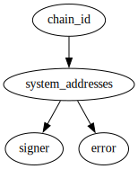
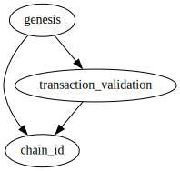

# Module `0x1::chain_id`

The chain id distinguishes between different chains (e.g., testnet and the main network).
One important role is to prevent transactions intended for one chain from being executed on another.
This code provides a container for storing a chain id and functions to initialize and get it.

-  [Resource `ChainId`](#0x1_chain_id_ChainId)
-  [Function `initialize`](#0x1_chain_id_initialize)
-  [Function `get`](#0x1_chain_id_get)
-  [Specification](#@Specification_0)
    -  [Function `initialize`](#@Specification_0_initialize)
    -  [Function `get`](#@Specification_0_get)

<pre><code><b>use</b> <a href="system_addresses.md#0x1_system_addresses">0x1::system_addresses</a>;
</code></pre>

Show all the modules that "chain_id" depends on directly or indirectly

Show all the modules that depend on "chain_id" directly or indirectly

## Resource `ChainId`

<pre><code><b>struct</b> <a href="chain_id.md#0x1_chain_id_ChainId">ChainId</a> <b>has</b> key
</code></pre>

Fields

<dl>
<dt>
<code>id: u8</code>
</dt>
<dd>

</dd>
</dl>

## Function `initialize`

Only called during genesis.
Publish the chain ID <code>id</code> of this instance under the SystemAddresses address

<pre><code><b>public</b>(<b>friend</b>) <b>fun</b> <a href="chain_id.md#0x1_chain_id_initialize">initialize</a>(aptos_framework: &<a href="../../aptos-stdlib/../move-stdlib/doc/signer.md#0x1_signer">signer</a>, id: u8)
</code></pre>

Implementation

<pre><code><b>public</b>(<b>friend</b>) <b>fun</b> <a href="chain_id.md#0x1_chain_id_initialize">initialize</a>(aptos_framework: &<a href="../../aptos-stdlib/../move-stdlib/doc/signer.md#0x1_signer">signer</a>, id: u8) {
    <a href="system_addresses.md#0x1_system_addresses_assert_aptos_framework">system_addresses::assert_aptos_framework</a>(aptos_framework);
    <b>move_to</b>(aptos_framework, <a href="chain_id.md#0x1_chain_id_ChainId">ChainId</a> { id })
}
</code></pre>

Show all the functions that "initialize" calls

Show all the functions that call "initialize"

## Function `get`

Return the chain ID of this instance.

<pre><code><b>public</b> <b>fun</b> <a href="chain_id.md#0x1_chain_id_get">get</a>(): u8
</code></pre>

Implementation

<pre><code><b>public</b> <b>fun</b> <a href="chain_id.md#0x1_chain_id_get">get</a>(): u8 <b>acquires</b> <a href="chain_id.md#0x1_chain_id_ChainId">ChainId</a> {
    <b>borrow_global</b>&lt;<a href="chain_id.md#0x1_chain_id_ChainId">ChainId</a>&gt;(@aptos_framework).id
}
</code></pre>

Show all the functions that "get" calls

Show all the functions that call "get"

## Specification

<pre><code><b>pragma</b> verify = <b>true</b>;
<b>pragma</b> aborts_if_is_strict;
</code></pre>

### Function `initialize`

<pre><code><b>public</b>(<b>friend</b>) <b>fun</b> <a href="chain_id.md#0x1_chain_id_initialize">initialize</a>(aptos_framework: &<a href="../../aptos-stdlib/../move-stdlib/doc/signer.md#0x1_signer">signer</a>, id: u8)
</code></pre>

<pre><code><b>let</b> addr = <a href="../../aptos-stdlib/../move-stdlib/doc/signer.md#0x1_signer_address_of">signer::address_of</a>(aptos_framework);
<b>aborts_if</b> addr != @aptos_framework;
<b>aborts_if</b> <b>exists</b>&lt;<a href="chain_id.md#0x1_chain_id_ChainId">ChainId</a>&gt;(@aptos_framework);
</code></pre>

### Function `get`

<pre><code><b>public</b> <b>fun</b> <a href="chain_id.md#0x1_chain_id_get">get</a>(): u8
</code></pre>

<pre><code><b>aborts_if</b> !<b>exists</b>&lt;<a href="chain_id.md#0x1_chain_id_ChainId">ChainId</a>&gt;(@aptos_framework);
</code></pre>

[move-book]: https://move-language.github.io/move/introduction.html
