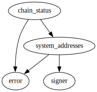
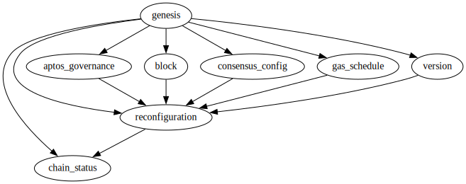
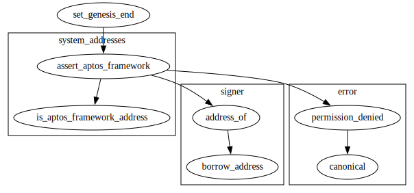
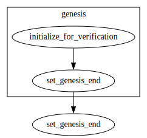

# Module `0x1::chain_status`

This module code to assert that it is running in genesis (<code><a href="chain_status.md#0x1_chain_status_assert_genesis">Self::assert_genesis</a></code>) or after
genesis (<code><a href="chain_status.md#0x1_chain_status_assert_operating">Self::assert_operating</a></code>). These are essentially distinct states of the system. Specifically,
if <code><a href="chain_status.md#0x1_chain_status_assert_operating">Self::assert_operating</a></code> succeeds, assumptions about invariants over the global state can be made
which reflect that the system has been successfully initialized.

-  [Resource `GenesisEndMarker`](#0x1_chain_status_GenesisEndMarker)
-  [Constants](#@Constants_0)
-  [Function `set_genesis_end`](#0x1_chain_status_set_genesis_end)
-  [Function `is_genesis`](#0x1_chain_status_is_genesis)
-  [Function `is_operating`](#0x1_chain_status_is_operating)
-  [Function `assert_operating`](#0x1_chain_status_assert_operating)
-  [Function `assert_genesis`](#0x1_chain_status_assert_genesis)
-  [Specification](#@Specification_1)
    -  [Function `set_genesis_end`](#@Specification_1_set_genesis_end)
    -  [Function `assert_operating`](#@Specification_1_assert_operating)
    -  [Function `assert_genesis`](#@Specification_1_assert_genesis)

<pre><code><b>use</b> <a href="../../aptos-stdlib/../move-stdlib/doc/error.md#0x1_error">0x1::error</a>;
<b>use</b> <a href="system_addresses.md#0x1_system_addresses">0x1::system_addresses</a>;
</code></pre>

Show all the modules that "chain_status" depends on directly or indirectly

Show all the modules that depend on "chain_status" directly or indirectly

## Resource `GenesisEndMarker`

Marker to publish at the end of genesis.

<pre><code><b>struct</b> <a href="chain_status.md#0x1_chain_status_GenesisEndMarker">GenesisEndMarker</a> <b>has</b> key
</code></pre>

Fields

<dl>
<dt>
<code>dummy_field: bool</code>
</dt>
<dd>

</dd>
</dl>

## Constants

The blockchain is not in the genesis status.

<pre><code><b>const</b> <a href="chain_status.md#0x1_chain_status_ENOT_GENESIS">ENOT_GENESIS</a>: u64 = 2;
</code></pre>

The blockchain is not in the operating status.

<pre><code><b>const</b> <a href="chain_status.md#0x1_chain_status_ENOT_OPERATING">ENOT_OPERATING</a>: u64 = 1;
</code></pre>

## Function `set_genesis_end`

Marks that genesis has finished.

<pre><code><b>public</b>(<b>friend</b>) <b>fun</b> <a href="chain_status.md#0x1_chain_status_set_genesis_end">set_genesis_end</a>(aptos_framework: &<a href="../../aptos-stdlib/../move-stdlib/doc/signer.md#0x1_signer">signer</a>)
</code></pre>

Implementation

<pre><code><b>public</b>(<b>friend</b>) <b>fun</b> <a href="chain_status.md#0x1_chain_status_set_genesis_end">set_genesis_end</a>(aptos_framework: &<a href="../../aptos-stdlib/../move-stdlib/doc/signer.md#0x1_signer">signer</a>) {
    <a href="system_addresses.md#0x1_system_addresses_assert_aptos_framework">system_addresses::assert_aptos_framework</a>(aptos_framework);
    <b>move_to</b>(aptos_framework, <a href="chain_status.md#0x1_chain_status_GenesisEndMarker">GenesisEndMarker</a> {});
}
</code></pre>

Show all the functions that "set_genesis_end" calls

Show all the functions that call "set_genesis_end"

## Function `is_genesis`

Helper function to determine if Aptos is in genesis state.

<pre><code><b>public</b> <b>fun</b> <a href="chain_status.md#0x1_chain_status_is_genesis">is_genesis</a>(): bool
</code></pre>

Implementation

<pre><code><b>public</b> <b>fun</b> <a href="chain_status.md#0x1_chain_status_is_genesis">is_genesis</a>(): bool {
    !<b>exists</b>&lt;<a href="chain_status.md#0x1_chain_status_GenesisEndMarker">GenesisEndMarker</a>&gt;(@aptos_framework)
}
</code></pre>

Show all the functions that "is_genesis" calls

Show all the functions that call "is_genesis"

## Function `is_operating`

Helper function to determine if Aptos is operating. This is
the same as <code>!<a href="chain_status.md#0x1_chain_status_is_genesis">is_genesis</a>()</code> and is provided for convenience.
Testing <code><a href="chain_status.md#0x1_chain_status_is_operating">is_operating</a>()</code> is more frequent than <code><a href="chain_status.md#0x1_chain_status_is_genesis">is_genesis</a>()</code>.

<pre><code><b>public</b> <b>fun</b> <a href="chain_status.md#0x1_chain_status_is_operating">is_operating</a>(): bool
</code></pre>

Implementation

<pre><code><b>public</b> <b>fun</b> <a href="chain_status.md#0x1_chain_status_is_operating">is_operating</a>(): bool {
    <b>exists</b>&lt;<a href="chain_status.md#0x1_chain_status_GenesisEndMarker">GenesisEndMarker</a>&gt;(@aptos_framework)
}
</code></pre>

Show all the functions that "is_operating" calls

Show all the functions that call "is_operating"

## Function `assert_operating`

Helper function to assert operating (not genesis) state.

<pre><code><b>public</b> <b>fun</b> <a href="chain_status.md#0x1_chain_status_assert_operating">assert_operating</a>()
</code></pre>

Implementation

<pre><code><b>public</b> <b>fun</b> <a href="chain_status.md#0x1_chain_status_assert_operating">assert_operating</a>() {
    <b>assert</b>!(<a href="chain_status.md#0x1_chain_status_is_operating">is_operating</a>(), <a href="../../aptos-stdlib/../move-stdlib/doc/error.md#0x1_error_invalid_state">error::invalid_state</a>(<a href="chain_status.md#0x1_chain_status_ENOT_OPERATING">ENOT_OPERATING</a>));
}
</code></pre>

Show all the functions that "assert_operating" calls

Show all the functions that call "assert_operating"

## Function `assert_genesis`

Helper function to assert genesis state.

<pre><code><b>public</b> <b>fun</b> <a href="chain_status.md#0x1_chain_status_assert_genesis">assert_genesis</a>()
</code></pre>

Implementation

<pre><code><b>public</b> <b>fun</b> <a href="chain_status.md#0x1_chain_status_assert_genesis">assert_genesis</a>() {
    <b>assert</b>!(<a href="chain_status.md#0x1_chain_status_is_genesis">is_genesis</a>(), <a href="../../aptos-stdlib/../move-stdlib/doc/error.md#0x1_error_invalid_state">error::invalid_state</a>(<a href="chain_status.md#0x1_chain_status_ENOT_OPERATING">ENOT_OPERATING</a>));
}
</code></pre>

Show all the functions that "assert_genesis" calls

Show all the functions that call "assert_genesis"

## Specification

<pre><code><b>pragma</b> verify = <b>true</b>;
<b>pragma</b> aborts_if_is_strict;
</code></pre>

### Function `set_genesis_end`

<pre><code><b>public</b>(<b>friend</b>) <b>fun</b> <a href="chain_status.md#0x1_chain_status_set_genesis_end">set_genesis_end</a>(aptos_framework: &<a href="../../aptos-stdlib/../move-stdlib/doc/signer.md#0x1_signer">signer</a>)
</code></pre>

<pre><code><b>pragma</b> verify = <b>false</b>;
</code></pre>

<pre><code><b>schema</b> <a href="chain_status.md#0x1_chain_status_RequiresIsOperating">RequiresIsOperating</a> {
    <b>requires</b> <a href="chain_status.md#0x1_chain_status_is_operating">is_operating</a>();
}
</code></pre>

### Function `assert_operating`

<pre><code><b>public</b> <b>fun</b> <a href="chain_status.md#0x1_chain_status_assert_operating">assert_operating</a>()
</code></pre>

<pre><code><b>aborts_if</b> !<a href="chain_status.md#0x1_chain_status_is_operating">is_operating</a>();
</code></pre>

### Function `assert_genesis`

<pre><code><b>public</b> <b>fun</b> <a href="chain_status.md#0x1_chain_status_assert_genesis">assert_genesis</a>()
</code></pre>

<pre><code><b>aborts_if</b> !<a href="chain_status.md#0x1_chain_status_is_genesis">is_genesis</a>();
</code></pre>

[move-book]: https://move-language.github.io/move/introduction.html
