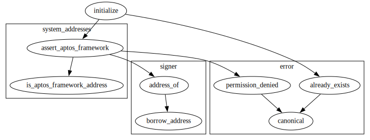
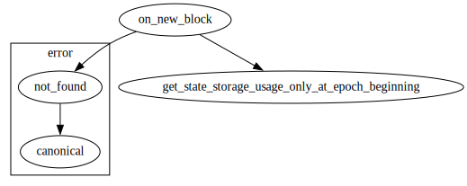
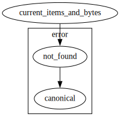
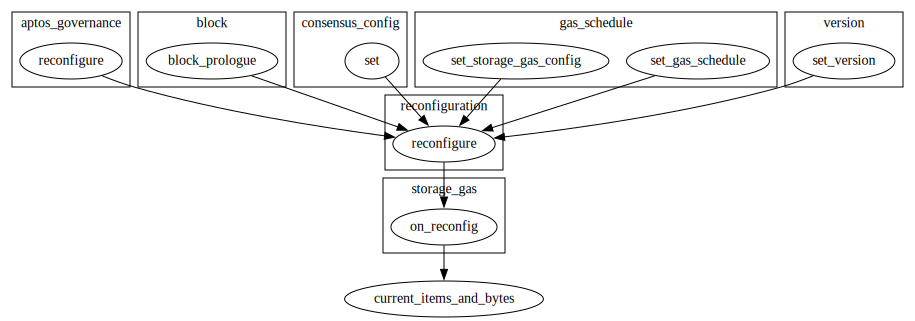
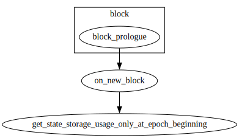

# Module `0x1::state_storage`

-  [Struct `Usage`](#0x1_state_storage_Usage)
-  [Resource `StateStorageUsage`](#0x1_state_storage_StateStorageUsage)
-  [Resource `GasParameter`](#0x1_state_storage_GasParameter)
-  [Constants](#@Constants_0)
-  [Function `initialize`](#0x1_state_storage_initialize)
-  [Function `on_new_block`](#0x1_state_storage_on_new_block)
-  [Function `current_items_and_bytes`](#0x1_state_storage_current_items_and_bytes)
-  [Function `get_state_storage_usage_only_at_epoch_beginning`](#0x1_state_storage_get_state_storage_usage_only_at_epoch_beginning)
-  [Function `on_reconfig`](#0x1_state_storage_on_reconfig)
-  [Specification](#@Specification_1)
    -  [Function `initialize`](#@Specification_1_initialize)
    -  [Function `on_new_block`](#@Specification_1_on_new_block)
    -  [Function `current_items_and_bytes`](#@Specification_1_current_items_and_bytes)
    -  [Function `get_state_storage_usage_only_at_epoch_beginning`](#@Specification_1_get_state_storage_usage_only_at_epoch_beginning)
    -  [Function `on_reconfig`](#@Specification_1_on_reconfig)

<pre><code><b>use</b> <a href="../../aptos-stdlib/../move-stdlib/doc/error.md#0x1_error">0x1::error</a>;
<b>use</b> <a href="system_addresses.md#0x1_system_addresses">0x1::system_addresses</a>;
</code></pre>

Show all the modules that "state_storage" depends on directly or indirectly

Show all the modules that depend on "state_storage" directly or indirectly

## Struct `Usage`

<pre><code><b>struct</b> <a href="state_storage.md#0x1_state_storage_Usage">Usage</a> <b>has</b> <b>copy</b>, drop, store
</code></pre>

Fields

<dl>
<dt>
<code>items: u64</code>
</dt>
<dd>

</dd>
<dt>
<code>bytes: u64</code>
</dt>
<dd>

</dd>
</dl>

## Resource `StateStorageUsage`

This is updated at the begining of each opoch, reflecting the storage
usage after the last txn of the previous epoch is committed.

<pre><code><b>struct</b> <a href="state_storage.md#0x1_state_storage_StateStorageUsage">StateStorageUsage</a> <b>has</b> store, key
</code></pre>

Fields

<dl>
<dt>
<code>epoch: u64</code>
</dt>
<dd>

</dd>
<dt>
<code>usage: <a href="state_storage.md#0x1_state_storage_Usage">state_storage::Usage</a></code>
</dt>
<dd>

</dd>
</dl>

## Resource `GasParameter`

<pre><code><b>struct</b> <a href="state_storage.md#0x1_state_storage_GasParameter">GasParameter</a> <b>has</b> store, key
</code></pre>

Fields

<dl>
<dt>
<code>usage: <a href="state_storage.md#0x1_state_storage_Usage">state_storage::Usage</a></code>
</dt>
<dd>

</dd>
</dl>

## Constants

<pre><code><b>const</b> <a href="state_storage.md#0x1_state_storage_ESTATE_STORAGE_USAGE">ESTATE_STORAGE_USAGE</a>: u64 = 0;
</code></pre>

## Function `initialize`

<pre><code><b>public</b>(<b>friend</b>) <b>fun</b> <a href="state_storage.md#0x1_state_storage_initialize">initialize</a>(aptos_framework: &<a href="../../aptos-stdlib/../move-stdlib/doc/signer.md#0x1_signer">signer</a>)
</code></pre>

Implementation

<pre><code><b>public</b>(<b>friend</b>) <b>fun</b> <a href="state_storage.md#0x1_state_storage_initialize">initialize</a>(aptos_framework: &<a href="../../aptos-stdlib/../move-stdlib/doc/signer.md#0x1_signer">signer</a>) {
    <a href="system_addresses.md#0x1_system_addresses_assert_aptos_framework">system_addresses::assert_aptos_framework</a>(aptos_framework);
    <b>assert</b>!(
        !<b>exists</b>&lt;<a href="state_storage.md#0x1_state_storage_StateStorageUsage">StateStorageUsage</a>&gt;(@aptos_framework),
        <a href="../../aptos-stdlib/../move-stdlib/doc/error.md#0x1_error_already_exists">error::already_exists</a>(<a href="state_storage.md#0x1_state_storage_ESTATE_STORAGE_USAGE">ESTATE_STORAGE_USAGE</a>)
    );
    <b>move_to</b>(aptos_framework, <a href="state_storage.md#0x1_state_storage_StateStorageUsage">StateStorageUsage</a> {
        epoch: 0,
        usage: <a href="state_storage.md#0x1_state_storage_Usage">Usage</a> {
            items: 0,
            bytes: 0,
        }
    });
}
</code></pre>

Show all the functions that "initialize" calls

Show all the functions that call "initialize"

## Function `on_new_block`

<pre><code><b>public</b>(<b>friend</b>) <b>fun</b> <a href="state_storage.md#0x1_state_storage_on_new_block">on_new_block</a>(epoch: u64)
</code></pre>

Implementation

<pre><code><b>public</b>(<b>friend</b>) <b>fun</b> <a href="state_storage.md#0x1_state_storage_on_new_block">on_new_block</a>(epoch: u64) <b>acquires</b> <a href="state_storage.md#0x1_state_storage_StateStorageUsage">StateStorageUsage</a> {
    <b>assert</b>!(
        <b>exists</b>&lt;<a href="state_storage.md#0x1_state_storage_StateStorageUsage">StateStorageUsage</a>&gt;(@aptos_framework),
        <a href="../../aptos-stdlib/../move-stdlib/doc/error.md#0x1_error_not_found">error::not_found</a>(<a href="state_storage.md#0x1_state_storage_ESTATE_STORAGE_USAGE">ESTATE_STORAGE_USAGE</a>)
    );
    <b>let</b> usage = <b>borrow_global_mut</b>&lt;<a href="state_storage.md#0x1_state_storage_StateStorageUsage">StateStorageUsage</a>&gt;(@aptos_framework);
    <b>if</b> (epoch != usage.epoch) {
        usage.epoch = epoch;
        usage.usage = <a href="state_storage.md#0x1_state_storage_get_state_storage_usage_only_at_epoch_beginning">get_state_storage_usage_only_at_epoch_beginning</a>();
    }
}
</code></pre>

Show all the functions that "on_new_block" calls

Show all the functions that call "on_new_block"

## Function `current_items_and_bytes`

<pre><code><b>public</b>(<b>friend</b>) <b>fun</b> <a href="state_storage.md#0x1_state_storage_current_items_and_bytes">current_items_and_bytes</a>(): (u64, u64)
</code></pre>

Implementation

<pre><code><b>public</b>(<b>friend</b>) <b>fun</b> <a href="state_storage.md#0x1_state_storage_current_items_and_bytes">current_items_and_bytes</a>(): (u64, u64) <b>acquires</b> <a href="state_storage.md#0x1_state_storage_StateStorageUsage">StateStorageUsage</a> {
    <b>assert</b>!(
        <b>exists</b>&lt;<a href="state_storage.md#0x1_state_storage_StateStorageUsage">StateStorageUsage</a>&gt;(@aptos_framework),
        <a href="../../aptos-stdlib/../move-stdlib/doc/error.md#0x1_error_not_found">error::not_found</a>(<a href="state_storage.md#0x1_state_storage_ESTATE_STORAGE_USAGE">ESTATE_STORAGE_USAGE</a>)
    );
    <b>let</b> usage = <b>borrow_global</b>&lt;<a href="state_storage.md#0x1_state_storage_StateStorageUsage">StateStorageUsage</a>&gt;(@aptos_framework);
    (usage.usage.items, usage.usage.bytes)
}
</code></pre>

Show all the functions that "current_items_and_bytes" calls

Show all the functions that call "current_items_and_bytes"

## Function `get_state_storage_usage_only_at_epoch_beginning`

Warning: the result returned is based on the base state view held by the
VM for the entire block or chunk of transactions, it's only deterministic
if called from the first transaction of the block because the execution layer
guarantees a fresh state view then.

<pre><code><b>fun</b> <a href="state_storage.md#0x1_state_storage_get_state_storage_usage_only_at_epoch_beginning">get_state_storage_usage_only_at_epoch_beginning</a>(): <a href="state_storage.md#0x1_state_storage_Usage">state_storage::Usage</a>
</code></pre>

Implementation

<pre><code><b>native</b> <b>fun</b> <a href="state_storage.md#0x1_state_storage_get_state_storage_usage_only_at_epoch_beginning">get_state_storage_usage_only_at_epoch_beginning</a>(): <a href="state_storage.md#0x1_state_storage_Usage">Usage</a>;
</code></pre>

Show all the functions that "get_state_storage_usage_only_at_epoch_beginning" calls

Show all the functions that call "get_state_storage_usage_only_at_epoch_beginning"

## Function `on_reconfig`

<pre><code><b>public</b>(<b>friend</b>) <b>fun</b> <a href="state_storage.md#0x1_state_storage_on_reconfig">on_reconfig</a>()
</code></pre>

Implementation

<pre><code><b>public</b>(<b>friend</b>) <b>fun</b> <a href="state_storage.md#0x1_state_storage_on_reconfig">on_reconfig</a>() {
    <b>abort</b> 0
}
</code></pre>

Show all the functions that "on_reconfig" calls

Show all the functions that call "on_reconfig"

## Specification

<pre><code><b>pragma</b> verify = <b>true</b>;
<b>pragma</b> aborts_if_is_strict;
<b>invariant</b> [suspendable] <a href="chain_status.md#0x1_chain_status_is_operating">chain_status::is_operating</a>() ==&gt; <b>exists</b>&lt;<a href="state_storage.md#0x1_state_storage_StateStorageUsage">StateStorageUsage</a>&gt;(@aptos_framework);
<b>invariant</b> [suspendable] <a href="chain_status.md#0x1_chain_status_is_operating">chain_status::is_operating</a>() ==&gt; <b>exists</b>&lt;<a href="state_storage.md#0x1_state_storage_GasParameter">GasParameter</a>&gt;(@aptos_framework);
</code></pre>

### Function `initialize`

<pre><code><b>public</b>(<b>friend</b>) <b>fun</b> <a href="state_storage.md#0x1_state_storage_initialize">initialize</a>(aptos_framework: &<a href="../../aptos-stdlib/../move-stdlib/doc/signer.md#0x1_signer">signer</a>)
</code></pre>

ensure caller is admin.
aborts if StateStorageUsage already exists.

<pre><code><b>let</b> addr = <a href="../../aptos-stdlib/../move-stdlib/doc/signer.md#0x1_signer_address_of">signer::address_of</a>(aptos_framework);
<b>aborts_if</b> !<a href="system_addresses.md#0x1_system_addresses_is_aptos_framework_address">system_addresses::is_aptos_framework_address</a>(addr);
<b>aborts_if</b> <b>exists</b>&lt;<a href="state_storage.md#0x1_state_storage_StateStorageUsage">StateStorageUsage</a>&gt;(@aptos_framework);
</code></pre>

### Function `on_new_block`

<pre><code><b>public</b>(<b>friend</b>) <b>fun</b> <a href="state_storage.md#0x1_state_storage_on_new_block">on_new_block</a>(epoch: u64)
</code></pre>

<pre><code><b>requires</b> <a href="chain_status.md#0x1_chain_status_is_operating">chain_status::is_operating</a>();
<b>aborts_if</b> <b>false</b>;
</code></pre>

### Function `current_items_and_bytes`

<pre><code><b>public</b>(<b>friend</b>) <b>fun</b> <a href="state_storage.md#0x1_state_storage_current_items_and_bytes">current_items_and_bytes</a>(): (u64, u64)
</code></pre>

<pre><code><b>aborts_if</b> !<b>exists</b>&lt;<a href="state_storage.md#0x1_state_storage_StateStorageUsage">StateStorageUsage</a>&gt;(@aptos_framework);
</code></pre>

### Function `get_state_storage_usage_only_at_epoch_beginning`

<pre><code><b>fun</b> <a href="state_storage.md#0x1_state_storage_get_state_storage_usage_only_at_epoch_beginning">get_state_storage_usage_only_at_epoch_beginning</a>(): <a href="state_storage.md#0x1_state_storage_Usage">state_storage::Usage</a>
</code></pre>

<pre><code><b>pragma</b> opaque;
</code></pre>

### Function `on_reconfig`

<pre><code><b>public</b>(<b>friend</b>) <b>fun</b> <a href="state_storage.md#0x1_state_storage_on_reconfig">on_reconfig</a>()
</code></pre>

<pre><code><b>aborts_if</b> <b>true</b>;
</code></pre>

[move-book]: https://move-language.github.io/move/introduction.html
