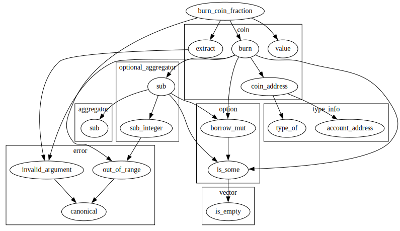
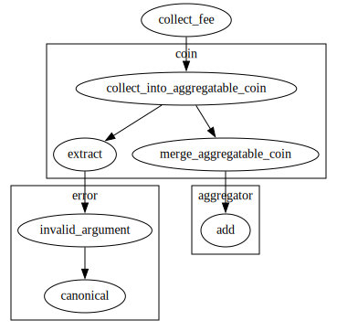
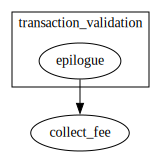
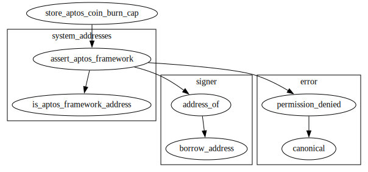

# Module `0x1::transaction_fee`

This module provides an interface to burn or collect and redistribute transaction fees.

-  [Resource `AptosCoinCapabilities`](#0x1_transaction_fee_AptosCoinCapabilities)
-  [Resource `CollectedFeesPerBlock`](#0x1_transaction_fee_CollectedFeesPerBlock)
-  [Constants](#@Constants_0)
-  [Function `initialize_fee_collection_and_distribution`](#0x1_transaction_fee_initialize_fee_collection_and_distribution)
-  [Function `is_fees_collection_enabled`](#0x1_transaction_fee_is_fees_collection_enabled)
-  [Function `upgrade_burn_percentage`](#0x1_transaction_fee_upgrade_burn_percentage)
-  [Function `register_proposer_for_fee_collection`](#0x1_transaction_fee_register_proposer_for_fee_collection)
-  [Function `burn_coin_fraction`](#0x1_transaction_fee_burn_coin_fraction)
-  [Function `process_collected_fees`](#0x1_transaction_fee_process_collected_fees)
-  [Function `burn_fee`](#0x1_transaction_fee_burn_fee)
-  [Function `collect_fee`](#0x1_transaction_fee_collect_fee)
-  [Function `store_aptos_coin_burn_cap`](#0x1_transaction_fee_store_aptos_coin_burn_cap)
-  [Specification](#@Specification_1)
    -  [Function `burn_fee`](#@Specification_1_burn_fee)
    -  [Function `store_aptos_coin_burn_cap`](#@Specification_1_store_aptos_coin_burn_cap)

<pre><code><b>use</b> <a href="aptos_coin.md#0x1_aptos_coin">0x1::aptos_coin</a>;
<b>use</b> <a href="coin.md#0x1_coin">0x1::coin</a>;
<b>use</b> <a href="../../aptos-stdlib/../move-stdlib/doc/error.md#0x1_error">0x1::error</a>;
<b>use</b> <a href="../../aptos-stdlib/../move-stdlib/doc/option.md#0x1_option">0x1::option</a>;
<b>use</b> <a href="stake.md#0x1_stake">0x1::stake</a>;
<b>use</b> <a href="system_addresses.md#0x1_system_addresses">0x1::system_addresses</a>;
</code></pre>

Show all the modules that "transaction_fee" depends on directly or indirectly

Show all the modules that depend on "transaction_fee" directly or indirectly

## Resource `AptosCoinCapabilities`

Stores burn capability to burn the gas fees.

<pre><code><b>struct</b> <a href="transaction_fee.md#0x1_transaction_fee_AptosCoinCapabilities">AptosCoinCapabilities</a> <b>has</b> key
</code></pre>

Fields

<dl>
<dt>
<code>burn_cap: <a href="coin.md#0x1_coin_BurnCapability">coin::BurnCapability</a>&lt;<a href="aptos_coin.md#0x1_aptos_coin_AptosCoin">aptos_coin::AptosCoin</a>&gt;</code>
</dt>
<dd>

</dd>
</dl>

## Resource `CollectedFeesPerBlock`

Stores information about the block proposer and the amount of fees
collected when executing the block.

<pre><code><b>struct</b> <a href="transaction_fee.md#0x1_transaction_fee_CollectedFeesPerBlock">CollectedFeesPerBlock</a> <b>has</b> key
</code></pre>

Fields

<dl>
<dt>
<code>amount: <a href="coin.md#0x1_coin_AggregatableCoin">coin::AggregatableCoin</a>&lt;<a href="aptos_coin.md#0x1_aptos_coin_AptosCoin">aptos_coin::AptosCoin</a>&gt;</code>
</dt>
<dd>

</dd>
<dt>
<code>proposer: <a href="../../aptos-stdlib/../move-stdlib/doc/option.md#0x1_option_Option">option::Option</a>&lt;<b>address</b>&gt;</code>
</dt>
<dd>

</dd>
<dt>
<code>burn_percentage: u8</code>
</dt>
<dd>

</dd>
</dl>

## Constants

Gas fees are already being collected and the struct holding
information about collected amounts is already published.

<pre><code><b>const</b> <a href="transaction_fee.md#0x1_transaction_fee_EALREADY_COLLECTING_FEES">EALREADY_COLLECTING_FEES</a>: u64 = 1;
</code></pre>

The burn percentage is out of range [0, 100].

<pre><code><b>const</b> <a href="transaction_fee.md#0x1_transaction_fee_EINVALID_BURN_PERCENTAGE">EINVALID_BURN_PERCENTAGE</a>: u64 = 3;
</code></pre>

## Function `initialize_fee_collection_and_distribution`

Initializes the resource storing information about gas fees collection and
distribution. Should be called by on-chain governance.

<pre><code><b>public</b> <b>fun</b> <a href="transaction_fee.md#0x1_transaction_fee_initialize_fee_collection_and_distribution">initialize_fee_collection_and_distribution</a>(aptos_framework: &<a href="../../aptos-stdlib/../move-stdlib/doc/signer.md#0x1_signer">signer</a>, burn_percentage: u8)
</code></pre>

Implementation

<pre><code><b>public</b> <b>fun</b> <a href="transaction_fee.md#0x1_transaction_fee_initialize_fee_collection_and_distribution">initialize_fee_collection_and_distribution</a>(aptos_framework: &<a href="../../aptos-stdlib/../move-stdlib/doc/signer.md#0x1_signer">signer</a>, burn_percentage: u8) {
    <a href="system_addresses.md#0x1_system_addresses_assert_aptos_framework">system_addresses::assert_aptos_framework</a>(aptos_framework);
    <b>assert</b>!(
        !<b>exists</b>&lt;<a href="transaction_fee.md#0x1_transaction_fee_CollectedFeesPerBlock">CollectedFeesPerBlock</a>&gt;(@aptos_framework),
        <a href="../../aptos-stdlib/../move-stdlib/doc/error.md#0x1_error_already_exists">error::already_exists</a>(<a href="transaction_fee.md#0x1_transaction_fee_EALREADY_COLLECTING_FEES">EALREADY_COLLECTING_FEES</a>)
    );
    <b>assert</b>!(burn_percentage &lt;= 100, <a href="../../aptos-stdlib/../move-stdlib/doc/error.md#0x1_error_out_of_range">error::out_of_range</a>(<a href="transaction_fee.md#0x1_transaction_fee_EINVALID_BURN_PERCENTAGE">EINVALID_BURN_PERCENTAGE</a>));

    // Make sure stakng <b>module</b> is aware of transaction fees collection.
    <a href="stake.md#0x1_stake_initialize_validator_fees">stake::initialize_validator_fees</a>(aptos_framework);

    // Initially, no fees are collected and the <a href="block.md#0x1_block">block</a> proposer is not set.
    <b>let</b> collected_fees = <a href="transaction_fee.md#0x1_transaction_fee_CollectedFeesPerBlock">CollectedFeesPerBlock</a> {
        amount: <a href="coin.md#0x1_coin_initialize_aggregatable_coin">coin::initialize_aggregatable_coin</a>(aptos_framework),
        proposer: <a href="../../aptos-stdlib/../move-stdlib/doc/option.md#0x1_option_none">option::none</a>(),
        burn_percentage,
    };
    <b>move_to</b>(aptos_framework, collected_fees);
}
</code></pre>

Show all the functions that "initialize_fee_collection_and_distribution" calls

Show all the functions that call "initialize_fee_collection_and_distribution"

## Function `is_fees_collection_enabled`

<pre><code><b>fun</b> <a href="transaction_fee.md#0x1_transaction_fee_is_fees_collection_enabled">is_fees_collection_enabled</a>(): bool
</code></pre>

Implementation

<pre><code><b>fun</b> <a href="transaction_fee.md#0x1_transaction_fee_is_fees_collection_enabled">is_fees_collection_enabled</a>(): bool {
    <b>exists</b>&lt;<a href="transaction_fee.md#0x1_transaction_fee_CollectedFeesPerBlock">CollectedFeesPerBlock</a>&gt;(@aptos_framework)
}
</code></pre>

Show all the functions that "is_fees_collection_enabled" calls

Show all the functions that call "is_fees_collection_enabled"

## Function `upgrade_burn_percentage`

Sets the burn percentage for collected fees to a new value. Should be called by on-chain governance.

<pre><code><b>public</b> <b>fun</b> <a href="transaction_fee.md#0x1_transaction_fee_upgrade_burn_percentage">upgrade_burn_percentage</a>(aptos_framework: &<a href="../../aptos-stdlib/../move-stdlib/doc/signer.md#0x1_signer">signer</a>, new_burn_percentage: u8)
</code></pre>

Implementation

<pre><code><b>public</b> <b>fun</b> <a href="transaction_fee.md#0x1_transaction_fee_upgrade_burn_percentage">upgrade_burn_percentage</a>(aptos_framework: &<a href="../../aptos-stdlib/../move-stdlib/doc/signer.md#0x1_signer">signer</a>, new_burn_percentage: u8) <b>acquires</b> <a href="transaction_fee.md#0x1_transaction_fee_CollectedFeesPerBlock">CollectedFeesPerBlock</a> {
    <a href="system_addresses.md#0x1_system_addresses_assert_aptos_framework">system_addresses::assert_aptos_framework</a>(aptos_framework);
    <b>assert</b>!(new_burn_percentage &lt;= 100, <a href="../../aptos-stdlib/../move-stdlib/doc/error.md#0x1_error_out_of_range">error::out_of_range</a>(<a href="transaction_fee.md#0x1_transaction_fee_EINVALID_BURN_PERCENTAGE">EINVALID_BURN_PERCENTAGE</a>));

    <b>if</b> (<a href="transaction_fee.md#0x1_transaction_fee_is_fees_collection_enabled">is_fees_collection_enabled</a>()) {
        // Upgrade <b>has</b> no effect unless fees are being collected.
        <b>let</b> burn_percentage = &<b>mut</b> <b>borrow_global_mut</b>&lt;<a href="transaction_fee.md#0x1_transaction_fee_CollectedFeesPerBlock">CollectedFeesPerBlock</a>&gt;(@aptos_framework).burn_percentage;
        *burn_percentage = new_burn_percentage
    }
}
</code></pre>

Show all the functions that "upgrade_burn_percentage" calls

Show all the functions that call "upgrade_burn_percentage"

## Function `register_proposer_for_fee_collection`

Registers the proposer of the block for gas fees collection. This function
can only be called at the beginning of the block.

<pre><code><b>public</b>(<b>friend</b>) <b>fun</b> <a href="transaction_fee.md#0x1_transaction_fee_register_proposer_for_fee_collection">register_proposer_for_fee_collection</a>(proposer_addr: <b>address</b>)
</code></pre>

Implementation

<pre><code><b>public</b>(<b>friend</b>) <b>fun</b> <a href="transaction_fee.md#0x1_transaction_fee_register_proposer_for_fee_collection">register_proposer_for_fee_collection</a>(proposer_addr: <b>address</b>) <b>acquires</b> <a href="transaction_fee.md#0x1_transaction_fee_CollectedFeesPerBlock">CollectedFeesPerBlock</a> {
    <b>if</b> (<a href="transaction_fee.md#0x1_transaction_fee_is_fees_collection_enabled">is_fees_collection_enabled</a>()) {
        <b>let</b> collected_fees = <b>borrow_global_mut</b>&lt;<a href="transaction_fee.md#0x1_transaction_fee_CollectedFeesPerBlock">CollectedFeesPerBlock</a>&gt;(@aptos_framework);
        <b>let</b> _ = <a href="../../aptos-stdlib/../move-stdlib/doc/option.md#0x1_option_swap_or_fill">option::swap_or_fill</a>(&<b>mut</b> collected_fees.proposer, proposer_addr);
    }
}
</code></pre>

Show all the functions that "register_proposer_for_fee_collection" calls

Show all the functions that call "register_proposer_for_fee_collection"

## Function `burn_coin_fraction`

Burns a specified fraction of the coin.

<pre><code><b>fun</b> <a href="transaction_fee.md#0x1_transaction_fee_burn_coin_fraction">burn_coin_fraction</a>(<a href="coin.md#0x1_coin">coin</a>: &<b>mut</b> <a href="coin.md#0x1_coin_Coin">coin::Coin</a>&lt;<a href="aptos_coin.md#0x1_aptos_coin_AptosCoin">aptos_coin::AptosCoin</a>&gt;, burn_percentage: u8)
</code></pre>

Implementation

<pre><code><b>fun</b> <a href="transaction_fee.md#0x1_transaction_fee_burn_coin_fraction">burn_coin_fraction</a>(<a href="coin.md#0x1_coin">coin</a>: &<b>mut</b> Coin&lt;AptosCoin&gt;, burn_percentage: u8) <b>acquires</b> <a href="transaction_fee.md#0x1_transaction_fee_AptosCoinCapabilities">AptosCoinCapabilities</a> {
    <b>assert</b>!(burn_percentage &lt;= 100, <a href="../../aptos-stdlib/../move-stdlib/doc/error.md#0x1_error_out_of_range">error::out_of_range</a>(<a href="transaction_fee.md#0x1_transaction_fee_EINVALID_BURN_PERCENTAGE">EINVALID_BURN_PERCENTAGE</a>));

    <b>let</b> collected_amount = <a href="coin.md#0x1_coin_value">coin::value</a>(<a href="coin.md#0x1_coin">coin</a>);
    <b>let</b> amount_to_burn = (burn_percentage <b>as</b> u64) * collected_amount / 100;
    <b>if</b> (amount_to_burn &gt; 0) {
        <b>let</b> coin_to_burn = <a href="coin.md#0x1_coin_extract">coin::extract</a>(<a href="coin.md#0x1_coin">coin</a>, amount_to_burn);
        <a href="coin.md#0x1_coin_burn">coin::burn</a>(
            coin_to_burn,
            &<b>borrow_global</b>&lt;<a href="transaction_fee.md#0x1_transaction_fee_AptosCoinCapabilities">AptosCoinCapabilities</a>&gt;(@aptos_framework).burn_cap,
        );
    }
}
</code></pre>

Show all the functions that "burn_coin_fraction" calls

Show all the functions that call "burn_coin_fraction"

## Function `process_collected_fees`

Calculates the fee which should be distributed to the block proposer at the
end of an epoch, and records it in the system. This function can only be called
at the beginning of the block or during reconfiguration.

<pre><code><b>public</b>(<b>friend</b>) <b>fun</b> <a href="transaction_fee.md#0x1_transaction_fee_process_collected_fees">process_collected_fees</a>()
</code></pre>

Implementation

<pre><code><b>public</b>(<b>friend</b>) <b>fun</b> <a href="transaction_fee.md#0x1_transaction_fee_process_collected_fees">process_collected_fees</a>() <b>acquires</b> <a href="transaction_fee.md#0x1_transaction_fee_AptosCoinCapabilities">AptosCoinCapabilities</a>, <a href="transaction_fee.md#0x1_transaction_fee_CollectedFeesPerBlock">CollectedFeesPerBlock</a> {
    <b>if</b> (!<a href="transaction_fee.md#0x1_transaction_fee_is_fees_collection_enabled">is_fees_collection_enabled</a>()) {
        <b>return</b>
    };
    <b>let</b> collected_fees = <b>borrow_global_mut</b>&lt;<a href="transaction_fee.md#0x1_transaction_fee_CollectedFeesPerBlock">CollectedFeesPerBlock</a>&gt;(@aptos_framework);

    // If there are no collected fees, do nothing.
    <b>if</b> (<a href="coin.md#0x1_coin_is_aggregatable_coin_zero">coin::is_aggregatable_coin_zero</a>(&collected_fees.amount)) {
        <b>return</b>
    };

    // Otherwise get the collected fee, and check <b>if</b> it can distributed later.
    <b>let</b> <a href="coin.md#0x1_coin">coin</a> = <a href="coin.md#0x1_coin_drain_aggregatable_coin">coin::drain_aggregatable_coin</a>(&<b>mut</b> collected_fees.amount);
    <b>if</b> (<a href="../../aptos-stdlib/../move-stdlib/doc/option.md#0x1_option_is_some">option::is_some</a>(&collected_fees.proposer)) {
        // Extract the <b>address</b> of proposer here and reset it <b>to</b> <a href="../../aptos-stdlib/../move-stdlib/doc/option.md#0x1_option_none">option::none</a>(). This
        // is particularly useful <b>to</b> avoid <a href="../../aptos-stdlib/doc/any.md#0x1_any">any</a> undesired side-effects <b>where</b> coins are
        // collected but never distributed or distributed <b>to</b> the wrong <a href="account.md#0x1_account">account</a>.
        // With this design, processing collected fees enforces that all fees will be burnt
        // unless the proposer is specified in the <a href="block.md#0x1_block">block</a> prologue. When we have a governance
        // proposal that triggers <a href="reconfiguration.md#0x1_reconfiguration">reconfiguration</a>, we distribute pending fees and burn the
        // fee for the proposal. Otherwise, that fee would be leaked <b>to</b> the next <a href="block.md#0x1_block">block</a>.
        <b>let</b> proposer = <a href="../../aptos-stdlib/../move-stdlib/doc/option.md#0x1_option_extract">option::extract</a>(&<b>mut</b> collected_fees.proposer);

        // Since the <a href="block.md#0x1_block">block</a> can be produced by the VM itself, we have <b>to</b> make sure we catch
        // this case.
        <b>if</b> (proposer == @vm_reserved) {
            <a href="transaction_fee.md#0x1_transaction_fee_burn_coin_fraction">burn_coin_fraction</a>(&<b>mut</b> <a href="coin.md#0x1_coin">coin</a>, 100);
            <a href="coin.md#0x1_coin_destroy_zero">coin::destroy_zero</a>(<a href="coin.md#0x1_coin">coin</a>);
            <b>return</b>
        };

        <a href="transaction_fee.md#0x1_transaction_fee_burn_coin_fraction">burn_coin_fraction</a>(&<b>mut</b> <a href="coin.md#0x1_coin">coin</a>, collected_fees.burn_percentage);
        <a href="stake.md#0x1_stake_add_transaction_fee">stake::add_transaction_fee</a>(proposer, <a href="coin.md#0x1_coin">coin</a>);
        <b>return</b>
    };

    // If checks did not pass, simply burn all collected coins and <b>return</b> none.
    <a href="transaction_fee.md#0x1_transaction_fee_burn_coin_fraction">burn_coin_fraction</a>(&<b>mut</b> <a href="coin.md#0x1_coin">coin</a>, 100);
    <a href="coin.md#0x1_coin_destroy_zero">coin::destroy_zero</a>(<a href="coin.md#0x1_coin">coin</a>)
}
</code></pre>

Show all the functions that "process_collected_fees" calls

Show all the functions that call "process_collected_fees"

## Function `burn_fee`

Burn transaction fees in epilogue.

<pre><code><b>public</b>(<b>friend</b>) <b>fun</b> <a href="transaction_fee.md#0x1_transaction_fee_burn_fee">burn_fee</a>(<a href="account.md#0x1_account">account</a>: <b>address</b>, fee: u64)
</code></pre>

Implementation

<pre><code><b>public</b>(<b>friend</b>) <b>fun</b> <a href="transaction_fee.md#0x1_transaction_fee_burn_fee">burn_fee</a>(<a href="account.md#0x1_account">account</a>: <b>address</b>, fee: u64) <b>acquires</b> <a href="transaction_fee.md#0x1_transaction_fee_AptosCoinCapabilities">AptosCoinCapabilities</a> {
    <a href="coin.md#0x1_coin_burn_from">coin::burn_from</a>&lt;AptosCoin&gt;(
        <a href="account.md#0x1_account">account</a>,
        fee,
        &<b>borrow_global</b>&lt;<a href="transaction_fee.md#0x1_transaction_fee_AptosCoinCapabilities">AptosCoinCapabilities</a>&gt;(@aptos_framework).burn_cap,
    );
}
</code></pre>

Show all the functions that "burn_fee" calls

Show all the functions that call "burn_fee"

## Function `collect_fee`

Collect transaction fees in epilogue.

<pre><code><b>public</b>(<b>friend</b>) <b>fun</b> <a href="transaction_fee.md#0x1_transaction_fee_collect_fee">collect_fee</a>(<a href="account.md#0x1_account">account</a>: <b>address</b>, fee: u64)
</code></pre>

Implementation

<pre><code><b>public</b>(<b>friend</b>) <b>fun</b> <a href="transaction_fee.md#0x1_transaction_fee_collect_fee">collect_fee</a>(<a href="account.md#0x1_account">account</a>: <b>address</b>, fee: u64) <b>acquires</b> <a href="transaction_fee.md#0x1_transaction_fee_CollectedFeesPerBlock">CollectedFeesPerBlock</a> {
    <b>let</b> collected_fees = <b>borrow_global_mut</b>&lt;<a href="transaction_fee.md#0x1_transaction_fee_CollectedFeesPerBlock">CollectedFeesPerBlock</a>&gt;(@aptos_framework);

    // Here, we are always optimistic and always collect fees. If the proposer is not set,
    // or we cannot redistribute fees later for some reason (e.g. <a href="account.md#0x1_account">account</a> cannot receive AptoCoin)
    // we burn them all at once. This way we avoid having a check for every transaction epilogue.
    <b>let</b> collected_amount = &<b>mut</b> collected_fees.amount;
    <a href="coin.md#0x1_coin_collect_into_aggregatable_coin">coin::collect_into_aggregatable_coin</a>&lt;AptosCoin&gt;(<a href="account.md#0x1_account">account</a>, fee, collected_amount);
}
</code></pre>

Show all the functions that "collect_fee" calls

Show all the functions that call "collect_fee"

## Function `store_aptos_coin_burn_cap`

Only called during genesis.

<pre><code><b>public</b>(<b>friend</b>) <b>fun</b> <a href="transaction_fee.md#0x1_transaction_fee_store_aptos_coin_burn_cap">store_aptos_coin_burn_cap</a>(aptos_framework: &<a href="../../aptos-stdlib/../move-stdlib/doc/signer.md#0x1_signer">signer</a>, burn_cap: <a href="coin.md#0x1_coin_BurnCapability">coin::BurnCapability</a>&lt;<a href="aptos_coin.md#0x1_aptos_coin_AptosCoin">aptos_coin::AptosCoin</a>&gt;)
</code></pre>

Implementation

<pre><code><b>public</b>(<b>friend</b>) <b>fun</b> <a href="transaction_fee.md#0x1_transaction_fee_store_aptos_coin_burn_cap">store_aptos_coin_burn_cap</a>(aptos_framework: &<a href="../../aptos-stdlib/../move-stdlib/doc/signer.md#0x1_signer">signer</a>, burn_cap: BurnCapability&lt;AptosCoin&gt;) {
    <a href="system_addresses.md#0x1_system_addresses_assert_aptos_framework">system_addresses::assert_aptos_framework</a>(aptos_framework);
    <b>move_to</b>(aptos_framework, <a href="transaction_fee.md#0x1_transaction_fee_AptosCoinCapabilities">AptosCoinCapabilities</a> { burn_cap })
}
</code></pre>

Show all the functions that "store_aptos_coin_burn_cap" calls

Show all the functions that call "store_aptos_coin_burn_cap"

## Specification

<pre><code><b>pragma</b> verify = <b>true</b>;
<b>pragma</b> aborts_if_is_strict;
</code></pre>

### Function `burn_fee`

<pre><code><b>public</b>(<b>friend</b>) <b>fun</b> <a href="transaction_fee.md#0x1_transaction_fee_burn_fee">burn_fee</a>(<a href="account.md#0x1_account">account</a>: <b>address</b>, fee: u64)
</code></pre>

<code><a href="transaction_fee.md#0x1_transaction_fee_AptosCoinCapabilities">AptosCoinCapabilities</a></code> should be exists.

<pre><code><b>pragma</b> aborts_if_is_partial;
<b>aborts_if</b> !<b>exists</b>&lt;<a href="transaction_fee.md#0x1_transaction_fee_AptosCoinCapabilities">AptosCoinCapabilities</a>&gt;(@aptos_framework);
</code></pre>

### Function `store_aptos_coin_burn_cap`

<pre><code><b>public</b>(<b>friend</b>) <b>fun</b> <a href="transaction_fee.md#0x1_transaction_fee_store_aptos_coin_burn_cap">store_aptos_coin_burn_cap</a>(aptos_framework: &<a href="../../aptos-stdlib/../move-stdlib/doc/signer.md#0x1_signer">signer</a>, burn_cap: <a href="coin.md#0x1_coin_BurnCapability">coin::BurnCapability</a>&lt;<a href="aptos_coin.md#0x1_aptos_coin_AptosCoin">aptos_coin::AptosCoin</a>&gt;)
</code></pre>

Ensure caller is admin.
Aborts if <code><a href="transaction_fee.md#0x1_transaction_fee_AptosCoinCapabilities">AptosCoinCapabilities</a></code> already exists.

<pre><code><b>let</b> addr = <a href="../../aptos-stdlib/../move-stdlib/doc/signer.md#0x1_signer_address_of">signer::address_of</a>(aptos_framework);
<b>aborts_if</b> !<a href="system_addresses.md#0x1_system_addresses_is_aptos_framework_address">system_addresses::is_aptos_framework_address</a>(addr);
<b>aborts_if</b> <b>exists</b>&lt;<a href="transaction_fee.md#0x1_transaction_fee_AptosCoinCapabilities">AptosCoinCapabilities</a>&gt;(addr);
<b>ensures</b> <b>exists</b>&lt;<a href="transaction_fee.md#0x1_transaction_fee_AptosCoinCapabilities">AptosCoinCapabilities</a>&gt;(addr);
</code></pre>

[move-book]: https://move-language.github.io/move/introduction.html
