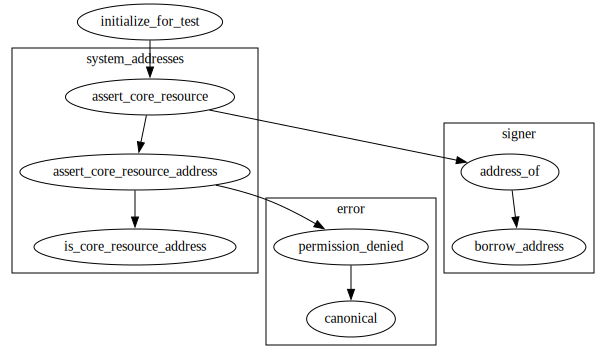

# Module `0x1::version`

Maintains the version number for the blockchain.

-  [Resource `Version`](#0x1_version_Version)
-  [Resource `SetVersionCapability`](#0x1_version_SetVersionCapability)
-  [Constants](#@Constants_0)
-  [Function `initialize`](#0x1_version_initialize)
-  [Function `set_version`](#0x1_version_set_version)
-  [Function `initialize_for_test`](#0x1_version_initialize_for_test)
-  [Specification](#@Specification_1)
    -  [Function `initialize`](#@Specification_1_initialize)
    -  [Function `set_version`](#@Specification_1_set_version)
    -  [Function `initialize_for_test`](#@Specification_1_initialize_for_test)

<pre><code><b>use</b> <a href="../../aptos-stdlib/../move-stdlib/doc/error.md#0x1_error">0x1::error</a>;
<b>use</b> <a href="reconfiguration.md#0x1_reconfiguration">0x1::reconfiguration</a>;
<b>use</b> <a href="../../aptos-stdlib/../move-stdlib/doc/signer.md#0x1_signer">0x1::signer</a>;
<b>use</b> <a href="system_addresses.md#0x1_system_addresses">0x1::system_addresses</a>;
</code></pre>

Show all the modules that "version" depends on directly or indirectly

Show all the modules that depend on "version" directly or indirectly

## Resource `Version`

<pre><code><b>struct</b> <a href="version.md#0x1_version_Version">Version</a> <b>has</b> key
</code></pre>

Fields

<dl>
<dt>
<code>major: u64</code>
</dt>
<dd>

</dd>
</dl>

## Resource `SetVersionCapability`

<pre><code><b>struct</b> <a href="version.md#0x1_version_SetVersionCapability">SetVersionCapability</a> <b>has</b> key
</code></pre>

Fields

<dl>
<dt>
<code>dummy_field: bool</code>
</dt>
<dd>

</dd>
</dl>

## Constants

Specified major version number must be greater than current version number.

<pre><code><b>const</b> <a href="version.md#0x1_version_EINVALID_MAJOR_VERSION_NUMBER">EINVALID_MAJOR_VERSION_NUMBER</a>: u64 = 1;
</code></pre>

Account is not authorized to make this change.

<pre><code><b>const</b> <a href="version.md#0x1_version_ENOT_AUTHORIZED">ENOT_AUTHORIZED</a>: u64 = 2;
</code></pre>

## Function `initialize`

Only called during genesis.
Publishes the Version config.

<pre><code><b>public</b>(<b>friend</b>) <b>fun</b> <a href="version.md#0x1_version_initialize">initialize</a>(aptos_framework: &<a href="../../aptos-stdlib/../move-stdlib/doc/signer.md#0x1_signer">signer</a>, initial_version: u64)
</code></pre>

Implementation

<pre><code><b>public</b>(<b>friend</b>) <b>fun</b> <a href="version.md#0x1_version_initialize">initialize</a>(aptos_framework: &<a href="../../aptos-stdlib/../move-stdlib/doc/signer.md#0x1_signer">signer</a>, initial_version: u64) {
    <a href="system_addresses.md#0x1_system_addresses_assert_aptos_framework">system_addresses::assert_aptos_framework</a>(aptos_framework);

    <b>move_to</b>(aptos_framework, <a href="version.md#0x1_version_Version">Version</a> { major: initial_version });
    // Give aptos framework <a href="account.md#0x1_account">account</a> capability <b>to</b> call set <a href="version.md#0x1_version">version</a>. This allows on chain governance <b>to</b> do it through
    // control of the aptos framework <a href="account.md#0x1_account">account</a>.
    <b>move_to</b>(aptos_framework, <a href="version.md#0x1_version_SetVersionCapability">SetVersionCapability</a> {});
}
</code></pre>

Show all the functions that "initialize" calls

Show all the functions that call "initialize"

## Function `set_version`

Updates the major version to a larger version.
This can be called by on chain governance.

<pre><code><b>public</b> entry <b>fun</b> <a href="version.md#0x1_version_set_version">set_version</a>(<a href="account.md#0x1_account">account</a>: &<a href="../../aptos-stdlib/../move-stdlib/doc/signer.md#0x1_signer">signer</a>, major: u64)
</code></pre>

Implementation

<pre><code><b>public</b> entry <b>fun</b> <a href="version.md#0x1_version_set_version">set_version</a>(<a href="account.md#0x1_account">account</a>: &<a href="../../aptos-stdlib/../move-stdlib/doc/signer.md#0x1_signer">signer</a>, major: u64) <b>acquires</b> <a href="version.md#0x1_version_Version">Version</a> {
    <b>assert</b>!(<b>exists</b>&lt;<a href="version.md#0x1_version_SetVersionCapability">SetVersionCapability</a>&gt;(<a href="../../aptos-stdlib/../move-stdlib/doc/signer.md#0x1_signer_address_of">signer::address_of</a>(<a href="account.md#0x1_account">account</a>)), <a href="../../aptos-stdlib/../move-stdlib/doc/error.md#0x1_error_permission_denied">error::permission_denied</a>(<a href="version.md#0x1_version_ENOT_AUTHORIZED">ENOT_AUTHORIZED</a>));

    <b>let</b> old_major = *&<b>borrow_global</b>&lt;<a href="version.md#0x1_version_Version">Version</a>&gt;(@aptos_framework).major;
    <b>assert</b>!(old_major &lt; major, <a href="../../aptos-stdlib/../move-stdlib/doc/error.md#0x1_error_invalid_argument">error::invalid_argument</a>(<a href="version.md#0x1_version_EINVALID_MAJOR_VERSION_NUMBER">EINVALID_MAJOR_VERSION_NUMBER</a>));

    <b>let</b> config = <b>borrow_global_mut</b>&lt;<a href="version.md#0x1_version_Version">Version</a>&gt;(@aptos_framework);
    config.major = major;

    // Need <b>to</b> trigger <a href="reconfiguration.md#0x1_reconfiguration">reconfiguration</a> so validator nodes can sync on the updated <a href="version.md#0x1_version">version</a>.
    <a href="reconfiguration.md#0x1_reconfiguration_reconfigure">reconfiguration::reconfigure</a>();
}
</code></pre>

Show all the functions that "set_version" calls

Show all the functions that call "set_version"

## Function `initialize_for_test`

Only called in tests and testnets. This allows the core resources account, which only exists in tests/testnets,
to update the version.

<pre><code><b>fun</b> <a href="version.md#0x1_version_initialize_for_test">initialize_for_test</a>(core_resources: &<a href="../../aptos-stdlib/../move-stdlib/doc/signer.md#0x1_signer">signer</a>)
</code></pre>

Implementation

<pre><code><b>fun</b> <a href="version.md#0x1_version_initialize_for_test">initialize_for_test</a>(core_resources: &<a href="../../aptos-stdlib/../move-stdlib/doc/signer.md#0x1_signer">signer</a>) {
    <a href="system_addresses.md#0x1_system_addresses_assert_core_resource">system_addresses::assert_core_resource</a>(core_resources);
    <b>move_to</b>(core_resources, <a href="version.md#0x1_version_SetVersionCapability">SetVersionCapability</a> {});
}
</code></pre>

Show all the functions that "initialize_for_test" calls

Show all the functions that call "initialize_for_test"

## Specification

<pre><code><b>pragma</b> verify = <b>true</b>;
<b>pragma</b> aborts_if_is_strict;
</code></pre>

### Function `initialize`

<pre><code><b>public</b>(<b>friend</b>) <b>fun</b> <a href="version.md#0x1_version_initialize">initialize</a>(aptos_framework: &<a href="../../aptos-stdlib/../move-stdlib/doc/signer.md#0x1_signer">signer</a>, initial_version: u64)
</code></pre>

Abort if resource already exists in <code>@aptos_framwork</code> when initializing.

<pre><code><b>aborts_if</b> <a href="../../aptos-stdlib/../move-stdlib/doc/signer.md#0x1_signer_address_of">signer::address_of</a>(aptos_framework) != @aptos_framework;
<b>aborts_if</b> <b>exists</b>&lt;<a href="version.md#0x1_version_Version">Version</a>&gt;(@aptos_framework);
<b>aborts_if</b> <b>exists</b>&lt;<a href="version.md#0x1_version_SetVersionCapability">SetVersionCapability</a>&gt;(@aptos_framework);
</code></pre>

### Function `set_version`

<pre><code><b>public</b> entry <b>fun</b> <a href="version.md#0x1_version_set_version">set_version</a>(<a href="account.md#0x1_account">account</a>: &<a href="../../aptos-stdlib/../move-stdlib/doc/signer.md#0x1_signer">signer</a>, major: u64)
</code></pre>

<pre><code><b>requires</b> <a href="chain_status.md#0x1_chain_status_is_operating">chain_status::is_operating</a>();
<b>requires</b> <a href="timestamp.md#0x1_timestamp_spec_now_microseconds">timestamp::spec_now_microseconds</a>() &gt;= <a href="reconfiguration.md#0x1_reconfiguration_last_reconfiguration_time">reconfiguration::last_reconfiguration_time</a>();
</code></pre>

<pre><code><b>aborts_if</b> !<b>exists</b>&lt;<a href="version.md#0x1_version_SetVersionCapability">SetVersionCapability</a>&gt;(<a href="../../aptos-stdlib/../move-stdlib/doc/signer.md#0x1_signer_address_of">signer::address_of</a>(<a href="account.md#0x1_account">account</a>));
<b>aborts_if</b> !<b>exists</b>&lt;<a href="version.md#0x1_version_Version">Version</a>&gt;(@aptos_framework);
<b>let</b> old_major = <b>global</b>&lt;<a href="version.md#0x1_version_Version">Version</a>&gt;(@aptos_framework).major;
<b>aborts_if</b> !(old_major &lt; major);
</code></pre>

### Function `initialize_for_test`

<pre><code><b>fun</b> <a href="version.md#0x1_version_initialize_for_test">initialize_for_test</a>(core_resources: &<a href="../../aptos-stdlib/../move-stdlib/doc/signer.md#0x1_signer">signer</a>)
</code></pre>

This module turns on <code>aborts_if_is_strict</code>, so need to add spec for test function <code>initialize_for_test</code>.

<pre><code><b>pragma</b> verify = <b>false</b>;
</code></pre>

[move-book]: https://move-language.github.io/move/introduction.html
