

# Module `0x1::bls12381`

Contains functions for:

The minimum-pubkey-size variant of [Boneh-Lynn-Shacham (BLS) signatures](https://en.wikipedia.org/wiki/BLS_digital_signature),
where public keys are BLS12-381 elliptic-curve points in $\mathbb{G}_1$ and signatures are in $\mathbb{G}_2$,
as per the [IETF BLS draft standard](https://datatracker.ietf.org/doc/html/draft-irtf-cfrg-bls-signature#section-2.1).

-  [Struct `PublicKey`](#0x1_bls12381_PublicKey)
-  [Struct `ProofOfPossession`](#0x1_bls12381_ProofOfPossession)
-  [Struct `PublicKeyWithPoP`](#0x1_bls12381_PublicKeyWithPoP)
-  [Struct `AggrPublicKeysWithPoP`](#0x1_bls12381_AggrPublicKeysWithPoP)
-  [Struct `Signature`](#0x1_bls12381_Signature)
-  [Struct `AggrOrMultiSignature`](#0x1_bls12381_AggrOrMultiSignature)
-  [Constants](#@Constants_0)
-  [Function `public_key_from_bytes`](#0x1_bls12381_public_key_from_bytes)
-  [Function `public_key_to_bytes`](#0x1_bls12381_public_key_to_bytes)
-  [Function `proof_of_possession_from_bytes`](#0x1_bls12381_proof_of_possession_from_bytes)
-  [Function `proof_of_possession_to_bytes`](#0x1_bls12381_proof_of_possession_to_bytes)
-  [Function `public_key_from_bytes_with_pop`](#0x1_bls12381_public_key_from_bytes_with_pop)
-  [Function `public_key_with_pop_to_normal`](#0x1_bls12381_public_key_with_pop_to_normal)
-  [Function `public_key_with_pop_to_bytes`](#0x1_bls12381_public_key_with_pop_to_bytes)
-  [Function `signature_from_bytes`](#0x1_bls12381_signature_from_bytes)
-  [Function `signature_to_bytes`](#0x1_bls12381_signature_to_bytes)
-  [Function `signature_subgroup_check`](#0x1_bls12381_signature_subgroup_check)
-  [Function `aggregate_pubkeys`](#0x1_bls12381_aggregate_pubkeys)
-  [Function `aggregate_pubkey_to_bytes`](#0x1_bls12381_aggregate_pubkey_to_bytes)
-  [Function `aggregate_signatures`](#0x1_bls12381_aggregate_signatures)
-  [Function `aggr_or_multi_signature_to_bytes`](#0x1_bls12381_aggr_or_multi_signature_to_bytes)
-  [Function `aggr_or_multi_signature_from_bytes`](#0x1_bls12381_aggr_or_multi_signature_from_bytes)
-  [Function `aggr_or_multi_signature_subgroup_check`](#0x1_bls12381_aggr_or_multi_signature_subgroup_check)
-  [Function `verify_aggregate_signature`](#0x1_bls12381_verify_aggregate_signature)
-  [Function `verify_multisignature`](#0x1_bls12381_verify_multisignature)
-  [Function `verify_normal_signature`](#0x1_bls12381_verify_normal_signature)
-  [Function `verify_signature_share`](#0x1_bls12381_verify_signature_share)
-  [Function `aggregate_pubkeys_internal`](#0x1_bls12381_aggregate_pubkeys_internal)
-  [Function `aggregate_signatures_internal`](#0x1_bls12381_aggregate_signatures_internal)
-  [Function `validate_pubkey_internal`](#0x1_bls12381_validate_pubkey_internal)
-  [Function `signature_subgroup_check_internal`](#0x1_bls12381_signature_subgroup_check_internal)
-  [Function `verify_aggregate_signature_internal`](#0x1_bls12381_verify_aggregate_signature_internal)
-  [Function `verify_multisignature_internal`](#0x1_bls12381_verify_multisignature_internal)
-  [Function `verify_normal_signature_internal`](#0x1_bls12381_verify_normal_signature_internal)
-  [Function `verify_proof_of_possession_internal`](#0x1_bls12381_verify_proof_of_possession_internal)
-  [Function `verify_signature_share_internal`](#0x1_bls12381_verify_signature_share_internal)
-  [Specification](#@Specification_1)
    -  [Function `aggregate_pubkeys_internal`](#@Specification_1_aggregate_pubkeys_internal)
    -  [Function `aggregate_signatures_internal`](#@Specification_1_aggregate_signatures_internal)
    -  [Function `validate_pubkey_internal`](#@Specification_1_validate_pubkey_internal)
    -  [Function `signature_subgroup_check_internal`](#@Specification_1_signature_subgroup_check_internal)
    -  [Function `verify_aggregate_signature_internal`](#@Specification_1_verify_aggregate_signature_internal)
    -  [Function `verify_multisignature_internal`](#@Specification_1_verify_multisignature_internal)
    -  [Function `verify_normal_signature_internal`](#@Specification_1_verify_normal_signature_internal)
    -  [Function `verify_proof_of_possession_internal`](#@Specification_1_verify_proof_of_possession_internal)
    -  [Function `verify_signature_share_internal`](#@Specification_1_verify_signature_share_internal)

<pre><code><b>use</b> <a href="../../move-stdlib/doc/error.md#0x1_error">0x1::error</a>;
<b>use</b> <a href="../../move-stdlib/doc/option.md#0x1_option">0x1::option</a>;
</code></pre>

Show all the modules that "bls12381" depends on directly or indirectly

Show all the modules that depend on "bls12381" directly or indirectly

## Struct `PublicKey`

A *validated* public key that:
(1) is a point in the prime-order subgroup of the BLS12-381 elliptic curve, and
(2) is not the identity point

This struct can be used to verify a normal (non-aggregated) signature.

This struct can be combined with a ProofOfPossession struct in order to create a PublicKeyWithPop struct, which
can be used to verify a multisignature.

<pre><code><b>struct</b> <a href="bls12381.md#0x1_bls12381_PublicKey">PublicKey</a> <b>has</b> <b>copy</b>, drop, store
</code></pre>

Fields

<dl>
<dt>
<code>bytes: <a href="../../move-stdlib/doc/vector.md#0x1_vector">vector</a>&lt;u8&gt;</code>
</dt>
<dd>

</dd>
</dl>

## Struct `ProofOfPossession`

A proof-of-possession (PoP).
Given such a struct and a PublicKey struct, one can construct a PublicKeyWithPoP (see below).

<pre><code><b>struct</b> <a href="bls12381.md#0x1_bls12381_ProofOfPossession">ProofOfPossession</a> <b>has</b> <b>copy</b>, drop, store
</code></pre>

Fields

<dl>
<dt>
<code>bytes: <a href="../../move-stdlib/doc/vector.md#0x1_vector">vector</a>&lt;u8&gt;</code>
</dt>
<dd>

</dd>
</dl>

## Struct `PublicKeyWithPoP`

A *validated* public key that had a successfully-verified proof-of-possession (PoP).

A vector of these structs can be either:
(1) used to verify an aggregate signature
(2) aggregated with other PublicKeyWithPoP structs into an AggrPublicKeysWithPoP, which in turn can be used
to verify a multisignature

<pre><code><b>struct</b> <a href="bls12381.md#0x1_bls12381_PublicKeyWithPoP">PublicKeyWithPoP</a> <b>has</b> <b>copy</b>, drop, store
</code></pre>

Fields

<dl>
<dt>
<code>bytes: <a href="../../move-stdlib/doc/vector.md#0x1_vector">vector</a>&lt;u8&gt;</code>
</dt>
<dd>

</dd>
</dl>

## Struct `AggrPublicKeysWithPoP`

An aggregation of public keys with verified PoPs, which can be used to verify multisignatures.

<pre><code><b>struct</b> <a href="bls12381.md#0x1_bls12381_AggrPublicKeysWithPoP">AggrPublicKeysWithPoP</a> <b>has</b> <b>copy</b>, drop, store
</code></pre>

Fields

<dl>
<dt>
<code>bytes: <a href="../../move-stdlib/doc/vector.md#0x1_vector">vector</a>&lt;u8&gt;</code>
</dt>
<dd>

</dd>
</dl>

## Struct `Signature`

A BLS signature. This can be either a:
(1) normal (non-aggregated) signature
(2) signature share (for a multisignature or aggregate signature)

<pre><code><b>struct</b> <a href="bls12381.md#0x1_bls12381_Signature">Signature</a> <b>has</b> <b>copy</b>, drop, store
</code></pre>

Fields

<dl>
<dt>
<code>bytes: <a href="../../move-stdlib/doc/vector.md#0x1_vector">vector</a>&lt;u8&gt;</code>
</dt>
<dd>

</dd>
</dl>

## Struct `AggrOrMultiSignature`

An aggregation of BLS signatures. This can be either a:
(4) aggregated signature (i.e., an aggregation of signatures s_i, each on a message m_i)
(3) multisignature (i.e., an aggregation of signatures s_i, each on the same message m)

We distinguish between a Signature type and a AggrOrMultiSignature type to prevent developers from interchangeably
calling <code>verify_multisignature</code> and <code>verify_signature_share</code> to verify both multisignatures and signature shares,
which could create problems down the line.

<pre><code><b>struct</b> <a href="bls12381.md#0x1_bls12381_AggrOrMultiSignature">AggrOrMultiSignature</a> <b>has</b> <b>copy</b>, drop, store
</code></pre>

Fields

<dl>
<dt>
<code>bytes: <a href="../../move-stdlib/doc/vector.md#0x1_vector">vector</a>&lt;u8&gt;</code>
</dt>
<dd>

</dd>
</dl>

## Constants

One of the given inputs has the wrong size.s

<pre><code><b>const</b> <a href="bls12381.md#0x1_bls12381_EWRONG_SIZE">EWRONG_SIZE</a>: u64 = 2;
</code></pre>

The caller was supposed to input one or more public keys.

<pre><code><b>const</b> <a href="bls12381.md#0x1_bls12381_EZERO_PUBKEYS">EZERO_PUBKEYS</a>: u64 = 1;
</code></pre>

The number of signers does not match the number of messages to be signed.

<pre><code><b>const</b> <a href="bls12381.md#0x1_bls12381_E_NUM_SIGNERS_MUST_EQ_NUM_MESSAGES">E_NUM_SIGNERS_MUST_EQ_NUM_MESSAGES</a>: u64 = 3;
</code></pre>

The public key size, in bytes

<pre><code><b>const</b> <a href="bls12381.md#0x1_bls12381_PUBLIC_KEY_NUM_BYTES">PUBLIC_KEY_NUM_BYTES</a>: u64 = 48;
</code></pre>

Random signature generated by running <code>cargo test -- bls12381_sample_signature --nocapture --<b>include</b>-ignored</code> in <code>crates/aptos-crypto</code>.
The associated SK is 07416693b6b32c84abe45578728e2379f525729e5b94762435a31e65ecc728da.

<pre><code><b>const</b> <a href="bls12381.md#0x1_bls12381_RANDOM_PK">RANDOM_PK</a>: <a href="../../move-stdlib/doc/vector.md#0x1_vector">vector</a>&lt;u8&gt; = [138, 83, 231, 174, 82, 112, 227, 231, 101, 205, 138, 64, 50, 194, 231, 124, 111, 126, 135, 164, 78, 187, 133, 191, 40, 164, 215, 134, 85, 101, 105, 143, 151, 83, 70, 113, 66, 98, 249, 228, 124, 111, 62, 13, 93, 149, 22, 96];
</code></pre>

Random signature generated by running <code>cargo test -- bls12381_sample_signature --nocapture --<b>include</b>-ignored</code> in <code>crates/aptos-crypto</code>.
The message signed is "Hello Aptos!" and the associated SK is 07416693b6b32c84abe45578728e2379f525729e5b94762435a31e65ecc728da.

<pre><code><b>const</b> <a href="bls12381.md#0x1_bls12381_RANDOM_SIGNATURE">RANDOM_SIGNATURE</a>: <a href="../../move-stdlib/doc/vector.md#0x1_vector">vector</a>&lt;u8&gt; = [160, 26, 101, 133, 79, 152, 125, 52, 52, 20, 155, 127, 8, 247, 7, 48, 227, 11, 36, 25, 132, 232, 113, 43, 194, 172, 168, 133, 214, 50, 170, 252, 237, 76, 63, 102, 18, 9, 222, 187, 107, 28, 134, 1, 50, 102, 35, 204, 22, 202, 47, 108, 158, 220, 83, 183, 184, 139, 116, 53, 251, 107, 5, 221, 236, 228, 24, 210, 195, 77, 198, 172, 162, 245, 161, 26, 121, 230, 119, 116, 88, 44, 20, 8, 74, 1, 220, 183, 130, 14, 76, 180, 186, 208, 234, 141];
</code></pre>

The signature size, in bytes

<pre><code><b>const</b> <a href="bls12381.md#0x1_bls12381_SIGNATURE_SIZE">SIGNATURE_SIZE</a>: u64 = 96;
</code></pre>

## Function `public_key_from_bytes`

Creates a new public key from a sequence of bytes.

<pre><code><b>public</b> <b>fun</b> <a href="bls12381.md#0x1_bls12381_public_key_from_bytes">public_key_from_bytes</a>(bytes: <a href="../../move-stdlib/doc/vector.md#0x1_vector">vector</a>&lt;u8&gt;): <a href="../../move-stdlib/doc/option.md#0x1_option_Option">option::Option</a>&lt;<a href="bls12381.md#0x1_bls12381_PublicKey">bls12381::PublicKey</a>&gt;
</code></pre>

Implementation

<pre><code><b>public</b> <b>fun</b> <a href="bls12381.md#0x1_bls12381_public_key_from_bytes">public_key_from_bytes</a>(bytes: <a href="../../move-stdlib/doc/vector.md#0x1_vector">vector</a>&lt;u8&gt;): Option&lt;<a href="bls12381.md#0x1_bls12381_PublicKey">PublicKey</a>&gt; {
    <b>if</b> (<a href="bls12381.md#0x1_bls12381_validate_pubkey_internal">validate_pubkey_internal</a>(bytes)) {
        <a href="../../move-stdlib/doc/option.md#0x1_option_some">option::some</a>(<a href="bls12381.md#0x1_bls12381_PublicKey">PublicKey</a> {
            bytes
        })
    } <b>else</b> {
        <a href="../../move-stdlib/doc/option.md#0x1_option_none">option::none</a>&lt;<a href="bls12381.md#0x1_bls12381_PublicKey">PublicKey</a>&gt;()
    }
}
</code></pre>

Show all the functions that "public_key_from_bytes" calls

Show all the functions that call "public_key_from_bytes"

## Function `public_key_to_bytes`

Serializes a public key into 48 bytes.

<pre><code><b>public</b> <b>fun</b> <a href="bls12381.md#0x1_bls12381_public_key_to_bytes">public_key_to_bytes</a>(pk: &<a href="bls12381.md#0x1_bls12381_PublicKey">bls12381::PublicKey</a>): <a href="../../move-stdlib/doc/vector.md#0x1_vector">vector</a>&lt;u8&gt;
</code></pre>

Implementation

<pre><code><b>public</b> <b>fun</b> <a href="bls12381.md#0x1_bls12381_public_key_to_bytes">public_key_to_bytes</a>(pk: &<a href="bls12381.md#0x1_bls12381_PublicKey">PublicKey</a>): <a href="../../move-stdlib/doc/vector.md#0x1_vector">vector</a>&lt;u8&gt; {
    pk.bytes
}
</code></pre>

Show all the functions that "public_key_to_bytes" calls

Show all the functions that call "public_key_to_bytes"

## Function `proof_of_possession_from_bytes`

Creates a new proof-of-possession (PoP) which can be later used to create a PublicKeyWithPoP struct,

<pre><code><b>public</b> <b>fun</b> <a href="bls12381.md#0x1_bls12381_proof_of_possession_from_bytes">proof_of_possession_from_bytes</a>(bytes: <a href="../../move-stdlib/doc/vector.md#0x1_vector">vector</a>&lt;u8&gt;): <a href="bls12381.md#0x1_bls12381_ProofOfPossession">bls12381::ProofOfPossession</a>
</code></pre>

Implementation

<pre><code><b>public</b> <b>fun</b> <a href="bls12381.md#0x1_bls12381_proof_of_possession_from_bytes">proof_of_possession_from_bytes</a>(bytes: <a href="../../move-stdlib/doc/vector.md#0x1_vector">vector</a>&lt;u8&gt;): <a href="bls12381.md#0x1_bls12381_ProofOfPossession">ProofOfPossession</a> {
    <a href="bls12381.md#0x1_bls12381_ProofOfPossession">ProofOfPossession</a> {
        bytes
    }
}
</code></pre>

Show all the functions that "proof_of_possession_from_bytes" calls

Show all the functions that call "proof_of_possession_from_bytes"

## Function `proof_of_possession_to_bytes`

Serializes the signature into 96 bytes.

<pre><code><b>public</b> <b>fun</b> <a href="bls12381.md#0x1_bls12381_proof_of_possession_to_bytes">proof_of_possession_to_bytes</a>(pop: &<a href="bls12381.md#0x1_bls12381_ProofOfPossession">bls12381::ProofOfPossession</a>): <a href="../../move-stdlib/doc/vector.md#0x1_vector">vector</a>&lt;u8&gt;
</code></pre>

Implementation

<pre><code><b>public</b> <b>fun</b> <a href="bls12381.md#0x1_bls12381_proof_of_possession_to_bytes">proof_of_possession_to_bytes</a>(pop: &<a href="bls12381.md#0x1_bls12381_ProofOfPossession">ProofOfPossession</a>): <a href="../../move-stdlib/doc/vector.md#0x1_vector">vector</a>&lt;u8&gt; {
    pop.bytes
}
</code></pre>

Show all the functions that "proof_of_possession_to_bytes" calls

Show all the functions that call "proof_of_possession_to_bytes"

## Function `public_key_from_bytes_with_pop`

Creates a PoP'd public key from a normal public key and a corresponding proof-of-possession.

<pre><code><b>public</b> <b>fun</b> <a href="bls12381.md#0x1_bls12381_public_key_from_bytes_with_pop">public_key_from_bytes_with_pop</a>(pk_bytes: <a href="../../move-stdlib/doc/vector.md#0x1_vector">vector</a>&lt;u8&gt;, pop: &<a href="bls12381.md#0x1_bls12381_ProofOfPossession">bls12381::ProofOfPossession</a>): <a href="../../move-stdlib/doc/option.md#0x1_option_Option">option::Option</a>&lt;<a href="bls12381.md#0x1_bls12381_PublicKeyWithPoP">bls12381::PublicKeyWithPoP</a>&gt;
</code></pre>

Implementation

<pre><code><b>public</b> <b>fun</b> <a href="bls12381.md#0x1_bls12381_public_key_from_bytes_with_pop">public_key_from_bytes_with_pop</a>(pk_bytes: <a href="../../move-stdlib/doc/vector.md#0x1_vector">vector</a>&lt;u8&gt;, pop: &<a href="bls12381.md#0x1_bls12381_ProofOfPossession">ProofOfPossession</a>): Option&lt;<a href="bls12381.md#0x1_bls12381_PublicKeyWithPoP">PublicKeyWithPoP</a>&gt; {
    <b>if</b> (<a href="bls12381.md#0x1_bls12381_verify_proof_of_possession_internal">verify_proof_of_possession_internal</a>(pk_bytes, pop.bytes)) {
        <a href="../../move-stdlib/doc/option.md#0x1_option_some">option::some</a>(<a href="bls12381.md#0x1_bls12381_PublicKeyWithPoP">PublicKeyWithPoP</a> {
            bytes: pk_bytes
        })
    } <b>else</b> {
        <a href="../../move-stdlib/doc/option.md#0x1_option_none">option::none</a>&lt;<a href="bls12381.md#0x1_bls12381_PublicKeyWithPoP">PublicKeyWithPoP</a>&gt;()
    }
}
</code></pre>

Show all the functions that "public_key_from_bytes_with_pop" calls

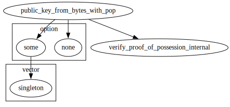

Show all the functions that call "public_key_from_bytes_with_pop"

## Function `public_key_with_pop_to_normal`

Creates a normal public key from a PoP'd public key.

<pre><code><b>public</b> <b>fun</b> <a href="bls12381.md#0x1_bls12381_public_key_with_pop_to_normal">public_key_with_pop_to_normal</a>(pkpop: &<a href="bls12381.md#0x1_bls12381_PublicKeyWithPoP">bls12381::PublicKeyWithPoP</a>): <a href="bls12381.md#0x1_bls12381_PublicKey">bls12381::PublicKey</a>
</code></pre>

Implementation

<pre><code><b>public</b> <b>fun</b> <a href="bls12381.md#0x1_bls12381_public_key_with_pop_to_normal">public_key_with_pop_to_normal</a>(pkpop: &<a href="bls12381.md#0x1_bls12381_PublicKeyWithPoP">PublicKeyWithPoP</a>): <a href="bls12381.md#0x1_bls12381_PublicKey">PublicKey</a> {
    <a href="bls12381.md#0x1_bls12381_PublicKey">PublicKey</a> {
        bytes: pkpop.bytes
    }
}
</code></pre>

Show all the functions that "public_key_with_pop_to_normal" calls

Show all the functions that call "public_key_with_pop_to_normal"

## Function `public_key_with_pop_to_bytes`

Serializes a PoP'd public key into 48 bytes.

<pre><code><b>public</b> <b>fun</b> <a href="bls12381.md#0x1_bls12381_public_key_with_pop_to_bytes">public_key_with_pop_to_bytes</a>(pk: &<a href="bls12381.md#0x1_bls12381_PublicKeyWithPoP">bls12381::PublicKeyWithPoP</a>): <a href="../../move-stdlib/doc/vector.md#0x1_vector">vector</a>&lt;u8&gt;
</code></pre>

Implementation

<pre><code><b>public</b> <b>fun</b> <a href="bls12381.md#0x1_bls12381_public_key_with_pop_to_bytes">public_key_with_pop_to_bytes</a>(pk: &<a href="bls12381.md#0x1_bls12381_PublicKeyWithPoP">PublicKeyWithPoP</a>): <a href="../../move-stdlib/doc/vector.md#0x1_vector">vector</a>&lt;u8&gt; {
    pk.bytes
}
</code></pre>

Show all the functions that "public_key_with_pop_to_bytes" calls

Show all the functions that call "public_key_with_pop_to_bytes"

## Function `signature_from_bytes`

Creates a new signature from a sequence of bytes. Does not check the signature for prime-order subgroup
membership since that is done implicitly during verification.

<pre><code><b>public</b> <b>fun</b> <a href="bls12381.md#0x1_bls12381_signature_from_bytes">signature_from_bytes</a>(bytes: <a href="../../move-stdlib/doc/vector.md#0x1_vector">vector</a>&lt;u8&gt;): <a href="bls12381.md#0x1_bls12381_Signature">bls12381::Signature</a>
</code></pre>

Implementation

<pre><code><b>public</b> <b>fun</b> <a href="bls12381.md#0x1_bls12381_signature_from_bytes">signature_from_bytes</a>(bytes: <a href="../../move-stdlib/doc/vector.md#0x1_vector">vector</a>&lt;u8&gt;): <a href="bls12381.md#0x1_bls12381_Signature">Signature</a> {
    <a href="bls12381.md#0x1_bls12381_Signature">Signature</a> {
        bytes
    }
}
</code></pre>

Show all the functions that "signature_from_bytes" calls

Show all the functions that call "signature_from_bytes"

## Function `signature_to_bytes`

Serializes the signature into 96 bytes.

<pre><code><b>public</b> <b>fun</b> <a href="bls12381.md#0x1_bls12381_signature_to_bytes">signature_to_bytes</a>(sig: &<a href="bls12381.md#0x1_bls12381_Signature">bls12381::Signature</a>): <a href="../../move-stdlib/doc/vector.md#0x1_vector">vector</a>&lt;u8&gt;
</code></pre>

Implementation

<pre><code><b>public</b> <b>fun</b> <a href="bls12381.md#0x1_bls12381_signature_to_bytes">signature_to_bytes</a>(sig: &<a href="bls12381.md#0x1_bls12381_Signature">Signature</a>): <a href="../../move-stdlib/doc/vector.md#0x1_vector">vector</a>&lt;u8&gt; {
    sig.bytes
}
</code></pre>

Show all the functions that "signature_to_bytes" calls

Show all the functions that call "signature_to_bytes"

## Function `signature_subgroup_check`

Checks that the group element that defines a signature is in the prime-order subgroup.
This check is implicitly performed when verifying any signature via this module, but we expose this functionality
in case it might be useful for applications to easily dismiss invalid signatures early on.

<pre><code><b>public</b> <b>fun</b> <a href="bls12381.md#0x1_bls12381_signature_subgroup_check">signature_subgroup_check</a>(signature: &<a href="bls12381.md#0x1_bls12381_Signature">bls12381::Signature</a>): bool
</code></pre>

Implementation

<pre><code><b>public</b> <b>fun</b> <a href="bls12381.md#0x1_bls12381_signature_subgroup_check">signature_subgroup_check</a>(signature: &<a href="bls12381.md#0x1_bls12381_Signature">Signature</a>): bool {
    <a href="bls12381.md#0x1_bls12381_signature_subgroup_check_internal">signature_subgroup_check_internal</a>(signature.bytes)
}
</code></pre>

Show all the functions that "signature_subgroup_check" calls

Show all the functions that call "signature_subgroup_check"

## Function `aggregate_pubkeys`

Given a vector of public keys with verified PoPs, combines them into an *aggregated* public key which can be used
to verify multisignatures using <code>verify_multisignature</code> and aggregate signatures using <code>verify_aggregate_signature</code>.
Aborts if no public keys are given as input.

<pre><code><b>public</b> <b>fun</b> <a href="bls12381.md#0x1_bls12381_aggregate_pubkeys">aggregate_pubkeys</a>(public_keys: <a href="../../move-stdlib/doc/vector.md#0x1_vector">vector</a>&lt;<a href="bls12381.md#0x1_bls12381_PublicKeyWithPoP">bls12381::PublicKeyWithPoP</a>&gt;): <a href="bls12381.md#0x1_bls12381_AggrPublicKeysWithPoP">bls12381::AggrPublicKeysWithPoP</a>
</code></pre>

Implementation

<pre><code><b>public</b> <b>fun</b> <a href="bls12381.md#0x1_bls12381_aggregate_pubkeys">aggregate_pubkeys</a>(public_keys: <a href="../../move-stdlib/doc/vector.md#0x1_vector">vector</a>&lt;<a href="bls12381.md#0x1_bls12381_PublicKeyWithPoP">PublicKeyWithPoP</a>&gt;): <a href="bls12381.md#0x1_bls12381_AggrPublicKeysWithPoP">AggrPublicKeysWithPoP</a> {
    <b>let</b> (bytes, success) = <a href="bls12381.md#0x1_bls12381_aggregate_pubkeys_internal">aggregate_pubkeys_internal</a>(public_keys);
    <b>assert</b>!(success, std::error::invalid_argument(<a href="bls12381.md#0x1_bls12381_EZERO_PUBKEYS">EZERO_PUBKEYS</a>));

    <a href="bls12381.md#0x1_bls12381_AggrPublicKeysWithPoP">AggrPublicKeysWithPoP</a> {
        bytes
    }
}
</code></pre>

Show all the functions that "aggregate_pubkeys" calls

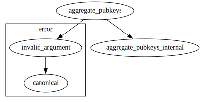

Show all the functions that call "aggregate_pubkeys"

## Function `aggregate_pubkey_to_bytes`

Serializes an aggregate public key into 48 bytes.

<pre><code><b>public</b> <b>fun</b> <a href="bls12381.md#0x1_bls12381_aggregate_pubkey_to_bytes">aggregate_pubkey_to_bytes</a>(apk: &<a href="bls12381.md#0x1_bls12381_AggrPublicKeysWithPoP">bls12381::AggrPublicKeysWithPoP</a>): <a href="../../move-stdlib/doc/vector.md#0x1_vector">vector</a>&lt;u8&gt;
</code></pre>

Implementation

<pre><code><b>public</b> <b>fun</b> <a href="bls12381.md#0x1_bls12381_aggregate_pubkey_to_bytes">aggregate_pubkey_to_bytes</a>(apk: &<a href="bls12381.md#0x1_bls12381_AggrPublicKeysWithPoP">AggrPublicKeysWithPoP</a>): <a href="../../move-stdlib/doc/vector.md#0x1_vector">vector</a>&lt;u8&gt; {
    apk.bytes
}
</code></pre>

Show all the functions that "aggregate_pubkey_to_bytes" calls

Show all the functions that call "aggregate_pubkey_to_bytes"

## Function `aggregate_signatures`

Aggregates the input signatures into an aggregate-or-multi-signature structure, which can be later verified via
<code>verify_aggregate_signature</code> or <code>verify_multisignature</code>. Returns <code>None</code> if zero signatures are given as input
or if some of the signatures are not valid group elements.

<pre><code><b>public</b> <b>fun</b> <a href="bls12381.md#0x1_bls12381_aggregate_signatures">aggregate_signatures</a>(signatures: <a href="../../move-stdlib/doc/vector.md#0x1_vector">vector</a>&lt;<a href="bls12381.md#0x1_bls12381_Signature">bls12381::Signature</a>&gt;): <a href="../../move-stdlib/doc/option.md#0x1_option_Option">option::Option</a>&lt;<a href="bls12381.md#0x1_bls12381_AggrOrMultiSignature">bls12381::AggrOrMultiSignature</a>&gt;
</code></pre>

Implementation

<pre><code><b>public</b> <b>fun</b> <a href="bls12381.md#0x1_bls12381_aggregate_signatures">aggregate_signatures</a>(signatures: <a href="../../move-stdlib/doc/vector.md#0x1_vector">vector</a>&lt;<a href="bls12381.md#0x1_bls12381_Signature">Signature</a>&gt;): Option&lt;<a href="bls12381.md#0x1_bls12381_AggrOrMultiSignature">AggrOrMultiSignature</a>&gt; {
    <b>let</b> (bytes, success) = <a href="bls12381.md#0x1_bls12381_aggregate_signatures_internal">aggregate_signatures_internal</a>(signatures);
    <b>if</b> (success) {
        <a href="../../move-stdlib/doc/option.md#0x1_option_some">option::some</a>(
            <a href="bls12381.md#0x1_bls12381_AggrOrMultiSignature">AggrOrMultiSignature</a> {
                bytes
            }
        )
    } <b>else</b> {
        <a href="../../move-stdlib/doc/option.md#0x1_option_none">option::none</a>&lt;<a href="bls12381.md#0x1_bls12381_AggrOrMultiSignature">AggrOrMultiSignature</a>&gt;()
    }
}
</code></pre>

Show all the functions that "aggregate_signatures" calls

Show all the functions that call "aggregate_signatures"

## Function `aggr_or_multi_signature_to_bytes`

Serializes an aggregate-or-multi-signature into 96 bytes.

<pre><code><b>public</b> <b>fun</b> <a href="bls12381.md#0x1_bls12381_aggr_or_multi_signature_to_bytes">aggr_or_multi_signature_to_bytes</a>(sig: &<a href="bls12381.md#0x1_bls12381_AggrOrMultiSignature">bls12381::AggrOrMultiSignature</a>): <a href="../../move-stdlib/doc/vector.md#0x1_vector">vector</a>&lt;u8&gt;
</code></pre>

Implementation

<pre><code><b>public</b> <b>fun</b> <a href="bls12381.md#0x1_bls12381_aggr_or_multi_signature_to_bytes">aggr_or_multi_signature_to_bytes</a>(sig: &<a href="bls12381.md#0x1_bls12381_AggrOrMultiSignature">AggrOrMultiSignature</a>): <a href="../../move-stdlib/doc/vector.md#0x1_vector">vector</a>&lt;u8&gt; {
    sig.bytes
}
</code></pre>

Show all the functions that "aggr_or_multi_signature_to_bytes" calls

Show all the functions that call "aggr_or_multi_signature_to_bytes"

## Function `aggr_or_multi_signature_from_bytes`

Deserializes an aggregate-or-multi-signature from 96 bytes.

<pre><code><b>public</b> <b>fun</b> <a href="bls12381.md#0x1_bls12381_aggr_or_multi_signature_from_bytes">aggr_or_multi_signature_from_bytes</a>(bytes: <a href="../../move-stdlib/doc/vector.md#0x1_vector">vector</a>&lt;u8&gt;): <a href="bls12381.md#0x1_bls12381_AggrOrMultiSignature">bls12381::AggrOrMultiSignature</a>
</code></pre>

Implementation

<pre><code><b>public</b> <b>fun</b> <a href="bls12381.md#0x1_bls12381_aggr_or_multi_signature_from_bytes">aggr_or_multi_signature_from_bytes</a>(bytes: <a href="../../move-stdlib/doc/vector.md#0x1_vector">vector</a>&lt;u8&gt;): <a href="bls12381.md#0x1_bls12381_AggrOrMultiSignature">AggrOrMultiSignature</a> {
    <b>assert</b>!(std::vector::length(&bytes) == <a href="bls12381.md#0x1_bls12381_SIGNATURE_SIZE">SIGNATURE_SIZE</a>, std::error::invalid_argument(<a href="bls12381.md#0x1_bls12381_EWRONG_SIZE">EWRONG_SIZE</a>));

    <a href="bls12381.md#0x1_bls12381_AggrOrMultiSignature">AggrOrMultiSignature</a> {
        bytes
    }
}
</code></pre>

Show all the functions that "aggr_or_multi_signature_from_bytes" calls

Show all the functions that call "aggr_or_multi_signature_from_bytes"

## Function `aggr_or_multi_signature_subgroup_check`

Checks that the group element that defines an aggregate-or-multi-signature is in the prime-order subgroup.

<pre><code><b>public</b> <b>fun</b> <a href="bls12381.md#0x1_bls12381_aggr_or_multi_signature_subgroup_check">aggr_or_multi_signature_subgroup_check</a>(signature: &<a href="bls12381.md#0x1_bls12381_AggrOrMultiSignature">bls12381::AggrOrMultiSignature</a>): bool
</code></pre>

Implementation

<pre><code><b>public</b> <b>fun</b> <a href="bls12381.md#0x1_bls12381_aggr_or_multi_signature_subgroup_check">aggr_or_multi_signature_subgroup_check</a>(signature: &<a href="bls12381.md#0x1_bls12381_AggrOrMultiSignature">AggrOrMultiSignature</a>): bool {
    <a href="bls12381.md#0x1_bls12381_signature_subgroup_check_internal">signature_subgroup_check_internal</a>(signature.bytes)
}
</code></pre>

Show all the functions that "aggr_or_multi_signature_subgroup_check" calls

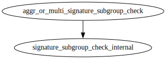

Show all the functions that call "aggr_or_multi_signature_subgroup_check"

## Function `verify_aggregate_signature`

Verifies an aggregate signature, an aggregation of many signatures <code>s_i</code>, each on a different message <code>m_i</code>.

<pre><code><b>public</b> <b>fun</b> <a href="bls12381.md#0x1_bls12381_verify_aggregate_signature">verify_aggregate_signature</a>(aggr_sig: &<a href="bls12381.md#0x1_bls12381_AggrOrMultiSignature">bls12381::AggrOrMultiSignature</a>, public_keys: <a href="../../move-stdlib/doc/vector.md#0x1_vector">vector</a>&lt;<a href="bls12381.md#0x1_bls12381_PublicKeyWithPoP">bls12381::PublicKeyWithPoP</a>&gt;, messages: <a href="../../move-stdlib/doc/vector.md#0x1_vector">vector</a>&lt;<a href="../../move-stdlib/doc/vector.md#0x1_vector">vector</a>&lt;u8&gt;&gt;): bool
</code></pre>

Implementation

<pre><code><b>public</b> <b>fun</b> <a href="bls12381.md#0x1_bls12381_verify_aggregate_signature">verify_aggregate_signature</a>(
    aggr_sig: &<a href="bls12381.md#0x1_bls12381_AggrOrMultiSignature">AggrOrMultiSignature</a>,
    public_keys: <a href="../../move-stdlib/doc/vector.md#0x1_vector">vector</a>&lt;<a href="bls12381.md#0x1_bls12381_PublicKeyWithPoP">PublicKeyWithPoP</a>&gt;,
    messages: <a href="../../move-stdlib/doc/vector.md#0x1_vector">vector</a>&lt;<a href="../../move-stdlib/doc/vector.md#0x1_vector">vector</a>&lt;u8&gt;&gt;,
): bool {
    <a href="bls12381.md#0x1_bls12381_verify_aggregate_signature_internal">verify_aggregate_signature_internal</a>(aggr_sig.bytes, public_keys, messages)
}
</code></pre>

Show all the functions that "verify_aggregate_signature" calls

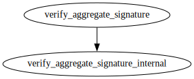

Show all the functions that call "verify_aggregate_signature"

## Function `verify_multisignature`

Verifies a multisignature: an aggregation of many signatures, each on the same message <code>m</code>.

<pre><code><b>public</b> <b>fun</b> <a href="bls12381.md#0x1_bls12381_verify_multisignature">verify_multisignature</a>(multisig: &<a href="bls12381.md#0x1_bls12381_AggrOrMultiSignature">bls12381::AggrOrMultiSignature</a>, aggr_public_key: &<a href="bls12381.md#0x1_bls12381_AggrPublicKeysWithPoP">bls12381::AggrPublicKeysWithPoP</a>, message: <a href="../../move-stdlib/doc/vector.md#0x1_vector">vector</a>&lt;u8&gt;): bool
</code></pre>

Implementation

<pre><code><b>public</b> <b>fun</b> <a href="bls12381.md#0x1_bls12381_verify_multisignature">verify_multisignature</a>(
    multisig: &<a href="bls12381.md#0x1_bls12381_AggrOrMultiSignature">AggrOrMultiSignature</a>,
    aggr_public_key: &<a href="bls12381.md#0x1_bls12381_AggrPublicKeysWithPoP">AggrPublicKeysWithPoP</a>,
    message: <a href="../../move-stdlib/doc/vector.md#0x1_vector">vector</a>&lt;u8&gt;
): bool {
    <a href="bls12381.md#0x1_bls12381_verify_multisignature_internal">verify_multisignature_internal</a>(multisig.bytes, aggr_public_key.bytes, message)
}
</code></pre>

Show all the functions that "verify_multisignature" calls

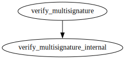

Show all the functions that call "verify_multisignature"

## Function `verify_normal_signature`

Verifies a normal, non-aggregated signature.

<pre><code><b>public</b> <b>fun</b> <a href="bls12381.md#0x1_bls12381_verify_normal_signature">verify_normal_signature</a>(signature: &<a href="bls12381.md#0x1_bls12381_Signature">bls12381::Signature</a>, public_key: &<a href="bls12381.md#0x1_bls12381_PublicKey">bls12381::PublicKey</a>, message: <a href="../../move-stdlib/doc/vector.md#0x1_vector">vector</a>&lt;u8&gt;): bool
</code></pre>

Implementation

<pre><code><b>public</b> <b>fun</b> <a href="bls12381.md#0x1_bls12381_verify_normal_signature">verify_normal_signature</a>(
    signature: &<a href="bls12381.md#0x1_bls12381_Signature">Signature</a>,
    public_key: &<a href="bls12381.md#0x1_bls12381_PublicKey">PublicKey</a>,
    message: <a href="../../move-stdlib/doc/vector.md#0x1_vector">vector</a>&lt;u8&gt;
): bool {
    <a href="bls12381.md#0x1_bls12381_verify_normal_signature_internal">verify_normal_signature_internal</a>(signature.bytes, public_key.bytes, message)
}
</code></pre>

Show all the functions that "verify_normal_signature" calls

Show all the functions that call "verify_normal_signature"

## Function `verify_signature_share`

Verifies a signature share in the multisignature share or an aggregate signature share.

<pre><code><b>public</b> <b>fun</b> <a href="bls12381.md#0x1_bls12381_verify_signature_share">verify_signature_share</a>(signature_share: &<a href="bls12381.md#0x1_bls12381_Signature">bls12381::Signature</a>, public_key: &<a href="bls12381.md#0x1_bls12381_PublicKeyWithPoP">bls12381::PublicKeyWithPoP</a>, message: <a href="../../move-stdlib/doc/vector.md#0x1_vector">vector</a>&lt;u8&gt;): bool
</code></pre>

Implementation

<pre><code><b>public</b> <b>fun</b> <a href="bls12381.md#0x1_bls12381_verify_signature_share">verify_signature_share</a>(
    signature_share: &<a href="bls12381.md#0x1_bls12381_Signature">Signature</a>,
    public_key: &<a href="bls12381.md#0x1_bls12381_PublicKeyWithPoP">PublicKeyWithPoP</a>,
    message: <a href="../../move-stdlib/doc/vector.md#0x1_vector">vector</a>&lt;u8&gt;
): bool {
    <a href="bls12381.md#0x1_bls12381_verify_signature_share_internal">verify_signature_share_internal</a>(signature_share.bytes, public_key.bytes, message)
}
</code></pre>

Show all the functions that "verify_signature_share" calls

Show all the functions that call "verify_signature_share"

## Function `aggregate_pubkeys_internal`

CRYPTOGRAPHY WARNING: This function assumes that the caller verified all public keys have a valid
proof-of-possesion (PoP) using <code>verify_proof_of_possession</code>.

Given a vector of serialized public keys, combines them into an aggregated public key, returning <code>(bytes, <b>true</b>)</code>,
where <code>bytes</code> store the serialized public key.
Aborts if no public keys are given as input.

<pre><code><b>fun</b> <a href="bls12381.md#0x1_bls12381_aggregate_pubkeys_internal">aggregate_pubkeys_internal</a>(public_keys: <a href="../../move-stdlib/doc/vector.md#0x1_vector">vector</a>&lt;<a href="bls12381.md#0x1_bls12381_PublicKeyWithPoP">bls12381::PublicKeyWithPoP</a>&gt;): (<a href="../../move-stdlib/doc/vector.md#0x1_vector">vector</a>&lt;u8&gt;, bool)
</code></pre>

Implementation

<pre><code><b>native</b> <b>fun</b> <a href="bls12381.md#0x1_bls12381_aggregate_pubkeys_internal">aggregate_pubkeys_internal</a>(public_keys: <a href="../../move-stdlib/doc/vector.md#0x1_vector">vector</a>&lt;<a href="bls12381.md#0x1_bls12381_PublicKeyWithPoP">PublicKeyWithPoP</a>&gt;): (<a href="../../move-stdlib/doc/vector.md#0x1_vector">vector</a>&lt;u8&gt;, bool);
</code></pre>

Show all the functions that "aggregate_pubkeys_internal" calls

Show all the functions that call "aggregate_pubkeys_internal"

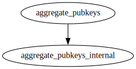

## Function `aggregate_signatures_internal`

CRYPTOGRAPHY WARNING: This function can be safely called without verifying that the input signatures are elements
of the prime-order subgroup of the BLS12-381 curve.

Given a vector of serialized signatures, combines them into an aggregate signature, returning <code>(bytes, <b>true</b>)</code>,
where <code>bytes</code> store the serialized signature.
Does not check the input signatures nor the final aggregated signatures for prime-order subgroup membership.
Returns <code>(_, <b>false</b>)</code> if no signatures are given as input.
Does not abort.

<pre><code><b>fun</b> <a href="bls12381.md#0x1_bls12381_aggregate_signatures_internal">aggregate_signatures_internal</a>(signatures: <a href="../../move-stdlib/doc/vector.md#0x1_vector">vector</a>&lt;<a href="bls12381.md#0x1_bls12381_Signature">bls12381::Signature</a>&gt;): (<a href="../../move-stdlib/doc/vector.md#0x1_vector">vector</a>&lt;u8&gt;, bool)
</code></pre>

Implementation

<pre><code><b>native</b> <b>fun</b> <a href="bls12381.md#0x1_bls12381_aggregate_signatures_internal">aggregate_signatures_internal</a>(signatures: <a href="../../move-stdlib/doc/vector.md#0x1_vector">vector</a>&lt;<a href="bls12381.md#0x1_bls12381_Signature">Signature</a>&gt;): (<a href="../../move-stdlib/doc/vector.md#0x1_vector">vector</a>&lt;u8&gt;, bool);
</code></pre>

Show all the functions that "aggregate_signatures_internal" calls

Show all the functions that call "aggregate_signatures_internal"

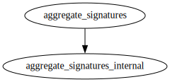

## Function `validate_pubkey_internal`

Return <code><b>true</b></code> if the bytes in <code>public_key</code> are a valid BLS12-381 public key:
(1) it is NOT the identity point, and
(2) it is a BLS12-381 elliptic curve point, and
(3) it is a prime-order point
Return <code><b>false</b></code> otherwise.
Does not abort.

<pre><code><b>fun</b> <a href="bls12381.md#0x1_bls12381_validate_pubkey_internal">validate_pubkey_internal</a>(public_key: <a href="../../move-stdlib/doc/vector.md#0x1_vector">vector</a>&lt;u8&gt;): bool
</code></pre>

Implementation

<pre><code><b>native</b> <b>fun</b> <a href="bls12381.md#0x1_bls12381_validate_pubkey_internal">validate_pubkey_internal</a>(public_key: <a href="../../move-stdlib/doc/vector.md#0x1_vector">vector</a>&lt;u8&gt;): bool;
</code></pre>

Show all the functions that "validate_pubkey_internal" calls

Show all the functions that call "validate_pubkey_internal"

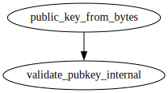

## Function `signature_subgroup_check_internal`

Return <code><b>true</b></code> if the elliptic curve point serialized in <code>signature</code>:
(1) is NOT the identity point, and
(2) is a BLS12-381 elliptic curve point, and
(3) is a prime-order point
Return <code><b>false</b></code> otherwise.
Does not abort.

<pre><code><b>fun</b> <a href="bls12381.md#0x1_bls12381_signature_subgroup_check_internal">signature_subgroup_check_internal</a>(signature: <a href="../../move-stdlib/doc/vector.md#0x1_vector">vector</a>&lt;u8&gt;): bool
</code></pre>

Implementation

<pre><code><b>native</b> <b>fun</b> <a href="bls12381.md#0x1_bls12381_signature_subgroup_check_internal">signature_subgroup_check_internal</a>(signature: <a href="../../move-stdlib/doc/vector.md#0x1_vector">vector</a>&lt;u8&gt;): bool;
</code></pre>

Show all the functions that "signature_subgroup_check_internal" calls

Show all the functions that call "signature_subgroup_check_internal"

## Function `verify_aggregate_signature_internal`

CRYPTOGRAPHY WARNING: First, this function assumes all public keys have a valid proof-of-possesion (PoP).
This prevents both small-subgroup attacks and rogue-key attacks. Second, this function can be safely called
without verifying that the aggregate signature is in the prime-order subgroup of the BLS12-381 curve.

Returns <code><b>true</b></code> if the aggregate signature <code>aggsig</code> on <code>messages</code> under <code>public_keys</code> verifies (where <code>messages[i]</code>
should be signed by <code>public_keys[i]</code>).

Returns <code><b>false</b></code> if either:
- no public keys or messages are given as input,
- number of messages does not equal number of public keys
- <code>aggsig</code> (1) is the identity point, or (2) is NOT a BLS12-381 elliptic curve point, or (3) is NOT a
prime-order point
Does not abort.

<pre><code><b>fun</b> <a href="bls12381.md#0x1_bls12381_verify_aggregate_signature_internal">verify_aggregate_signature_internal</a>(aggsig: <a href="../../move-stdlib/doc/vector.md#0x1_vector">vector</a>&lt;u8&gt;, public_keys: <a href="../../move-stdlib/doc/vector.md#0x1_vector">vector</a>&lt;<a href="bls12381.md#0x1_bls12381_PublicKeyWithPoP">bls12381::PublicKeyWithPoP</a>&gt;, messages: <a href="../../move-stdlib/doc/vector.md#0x1_vector">vector</a>&lt;<a href="../../move-stdlib/doc/vector.md#0x1_vector">vector</a>&lt;u8&gt;&gt;): bool
</code></pre>

Implementation

<pre><code><b>native</b> <b>fun</b> <a href="bls12381.md#0x1_bls12381_verify_aggregate_signature_internal">verify_aggregate_signature_internal</a>(
    aggsig: <a href="../../move-stdlib/doc/vector.md#0x1_vector">vector</a>&lt;u8&gt;,
    public_keys: <a href="../../move-stdlib/doc/vector.md#0x1_vector">vector</a>&lt;<a href="bls12381.md#0x1_bls12381_PublicKeyWithPoP">PublicKeyWithPoP</a>&gt;,
    messages: <a href="../../move-stdlib/doc/vector.md#0x1_vector">vector</a>&lt;<a href="../../move-stdlib/doc/vector.md#0x1_vector">vector</a>&lt;u8&gt;&gt;,
): bool;
</code></pre>

Show all the functions that "verify_aggregate_signature_internal" calls

Show all the functions that call "verify_aggregate_signature_internal"

## Function `verify_multisignature_internal`

CRYPTOGRAPHY WARNING: This function assumes verified proofs-of-possesion (PoP) for the public keys used in
computing the aggregate public key. This prevents small-subgroup attacks and rogue-key attacks.

Return <code><b>true</b></code> if the BLS <code>multisignature</code> on <code>message</code> verifies against the BLS aggregate public key <code>agg_public_key</code>.
Returns <code><b>false</b></code> otherwise.
Does not abort.

<pre><code><b>fun</b> <a href="bls12381.md#0x1_bls12381_verify_multisignature_internal">verify_multisignature_internal</a>(multisignature: <a href="../../move-stdlib/doc/vector.md#0x1_vector">vector</a>&lt;u8&gt;, agg_public_key: <a href="../../move-stdlib/doc/vector.md#0x1_vector">vector</a>&lt;u8&gt;, message: <a href="../../move-stdlib/doc/vector.md#0x1_vector">vector</a>&lt;u8&gt;): bool
</code></pre>

Implementation

<pre><code><b>native</b> <b>fun</b> <a href="bls12381.md#0x1_bls12381_verify_multisignature_internal">verify_multisignature_internal</a>(
    multisignature: <a href="../../move-stdlib/doc/vector.md#0x1_vector">vector</a>&lt;u8&gt;,
    agg_public_key: <a href="../../move-stdlib/doc/vector.md#0x1_vector">vector</a>&lt;u8&gt;,
    message: <a href="../../move-stdlib/doc/vector.md#0x1_vector">vector</a>&lt;u8&gt;
): bool;
</code></pre>

Show all the functions that "verify_multisignature_internal" calls

Show all the functions that call "verify_multisignature_internal"

## Function `verify_normal_signature_internal`

CRYPTOGRAPHY WARNING: This function WILL check that the public key is a prime-order point, in order to prevent
library users from misusing the library by forgetting to validate public keys before giving them as arguments to
this function.

Returns <code><b>true</b></code> if the <code>signature</code> on <code>message</code> verifies under <code><b>public</b> key</code>.
Returns <code><b>false</b></code> otherwise.
Does not abort.

<pre><code><b>fun</b> <a href="bls12381.md#0x1_bls12381_verify_normal_signature_internal">verify_normal_signature_internal</a>(signature: <a href="../../move-stdlib/doc/vector.md#0x1_vector">vector</a>&lt;u8&gt;, public_key: <a href="../../move-stdlib/doc/vector.md#0x1_vector">vector</a>&lt;u8&gt;, message: <a href="../../move-stdlib/doc/vector.md#0x1_vector">vector</a>&lt;u8&gt;): bool
</code></pre>

Implementation

<pre><code><b>native</b> <b>fun</b> <a href="bls12381.md#0x1_bls12381_verify_normal_signature_internal">verify_normal_signature_internal</a>(
    signature: <a href="../../move-stdlib/doc/vector.md#0x1_vector">vector</a>&lt;u8&gt;,
    public_key: <a href="../../move-stdlib/doc/vector.md#0x1_vector">vector</a>&lt;u8&gt;,
    message: <a href="../../move-stdlib/doc/vector.md#0x1_vector">vector</a>&lt;u8&gt;
): bool;
</code></pre>

Show all the functions that "verify_normal_signature_internal" calls

Show all the functions that call "verify_normal_signature_internal"

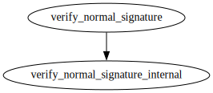

## Function `verify_proof_of_possession_internal`

Return <code><b>true</b></code> if the bytes in <code>public_key</code> are a valid bls12381 public key (as per <code>validate_pubkey</code>)
*and* this public key has a valid proof-of-possesion (PoP).
Return <code><b>false</b></code> otherwise.
Does not abort.

<pre><code><b>fun</b> <a href="bls12381.md#0x1_bls12381_verify_proof_of_possession_internal">verify_proof_of_possession_internal</a>(public_key: <a href="../../move-stdlib/doc/vector.md#0x1_vector">vector</a>&lt;u8&gt;, proof_of_possesion: <a href="../../move-stdlib/doc/vector.md#0x1_vector">vector</a>&lt;u8&gt;): bool
</code></pre>

Implementation

<pre><code><b>native</b> <b>fun</b> <a href="bls12381.md#0x1_bls12381_verify_proof_of_possession_internal">verify_proof_of_possession_internal</a>(
    public_key: <a href="../../move-stdlib/doc/vector.md#0x1_vector">vector</a>&lt;u8&gt;,
    proof_of_possesion: <a href="../../move-stdlib/doc/vector.md#0x1_vector">vector</a>&lt;u8&gt;
): bool;
</code></pre>

Show all the functions that "verify_proof_of_possession_internal" calls

Show all the functions that call "verify_proof_of_possession_internal"

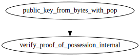

## Function `verify_signature_share_internal`

CRYPTOGRAPHY WARNING: Assumes the public key has a valid proof-of-possesion (PoP). This prevents rogue-key
attacks later on during signature aggregation.

Returns <code><b>true</b></code> if the <code>signature_share</code> on <code>message</code> verifies under <code><b>public</b> key</code>.
Returns <code><b>false</b></code> otherwise, similar to <code>verify_multisignature</code>.
Does not abort.

<pre><code><b>fun</b> <a href="bls12381.md#0x1_bls12381_verify_signature_share_internal">verify_signature_share_internal</a>(signature_share: <a href="../../move-stdlib/doc/vector.md#0x1_vector">vector</a>&lt;u8&gt;, public_key: <a href="../../move-stdlib/doc/vector.md#0x1_vector">vector</a>&lt;u8&gt;, message: <a href="../../move-stdlib/doc/vector.md#0x1_vector">vector</a>&lt;u8&gt;): bool
</code></pre>

Implementation

<pre><code><b>native</b> <b>fun</b> <a href="bls12381.md#0x1_bls12381_verify_signature_share_internal">verify_signature_share_internal</a>(
    signature_share: <a href="../../move-stdlib/doc/vector.md#0x1_vector">vector</a>&lt;u8&gt;,
    public_key: <a href="../../move-stdlib/doc/vector.md#0x1_vector">vector</a>&lt;u8&gt;,
    message: <a href="../../move-stdlib/doc/vector.md#0x1_vector">vector</a>&lt;u8&gt;
): bool;
</code></pre>

Show all the functions that "verify_signature_share_internal" calls

Show all the functions that call "verify_signature_share_internal"

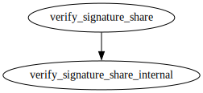

## Specification

### Function `aggregate_pubkeys_internal`

<pre><code><b>fun</b> <a href="bls12381.md#0x1_bls12381_aggregate_pubkeys_internal">aggregate_pubkeys_internal</a>(public_keys: <a href="../../move-stdlib/doc/vector.md#0x1_vector">vector</a>&lt;<a href="bls12381.md#0x1_bls12381_PublicKeyWithPoP">bls12381::PublicKeyWithPoP</a>&gt;): (<a href="../../move-stdlib/doc/vector.md#0x1_vector">vector</a>&lt;u8&gt;, bool)
</code></pre>

<pre><code><b>pragma</b> opaque;
</code></pre>

### Function `aggregate_signatures_internal`

<pre><code><b>fun</b> <a href="bls12381.md#0x1_bls12381_aggregate_signatures_internal">aggregate_signatures_internal</a>(signatures: <a href="../../move-stdlib/doc/vector.md#0x1_vector">vector</a>&lt;<a href="bls12381.md#0x1_bls12381_Signature">bls12381::Signature</a>&gt;): (<a href="../../move-stdlib/doc/vector.md#0x1_vector">vector</a>&lt;u8&gt;, bool)
</code></pre>

<pre><code><b>pragma</b> opaque;
</code></pre>

### Function `validate_pubkey_internal`

<pre><code><b>fun</b> <a href="bls12381.md#0x1_bls12381_validate_pubkey_internal">validate_pubkey_internal</a>(public_key: <a href="../../move-stdlib/doc/vector.md#0x1_vector">vector</a>&lt;u8&gt;): bool
</code></pre>

<pre><code><b>pragma</b> opaque;
</code></pre>

### Function `signature_subgroup_check_internal`

<pre><code><b>fun</b> <a href="bls12381.md#0x1_bls12381_signature_subgroup_check_internal">signature_subgroup_check_internal</a>(signature: <a href="../../move-stdlib/doc/vector.md#0x1_vector">vector</a>&lt;u8&gt;): bool
</code></pre>

<pre><code><b>pragma</b> opaque;
</code></pre>

### Function `verify_aggregate_signature_internal`

<pre><code><b>fun</b> <a href="bls12381.md#0x1_bls12381_verify_aggregate_signature_internal">verify_aggregate_signature_internal</a>(aggsig: <a href="../../move-stdlib/doc/vector.md#0x1_vector">vector</a>&lt;u8&gt;, public_keys: <a href="../../move-stdlib/doc/vector.md#0x1_vector">vector</a>&lt;<a href="bls12381.md#0x1_bls12381_PublicKeyWithPoP">bls12381::PublicKeyWithPoP</a>&gt;, messages: <a href="../../move-stdlib/doc/vector.md#0x1_vector">vector</a>&lt;<a href="../../move-stdlib/doc/vector.md#0x1_vector">vector</a>&lt;u8&gt;&gt;): bool
</code></pre>

<pre><code><b>pragma</b> opaque;
</code></pre>

### Function `verify_multisignature_internal`

<pre><code><b>fun</b> <a href="bls12381.md#0x1_bls12381_verify_multisignature_internal">verify_multisignature_internal</a>(multisignature: <a href="../../move-stdlib/doc/vector.md#0x1_vector">vector</a>&lt;u8&gt;, agg_public_key: <a href="../../move-stdlib/doc/vector.md#0x1_vector">vector</a>&lt;u8&gt;, message: <a href="../../move-stdlib/doc/vector.md#0x1_vector">vector</a>&lt;u8&gt;): bool
</code></pre>

<pre><code><b>pragma</b> opaque;
</code></pre>

### Function `verify_normal_signature_internal`

<pre><code><b>fun</b> <a href="bls12381.md#0x1_bls12381_verify_normal_signature_internal">verify_normal_signature_internal</a>(signature: <a href="../../move-stdlib/doc/vector.md#0x1_vector">vector</a>&lt;u8&gt;, public_key: <a href="../../move-stdlib/doc/vector.md#0x1_vector">vector</a>&lt;u8&gt;, message: <a href="../../move-stdlib/doc/vector.md#0x1_vector">vector</a>&lt;u8&gt;): bool
</code></pre>

<pre><code><b>pragma</b> opaque;
</code></pre>

### Function `verify_proof_of_possession_internal`

<pre><code><b>fun</b> <a href="bls12381.md#0x1_bls12381_verify_proof_of_possession_internal">verify_proof_of_possession_internal</a>(public_key: <a href="../../move-stdlib/doc/vector.md#0x1_vector">vector</a>&lt;u8&gt;, proof_of_possesion: <a href="../../move-stdlib/doc/vector.md#0x1_vector">vector</a>&lt;u8&gt;): bool
</code></pre>

<pre><code><b>pragma</b> opaque;
</code></pre>

### Function `verify_signature_share_internal`

<pre><code><b>fun</b> <a href="bls12381.md#0x1_bls12381_verify_signature_share_internal">verify_signature_share_internal</a>(signature_share: <a href="../../move-stdlib/doc/vector.md#0x1_vector">vector</a>&lt;u8&gt;, public_key: <a href="../../move-stdlib/doc/vector.md#0x1_vector">vector</a>&lt;u8&gt;, message: <a href="../../move-stdlib/doc/vector.md#0x1_vector">vector</a>&lt;u8&gt;): bool
</code></pre>

<pre><code><b>pragma</b> opaque;
</code></pre>

[move-book]: https://move-language.github.io/move/introduction.html
