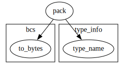

# Module `0x1::copyable_any`

-  [Struct `Any`](#0x1_copyable_any_Any)
-  [Constants](#@Constants_0)
-  [Function `pack`](#0x1_copyable_any_pack)
-  [Function `unpack`](#0x1_copyable_any_unpack)
-  [Function `type_name`](#0x1_copyable_any_type_name)
-  [Specification](#@Specification_1)
    -  [Function `pack`](#@Specification_1_pack)
    -  [Function `unpack`](#@Specification_1_unpack)
    -  [Function `type_name`](#@Specification_1_type_name)

<pre><code><b>use</b> <a href="../../move-stdlib/doc/bcs.md#0x1_bcs">0x1::bcs</a>;
<b>use</b> <a href="../../move-stdlib/doc/error.md#0x1_error">0x1::error</a>;
<b>use</b> <a href="from_bcs.md#0x1_from_bcs">0x1::from_bcs</a>;
<b>use</b> <a href="../../move-stdlib/doc/string.md#0x1_string">0x1::string</a>;
<b>use</b> <a href="type_info.md#0x1_type_info">0x1::type_info</a>;
</code></pre>

Show all the modules that "copyable_any" depends on directly or indirectly

Show all the modules that depend on "copyable_any" directly or indirectly

## Struct `Any`

The same as <code><a href="any.md#0x1_any_Any">any::Any</a></code> but with the copy ability.

<pre><code><b>struct</b> <a href="copyable_any.md#0x1_copyable_any_Any">Any</a> <b>has</b> <b>copy</b>, drop, store
</code></pre>

Fields

<dl>
<dt>
<code>type_name: <a href="../../move-stdlib/doc/string.md#0x1_string_String">string::String</a></code>
</dt>
<dd>

</dd>
<dt>
<code>data: <a href="../../move-stdlib/doc/vector.md#0x1_vector">vector</a>&lt;u8&gt;</code>
</dt>
<dd>

</dd>
</dl>

## Constants

The type provided for <code>unpack</code> is not the same as was given for <code>pack</code>.

<pre><code><b>const</b> <a href="copyable_any.md#0x1_copyable_any_ETYPE_MISMATCH">ETYPE_MISMATCH</a>: u64 = 0;
</code></pre>

## Function `pack`

Pack a value into the <code><a href="copyable_any.md#0x1_copyable_any_Any">Any</a></code> representation. Because Any can be stored, dropped, and copied this is
also required from <code>T</code>.

<pre><code><b>public</b> <b>fun</b> <a href="copyable_any.md#0x1_copyable_any_pack">pack</a>&lt;T: <b>copy</b>, drop, store&gt;(x: T): <a href="copyable_any.md#0x1_copyable_any_Any">copyable_any::Any</a>
</code></pre>

Implementation

<pre><code><b>public</b> <b>fun</b> <a href="copyable_any.md#0x1_copyable_any_pack">pack</a>&lt;T: drop + store + <b>copy</b>&gt;(x: T): <a href="copyable_any.md#0x1_copyable_any_Any">Any</a> {
    <a href="copyable_any.md#0x1_copyable_any_Any">Any</a> {
        type_name: <a href="type_info.md#0x1_type_info_type_name">type_info::type_name</a>&lt;T&gt;(),
        data: <a href="../../move-stdlib/doc/bcs.md#0x1_bcs_to_bytes">bcs::to_bytes</a>(&x)
    }
}
</code></pre>

Show all the functions that "pack" calls

Show all the functions that call "pack"

## Function `unpack`

Unpack a value from the <code><a href="copyable_any.md#0x1_copyable_any_Any">Any</a></code> representation. This aborts if the value has not the expected type <code>T</code>.

<pre><code><b>public</b> <b>fun</b> <a href="copyable_any.md#0x1_copyable_any_unpack">unpack</a>&lt;T&gt;(x: <a href="copyable_any.md#0x1_copyable_any_Any">copyable_any::Any</a>): T
</code></pre>

Implementation

<pre><code><b>public</b> <b>fun</b> <a href="copyable_any.md#0x1_copyable_any_unpack">unpack</a>&lt;T&gt;(x: <a href="copyable_any.md#0x1_copyable_any_Any">Any</a>): T {
    <b>assert</b>!(<a href="type_info.md#0x1_type_info_type_name">type_info::type_name</a>&lt;T&gt;() == x.type_name, <a href="../../move-stdlib/doc/error.md#0x1_error_invalid_argument">error::invalid_argument</a>(<a href="copyable_any.md#0x1_copyable_any_ETYPE_MISMATCH">ETYPE_MISMATCH</a>));
    from_bytes&lt;T&gt;(x.data)
}
</code></pre>

Show all the functions that "unpack" calls

Show all the functions that call "unpack"

## Function `type_name`

Returns the type name of this Any

<pre><code><b>public</b> <b>fun</b> <a href="copyable_any.md#0x1_copyable_any_type_name">type_name</a>(x: &<a href="copyable_any.md#0x1_copyable_any_Any">copyable_any::Any</a>): &<a href="../../move-stdlib/doc/string.md#0x1_string_String">string::String</a>
</code></pre>

Implementation

<pre><code><b>public</b> <b>fun</b> <a href="copyable_any.md#0x1_copyable_any_type_name">type_name</a>(x: &<a href="copyable_any.md#0x1_copyable_any_Any">Any</a>): &String {
    &x.type_name
}
</code></pre>

Show all the functions that "type_name" calls

Show all the functions that call "type_name"

## Specification

### Function `pack`

<pre><code><b>public</b> <b>fun</b> <a href="copyable_any.md#0x1_copyable_any_pack">pack</a>&lt;T: <b>copy</b>, drop, store&gt;(x: T): <a href="copyable_any.md#0x1_copyable_any_Any">copyable_any::Any</a>
</code></pre>

<pre><code><b>aborts_if</b> <b>false</b>;
<b>ensures</b> result == <a href="copyable_any.md#0x1_copyable_any_Any">Any</a> {
    type_name: <a href="type_info.md#0x1_type_info_type_name">type_info::type_name</a>&lt;T&gt;(),
    data: <a href="../../move-stdlib/doc/bcs.md#0x1_bcs_serialize">bcs::serialize</a>&lt;T&gt;(x)
};
</code></pre>

### Function `unpack`

<pre><code><b>public</b> <b>fun</b> <a href="copyable_any.md#0x1_copyable_any_unpack">unpack</a>&lt;T&gt;(x: <a href="copyable_any.md#0x1_copyable_any_Any">copyable_any::Any</a>): T
</code></pre>

<pre><code><b>pragma</b> aborts_if_is_partial;
<b>aborts_if</b> <a href="type_info.md#0x1_type_info_type_name">type_info::type_name</a>&lt;T&gt;() != x.type_name;
<b>aborts_if</b> !<a href="from_bcs.md#0x1_from_bcs_deserializable">from_bcs::deserializable</a>&lt;T&gt;(x.data);
<b>ensures</b> result == <a href="from_bcs.md#0x1_from_bcs_deserialize">from_bcs::deserialize</a>&lt;T&gt;(x.data);
</code></pre>

### Function `type_name`

<pre><code><b>public</b> <b>fun</b> <a href="copyable_any.md#0x1_copyable_any_type_name">type_name</a>(x: &<a href="copyable_any.md#0x1_copyable_any_Any">copyable_any::Any</a>): &<a href="../../move-stdlib/doc/string.md#0x1_string_String">string::String</a>
</code></pre>

<pre><code><b>aborts_if</b> <b>false</b>;
<b>ensures</b> result == x.type_name;
</code></pre>

[move-book]: https://move-language.github.io/move/introduction.html
