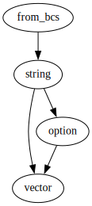
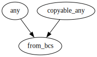
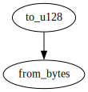
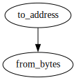

<a name="0x1_from_bcs"></a>

# Module `0x1::from_bcs`

This module provides a number of functions to convert _primitive_ types from their representation in <code>std::bcs</code>
to values. This is the opposite of <code><a href="../../move-stdlib/doc/bcs.md#0x1_bcs_to_bytes">bcs::to_bytes</a></code>. Note that it is not safe to define a generic public <code>from_bytes</code>
function because this can violate implicit struct invariants, therefore only primitive types are offerred. If
a general conversion back-and-force is needed, consider the <code>aptos_std::Any</code> type which preserves invariants.

Example:
```
use std::bcs;
use aptos_std::from_bcs;

assert!(from_bcs::to_address(bcs::to_bytes(&@0xabcdef)) == @0xabcdef, 0);
```


-  [Constants](#@Constants_0)
-  [Function `to_bool`](#0x1_from_bcs_to_bool)
-  [Function `to_u8`](#0x1_from_bcs_to_u8)
-  [Function `to_u64`](#0x1_from_bcs_to_u64)
-  [Function `to_u128`](#0x1_from_bcs_to_u128)
-  [Function `to_address`](#0x1_from_bcs_to_address)
-  [Function `to_string`](#0x1_from_bcs_to_string)
-  [Function `from_bytes`](#0x1_from_bcs_from_bytes)
-  [Specification](#@Specification_1)
    -  [Function `from_bytes`](#@Specification_1_from_bytes)


<pre><code><b>use</b> <a href="../../move-stdlib/doc/string.md#0x1_string">0x1::string</a>;
</code></pre>


<details>
<summary>Show all the modules that "from_bcs" depends on directly or indirectly</summary>





</details>

<details>
<summary>Show all the modules that depend on "from_bcs" directly or indirectly</summary>





</details>

<a name="@Constants_0"></a>

## Constants


<a name="0x1_from_bcs_EINVALID_UTF8"></a>

UTF8 check failed in conversion from bytes to string


<pre><code><b>const</b> <a href="from_bcs.md#0x1_from_bcs_EINVALID_UTF8">EINVALID_UTF8</a>: u64 = 1;
</code></pre>


<a name="0x1_from_bcs_to_bool"></a>

## Function `to_bool`


<pre><code><b>public</b> <b>fun</b> <a href="from_bcs.md#0x1_from_bcs_to_bool">to_bool</a>(v: <a href="../../move-stdlib/doc/vector.md#0x1_vector">vector</a>&lt;u8&gt;): bool
</code></pre>


<details>
<summary>Implementation</summary>


<pre><code><b>public</b> <b>fun</b> <a href="from_bcs.md#0x1_from_bcs_to_bool">to_bool</a>(v: <a href="../../move-stdlib/doc/vector.md#0x1_vector">vector</a>&lt;u8&gt;): bool {
    <a href="from_bcs.md#0x1_from_bcs_from_bytes">from_bytes</a>&lt;bool&gt;(v)
}
</code></pre>


</details>

<details>
<summary>Show all the functions that "to_bool" calls</summary>


</details>

<details>
<summary>Show all the functions that call "to_bool"</summary>


</details>

<a name="0x1_from_bcs_to_u8"></a>

## Function `to_u8`


<pre><code><b>public</b> <b>fun</b> <a href="from_bcs.md#0x1_from_bcs_to_u8">to_u8</a>(v: <a href="../../move-stdlib/doc/vector.md#0x1_vector">vector</a>&lt;u8&gt;): u8
</code></pre>


<details>
<summary>Implementation</summary>


<pre><code><b>public</b> <b>fun</b> <a href="from_bcs.md#0x1_from_bcs_to_u8">to_u8</a>(v: <a href="../../move-stdlib/doc/vector.md#0x1_vector">vector</a>&lt;u8&gt;): u8 {
    <a href="from_bcs.md#0x1_from_bcs_from_bytes">from_bytes</a>&lt;u8&gt;(v)
}
</code></pre>


</details>

<details>
<summary>Show all the functions that "to_u8" calls</summary>


</details>

<details>
<summary>Show all the functions that call "to_u8"</summary>


</details>

<a name="0x1_from_bcs_to_u64"></a>

## Function `to_u64`


<pre><code><b>public</b> <b>fun</b> <a href="from_bcs.md#0x1_from_bcs_to_u64">to_u64</a>(v: <a href="../../move-stdlib/doc/vector.md#0x1_vector">vector</a>&lt;u8&gt;): u64
</code></pre>


<details>
<summary>Implementation</summary>


<pre><code><b>public</b> <b>fun</b> <a href="from_bcs.md#0x1_from_bcs_to_u64">to_u64</a>(v: <a href="../../move-stdlib/doc/vector.md#0x1_vector">vector</a>&lt;u8&gt;): u64 {
    <a href="from_bcs.md#0x1_from_bcs_from_bytes">from_bytes</a>&lt;u64&gt;(v)
}
</code></pre>


</details>

<details>
<summary>Show all the functions that "to_u64" calls</summary>


</details>

<details>
<summary>Show all the functions that call "to_u64"</summary>


</details>

<a name="0x1_from_bcs_to_u128"></a>

## Function `to_u128`


<pre><code><b>public</b> <b>fun</b> <a href="from_bcs.md#0x1_from_bcs_to_u128">to_u128</a>(v: <a href="../../move-stdlib/doc/vector.md#0x1_vector">vector</a>&lt;u8&gt;): u128
</code></pre>


<details>
<summary>Implementation</summary>


<pre><code><b>public</b> <b>fun</b> <a href="from_bcs.md#0x1_from_bcs_to_u128">to_u128</a>(v: <a href="../../move-stdlib/doc/vector.md#0x1_vector">vector</a>&lt;u8&gt;): u128 {
    <a href="from_bcs.md#0x1_from_bcs_from_bytes">from_bytes</a>&lt;u128&gt;(v)
}
</code></pre>


</details>

<details>
<summary>Show all the functions that "to_u128" calls</summary>





</details>

<details>
<summary>Show all the functions that call "to_u128"</summary>


</details>

<a name="0x1_from_bcs_to_address"></a>

## Function `to_address`


<pre><code><b>public</b> <b>fun</b> <a href="from_bcs.md#0x1_from_bcs_to_address">to_address</a>(v: <a href="../../move-stdlib/doc/vector.md#0x1_vector">vector</a>&lt;u8&gt;): <b>address</b>
</code></pre>


<details>
<summary>Implementation</summary>


<pre><code><b>public</b> <b>fun</b> <a href="from_bcs.md#0x1_from_bcs_to_address">to_address</a>(v: <a href="../../move-stdlib/doc/vector.md#0x1_vector">vector</a>&lt;u8&gt;): <b>address</b> {
    <a href="from_bcs.md#0x1_from_bcs_from_bytes">from_bytes</a>&lt;<b>address</b>&gt;(v)
}
</code></pre>


</details>

<details>
<summary>Show all the functions that "to_address" calls</summary>





</details>

<details>
<summary>Show all the functions that call "to_address"</summary>


</details>

<a name="0x1_from_bcs_to_string"></a>

## Function `to_string`


<pre><code><b>public</b> <b>fun</b> <a href="from_bcs.md#0x1_from_bcs_to_string">to_string</a>(v: <a href="../../move-stdlib/doc/vector.md#0x1_vector">vector</a>&lt;u8&gt;): <a href="../../move-stdlib/doc/string.md#0x1_string_String">string::String</a>
</code></pre>


<details>
<summary>Implementation</summary>


<pre><code><b>public</b> <b>fun</b> <a href="from_bcs.md#0x1_from_bcs_to_string">to_string</a>(v: <a href="../../move-stdlib/doc/vector.md#0x1_vector">vector</a>&lt;u8&gt;): String {
    // To make this safe, we need <b>to</b> evaluate the utf8 <b>invariant</b>.
    <b>let</b> s = <a href="from_bcs.md#0x1_from_bcs_from_bytes">from_bytes</a>&lt;String&gt;(v);
    <b>assert</b>!(<a href="../../move-stdlib/doc/string.md#0x1_string_internal_check_utf8">string::internal_check_utf8</a>(<a href="../../move-stdlib/doc/string.md#0x1_string_bytes">string::bytes</a>(&s)), <a href="from_bcs.md#0x1_from_bcs_EINVALID_UTF8">EINVALID_UTF8</a>);
    s
}
</code></pre>


</details>

<details>
<summary>Show all the functions that "to_string" calls</summary>


</details>

<details>
<summary>Show all the functions that call "to_string"</summary>


</details>

<a name="0x1_from_bcs_from_bytes"></a>

## Function `from_bytes`

Package private native function to deserialize a type T.

Note that this function does not put any constraint on <code>T</code>. If code uses this function to
deserialize a linear value, its their responsibility that the data they deserialize is
owned.


<pre><code><b>public</b>(<b>friend</b>) <b>fun</b> <a href="from_bcs.md#0x1_from_bcs_from_bytes">from_bytes</a>&lt;T&gt;(bytes: <a href="../../move-stdlib/doc/vector.md#0x1_vector">vector</a>&lt;u8&gt;): T
</code></pre>


<details>
<summary>Implementation</summary>


<pre><code><b>public</b>(<b>friend</b>) <b>native</b> <b>fun</b> <a href="from_bcs.md#0x1_from_bcs_from_bytes">from_bytes</a>&lt;T&gt;(bytes: <a href="../../move-stdlib/doc/vector.md#0x1_vector">vector</a>&lt;u8&gt;): T;
</code></pre>


</details>

<details>
<summary>Show all the functions that "from_bytes" calls</summary>


</details>

<details>
<summary>Show all the functions that call "from_bytes"</summary>


</details>

<a name="@Specification_1"></a>

## Specification


<a name="0x1_from_bcs_deserialize"></a>


<pre><code><b>fun</b> <a href="from_bcs.md#0x1_from_bcs_deserialize">deserialize</a>&lt;T&gt;(bytes: <a href="../../move-stdlib/doc/vector.md#0x1_vector">vector</a>&lt;u8&gt;): T;
<a name="0x1_from_bcs_deserializable"></a>
<b>fun</b> <a href="from_bcs.md#0x1_from_bcs_deserializable">deserializable</a>&lt;T&gt;(bytes: <a href="../../move-stdlib/doc/vector.md#0x1_vector">vector</a>&lt;u8&gt;): bool;
</code></pre>


<a name="@Specification_1_from_bytes"></a>

### Function `from_bytes`


<pre><code><b>public</b>(<b>friend</b>) <b>fun</b> <a href="from_bcs.md#0x1_from_bcs_from_bytes">from_bytes</a>&lt;T&gt;(bytes: <a href="../../move-stdlib/doc/vector.md#0x1_vector">vector</a>&lt;u8&gt;): T
</code></pre>


<pre><code><b>pragma</b> opaque;
<b>aborts_if</b> !<a href="from_bcs.md#0x1_from_bcs_deserializable">deserializable</a>&lt;T&gt;(bytes);
<b>ensures</b> result == <a href="from_bcs.md#0x1_from_bcs_deserialize">deserialize</a>&lt;T&gt;(bytes);
</code></pre>


[move-book]: https://move-language.github.io/move/introduction.html
