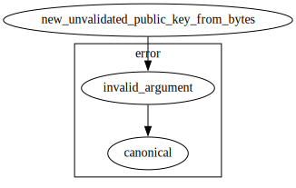
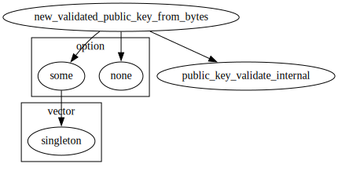
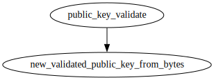
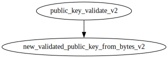
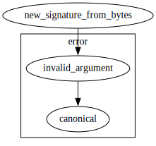
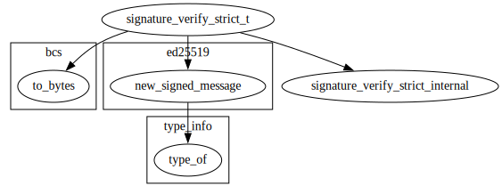
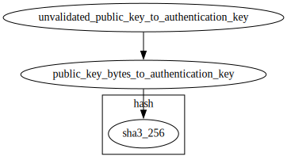
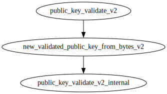

# Module `0x1::multi_ed25519`

Exports MultiEd25519 multi-signatures in Move.
This module has the exact same interface as the Ed25519 module.

-  [Struct `UnvalidatedPublicKey`](#0x1_multi_ed25519_UnvalidatedPublicKey)
-  [Struct `ValidatedPublicKey`](#0x1_multi_ed25519_ValidatedPublicKey)
-  [Struct `Signature`](#0x1_multi_ed25519_Signature)
-  [Constants](#@Constants_0)
-  [Function `new_unvalidated_public_key_from_bytes`](#0x1_multi_ed25519_new_unvalidated_public_key_from_bytes)
-  [Function `new_validated_public_key_from_bytes`](#0x1_multi_ed25519_new_validated_public_key_from_bytes)
-  [Function `new_validated_public_key_from_bytes_v2`](#0x1_multi_ed25519_new_validated_public_key_from_bytes_v2)
-  [Function `new_signature_from_bytes`](#0x1_multi_ed25519_new_signature_from_bytes)
-  [Function `public_key_to_unvalidated`](#0x1_multi_ed25519_public_key_to_unvalidated)
-  [Function `public_key_into_unvalidated`](#0x1_multi_ed25519_public_key_into_unvalidated)
-  [Function `unvalidated_public_key_to_bytes`](#0x1_multi_ed25519_unvalidated_public_key_to_bytes)
-  [Function `validated_public_key_to_bytes`](#0x1_multi_ed25519_validated_public_key_to_bytes)
-  [Function `signature_to_bytes`](#0x1_multi_ed25519_signature_to_bytes)
-  [Function `public_key_validate`](#0x1_multi_ed25519_public_key_validate)
-  [Function `public_key_validate_v2`](#0x1_multi_ed25519_public_key_validate_v2)
-  [Function `signature_verify_strict`](#0x1_multi_ed25519_signature_verify_strict)
-  [Function `signature_verify_strict_t`](#0x1_multi_ed25519_signature_verify_strict_t)
-  [Function `unvalidated_public_key_to_authentication_key`](#0x1_multi_ed25519_unvalidated_public_key_to_authentication_key)
-  [Function `validated_public_key_to_authentication_key`](#0x1_multi_ed25519_validated_public_key_to_authentication_key)
-  [Function `public_key_bytes_to_authentication_key`](#0x1_multi_ed25519_public_key_bytes_to_authentication_key)
-  [Function `public_key_validate_internal`](#0x1_multi_ed25519_public_key_validate_internal)
-  [Function `public_key_validate_v2_internal`](#0x1_multi_ed25519_public_key_validate_v2_internal)
-  [Function `signature_verify_strict_internal`](#0x1_multi_ed25519_signature_verify_strict_internal)
-  [Specification](#@Specification_1)
    -  [Function `new_unvalidated_public_key_from_bytes`](#@Specification_1_new_unvalidated_public_key_from_bytes)
    -  [Function `new_validated_public_key_from_bytes`](#@Specification_1_new_validated_public_key_from_bytes)
    -  [Function `new_validated_public_key_from_bytes_v2`](#@Specification_1_new_validated_public_key_from_bytes_v2)
    -  [Function `new_signature_from_bytes`](#@Specification_1_new_signature_from_bytes)
    -  [Function `public_key_validate_internal`](#@Specification_1_public_key_validate_internal)
    -  [Function `public_key_validate_v2_internal`](#@Specification_1_public_key_validate_v2_internal)
    -  [Function `signature_verify_strict_internal`](#@Specification_1_signature_verify_strict_internal)

<pre><code><b>use</b> <a href="../../move-stdlib/doc/bcs.md#0x1_bcs">0x1::bcs</a>;
<b>use</b> <a href="ed25519.md#0x1_ed25519">0x1::ed25519</a>;
<b>use</b> <a href="../../move-stdlib/doc/error.md#0x1_error">0x1::error</a>;
<b>use</b> <a href="../../move-stdlib/doc/features.md#0x1_features">0x1::features</a>;
<b>use</b> <a href="../../move-stdlib/doc/hash.md#0x1_hash">0x1::hash</a>;
<b>use</b> <a href="../../move-stdlib/doc/option.md#0x1_option">0x1::option</a>;
</code></pre>

Show all the modules that "multi_ed25519" depends on directly or indirectly

Show all the modules that depend on "multi_ed25519" directly or indirectly

## Struct `UnvalidatedPublicKey`

An *unvalidated*, k out of n MultiEd25519 public key. The <code>bytes</code> field contains (1) several chunks of
<code><a href="ed25519.md#0x1_ed25519_PUBLIC_KEY_NUM_BYTES">ed25519::PUBLIC_KEY_NUM_BYTES</a></code> bytes, each encoding a Ed25519 PK, and (2) a single byte encoding the threshold k.
*Unvalidated* means there is no guarantee that the underlying PKs are valid elliptic curve points of non-small
order.

<pre><code><b>struct</b> <a href="multi_ed25519.md#0x1_multi_ed25519_UnvalidatedPublicKey">UnvalidatedPublicKey</a> <b>has</b> <b>copy</b>, drop, store
</code></pre>

Fields

<dl>
<dt>
<code>bytes: <a href="../../move-stdlib/doc/vector.md#0x1_vector">vector</a>&lt;u8&gt;</code>
</dt>
<dd>

</dd>
</dl>

## Struct `ValidatedPublicKey`

A *validated* k out of n MultiEd25519 public key. *Validated* means that all the underlying PKs will be
elliptic curve points that are NOT of small-order. It does not necessarily mean they will be prime-order points.
This struct encodes the public key exactly as <code><a href="multi_ed25519.md#0x1_multi_ed25519_UnvalidatedPublicKey">UnvalidatedPublicKey</a></code>.

For now, this struct is not used in any verification functions, but it might be in the future.

<pre><code><b>struct</b> <a href="multi_ed25519.md#0x1_multi_ed25519_ValidatedPublicKey">ValidatedPublicKey</a> <b>has</b> <b>copy</b>, drop, store
</code></pre>

Fields

<dl>
<dt>
<code>bytes: <a href="../../move-stdlib/doc/vector.md#0x1_vector">vector</a>&lt;u8&gt;</code>
</dt>
<dd>

</dd>
</dl>

## Struct `Signature`

A purported MultiEd25519 multi-signature that can be verified via <code>signature_verify_strict</code> or
<code>signature_verify_strict_t</code>. The <code>bytes</code> field contains (1) several chunks of <code><a href="ed25519.md#0x1_ed25519_SIGNATURE_NUM_BYTES">ed25519::SIGNATURE_NUM_BYTES</a></code>
bytes, each encoding a Ed25519 signature, and (2) a <code><a href="multi_ed25519.md#0x1_multi_ed25519_BITMAP_NUM_OF_BYTES">BITMAP_NUM_OF_BYTES</a></code>-byte bitmap encoding the signer
identities.

<pre><code><b>struct</b> <a href="multi_ed25519.md#0x1_multi_ed25519_Signature">Signature</a> <b>has</b> <b>copy</b>, drop, store
</code></pre>

Fields

<dl>
<dt>
<code>bytes: <a href="../../move-stdlib/doc/vector.md#0x1_vector">vector</a>&lt;u8&gt;</code>
</dt>
<dd>

</dd>
</dl>

## Constants

The native functions have not been rolled out yet.

<pre><code><b>const</b> <a href="multi_ed25519.md#0x1_multi_ed25519_E_NATIVE_FUN_NOT_AVAILABLE">E_NATIVE_FUN_NOT_AVAILABLE</a>: u64 = 4;
</code></pre>

Wrong number of bytes were given as input when deserializing an Ed25519 public key.

<pre><code><b>const</b> <a href="multi_ed25519.md#0x1_multi_ed25519_E_WRONG_PUBKEY_SIZE">E_WRONG_PUBKEY_SIZE</a>: u64 = 1;
</code></pre>

Wrong number of bytes were given as input when deserializing an Ed25519 signature.

<pre><code><b>const</b> <a href="multi_ed25519.md#0x1_multi_ed25519_E_WRONG_SIGNATURE_SIZE">E_WRONG_SIGNATURE_SIZE</a>: u64 = 2;
</code></pre>

The identifier of the MultiEd25519 signature scheme, which is used when deriving Aptos authentication keys by hashing
it together with an MultiEd25519 public key.

<pre><code><b>const</b> <a href="multi_ed25519.md#0x1_multi_ed25519_SIGNATURE_SCHEME_ID">SIGNATURE_SCHEME_ID</a>: u8 = 1;
</code></pre>

When serializing a MultiEd25519 signature, the bitmap that indicates the signers will be encoded using this many
bytes.

<pre><code><b>const</b> <a href="multi_ed25519.md#0x1_multi_ed25519_BITMAP_NUM_OF_BYTES">BITMAP_NUM_OF_BYTES</a>: u64 = 4;
</code></pre>

The threshold must be in the range <code>[1, n]</code>, where n is the total number of signers.

<pre><code><b>const</b> <a href="multi_ed25519.md#0x1_multi_ed25519_E_INVALID_THRESHOLD_OR_NUMBER_OF_SIGNERS">E_INVALID_THRESHOLD_OR_NUMBER_OF_SIGNERS</a>: u64 = 3;
</code></pre>

The size of an individual Ed25519 public key, in bytes.
(A MultiEd25519 public key consists of several of these, plus the threshold.)

<pre><code><b>const</b> <a href="multi_ed25519.md#0x1_multi_ed25519_INDIVIDUAL_PUBLIC_KEY_NUM_BYTES">INDIVIDUAL_PUBLIC_KEY_NUM_BYTES</a>: u64 = 32;
</code></pre>

The size of an individual Ed25519 signature, in bytes.
(A MultiEd25519 signature consists of several of these, plus the signer bitmap.)

<pre><code><b>const</b> <a href="multi_ed25519.md#0x1_multi_ed25519_INDIVIDUAL_SIGNATURE_NUM_BYTES">INDIVIDUAL_SIGNATURE_NUM_BYTES</a>: u64 = 64;
</code></pre>

Max number of ed25519 public keys allowed in multi-ed25519 keys

<pre><code><b>const</b> <a href="multi_ed25519.md#0x1_multi_ed25519_MAX_NUMBER_OF_PUBLIC_KEYS">MAX_NUMBER_OF_PUBLIC_KEYS</a>: u64 = 32;
</code></pre>

When serializing a MultiEd25519 public key, the threshold k will be encoded using this many bytes.

<pre><code><b>const</b> <a href="multi_ed25519.md#0x1_multi_ed25519_THRESHOLD_SIZE_BYTES">THRESHOLD_SIZE_BYTES</a>: u64 = 1;
</code></pre>

## Function `new_unvalidated_public_key_from_bytes`

Parses the input 32 bytes as an *unvalidated* MultiEd25519 public key.

NOTE: This function could have also checked that the # of sub-PKs is > 0, but it did not. However, since such
invalid PKs are rejected during signature verification  (see <code>bugfix_unvalidated_pk_from_zero_subpks</code>) they
will not cause problems.

We could fix this API by adding a new one that checks the # of sub PKs is > 0, but it is likely not a good idea
to reproduce the PK validation logic in Move. We should not have done so in the first place. Instead, we will
leave it as is and continue assuming <code><a href="multi_ed25519.md#0x1_multi_ed25519_UnvalidatedPublicKey">UnvalidatedPublicKey</a></code> objects could be invalid PKs that will safely be
rejected during signature verification.

<pre><code><b>public</b> <b>fun</b> <a href="multi_ed25519.md#0x1_multi_ed25519_new_unvalidated_public_key_from_bytes">new_unvalidated_public_key_from_bytes</a>(bytes: <a href="../../move-stdlib/doc/vector.md#0x1_vector">vector</a>&lt;u8&gt;): <a href="multi_ed25519.md#0x1_multi_ed25519_UnvalidatedPublicKey">multi_ed25519::UnvalidatedPublicKey</a>
</code></pre>

Implementation

<pre><code><b>public</b> <b>fun</b> <a href="multi_ed25519.md#0x1_multi_ed25519_new_unvalidated_public_key_from_bytes">new_unvalidated_public_key_from_bytes</a>(bytes: <a href="../../move-stdlib/doc/vector.md#0x1_vector">vector</a>&lt;u8&gt;): <a href="multi_ed25519.md#0x1_multi_ed25519_UnvalidatedPublicKey">UnvalidatedPublicKey</a> {
    <b>let</b> len = <a href="../../move-stdlib/doc/vector.md#0x1_vector_length">vector::length</a>(&bytes);
    <b>let</b> num_sub_pks = len / <a href="multi_ed25519.md#0x1_multi_ed25519_INDIVIDUAL_PUBLIC_KEY_NUM_BYTES">INDIVIDUAL_PUBLIC_KEY_NUM_BYTES</a>;

    <b>assert</b>!(num_sub_pks &lt;= <a href="multi_ed25519.md#0x1_multi_ed25519_MAX_NUMBER_OF_PUBLIC_KEYS">MAX_NUMBER_OF_PUBLIC_KEYS</a>, <a href="../../move-stdlib/doc/error.md#0x1_error_invalid_argument">error::invalid_argument</a>(<a href="multi_ed25519.md#0x1_multi_ed25519_E_WRONG_PUBKEY_SIZE">E_WRONG_PUBKEY_SIZE</a>));
    <b>assert</b>!(len % <a href="multi_ed25519.md#0x1_multi_ed25519_INDIVIDUAL_PUBLIC_KEY_NUM_BYTES">INDIVIDUAL_PUBLIC_KEY_NUM_BYTES</a> == <a href="multi_ed25519.md#0x1_multi_ed25519_THRESHOLD_SIZE_BYTES">THRESHOLD_SIZE_BYTES</a>, <a href="../../move-stdlib/doc/error.md#0x1_error_invalid_argument">error::invalid_argument</a>(<a href="multi_ed25519.md#0x1_multi_ed25519_E_WRONG_PUBKEY_SIZE">E_WRONG_PUBKEY_SIZE</a>));
    <a href="multi_ed25519.md#0x1_multi_ed25519_UnvalidatedPublicKey">UnvalidatedPublicKey</a> { bytes }
}
</code></pre>

Show all the functions that "new_unvalidated_public_key_from_bytes" calls

Show all the functions that call "new_unvalidated_public_key_from_bytes"

## Function `new_validated_public_key_from_bytes`

DEPRECATED: Use <code>new_validated_public_key_from_bytes_v2</code> instead. See <code>public_key_validate_internal</code> comments.

(Incorrectly) parses the input bytes as a *validated* MultiEd25519 public key.

<pre><code><b>public</b> <b>fun</b> <a href="multi_ed25519.md#0x1_multi_ed25519_new_validated_public_key_from_bytes">new_validated_public_key_from_bytes</a>(bytes: <a href="../../move-stdlib/doc/vector.md#0x1_vector">vector</a>&lt;u8&gt;): <a href="../../move-stdlib/doc/option.md#0x1_option_Option">option::Option</a>&lt;<a href="multi_ed25519.md#0x1_multi_ed25519_ValidatedPublicKey">multi_ed25519::ValidatedPublicKey</a>&gt;
</code></pre>

Implementation

<pre><code><b>public</b> <b>fun</b> <a href="multi_ed25519.md#0x1_multi_ed25519_new_validated_public_key_from_bytes">new_validated_public_key_from_bytes</a>(bytes: <a href="../../move-stdlib/doc/vector.md#0x1_vector">vector</a>&lt;u8&gt;): Option&lt;<a href="multi_ed25519.md#0x1_multi_ed25519_ValidatedPublicKey">ValidatedPublicKey</a>&gt; {
    // Note that `public_key_validate_internal` will check that `<a href="../../move-stdlib/doc/vector.md#0x1_vector_length">vector::length</a>(&bytes) / <a href="multi_ed25519.md#0x1_multi_ed25519_INDIVIDUAL_PUBLIC_KEY_NUM_BYTES">INDIVIDUAL_PUBLIC_KEY_NUM_BYTES</a> &lt;= <a href="multi_ed25519.md#0x1_multi_ed25519_MAX_NUMBER_OF_PUBLIC_KEYS">MAX_NUMBER_OF_PUBLIC_KEYS</a>`.
    <b>if</b> (<a href="../../move-stdlib/doc/vector.md#0x1_vector_length">vector::length</a>(&bytes) % <a href="multi_ed25519.md#0x1_multi_ed25519_INDIVIDUAL_PUBLIC_KEY_NUM_BYTES">INDIVIDUAL_PUBLIC_KEY_NUM_BYTES</a> == <a href="multi_ed25519.md#0x1_multi_ed25519_THRESHOLD_SIZE_BYTES">THRESHOLD_SIZE_BYTES</a> &&
        <a href="multi_ed25519.md#0x1_multi_ed25519_public_key_validate_internal">public_key_validate_internal</a>(bytes)) {
        <a href="../../move-stdlib/doc/option.md#0x1_option_some">option::some</a>(<a href="multi_ed25519.md#0x1_multi_ed25519_ValidatedPublicKey">ValidatedPublicKey</a> {
            bytes
        })
    } <b>else</b> {
        <a href="../../move-stdlib/doc/option.md#0x1_option_none">option::none</a>&lt;<a href="multi_ed25519.md#0x1_multi_ed25519_ValidatedPublicKey">ValidatedPublicKey</a>&gt;()
    }
}
</code></pre>

Show all the functions that "new_validated_public_key_from_bytes" calls

Show all the functions that call "new_validated_public_key_from_bytes"

## Function `new_validated_public_key_from_bytes_v2`

Parses the input bytes as a *validated* MultiEd25519 public key (see <code>public_key_validate_internal_v2</code>).

<pre><code><b>public</b> <b>fun</b> <a href="multi_ed25519.md#0x1_multi_ed25519_new_validated_public_key_from_bytes_v2">new_validated_public_key_from_bytes_v2</a>(bytes: <a href="../../move-stdlib/doc/vector.md#0x1_vector">vector</a>&lt;u8&gt;): <a href="../../move-stdlib/doc/option.md#0x1_option_Option">option::Option</a>&lt;<a href="multi_ed25519.md#0x1_multi_ed25519_ValidatedPublicKey">multi_ed25519::ValidatedPublicKey</a>&gt;
</code></pre>

Implementation

<pre><code><b>public</b> <b>fun</b> <a href="multi_ed25519.md#0x1_multi_ed25519_new_validated_public_key_from_bytes_v2">new_validated_public_key_from_bytes_v2</a>(bytes: <a href="../../move-stdlib/doc/vector.md#0x1_vector">vector</a>&lt;u8&gt;): Option&lt;<a href="multi_ed25519.md#0x1_multi_ed25519_ValidatedPublicKey">ValidatedPublicKey</a>&gt; {
    <b>if</b> (!<a href="../../move-stdlib/doc/features.md#0x1_features_multi_ed25519_pk_validate_v2_enabled">features::multi_ed25519_pk_validate_v2_enabled</a>()) {
        <b>abort</b>(<a href="../../move-stdlib/doc/error.md#0x1_error_invalid_state">error::invalid_state</a>(<a href="multi_ed25519.md#0x1_multi_ed25519_E_NATIVE_FUN_NOT_AVAILABLE">E_NATIVE_FUN_NOT_AVAILABLE</a>))
    };

    <b>if</b> (<a href="multi_ed25519.md#0x1_multi_ed25519_public_key_validate_v2_internal">public_key_validate_v2_internal</a>(bytes)) {
        <a href="../../move-stdlib/doc/option.md#0x1_option_some">option::some</a>(<a href="multi_ed25519.md#0x1_multi_ed25519_ValidatedPublicKey">ValidatedPublicKey</a> {
            bytes
        })
    } <b>else</b> {
        <a href="../../move-stdlib/doc/option.md#0x1_option_none">option::none</a>&lt;<a href="multi_ed25519.md#0x1_multi_ed25519_ValidatedPublicKey">ValidatedPublicKey</a>&gt;()
    }
}
</code></pre>

Show all the functions that "new_validated_public_key_from_bytes_v2" calls

Show all the functions that call "new_validated_public_key_from_bytes_v2"

## Function `new_signature_from_bytes`

Parses the input bytes as a purported MultiEd25519 multi-signature.

<pre><code><b>public</b> <b>fun</b> <a href="multi_ed25519.md#0x1_multi_ed25519_new_signature_from_bytes">new_signature_from_bytes</a>(bytes: <a href="../../move-stdlib/doc/vector.md#0x1_vector">vector</a>&lt;u8&gt;): <a href="multi_ed25519.md#0x1_multi_ed25519_Signature">multi_ed25519::Signature</a>
</code></pre>

Implementation

<pre><code><b>public</b> <b>fun</b> <a href="multi_ed25519.md#0x1_multi_ed25519_new_signature_from_bytes">new_signature_from_bytes</a>(bytes: <a href="../../move-stdlib/doc/vector.md#0x1_vector">vector</a>&lt;u8&gt;): <a href="multi_ed25519.md#0x1_multi_ed25519_Signature">Signature</a> {
    <b>assert</b>!(<a href="../../move-stdlib/doc/vector.md#0x1_vector_length">vector::length</a>(&bytes) % <a href="multi_ed25519.md#0x1_multi_ed25519_INDIVIDUAL_SIGNATURE_NUM_BYTES">INDIVIDUAL_SIGNATURE_NUM_BYTES</a> == <a href="multi_ed25519.md#0x1_multi_ed25519_BITMAP_NUM_OF_BYTES">BITMAP_NUM_OF_BYTES</a>, <a href="../../move-stdlib/doc/error.md#0x1_error_invalid_argument">error::invalid_argument</a>(<a href="multi_ed25519.md#0x1_multi_ed25519_E_WRONG_SIGNATURE_SIZE">E_WRONG_SIGNATURE_SIZE</a>));
    <a href="multi_ed25519.md#0x1_multi_ed25519_Signature">Signature</a> { bytes }
}
</code></pre>

Show all the functions that "new_signature_from_bytes" calls

Show all the functions that call "new_signature_from_bytes"

## Function `public_key_to_unvalidated`

Converts a ValidatedPublicKey to an UnvalidatedPublicKey, which can be used in the strict verification APIs.

<pre><code><b>public</b> <b>fun</b> <a href="multi_ed25519.md#0x1_multi_ed25519_public_key_to_unvalidated">public_key_to_unvalidated</a>(pk: &<a href="multi_ed25519.md#0x1_multi_ed25519_ValidatedPublicKey">multi_ed25519::ValidatedPublicKey</a>): <a href="multi_ed25519.md#0x1_multi_ed25519_UnvalidatedPublicKey">multi_ed25519::UnvalidatedPublicKey</a>
</code></pre>

Implementation

<pre><code><b>public</b> <b>fun</b> <a href="multi_ed25519.md#0x1_multi_ed25519_public_key_to_unvalidated">public_key_to_unvalidated</a>(pk: &<a href="multi_ed25519.md#0x1_multi_ed25519_ValidatedPublicKey">ValidatedPublicKey</a>): <a href="multi_ed25519.md#0x1_multi_ed25519_UnvalidatedPublicKey">UnvalidatedPublicKey</a> {
    <a href="multi_ed25519.md#0x1_multi_ed25519_UnvalidatedPublicKey">UnvalidatedPublicKey</a> {
        bytes: pk.bytes
    }
}
</code></pre>

Show all the functions that "public_key_to_unvalidated" calls

Show all the functions that call "public_key_to_unvalidated"

## Function `public_key_into_unvalidated`

Moves a ValidatedPublicKey into an UnvalidatedPublicKey, which can be used in the strict verification APIs.

<pre><code><b>public</b> <b>fun</b> <a href="multi_ed25519.md#0x1_multi_ed25519_public_key_into_unvalidated">public_key_into_unvalidated</a>(pk: <a href="multi_ed25519.md#0x1_multi_ed25519_ValidatedPublicKey">multi_ed25519::ValidatedPublicKey</a>): <a href="multi_ed25519.md#0x1_multi_ed25519_UnvalidatedPublicKey">multi_ed25519::UnvalidatedPublicKey</a>
</code></pre>

Implementation

<pre><code><b>public</b> <b>fun</b> <a href="multi_ed25519.md#0x1_multi_ed25519_public_key_into_unvalidated">public_key_into_unvalidated</a>(pk: <a href="multi_ed25519.md#0x1_multi_ed25519_ValidatedPublicKey">ValidatedPublicKey</a>): <a href="multi_ed25519.md#0x1_multi_ed25519_UnvalidatedPublicKey">UnvalidatedPublicKey</a> {
    <a href="multi_ed25519.md#0x1_multi_ed25519_UnvalidatedPublicKey">UnvalidatedPublicKey</a> {
        bytes: pk.bytes
    }
}
</code></pre>

Show all the functions that "public_key_into_unvalidated" calls

Show all the functions that call "public_key_into_unvalidated"

## Function `unvalidated_public_key_to_bytes`

Serializes an UnvalidatedPublicKey struct to 32-bytes.

<pre><code><b>public</b> <b>fun</b> <a href="multi_ed25519.md#0x1_multi_ed25519_unvalidated_public_key_to_bytes">unvalidated_public_key_to_bytes</a>(pk: &<a href="multi_ed25519.md#0x1_multi_ed25519_UnvalidatedPublicKey">multi_ed25519::UnvalidatedPublicKey</a>): <a href="../../move-stdlib/doc/vector.md#0x1_vector">vector</a>&lt;u8&gt;
</code></pre>

Implementation

<pre><code><b>public</b> <b>fun</b> <a href="multi_ed25519.md#0x1_multi_ed25519_unvalidated_public_key_to_bytes">unvalidated_public_key_to_bytes</a>(pk: &<a href="multi_ed25519.md#0x1_multi_ed25519_UnvalidatedPublicKey">UnvalidatedPublicKey</a>): <a href="../../move-stdlib/doc/vector.md#0x1_vector">vector</a>&lt;u8&gt; {
    pk.bytes
}
</code></pre>

Show all the functions that "unvalidated_public_key_to_bytes" calls

Show all the functions that call "unvalidated_public_key_to_bytes"

## Function `validated_public_key_to_bytes`

Serializes a ValidatedPublicKey struct to 32-bytes.

<pre><code><b>public</b> <b>fun</b> <a href="multi_ed25519.md#0x1_multi_ed25519_validated_public_key_to_bytes">validated_public_key_to_bytes</a>(pk: &<a href="multi_ed25519.md#0x1_multi_ed25519_ValidatedPublicKey">multi_ed25519::ValidatedPublicKey</a>): <a href="../../move-stdlib/doc/vector.md#0x1_vector">vector</a>&lt;u8&gt;
</code></pre>

Implementation

<pre><code><b>public</b> <b>fun</b> <a href="multi_ed25519.md#0x1_multi_ed25519_validated_public_key_to_bytes">validated_public_key_to_bytes</a>(pk: &<a href="multi_ed25519.md#0x1_multi_ed25519_ValidatedPublicKey">ValidatedPublicKey</a>): <a href="../../move-stdlib/doc/vector.md#0x1_vector">vector</a>&lt;u8&gt; {
    pk.bytes
}
</code></pre>

Show all the functions that "validated_public_key_to_bytes" calls

Show all the functions that call "validated_public_key_to_bytes"

## Function `signature_to_bytes`

Serializes a Signature struct to 64-bytes.

<pre><code><b>public</b> <b>fun</b> <a href="multi_ed25519.md#0x1_multi_ed25519_signature_to_bytes">signature_to_bytes</a>(sig: &<a href="multi_ed25519.md#0x1_multi_ed25519_Signature">multi_ed25519::Signature</a>): <a href="../../move-stdlib/doc/vector.md#0x1_vector">vector</a>&lt;u8&gt;
</code></pre>

Implementation

<pre><code><b>public</b> <b>fun</b> <a href="multi_ed25519.md#0x1_multi_ed25519_signature_to_bytes">signature_to_bytes</a>(sig: &<a href="multi_ed25519.md#0x1_multi_ed25519_Signature">Signature</a>): <a href="../../move-stdlib/doc/vector.md#0x1_vector">vector</a>&lt;u8&gt; {
    sig.bytes
}
</code></pre>

Show all the functions that "signature_to_bytes" calls

Show all the functions that call "signature_to_bytes"

## Function `public_key_validate`

DEPRECATED: Use <code>public_key_validate_v2</code> instead. See <code>public_key_validate_internal</code> comments.

Takes in an *unvalidated* public key and attempts to validate it.
Returns <code>Some(<a href="multi_ed25519.md#0x1_multi_ed25519_ValidatedPublicKey">ValidatedPublicKey</a>)</code> if successful and <code>None</code> otherwise.

<pre><code><b>public</b> <b>fun</b> <a href="multi_ed25519.md#0x1_multi_ed25519_public_key_validate">public_key_validate</a>(pk: &<a href="multi_ed25519.md#0x1_multi_ed25519_UnvalidatedPublicKey">multi_ed25519::UnvalidatedPublicKey</a>): <a href="../../move-stdlib/doc/option.md#0x1_option_Option">option::Option</a>&lt;<a href="multi_ed25519.md#0x1_multi_ed25519_ValidatedPublicKey">multi_ed25519::ValidatedPublicKey</a>&gt;
</code></pre>

Implementation

<pre><code><b>public</b> <b>fun</b> <a href="multi_ed25519.md#0x1_multi_ed25519_public_key_validate">public_key_validate</a>(pk: &<a href="multi_ed25519.md#0x1_multi_ed25519_UnvalidatedPublicKey">UnvalidatedPublicKey</a>): Option&lt;<a href="multi_ed25519.md#0x1_multi_ed25519_ValidatedPublicKey">ValidatedPublicKey</a>&gt; {
    <a href="multi_ed25519.md#0x1_multi_ed25519_new_validated_public_key_from_bytes">new_validated_public_key_from_bytes</a>(pk.bytes)
}
</code></pre>

Show all the functions that "public_key_validate" calls

Show all the functions that call "public_key_validate"

## Function `public_key_validate_v2`

Takes in an *unvalidated* public key and attempts to validate it.
Returns <code>Some(<a href="multi_ed25519.md#0x1_multi_ed25519_ValidatedPublicKey">ValidatedPublicKey</a>)</code> if successful and <code>None</code> otherwise.

<pre><code><b>public</b> <b>fun</b> <a href="multi_ed25519.md#0x1_multi_ed25519_public_key_validate_v2">public_key_validate_v2</a>(pk: &<a href="multi_ed25519.md#0x1_multi_ed25519_UnvalidatedPublicKey">multi_ed25519::UnvalidatedPublicKey</a>): <a href="../../move-stdlib/doc/option.md#0x1_option_Option">option::Option</a>&lt;<a href="multi_ed25519.md#0x1_multi_ed25519_ValidatedPublicKey">multi_ed25519::ValidatedPublicKey</a>&gt;
</code></pre>

Implementation

<pre><code><b>public</b> <b>fun</b> <a href="multi_ed25519.md#0x1_multi_ed25519_public_key_validate_v2">public_key_validate_v2</a>(pk: &<a href="multi_ed25519.md#0x1_multi_ed25519_UnvalidatedPublicKey">UnvalidatedPublicKey</a>): Option&lt;<a href="multi_ed25519.md#0x1_multi_ed25519_ValidatedPublicKey">ValidatedPublicKey</a>&gt; {
    <a href="multi_ed25519.md#0x1_multi_ed25519_new_validated_public_key_from_bytes_v2">new_validated_public_key_from_bytes_v2</a>(pk.bytes)
}
</code></pre>

Show all the functions that "public_key_validate_v2" calls

Show all the functions that call "public_key_validate_v2"

## Function `signature_verify_strict`

Verifies a purported MultiEd25519 <code>multisignature</code> under an *unvalidated* <code>public_key</code> on the specified <code>message</code>.
This call will validate the public key by checking it is NOT in the small subgroup.

<pre><code><b>public</b> <b>fun</b> <a href="multi_ed25519.md#0x1_multi_ed25519_signature_verify_strict">signature_verify_strict</a>(multisignature: &<a href="multi_ed25519.md#0x1_multi_ed25519_Signature">multi_ed25519::Signature</a>, public_key: &<a href="multi_ed25519.md#0x1_multi_ed25519_UnvalidatedPublicKey">multi_ed25519::UnvalidatedPublicKey</a>, message: <a href="../../move-stdlib/doc/vector.md#0x1_vector">vector</a>&lt;u8&gt;): bool
</code></pre>

Implementation

<pre><code><b>public</b> <b>fun</b> <a href="multi_ed25519.md#0x1_multi_ed25519_signature_verify_strict">signature_verify_strict</a>(
    multisignature: &<a href="multi_ed25519.md#0x1_multi_ed25519_Signature">Signature</a>,
    public_key: &<a href="multi_ed25519.md#0x1_multi_ed25519_UnvalidatedPublicKey">UnvalidatedPublicKey</a>,
    message: <a href="../../move-stdlib/doc/vector.md#0x1_vector">vector</a>&lt;u8&gt;
): bool {
    <a href="multi_ed25519.md#0x1_multi_ed25519_signature_verify_strict_internal">signature_verify_strict_internal</a>(multisignature.bytes, public_key.bytes, message)
}
</code></pre>

Show all the functions that "signature_verify_strict" calls

Show all the functions that call "signature_verify_strict"

## Function `signature_verify_strict_t`

This function is used to verify a multi-signature on any BCS-serializable type T. For now, it is used to verify the
proof of private key ownership when rotating authentication keys.

<pre><code><b>public</b> <b>fun</b> <a href="multi_ed25519.md#0x1_multi_ed25519_signature_verify_strict_t">signature_verify_strict_t</a>&lt;T: drop&gt;(multisignature: &<a href="multi_ed25519.md#0x1_multi_ed25519_Signature">multi_ed25519::Signature</a>, public_key: &<a href="multi_ed25519.md#0x1_multi_ed25519_UnvalidatedPublicKey">multi_ed25519::UnvalidatedPublicKey</a>, data: T): bool
</code></pre>

Implementation

<pre><code><b>public</b> <b>fun</b> <a href="multi_ed25519.md#0x1_multi_ed25519_signature_verify_strict_t">signature_verify_strict_t</a>&lt;T: drop&gt;(multisignature: &<a href="multi_ed25519.md#0x1_multi_ed25519_Signature">Signature</a>, public_key: &<a href="multi_ed25519.md#0x1_multi_ed25519_UnvalidatedPublicKey">UnvalidatedPublicKey</a>, data: T): bool {
    <b>let</b> encoded = <a href="ed25519.md#0x1_ed25519_new_signed_message">ed25519::new_signed_message</a>(data);

    <a href="multi_ed25519.md#0x1_multi_ed25519_signature_verify_strict_internal">signature_verify_strict_internal</a>(multisignature.bytes, public_key.bytes, <a href="../../move-stdlib/doc/bcs.md#0x1_bcs_to_bytes">bcs::to_bytes</a>(&encoded))
}
</code></pre>

Show all the functions that "signature_verify_strict_t" calls

Show all the functions that call "signature_verify_strict_t"

## Function `unvalidated_public_key_to_authentication_key`

Derives the Aptos-specific authentication key of the given Ed25519 public key.

<pre><code><b>public</b> <b>fun</b> <a href="multi_ed25519.md#0x1_multi_ed25519_unvalidated_public_key_to_authentication_key">unvalidated_public_key_to_authentication_key</a>(pk: &<a href="multi_ed25519.md#0x1_multi_ed25519_UnvalidatedPublicKey">multi_ed25519::UnvalidatedPublicKey</a>): <a href="../../move-stdlib/doc/vector.md#0x1_vector">vector</a>&lt;u8&gt;
</code></pre>

Implementation

<pre><code><b>public</b> <b>fun</b> <a href="multi_ed25519.md#0x1_multi_ed25519_unvalidated_public_key_to_authentication_key">unvalidated_public_key_to_authentication_key</a>(pk: &<a href="multi_ed25519.md#0x1_multi_ed25519_UnvalidatedPublicKey">UnvalidatedPublicKey</a>): <a href="../../move-stdlib/doc/vector.md#0x1_vector">vector</a>&lt;u8&gt; {
    <a href="multi_ed25519.md#0x1_multi_ed25519_public_key_bytes_to_authentication_key">public_key_bytes_to_authentication_key</a>(pk.bytes)
}
</code></pre>

Show all the functions that "unvalidated_public_key_to_authentication_key" calls

Show all the functions that call "unvalidated_public_key_to_authentication_key"

## Function `validated_public_key_to_authentication_key`

Derives the Aptos-specific authentication key of the given Ed25519 public key.

<pre><code><b>public</b> <b>fun</b> <a href="multi_ed25519.md#0x1_multi_ed25519_validated_public_key_to_authentication_key">validated_public_key_to_authentication_key</a>(pk: &<a href="multi_ed25519.md#0x1_multi_ed25519_ValidatedPublicKey">multi_ed25519::ValidatedPublicKey</a>): <a href="../../move-stdlib/doc/vector.md#0x1_vector">vector</a>&lt;u8&gt;
</code></pre>

Implementation

<pre><code><b>public</b> <b>fun</b> <a href="multi_ed25519.md#0x1_multi_ed25519_validated_public_key_to_authentication_key">validated_public_key_to_authentication_key</a>(pk: &<a href="multi_ed25519.md#0x1_multi_ed25519_ValidatedPublicKey">ValidatedPublicKey</a>): <a href="../../move-stdlib/doc/vector.md#0x1_vector">vector</a>&lt;u8&gt; {
    <a href="multi_ed25519.md#0x1_multi_ed25519_public_key_bytes_to_authentication_key">public_key_bytes_to_authentication_key</a>(pk.bytes)
}
</code></pre>

Show all the functions that "validated_public_key_to_authentication_key" calls

Show all the functions that call "validated_public_key_to_authentication_key"

## Function `public_key_bytes_to_authentication_key`

Derives the Aptos-specific authentication key of the given Ed25519 public key.

<pre><code><b>fun</b> <a href="multi_ed25519.md#0x1_multi_ed25519_public_key_bytes_to_authentication_key">public_key_bytes_to_authentication_key</a>(pk_bytes: <a href="../../move-stdlib/doc/vector.md#0x1_vector">vector</a>&lt;u8&gt;): <a href="../../move-stdlib/doc/vector.md#0x1_vector">vector</a>&lt;u8&gt;
</code></pre>

Implementation

<pre><code><b>fun</b> <a href="multi_ed25519.md#0x1_multi_ed25519_public_key_bytes_to_authentication_key">public_key_bytes_to_authentication_key</a>(pk_bytes: <a href="../../move-stdlib/doc/vector.md#0x1_vector">vector</a>&lt;u8&gt;): <a href="../../move-stdlib/doc/vector.md#0x1_vector">vector</a>&lt;u8&gt; {
    std::vector::push_back(&<b>mut</b> pk_bytes, <a href="multi_ed25519.md#0x1_multi_ed25519_SIGNATURE_SCHEME_ID">SIGNATURE_SCHEME_ID</a>);
    std::hash::sha3_256(pk_bytes)
}
</code></pre>

Show all the functions that "public_key_bytes_to_authentication_key" calls

Show all the functions that call "public_key_bytes_to_authentication_key"

## Function `public_key_validate_internal`

DEPRECATED: Use <code>public_key_validate_internal_v2</code> instead. This function was NOT correctly implemented:

1. It does not check that the # of sub public keys is > 0, which leads to invalid <code><a href="multi_ed25519.md#0x1_multi_ed25519_ValidatedPublicKey">ValidatedPublicKey</a></code> objects
against which no signature will verify, since <code>signature_verify_strict_internal</code> will reject such invalid PKs.
This is not a security issue, but a correctness issue. See <code>bugfix_validated_pk_from_zero_subpks</code>.
2. It charges too much gas: if the first sub PK is invalid, it will charge for verifying all remaining sub-PKs.

DEPRECATES:
- new_validated_public_key_from_bytes
- public_key_validate

Return <code><b>true</b></code> if the bytes in <code>public_key</code> can be parsed as a valid MultiEd25519 public key: i.e., all underlying
PKs pass point-on-curve and not-in-small-subgroup checks.
Returns <code><b>false</b></code> otherwise.

<pre><code><b>fun</b> <a href="multi_ed25519.md#0x1_multi_ed25519_public_key_validate_internal">public_key_validate_internal</a>(bytes: <a href="../../move-stdlib/doc/vector.md#0x1_vector">vector</a>&lt;u8&gt;): bool
</code></pre>

Implementation

<pre><code><b>native</b> <b>fun</b> <a href="multi_ed25519.md#0x1_multi_ed25519_public_key_validate_internal">public_key_validate_internal</a>(bytes: <a href="../../move-stdlib/doc/vector.md#0x1_vector">vector</a>&lt;u8&gt;): bool;
</code></pre>

Show all the functions that "public_key_validate_internal" calls

Show all the functions that call "public_key_validate_internal"

## Function `public_key_validate_v2_internal`

Return <code><b>true</b></code> if the bytes in <code>public_key</code> can be parsed as a valid MultiEd25519 public key: i.e., all underlying
sub PKs pass point-on-curve and not-in-small-subgroup checks.
Returns <code><b>false</b></code> otherwise.

<pre><code><b>fun</b> <a href="multi_ed25519.md#0x1_multi_ed25519_public_key_validate_v2_internal">public_key_validate_v2_internal</a>(bytes: <a href="../../move-stdlib/doc/vector.md#0x1_vector">vector</a>&lt;u8&gt;): bool
</code></pre>

Implementation

<pre><code><b>native</b> <b>fun</b> <a href="multi_ed25519.md#0x1_multi_ed25519_public_key_validate_v2_internal">public_key_validate_v2_internal</a>(bytes: <a href="../../move-stdlib/doc/vector.md#0x1_vector">vector</a>&lt;u8&gt;): bool;
</code></pre>

Show all the functions that "public_key_validate_v2_internal" calls

Show all the functions that call "public_key_validate_v2_internal"

## Function `signature_verify_strict_internal`

Return true if the MultiEd25519 <code>multisignature</code> on <code>message</code> verifies against the MultiEd25519 <code>public_key</code>.
Returns <code><b>false</b></code> if either:
- The PKs in <code>public_key</code> do not all pass points-on-curve or not-in-small-subgroup checks,
- The signatures in <code>multisignature</code> do not all pass points-on-curve or not-in-small-subgroup checks,
- the <code>multisignature</code> on <code>message</code> does not verify.

<pre><code><b>fun</b> <a href="multi_ed25519.md#0x1_multi_ed25519_signature_verify_strict_internal">signature_verify_strict_internal</a>(multisignature: <a href="../../move-stdlib/doc/vector.md#0x1_vector">vector</a>&lt;u8&gt;, public_key: <a href="../../move-stdlib/doc/vector.md#0x1_vector">vector</a>&lt;u8&gt;, message: <a href="../../move-stdlib/doc/vector.md#0x1_vector">vector</a>&lt;u8&gt;): bool
</code></pre>

Implementation

<pre><code><b>native</b> <b>fun</b> <a href="multi_ed25519.md#0x1_multi_ed25519_signature_verify_strict_internal">signature_verify_strict_internal</a>(
    multisignature: <a href="../../move-stdlib/doc/vector.md#0x1_vector">vector</a>&lt;u8&gt;,
    public_key: <a href="../../move-stdlib/doc/vector.md#0x1_vector">vector</a>&lt;u8&gt;,
    message: <a href="../../move-stdlib/doc/vector.md#0x1_vector">vector</a>&lt;u8&gt;
): bool;
</code></pre>

Show all the functions that "signature_verify_strict_internal" calls

Show all the functions that call "signature_verify_strict_internal"

## Specification

### Function `new_unvalidated_public_key_from_bytes`

<pre><code><b>public</b> <b>fun</b> <a href="multi_ed25519.md#0x1_multi_ed25519_new_unvalidated_public_key_from_bytes">new_unvalidated_public_key_from_bytes</a>(bytes: <a href="../../move-stdlib/doc/vector.md#0x1_vector">vector</a>&lt;u8&gt;): <a href="multi_ed25519.md#0x1_multi_ed25519_UnvalidatedPublicKey">multi_ed25519::UnvalidatedPublicKey</a>
</code></pre>

<pre><code><b>let</b> length = len(bytes);
<b>aborts_if</b> length / <a href="multi_ed25519.md#0x1_multi_ed25519_INDIVIDUAL_PUBLIC_KEY_NUM_BYTES">INDIVIDUAL_PUBLIC_KEY_NUM_BYTES</a> &gt; <a href="multi_ed25519.md#0x1_multi_ed25519_MAX_NUMBER_OF_PUBLIC_KEYS">MAX_NUMBER_OF_PUBLIC_KEYS</a>;
<b>aborts_if</b> length % <a href="multi_ed25519.md#0x1_multi_ed25519_INDIVIDUAL_PUBLIC_KEY_NUM_BYTES">INDIVIDUAL_PUBLIC_KEY_NUM_BYTES</a> != <a href="multi_ed25519.md#0x1_multi_ed25519_THRESHOLD_SIZE_BYTES">THRESHOLD_SIZE_BYTES</a>;
<b>ensures</b> result == <a href="multi_ed25519.md#0x1_multi_ed25519_UnvalidatedPublicKey">UnvalidatedPublicKey</a> { bytes };
</code></pre>

### Function `new_validated_public_key_from_bytes`

<pre><code><b>public</b> <b>fun</b> <a href="multi_ed25519.md#0x1_multi_ed25519_new_validated_public_key_from_bytes">new_validated_public_key_from_bytes</a>(bytes: <a href="../../move-stdlib/doc/vector.md#0x1_vector">vector</a>&lt;u8&gt;): <a href="../../move-stdlib/doc/option.md#0x1_option_Option">option::Option</a>&lt;<a href="multi_ed25519.md#0x1_multi_ed25519_ValidatedPublicKey">multi_ed25519::ValidatedPublicKey</a>&gt;
</code></pre>

<pre><code><b>aborts_if</b> len(bytes) % <a href="multi_ed25519.md#0x1_multi_ed25519_INDIVIDUAL_PUBLIC_KEY_NUM_BYTES">INDIVIDUAL_PUBLIC_KEY_NUM_BYTES</a> == <a href="multi_ed25519.md#0x1_multi_ed25519_THRESHOLD_SIZE_BYTES">THRESHOLD_SIZE_BYTES</a>
    && len(bytes) / <a href="multi_ed25519.md#0x1_multi_ed25519_INDIVIDUAL_PUBLIC_KEY_NUM_BYTES">INDIVIDUAL_PUBLIC_KEY_NUM_BYTES</a> &gt; <a href="multi_ed25519.md#0x1_multi_ed25519_MAX_NUMBER_OF_PUBLIC_KEYS">MAX_NUMBER_OF_PUBLIC_KEYS</a>;
<b>let</b> cond = len(bytes) % <a href="multi_ed25519.md#0x1_multi_ed25519_INDIVIDUAL_PUBLIC_KEY_NUM_BYTES">INDIVIDUAL_PUBLIC_KEY_NUM_BYTES</a> == <a href="multi_ed25519.md#0x1_multi_ed25519_THRESHOLD_SIZE_BYTES">THRESHOLD_SIZE_BYTES</a>
    && <a href="multi_ed25519.md#0x1_multi_ed25519_spec_public_key_validate_internal">spec_public_key_validate_internal</a>(bytes);
<b>ensures</b> cond ==&gt; result == <a href="../../move-stdlib/doc/option.md#0x1_option_spec_some">option::spec_some</a>(<a href="multi_ed25519.md#0x1_multi_ed25519_ValidatedPublicKey">ValidatedPublicKey</a>{bytes});
<b>ensures</b> !cond ==&gt; result == <a href="../../move-stdlib/doc/option.md#0x1_option_spec_none">option::spec_none</a>&lt;<a href="multi_ed25519.md#0x1_multi_ed25519_ValidatedPublicKey">ValidatedPublicKey</a>&gt;();
</code></pre>

### Function `new_validated_public_key_from_bytes_v2`

<pre><code><b>public</b> <b>fun</b> <a href="multi_ed25519.md#0x1_multi_ed25519_new_validated_public_key_from_bytes_v2">new_validated_public_key_from_bytes_v2</a>(bytes: <a href="../../move-stdlib/doc/vector.md#0x1_vector">vector</a>&lt;u8&gt;): <a href="../../move-stdlib/doc/option.md#0x1_option_Option">option::Option</a>&lt;<a href="multi_ed25519.md#0x1_multi_ed25519_ValidatedPublicKey">multi_ed25519::ValidatedPublicKey</a>&gt;
</code></pre>

<pre><code><b>let</b> cond = <a href="multi_ed25519.md#0x1_multi_ed25519_spec_public_key_validate_v2_internal">spec_public_key_validate_v2_internal</a>(bytes);
<b>ensures</b> cond ==&gt; result == <a href="../../move-stdlib/doc/option.md#0x1_option_spec_some">option::spec_some</a>(<a href="multi_ed25519.md#0x1_multi_ed25519_ValidatedPublicKey">ValidatedPublicKey</a>{bytes});
<b>ensures</b> !cond ==&gt; result == <a href="../../move-stdlib/doc/option.md#0x1_option_spec_none">option::spec_none</a>&lt;<a href="multi_ed25519.md#0x1_multi_ed25519_ValidatedPublicKey">ValidatedPublicKey</a>&gt;();
</code></pre>

### Function `new_signature_from_bytes`

<pre><code><b>public</b> <b>fun</b> <a href="multi_ed25519.md#0x1_multi_ed25519_new_signature_from_bytes">new_signature_from_bytes</a>(bytes: <a href="../../move-stdlib/doc/vector.md#0x1_vector">vector</a>&lt;u8&gt;): <a href="multi_ed25519.md#0x1_multi_ed25519_Signature">multi_ed25519::Signature</a>
</code></pre>

<pre><code><b>aborts_if</b> len(bytes) % <a href="multi_ed25519.md#0x1_multi_ed25519_INDIVIDUAL_SIGNATURE_NUM_BYTES">INDIVIDUAL_SIGNATURE_NUM_BYTES</a> != <a href="multi_ed25519.md#0x1_multi_ed25519_BITMAP_NUM_OF_BYTES">BITMAP_NUM_OF_BYTES</a>;
<b>ensures</b> result == <a href="multi_ed25519.md#0x1_multi_ed25519_Signature">Signature</a> { bytes };
</code></pre>

<pre><code><b>fun</b> <a href="multi_ed25519.md#0x1_multi_ed25519_spec_public_key_validate_internal">spec_public_key_validate_internal</a>(bytes: <a href="../../move-stdlib/doc/vector.md#0x1_vector">vector</a>&lt;u8&gt;): bool;
</code></pre>

<pre><code><b>fun</b> <a href="multi_ed25519.md#0x1_multi_ed25519_spec_public_key_validate_v2_internal">spec_public_key_validate_v2_internal</a>(bytes: <a href="../../move-stdlib/doc/vector.md#0x1_vector">vector</a>&lt;u8&gt;): bool;
</code></pre>

<pre><code><b>fun</b> <a href="multi_ed25519.md#0x1_multi_ed25519_spec_signature_verify_strict_internal">spec_signature_verify_strict_internal</a>(
   multisignature: <a href="../../move-stdlib/doc/vector.md#0x1_vector">vector</a>&lt;u8&gt;,
   public_key: <a href="../../move-stdlib/doc/vector.md#0x1_vector">vector</a>&lt;u8&gt;,
   message: <a href="../../move-stdlib/doc/vector.md#0x1_vector">vector</a>&lt;u8&gt;
): bool;
</code></pre>

### Function `public_key_validate_internal`

<pre><code><b>fun</b> <a href="multi_ed25519.md#0x1_multi_ed25519_public_key_validate_internal">public_key_validate_internal</a>(bytes: <a href="../../move-stdlib/doc/vector.md#0x1_vector">vector</a>&lt;u8&gt;): bool
</code></pre>

<pre><code><b>pragma</b> opaque;
<b>aborts_if</b> len(bytes) / <a href="multi_ed25519.md#0x1_multi_ed25519_INDIVIDUAL_PUBLIC_KEY_NUM_BYTES">INDIVIDUAL_PUBLIC_KEY_NUM_BYTES</a> &gt; <a href="multi_ed25519.md#0x1_multi_ed25519_MAX_NUMBER_OF_PUBLIC_KEYS">MAX_NUMBER_OF_PUBLIC_KEYS</a>;
<b>ensures</b> result == <a href="multi_ed25519.md#0x1_multi_ed25519_spec_public_key_validate_internal">spec_public_key_validate_internal</a>(bytes);
</code></pre>

### Function `public_key_validate_v2_internal`

<pre><code><b>fun</b> <a href="multi_ed25519.md#0x1_multi_ed25519_public_key_validate_v2_internal">public_key_validate_v2_internal</a>(bytes: <a href="../../move-stdlib/doc/vector.md#0x1_vector">vector</a>&lt;u8&gt;): bool
</code></pre>

<pre><code><b>pragma</b> opaque;
<b>ensures</b> result == <a href="multi_ed25519.md#0x1_multi_ed25519_spec_public_key_validate_v2_internal">spec_public_key_validate_v2_internal</a>(bytes);
</code></pre>

### Function `signature_verify_strict_internal`

<pre><code><b>fun</b> <a href="multi_ed25519.md#0x1_multi_ed25519_signature_verify_strict_internal">signature_verify_strict_internal</a>(multisignature: <a href="../../move-stdlib/doc/vector.md#0x1_vector">vector</a>&lt;u8&gt;, public_key: <a href="../../move-stdlib/doc/vector.md#0x1_vector">vector</a>&lt;u8&gt;, message: <a href="../../move-stdlib/doc/vector.md#0x1_vector">vector</a>&lt;u8&gt;): bool
</code></pre>

<pre><code><b>pragma</b> opaque;
<b>aborts_if</b> <b>false</b>;
<b>ensures</b> result == <a href="multi_ed25519.md#0x1_multi_ed25519_spec_signature_verify_strict_internal">spec_signature_verify_strict_internal</a>(multisignature, public_key, message);
</code></pre>

[move-book]: https://move-language.github.io/move/introduction.html
