

# Module `0x1::pool_u64`

* Simple module for tracking and calculating shares of a pool of coins. The shares are worth more as the total coins in
* the pool increases. New shareholder can buy more shares or redeem their existing shares.
*
* Example flow:
* 1. Pool start outs empty.
* 2. Shareholder A buys in with 1000 coins. A will receive 1000 shares in the pool. Pool now has 1000 total coins and
* 1000 total shares.
* 3. Pool appreciates in value from rewards and now has 2000 coins. A's 1000 shares are now worth 2000 coins.
* 4. Shareholder B now buys in with 1000 coins. Since before the buy in, each existing share is worth 2 coins, B will
* receive 500 shares in exchange for 1000 coins. Pool now has 1500 shares and 3000 coins.
* 5. Pool appreciates in value from rewards and now has 6000 coins.
* 6. A redeems 500 shares. Each share is worth 6000 / 1500 = 4. A receives 2000 coins. Pool has 4000 coins and 1000
* shares left.

-  [Struct `Pool`](#0x1_pool_u64_Pool)
-  [Constants](#@Constants_0)
-  [Function `create`](#0x1_pool_u64_create)
-  [Function `create_with_scaling_factor`](#0x1_pool_u64_create_with_scaling_factor)
-  [Function `destroy_empty`](#0x1_pool_u64_destroy_empty)
-  [Function `total_coins`](#0x1_pool_u64_total_coins)
-  [Function `total_shares`](#0x1_pool_u64_total_shares)
-  [Function `contains`](#0x1_pool_u64_contains)
-  [Function `shares`](#0x1_pool_u64_shares)
-  [Function `balance`](#0x1_pool_u64_balance)
-  [Function `shareholders`](#0x1_pool_u64_shareholders)
-  [Function `shareholders_count`](#0x1_pool_u64_shareholders_count)
-  [Function `update_total_coins`](#0x1_pool_u64_update_total_coins)
-  [Function `buy_in`](#0x1_pool_u64_buy_in)
-  [Function `add_shares`](#0x1_pool_u64_add_shares)
-  [Function `redeem_shares`](#0x1_pool_u64_redeem_shares)
-  [Function `transfer_shares`](#0x1_pool_u64_transfer_shares)
-  [Function `deduct_shares`](#0x1_pool_u64_deduct_shares)
-  [Function `amount_to_shares`](#0x1_pool_u64_amount_to_shares)
-  [Function `amount_to_shares_with_total_coins`](#0x1_pool_u64_amount_to_shares_with_total_coins)
-  [Function `shares_to_amount`](#0x1_pool_u64_shares_to_amount)
-  [Function `shares_to_amount_with_total_coins`](#0x1_pool_u64_shares_to_amount_with_total_coins)
-  [Function `multiply_then_divide`](#0x1_pool_u64_multiply_then_divide)
-  [Function `to_u128`](#0x1_pool_u64_to_u128)
-  [Specification](#@Specification_1)
    -  [Struct `Pool`](#@Specification_1_Pool)
    -  [Function `contains`](#@Specification_1_contains)
    -  [Function `shares`](#@Specification_1_shares)
    -  [Function `balance`](#@Specification_1_balance)
    -  [Function `buy_in`](#@Specification_1_buy_in)
    -  [Function `add_shares`](#@Specification_1_add_shares)
    -  [Function `redeem_shares`](#@Specification_1_redeem_shares)
    -  [Function `transfer_shares`](#@Specification_1_transfer_shares)
    -  [Function `deduct_shares`](#@Specification_1_deduct_shares)
    -  [Function `amount_to_shares_with_total_coins`](#@Specification_1_amount_to_shares_with_total_coins)
    -  [Function `shares_to_amount_with_total_coins`](#@Specification_1_shares_to_amount_with_total_coins)
    -  [Function `multiply_then_divide`](#@Specification_1_multiply_then_divide)

<pre><code><b>use</b> <a href="../../move-stdlib/doc/error.md#0x1_error">0x1::error</a>;
<b>use</b> <a href="simple_map.md#0x1_simple_map">0x1::simple_map</a>;
<b>use</b> <a href="../../move-stdlib/doc/vector.md#0x1_vector">0x1::vector</a>;
</code></pre>

Show all the modules that "pool_u64" depends on directly or indirectly

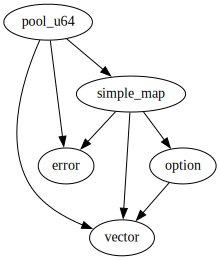

Show all the modules that depend on "pool_u64" directly or indirectly

## Struct `Pool`

<pre><code><b>struct</b> <a href="pool_u64.md#0x1_pool_u64_Pool">Pool</a> <b>has</b> store
</code></pre>

Fields

<dl>
<dt>
<code>shareholders_limit: u64</code>
</dt>
<dd>

</dd>
<dt>
<code>total_coins: u64</code>
</dt>
<dd>

</dd>
<dt>
<code>total_shares: u64</code>
</dt>
<dd>

</dd>
<dt>
<code>shares: <a href="simple_map.md#0x1_simple_map_SimpleMap">simple_map::SimpleMap</a>&lt;<b>address</b>, u64&gt;</code>
</dt>
<dd>

</dd>
<dt>
<code>shareholders: <a href="../../move-stdlib/doc/vector.md#0x1_vector">vector</a>&lt;<b>address</b>&gt;</code>
</dt>
<dd>

</dd>
<dt>
<code>scaling_factor: u64</code>
</dt>
<dd>

</dd>
</dl>

## Constants

<pre><code><b>const</b> <a href="pool_u64.md#0x1_pool_u64_MAX_U64">MAX_U64</a>: u64 = 18446744073709551615;
</code></pre>

Cannot redeem more shares than the shareholder has in the pool.

<pre><code><b>const</b> <a href="pool_u64.md#0x1_pool_u64_EINSUFFICIENT_SHARES">EINSUFFICIENT_SHARES</a>: u64 = 4;
</code></pre>

Cannot destroy non-empty pool.

<pre><code><b>const</b> <a href="pool_u64.md#0x1_pool_u64_EPOOL_IS_NOT_EMPTY">EPOOL_IS_NOT_EMPTY</a>: u64 = 3;
</code></pre>

Pool's total coins cannot exceed u64.max.

<pre><code><b>const</b> <a href="pool_u64.md#0x1_pool_u64_EPOOL_TOTAL_COINS_OVERFLOW">EPOOL_TOTAL_COINS_OVERFLOW</a>: u64 = 6;
</code></pre>

Pool's total shares cannot exceed u64.max.

<pre><code><b>const</b> <a href="pool_u64.md#0x1_pool_u64_EPOOL_TOTAL_SHARES_OVERFLOW">EPOOL_TOTAL_SHARES_OVERFLOW</a>: u64 = 7;
</code></pre>

Shareholder not present in pool.

<pre><code><b>const</b> <a href="pool_u64.md#0x1_pool_u64_ESHAREHOLDER_NOT_FOUND">ESHAREHOLDER_NOT_FOUND</a>: u64 = 1;
</code></pre>

Shareholder cannot have more than u64.max shares.

<pre><code><b>const</b> <a href="pool_u64.md#0x1_pool_u64_ESHAREHOLDER_SHARES_OVERFLOW">ESHAREHOLDER_SHARES_OVERFLOW</a>: u64 = 5;
</code></pre>

There are too many shareholders in the pool.

<pre><code><b>const</b> <a href="pool_u64.md#0x1_pool_u64_ETOO_MANY_SHAREHOLDERS">ETOO_MANY_SHAREHOLDERS</a>: u64 = 2;
</code></pre>

## Function `create`

Create a new pool.

<pre><code><b>public</b> <b>fun</b> <a href="pool_u64.md#0x1_pool_u64_create">create</a>(shareholders_limit: u64): <a href="pool_u64.md#0x1_pool_u64_Pool">pool_u64::Pool</a>
</code></pre>

Implementation

<pre><code><b>public</b> <b>fun</b> <a href="pool_u64.md#0x1_pool_u64_create">create</a>(shareholders_limit: u64): <a href="pool_u64.md#0x1_pool_u64_Pool">Pool</a> {
    // Default <b>to</b> a scaling factor of 1 (effectively no scaling).
    <a href="pool_u64.md#0x1_pool_u64_create_with_scaling_factor">create_with_scaling_factor</a>(shareholders_limit, 1)
}
</code></pre>

Show all the functions that "create" calls

Show all the functions that call "create"

## Function `create_with_scaling_factor`

Create a new pool with custom <code>scaling_factor</code>.

<pre><code><b>public</b> <b>fun</b> <a href="pool_u64.md#0x1_pool_u64_create_with_scaling_factor">create_with_scaling_factor</a>(shareholders_limit: u64, scaling_factor: u64): <a href="pool_u64.md#0x1_pool_u64_Pool">pool_u64::Pool</a>
</code></pre>

Implementation

<pre><code><b>public</b> <b>fun</b> <a href="pool_u64.md#0x1_pool_u64_create_with_scaling_factor">create_with_scaling_factor</a>(shareholders_limit: u64, scaling_factor: u64): <a href="pool_u64.md#0x1_pool_u64_Pool">Pool</a> {
    <a href="pool_u64.md#0x1_pool_u64_Pool">Pool</a> {
        shareholders_limit,
        total_coins: 0,
        total_shares: 0,
        shares: <a href="simple_map.md#0x1_simple_map_create">simple_map::create</a>&lt;<b>address</b>, u64&gt;(),
        shareholders: <a href="../../move-stdlib/doc/vector.md#0x1_vector_empty">vector::empty</a>&lt;<b>address</b>&gt;(),
        scaling_factor,
    }
}
</code></pre>

Show all the functions that "create_with_scaling_factor" calls

Show all the functions that call "create_with_scaling_factor"

## Function `destroy_empty`

Destroy an empty pool. This will fail if the pool has any balance of coins.

<pre><code><b>public</b> <b>fun</b> <a href="pool_u64.md#0x1_pool_u64_destroy_empty">destroy_empty</a>(pool: <a href="pool_u64.md#0x1_pool_u64_Pool">pool_u64::Pool</a>)
</code></pre>

Implementation

<pre><code><b>public</b> <b>fun</b> <a href="pool_u64.md#0x1_pool_u64_destroy_empty">destroy_empty</a>(pool: <a href="pool_u64.md#0x1_pool_u64_Pool">Pool</a>) {
    <b>assert</b>!(pool.total_coins == 0, <a href="../../move-stdlib/doc/error.md#0x1_error_invalid_state">error::invalid_state</a>(<a href="pool_u64.md#0x1_pool_u64_EPOOL_IS_NOT_EMPTY">EPOOL_IS_NOT_EMPTY</a>));
    <b>let</b> <a href="pool_u64.md#0x1_pool_u64_Pool">Pool</a> {
        shareholders_limit: _,
        total_coins: _,
        total_shares: _,
        shares: _,
        shareholders: _,
        scaling_factor: _,
    } = pool;
}
</code></pre>

Show all the functions that "destroy_empty" calls

Show all the functions that call "destroy_empty"

## Function `total_coins`

Return <code>pool</code>'s total balance of coins.

<pre><code><b>public</b> <b>fun</b> <a href="pool_u64.md#0x1_pool_u64_total_coins">total_coins</a>(pool: &<a href="pool_u64.md#0x1_pool_u64_Pool">pool_u64::Pool</a>): u64
</code></pre>

Implementation

<pre><code><b>public</b> <b>fun</b> <a href="pool_u64.md#0x1_pool_u64_total_coins">total_coins</a>(pool: &<a href="pool_u64.md#0x1_pool_u64_Pool">Pool</a>): u64 {
    pool.total_coins
}
</code></pre>

Show all the functions that "total_coins" calls

Show all the functions that call "total_coins"

## Function `total_shares`

Return the total number of shares across all shareholders in <code>pool</code>.

<pre><code><b>public</b> <b>fun</b> <a href="pool_u64.md#0x1_pool_u64_total_shares">total_shares</a>(pool: &<a href="pool_u64.md#0x1_pool_u64_Pool">pool_u64::Pool</a>): u64
</code></pre>

Implementation

<pre><code><b>public</b> <b>fun</b> <a href="pool_u64.md#0x1_pool_u64_total_shares">total_shares</a>(pool: &<a href="pool_u64.md#0x1_pool_u64_Pool">Pool</a>): u64 {
    pool.total_shares
}
</code></pre>

Show all the functions that "total_shares" calls

Show all the functions that call "total_shares"

## Function `contains`

Return true if <code>shareholder</code> is in <code>pool</code>.

<pre><code><b>public</b> <b>fun</b> <a href="pool_u64.md#0x1_pool_u64_contains">contains</a>(pool: &<a href="pool_u64.md#0x1_pool_u64_Pool">pool_u64::Pool</a>, shareholder: <b>address</b>): bool
</code></pre>

Implementation

<pre><code><b>public</b> <b>fun</b> <a href="pool_u64.md#0x1_pool_u64_contains">contains</a>(pool: &<a href="pool_u64.md#0x1_pool_u64_Pool">Pool</a>, shareholder: <b>address</b>): bool {
    <a href="simple_map.md#0x1_simple_map_contains_key">simple_map::contains_key</a>(&pool.shares, &shareholder)
}
</code></pre>

Show all the functions that "contains" calls

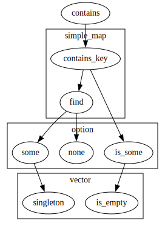

Show all the functions that call "contains"

## Function `shares`

Return the number of shares of <code>stakeholder</code> in <code>pool</code>.

<pre><code><b>public</b> <b>fun</b> <a href="pool_u64.md#0x1_pool_u64_shares">shares</a>(pool: &<a href="pool_u64.md#0x1_pool_u64_Pool">pool_u64::Pool</a>, shareholder: <b>address</b>): u64
</code></pre>

Implementation

<pre><code><b>public</b> <b>fun</b> <a href="pool_u64.md#0x1_pool_u64_shares">shares</a>(pool: &<a href="pool_u64.md#0x1_pool_u64_Pool">Pool</a>, shareholder: <b>address</b>): u64 {
    <b>if</b> (<a href="pool_u64.md#0x1_pool_u64_contains">contains</a>(pool, shareholder)) {
        *<a href="simple_map.md#0x1_simple_map_borrow">simple_map::borrow</a>(&pool.shares, &shareholder)
    } <b>else</b> {
        0
    }
}
</code></pre>

Show all the functions that "shares" calls

Show all the functions that call "shares"

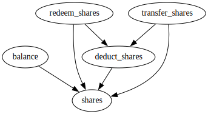

## Function `balance`

Return the balance in coins of <code>shareholder</code> in <code>pool.</code>

<pre><code><b>public</b> <b>fun</b> <a href="pool_u64.md#0x1_pool_u64_balance">balance</a>(pool: &<a href="pool_u64.md#0x1_pool_u64_Pool">pool_u64::Pool</a>, shareholder: <b>address</b>): u64
</code></pre>

Implementation

<pre><code><b>public</b> <b>fun</b> <a href="pool_u64.md#0x1_pool_u64_balance">balance</a>(pool: &<a href="pool_u64.md#0x1_pool_u64_Pool">Pool</a>, shareholder: <b>address</b>): u64 {
    <b>let</b> num_shares = <a href="pool_u64.md#0x1_pool_u64_shares">shares</a>(pool, shareholder);
    <a href="pool_u64.md#0x1_pool_u64_shares_to_amount">shares_to_amount</a>(pool, num_shares)
}
</code></pre>

Show all the functions that "balance" calls

Show all the functions that call "balance"

## Function `shareholders`

Return the list of shareholders in <code>pool</code>.

<pre><code><b>public</b> <b>fun</b> <a href="pool_u64.md#0x1_pool_u64_shareholders">shareholders</a>(pool: &<a href="pool_u64.md#0x1_pool_u64_Pool">pool_u64::Pool</a>): <a href="../../move-stdlib/doc/vector.md#0x1_vector">vector</a>&lt;<b>address</b>&gt;
</code></pre>

Implementation

<pre><code><b>public</b> <b>fun</b> <a href="pool_u64.md#0x1_pool_u64_shareholders">shareholders</a>(pool: &<a href="pool_u64.md#0x1_pool_u64_Pool">Pool</a>): <a href="../../move-stdlib/doc/vector.md#0x1_vector">vector</a>&lt;<b>address</b>&gt; {
    pool.shareholders
}
</code></pre>

Show all the functions that "shareholders" calls

Show all the functions that call "shareholders"

## Function `shareholders_count`

Return the number of shareholders in <code>pool</code>.

<pre><code><b>public</b> <b>fun</b> <a href="pool_u64.md#0x1_pool_u64_shareholders_count">shareholders_count</a>(pool: &<a href="pool_u64.md#0x1_pool_u64_Pool">pool_u64::Pool</a>): u64
</code></pre>

Implementation

<pre><code><b>public</b> <b>fun</b> <a href="pool_u64.md#0x1_pool_u64_shareholders_count">shareholders_count</a>(pool: &<a href="pool_u64.md#0x1_pool_u64_Pool">Pool</a>): u64 {
    <a href="../../move-stdlib/doc/vector.md#0x1_vector_length">vector::length</a>(&pool.shareholders)
}
</code></pre>

Show all the functions that "shareholders_count" calls

Show all the functions that call "shareholders_count"

## Function `update_total_coins`

Update <code>pool</code>'s total balance of coins.

<pre><code><b>public</b> <b>fun</b> <a href="pool_u64.md#0x1_pool_u64_update_total_coins">update_total_coins</a>(pool: &<b>mut</b> <a href="pool_u64.md#0x1_pool_u64_Pool">pool_u64::Pool</a>, new_total_coins: u64)
</code></pre>

Implementation

<pre><code><b>public</b> <b>fun</b> <a href="pool_u64.md#0x1_pool_u64_update_total_coins">update_total_coins</a>(pool: &<b>mut</b> <a href="pool_u64.md#0x1_pool_u64_Pool">Pool</a>, new_total_coins: u64) {
    pool.total_coins = new_total_coins;
}
</code></pre>

Show all the functions that "update_total_coins" calls

Show all the functions that call "update_total_coins"

## Function `buy_in`

Allow an existing or new shareholder to add their coins to the pool in exchange for new shares.

<pre><code><b>public</b> <b>fun</b> <a href="pool_u64.md#0x1_pool_u64_buy_in">buy_in</a>(pool: &<b>mut</b> <a href="pool_u64.md#0x1_pool_u64_Pool">pool_u64::Pool</a>, shareholder: <b>address</b>, coins_amount: u64): u64
</code></pre>

Implementation

<pre><code><b>public</b> <b>fun</b> <a href="pool_u64.md#0x1_pool_u64_buy_in">buy_in</a>(pool: &<b>mut</b> <a href="pool_u64.md#0x1_pool_u64_Pool">Pool</a>, shareholder: <b>address</b>, coins_amount: u64): u64 {
    <b>if</b> (coins_amount == 0) <b>return</b> 0;

    <b>let</b> new_shares = <a href="pool_u64.md#0x1_pool_u64_amount_to_shares">amount_to_shares</a>(pool, coins_amount);
    <b>assert</b>!(<a href="pool_u64.md#0x1_pool_u64_MAX_U64">MAX_U64</a> - pool.total_coins &gt;= coins_amount, <a href="../../move-stdlib/doc/error.md#0x1_error_invalid_argument">error::invalid_argument</a>(<a href="pool_u64.md#0x1_pool_u64_EPOOL_TOTAL_COINS_OVERFLOW">EPOOL_TOTAL_COINS_OVERFLOW</a>));
    <b>assert</b>!(<a href="pool_u64.md#0x1_pool_u64_MAX_U64">MAX_U64</a> - pool.total_shares &gt;= new_shares, <a href="../../move-stdlib/doc/error.md#0x1_error_invalid_argument">error::invalid_argument</a>(<a href="pool_u64.md#0x1_pool_u64_EPOOL_TOTAL_COINS_OVERFLOW">EPOOL_TOTAL_COINS_OVERFLOW</a>));

    pool.total_coins = pool.total_coins + coins_amount;
    pool.total_shares = pool.total_shares + new_shares;
    <a href="pool_u64.md#0x1_pool_u64_add_shares">add_shares</a>(pool, shareholder, new_shares);
    new_shares
}
</code></pre>

Show all the functions that "buy_in" calls

Show all the functions that call "buy_in"

## Function `add_shares`

Add the number of shares directly for <code>shareholder</code> in <code>pool</code>.
This would dilute other shareholders if the pool's balance of coins didn't change.

<pre><code><b>fun</b> <a href="pool_u64.md#0x1_pool_u64_add_shares">add_shares</a>(pool: &<b>mut</b> <a href="pool_u64.md#0x1_pool_u64_Pool">pool_u64::Pool</a>, shareholder: <b>address</b>, new_shares: u64): u64
</code></pre>

Implementation

<pre><code><b>fun</b> <a href="pool_u64.md#0x1_pool_u64_add_shares">add_shares</a>(pool: &<b>mut</b> <a href="pool_u64.md#0x1_pool_u64_Pool">Pool</a>, shareholder: <b>address</b>, new_shares: u64): u64 {
    <b>if</b> (<a href="pool_u64.md#0x1_pool_u64_contains">contains</a>(pool, shareholder)) {
        <b>let</b> existing_shares = <a href="simple_map.md#0x1_simple_map_borrow_mut">simple_map::borrow_mut</a>(&<b>mut</b> pool.shares, &shareholder);
        <b>let</b> current_shares = *existing_shares;
        <b>assert</b>!(<a href="pool_u64.md#0x1_pool_u64_MAX_U64">MAX_U64</a> - current_shares &gt;= new_shares, <a href="../../move-stdlib/doc/error.md#0x1_error_invalid_argument">error::invalid_argument</a>(<a href="pool_u64.md#0x1_pool_u64_ESHAREHOLDER_SHARES_OVERFLOW">ESHAREHOLDER_SHARES_OVERFLOW</a>));

        *existing_shares = current_shares + new_shares;
        *existing_shares
    } <b>else</b> <b>if</b> (new_shares &gt; 0) {
        <b>assert</b>!(
            <a href="../../move-stdlib/doc/vector.md#0x1_vector_length">vector::length</a>(&pool.shareholders) &lt; pool.shareholders_limit,
            <a href="../../move-stdlib/doc/error.md#0x1_error_invalid_state">error::invalid_state</a>(<a href="pool_u64.md#0x1_pool_u64_ETOO_MANY_SHAREHOLDERS">ETOO_MANY_SHAREHOLDERS</a>),
        );

        <a href="../../move-stdlib/doc/vector.md#0x1_vector_push_back">vector::push_back</a>(&<b>mut</b> pool.shareholders, shareholder);
        <a href="simple_map.md#0x1_simple_map_add">simple_map::add</a>(&<b>mut</b> pool.shares, shareholder, new_shares);
        new_shares
    } <b>else</b> {
        new_shares
    }
}
</code></pre>

Show all the functions that "add_shares" calls

Show all the functions that call "add_shares"

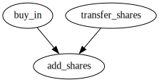

## Function `redeem_shares`

Allow <code>shareholder</code> to redeem their shares in <code>pool</code> for coins.

<pre><code><b>public</b> <b>fun</b> <a href="pool_u64.md#0x1_pool_u64_redeem_shares">redeem_shares</a>(pool: &<b>mut</b> <a href="pool_u64.md#0x1_pool_u64_Pool">pool_u64::Pool</a>, shareholder: <b>address</b>, shares_to_redeem: u64): u64
</code></pre>

Implementation

<pre><code><b>public</b> <b>fun</b> <a href="pool_u64.md#0x1_pool_u64_redeem_shares">redeem_shares</a>(pool: &<b>mut</b> <a href="pool_u64.md#0x1_pool_u64_Pool">Pool</a>, shareholder: <b>address</b>, shares_to_redeem: u64): u64 {
    <b>assert</b>!(<a href="pool_u64.md#0x1_pool_u64_contains">contains</a>(pool, shareholder), <a href="../../move-stdlib/doc/error.md#0x1_error_invalid_argument">error::invalid_argument</a>(<a href="pool_u64.md#0x1_pool_u64_ESHAREHOLDER_NOT_FOUND">ESHAREHOLDER_NOT_FOUND</a>));
    <b>assert</b>!(<a href="pool_u64.md#0x1_pool_u64_shares">shares</a>(pool, shareholder) &gt;= shares_to_redeem, <a href="../../move-stdlib/doc/error.md#0x1_error_invalid_argument">error::invalid_argument</a>(<a href="pool_u64.md#0x1_pool_u64_EINSUFFICIENT_SHARES">EINSUFFICIENT_SHARES</a>));

    <b>if</b> (shares_to_redeem == 0) <b>return</b> 0;

    <b>let</b> redeemed_coins = <a href="pool_u64.md#0x1_pool_u64_shares_to_amount">shares_to_amount</a>(pool, shares_to_redeem);
    pool.total_coins = pool.total_coins - redeemed_coins;
    pool.total_shares = pool.total_shares - shares_to_redeem;
    <a href="pool_u64.md#0x1_pool_u64_deduct_shares">deduct_shares</a>(pool, shareholder, shares_to_redeem);

    redeemed_coins
}
</code></pre>

Show all the functions that "redeem_shares" calls

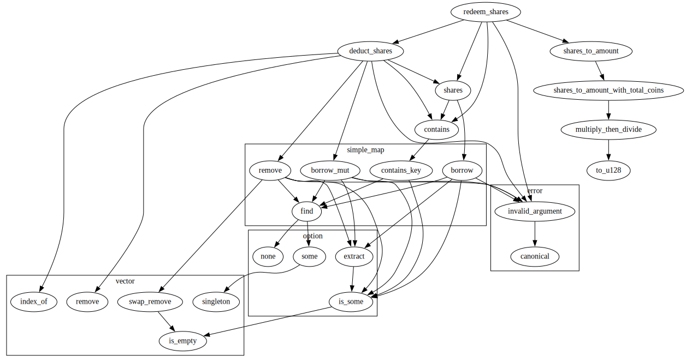

Show all the functions that call "redeem_shares"

## Function `transfer_shares`

Transfer shares from <code>shareholder_1</code> to <code>shareholder_2</code>.

<pre><code><b>public</b> <b>fun</b> <a href="pool_u64.md#0x1_pool_u64_transfer_shares">transfer_shares</a>(pool: &<b>mut</b> <a href="pool_u64.md#0x1_pool_u64_Pool">pool_u64::Pool</a>, shareholder_1: <b>address</b>, shareholder_2: <b>address</b>, shares_to_transfer: u64)
</code></pre>

Implementation

<pre><code><b>public</b> <b>fun</b> <a href="pool_u64.md#0x1_pool_u64_transfer_shares">transfer_shares</a>(
    pool: &<b>mut</b> <a href="pool_u64.md#0x1_pool_u64_Pool">Pool</a>,
    shareholder_1: <b>address</b>,
    shareholder_2: <b>address</b>,
    shares_to_transfer: u64,
) {
    <b>assert</b>!(<a href="pool_u64.md#0x1_pool_u64_contains">contains</a>(pool, shareholder_1), <a href="../../move-stdlib/doc/error.md#0x1_error_invalid_argument">error::invalid_argument</a>(<a href="pool_u64.md#0x1_pool_u64_ESHAREHOLDER_NOT_FOUND">ESHAREHOLDER_NOT_FOUND</a>));
    <b>assert</b>!(<a href="pool_u64.md#0x1_pool_u64_shares">shares</a>(pool, shareholder_1) &gt;= shares_to_transfer, <a href="../../move-stdlib/doc/error.md#0x1_error_invalid_argument">error::invalid_argument</a>(<a href="pool_u64.md#0x1_pool_u64_EINSUFFICIENT_SHARES">EINSUFFICIENT_SHARES</a>));
    <b>if</b> (shares_to_transfer == 0) <b>return</b>;

    <a href="pool_u64.md#0x1_pool_u64_deduct_shares">deduct_shares</a>(pool, shareholder_1, shares_to_transfer);
    <a href="pool_u64.md#0x1_pool_u64_add_shares">add_shares</a>(pool, shareholder_2, shares_to_transfer);
}
</code></pre>

Show all the functions that "transfer_shares" calls

Show all the functions that call "transfer_shares"

## Function `deduct_shares`

Directly deduct <code>shareholder</code>'s number of shares in <code>pool</code> and return the number of remaining shares.

<pre><code><b>fun</b> <a href="pool_u64.md#0x1_pool_u64_deduct_shares">deduct_shares</a>(pool: &<b>mut</b> <a href="pool_u64.md#0x1_pool_u64_Pool">pool_u64::Pool</a>, shareholder: <b>address</b>, num_shares: u64): u64
</code></pre>

Implementation

<pre><code><b>fun</b> <a href="pool_u64.md#0x1_pool_u64_deduct_shares">deduct_shares</a>(pool: &<b>mut</b> <a href="pool_u64.md#0x1_pool_u64_Pool">Pool</a>, shareholder: <b>address</b>, num_shares: u64): u64 {
    <b>assert</b>!(<a href="pool_u64.md#0x1_pool_u64_contains">contains</a>(pool, shareholder), <a href="../../move-stdlib/doc/error.md#0x1_error_invalid_argument">error::invalid_argument</a>(<a href="pool_u64.md#0x1_pool_u64_ESHAREHOLDER_NOT_FOUND">ESHAREHOLDER_NOT_FOUND</a>));
    <b>assert</b>!(<a href="pool_u64.md#0x1_pool_u64_shares">shares</a>(pool, shareholder) &gt;= num_shares, <a href="../../move-stdlib/doc/error.md#0x1_error_invalid_argument">error::invalid_argument</a>(<a href="pool_u64.md#0x1_pool_u64_EINSUFFICIENT_SHARES">EINSUFFICIENT_SHARES</a>));

    <b>let</b> existing_shares = <a href="simple_map.md#0x1_simple_map_borrow_mut">simple_map::borrow_mut</a>(&<b>mut</b> pool.shares, &shareholder);
    *existing_shares = *existing_shares - num_shares;

    // Remove the shareholder completely <b>if</b> they have no shares left.
    <b>let</b> remaining_shares = *existing_shares;
    <b>if</b> (remaining_shares == 0) {
        <b>let</b> (_, shareholder_index) = <a href="../../move-stdlib/doc/vector.md#0x1_vector_index_of">vector::index_of</a>(&pool.shareholders, &shareholder);
        <a href="../../move-stdlib/doc/vector.md#0x1_vector_remove">vector::remove</a>(&<b>mut</b> pool.shareholders, shareholder_index);
        <a href="simple_map.md#0x1_simple_map_remove">simple_map::remove</a>(&<b>mut</b> pool.shares, &shareholder);
    };

    remaining_shares
}
</code></pre>

Show all the functions that "deduct_shares" calls

Show all the functions that call "deduct_shares"

## Function `amount_to_shares`

Return the number of new shares <code>coins_amount</code> can buy in <code>pool</code>.
<code>amount</code> needs to big enough to avoid rounding number.

<pre><code><b>public</b> <b>fun</b> <a href="pool_u64.md#0x1_pool_u64_amount_to_shares">amount_to_shares</a>(pool: &<a href="pool_u64.md#0x1_pool_u64_Pool">pool_u64::Pool</a>, coins_amount: u64): u64
</code></pre>

Implementation

<pre><code><b>public</b> <b>fun</b> <a href="pool_u64.md#0x1_pool_u64_amount_to_shares">amount_to_shares</a>(pool: &<a href="pool_u64.md#0x1_pool_u64_Pool">Pool</a>, coins_amount: u64): u64 {
    <a href="pool_u64.md#0x1_pool_u64_amount_to_shares_with_total_coins">amount_to_shares_with_total_coins</a>(pool, coins_amount, pool.total_coins)
}
</code></pre>

Show all the functions that "amount_to_shares" calls

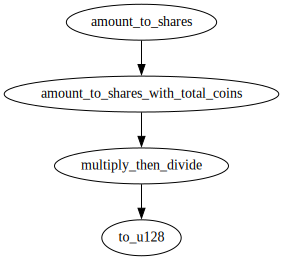

Show all the functions that call "amount_to_shares"

## Function `amount_to_shares_with_total_coins`

Return the number of new shares <code>coins_amount</code> can buy in <code>pool</code> with a custom total coins number.
<code>amount</code> needs to big enough to avoid rounding number.

<pre><code><b>public</b> <b>fun</b> <a href="pool_u64.md#0x1_pool_u64_amount_to_shares_with_total_coins">amount_to_shares_with_total_coins</a>(pool: &<a href="pool_u64.md#0x1_pool_u64_Pool">pool_u64::Pool</a>, coins_amount: u64, total_coins: u64): u64
</code></pre>

Implementation

<pre><code><b>public</b> <b>fun</b> <a href="pool_u64.md#0x1_pool_u64_amount_to_shares_with_total_coins">amount_to_shares_with_total_coins</a>(pool: &<a href="pool_u64.md#0x1_pool_u64_Pool">Pool</a>, coins_amount: u64, total_coins: u64): u64 {
    // No shares yet so amount is worth the same number of shares.
    <b>if</b> (pool.total_coins == 0 || pool.total_shares == 0) {
        // Multiply by scaling factor <b>to</b> minimize rounding errors during <b>internal</b> calculations for buy ins/redeems.
        // This can overflow but scaling factor is expected <b>to</b> be chosen carefully so this would not overflow.
        coins_amount * pool.scaling_factor
    } <b>else</b> {
        // Shares price = total_coins / total existing shares.
        // New number of shares = new_amount / shares_price = new_amount * existing_shares / total_amount.
        // We rearrange the calc and do multiplication first <b>to</b> avoid rounding errors.
        <a href="pool_u64.md#0x1_pool_u64_multiply_then_divide">multiply_then_divide</a>(pool, coins_amount, pool.total_shares, total_coins)
    }
}
</code></pre>

Show all the functions that "amount_to_shares_with_total_coins" calls

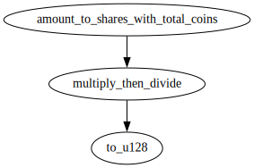

Show all the functions that call "amount_to_shares_with_total_coins"

## Function `shares_to_amount`

Return the number of coins <code>shares</code> are worth in <code>pool</code>.
<code>shares</code> needs to big enough to avoid rounding number.

<pre><code><b>public</b> <b>fun</b> <a href="pool_u64.md#0x1_pool_u64_shares_to_amount">shares_to_amount</a>(pool: &<a href="pool_u64.md#0x1_pool_u64_Pool">pool_u64::Pool</a>, shares: u64): u64
</code></pre>

Implementation

<pre><code><b>public</b> <b>fun</b> <a href="pool_u64.md#0x1_pool_u64_shares_to_amount">shares_to_amount</a>(pool: &<a href="pool_u64.md#0x1_pool_u64_Pool">Pool</a>, shares: u64): u64 {
    <a href="pool_u64.md#0x1_pool_u64_shares_to_amount_with_total_coins">shares_to_amount_with_total_coins</a>(pool, shares, pool.total_coins)
}
</code></pre>

Show all the functions that "shares_to_amount" calls

Show all the functions that call "shares_to_amount"

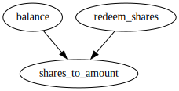

## Function `shares_to_amount_with_total_coins`

Return the number of coins <code>shares</code> are worth in <code>pool</code> with a custom total coins number.
<code>shares</code> needs to big enough to avoid rounding number.

<pre><code><b>public</b> <b>fun</b> <a href="pool_u64.md#0x1_pool_u64_shares_to_amount_with_total_coins">shares_to_amount_with_total_coins</a>(pool: &<a href="pool_u64.md#0x1_pool_u64_Pool">pool_u64::Pool</a>, shares: u64, total_coins: u64): u64
</code></pre>

Implementation

<pre><code><b>public</b> <b>fun</b> <a href="pool_u64.md#0x1_pool_u64_shares_to_amount_with_total_coins">shares_to_amount_with_total_coins</a>(pool: &<a href="pool_u64.md#0x1_pool_u64_Pool">Pool</a>, shares: u64, total_coins: u64): u64 {
    // No shares or coins yet so shares are worthless.
    <b>if</b> (pool.total_coins == 0 || pool.total_shares == 0) {
        0
    } <b>else</b> {
        // Shares price = total_coins / total existing shares.
        // Shares worth = shares * shares price = shares * total_coins / total existing shares.
        // We rearrange the calc and do multiplication first <b>to</b> avoid rounding errors.
        <a href="pool_u64.md#0x1_pool_u64_multiply_then_divide">multiply_then_divide</a>(pool, shares, total_coins, pool.total_shares)
    }
}
</code></pre>

Show all the functions that "shares_to_amount_with_total_coins" calls

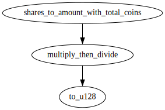

Show all the functions that call "shares_to_amount_with_total_coins"

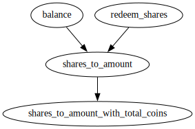

## Function `multiply_then_divide`

<pre><code><b>public</b> <b>fun</b> <a href="pool_u64.md#0x1_pool_u64_multiply_then_divide">multiply_then_divide</a>(_pool: &<a href="pool_u64.md#0x1_pool_u64_Pool">pool_u64::Pool</a>, x: u64, y: u64, z: u64): u64
</code></pre>

Implementation

<pre><code><b>public</b> <b>fun</b> <a href="pool_u64.md#0x1_pool_u64_multiply_then_divide">multiply_then_divide</a>(_pool: &<a href="pool_u64.md#0x1_pool_u64_Pool">Pool</a>, x: u64, y: u64, z: u64): u64 {
    <b>let</b> result = (<a href="pool_u64.md#0x1_pool_u64_to_u128">to_u128</a>(x) * <a href="pool_u64.md#0x1_pool_u64_to_u128">to_u128</a>(y)) / <a href="pool_u64.md#0x1_pool_u64_to_u128">to_u128</a>(z);
    (result <b>as</b> u64)
}
</code></pre>

Show all the functions that "multiply_then_divide" calls

Show all the functions that call "multiply_then_divide"

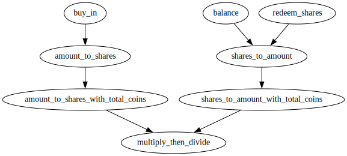

## Function `to_u128`

<pre><code><b>fun</b> <a href="pool_u64.md#0x1_pool_u64_to_u128">to_u128</a>(num: u64): u128
</code></pre>

Implementation

<pre><code><b>fun</b> <a href="pool_u64.md#0x1_pool_u64_to_u128">to_u128</a>(num: u64): u128 {
    (num <b>as</b> u128)
}
</code></pre>

Show all the functions that "to_u128" calls

Show all the functions that call "to_u128"

## Specification

### Struct `Pool`

<pre><code><b>struct</b> <a href="pool_u64.md#0x1_pool_u64_Pool">Pool</a> <b>has</b> store
</code></pre>

<dl>
<dt>
<code>shareholders_limit: u64</code>
</dt>
<dd>

</dd>
<dt>
<code>total_coins: u64</code>
</dt>
<dd>

</dd>
<dt>
<code>total_shares: u64</code>
</dt>
<dd>

</dd>
<dt>
<code>shares: <a href="simple_map.md#0x1_simple_map_SimpleMap">simple_map::SimpleMap</a>&lt;<b>address</b>, u64&gt;</code>
</dt>
<dd>

</dd>
<dt>
<code>shareholders: <a href="../../move-stdlib/doc/vector.md#0x1_vector">vector</a>&lt;<b>address</b>&gt;</code>
</dt>
<dd>

</dd>
<dt>
<code>scaling_factor: u64</code>
</dt>
<dd>

</dd>
</dl>

<pre><code><b>invariant</b> <b>forall</b> addr: <b>address</b>:
    (<a href="simple_map.md#0x1_simple_map_spec_contains_key">simple_map::spec_contains_key</a>(shares, addr) == <a href="../../move-stdlib/doc/vector.md#0x1_vector_spec_contains">vector::spec_contains</a>(shareholders, addr));
<b>invariant</b> <b>forall</b> i in 0..len(shareholders), j in 0..len(shareholders):
    shareholders[i] == shareholders[j] ==&gt; i == j;
</code></pre>

<pre><code><b>fun</b> <a href="pool_u64.md#0x1_pool_u64_spec_contains">spec_contains</a>(pool: <a href="pool_u64.md#0x1_pool_u64_Pool">Pool</a>, shareholder: <b>address</b>): bool {
   <a href="simple_map.md#0x1_simple_map_spec_contains_key">simple_map::spec_contains_key</a>(pool.shares, shareholder)
}
</code></pre>

### Function `contains`

<pre><code><b>public</b> <b>fun</b> <a href="pool_u64.md#0x1_pool_u64_contains">contains</a>(pool: &<a href="pool_u64.md#0x1_pool_u64_Pool">pool_u64::Pool</a>, shareholder: <b>address</b>): bool
</code></pre>

<pre><code><b>aborts_if</b> <b>false</b>;
<b>ensures</b> result == <a href="pool_u64.md#0x1_pool_u64_spec_contains">spec_contains</a>(pool, shareholder);
</code></pre>

<pre><code><b>fun</b> <a href="pool_u64.md#0x1_pool_u64_spec_shares">spec_shares</a>(pool: <a href="pool_u64.md#0x1_pool_u64_Pool">Pool</a>, shareholder: <b>address</b>): u64 {
   <b>if</b> (<a href="simple_map.md#0x1_simple_map_spec_contains_key">simple_map::spec_contains_key</a>(pool.shares, shareholder)) {
       <a href="simple_map.md#0x1_simple_map_spec_get">simple_map::spec_get</a>(pool.shares, shareholder)
   }
   <b>else</b> {
       0
   }
}
</code></pre>

### Function `shares`

<pre><code><b>public</b> <b>fun</b> <a href="pool_u64.md#0x1_pool_u64_shares">shares</a>(pool: &<a href="pool_u64.md#0x1_pool_u64_Pool">pool_u64::Pool</a>, shareholder: <b>address</b>): u64
</code></pre>

<pre><code><b>aborts_if</b> <b>false</b>;
<b>ensures</b> result == <a href="pool_u64.md#0x1_pool_u64_spec_shares">spec_shares</a>(pool, shareholder);
</code></pre>

### Function `balance`

<pre><code><b>public</b> <b>fun</b> <a href="pool_u64.md#0x1_pool_u64_balance">balance</a>(pool: &<a href="pool_u64.md#0x1_pool_u64_Pool">pool_u64::Pool</a>, shareholder: <b>address</b>): u64
</code></pre>

<pre><code><b>let</b> shares = <a href="pool_u64.md#0x1_pool_u64_spec_shares">spec_shares</a>(pool, shareholder);
<b>let</b> total_coins = pool.total_coins;
<b>aborts_if</b> pool.total_coins &gt; 0 && pool.total_shares &gt; 0 && (shares * total_coins) / pool.total_shares &gt; <a href="pool_u64.md#0x1_pool_u64_MAX_U64">MAX_U64</a>;
<b>ensures</b> result == <a href="pool_u64.md#0x1_pool_u64_spec_shares_to_amount_with_total_coins">spec_shares_to_amount_with_total_coins</a>(pool, shares, total_coins);
</code></pre>

### Function `buy_in`

<pre><code><b>public</b> <b>fun</b> <a href="pool_u64.md#0x1_pool_u64_buy_in">buy_in</a>(pool: &<b>mut</b> <a href="pool_u64.md#0x1_pool_u64_Pool">pool_u64::Pool</a>, shareholder: <b>address</b>, coins_amount: u64): u64
</code></pre>

<pre><code><b>let</b> new_shares = <a href="pool_u64.md#0x1_pool_u64_spec_amount_to_shares_with_total_coins">spec_amount_to_shares_with_total_coins</a>(pool, coins_amount, pool.total_coins);
<b>aborts_if</b> pool.total_coins + coins_amount &gt; <a href="pool_u64.md#0x1_pool_u64_MAX_U64">MAX_U64</a>;
<b>aborts_if</b> pool.total_shares + new_shares &gt; <a href="pool_u64.md#0x1_pool_u64_MAX_U64">MAX_U64</a>;
<b>include</b> coins_amount &gt; 0 ==&gt; <a href="pool_u64.md#0x1_pool_u64_AddSharesAbortsIf">AddSharesAbortsIf</a> { new_shares: new_shares };
<b>include</b> coins_amount &gt; 0 ==&gt; <a href="pool_u64.md#0x1_pool_u64_AddSharesEnsures">AddSharesEnsures</a> { new_shares: new_shares };
<b>ensures</b> pool.total_coins == <b>old</b>(pool.total_coins) + coins_amount;
<b>ensures</b> pool.total_shares == <b>old</b>(pool.total_shares) + new_shares;
<b>ensures</b> result == new_shares;
</code></pre>

### Function `add_shares`

<pre><code><b>fun</b> <a href="pool_u64.md#0x1_pool_u64_add_shares">add_shares</a>(pool: &<b>mut</b> <a href="pool_u64.md#0x1_pool_u64_Pool">pool_u64::Pool</a>, shareholder: <b>address</b>, new_shares: u64): u64
</code></pre>

<pre><code><b>include</b> <a href="pool_u64.md#0x1_pool_u64_AddSharesAbortsIf">AddSharesAbortsIf</a>;
<b>include</b> <a href="pool_u64.md#0x1_pool_u64_AddSharesEnsures">AddSharesEnsures</a>;
<b>let</b> key_exists = <a href="simple_map.md#0x1_simple_map_spec_contains_key">simple_map::spec_contains_key</a>(pool.shares, shareholder);
<b>ensures</b> result == <b>if</b> (key_exists) { <a href="simple_map.md#0x1_simple_map_spec_get">simple_map::spec_get</a>(pool.shares, shareholder) }
<b>else</b> { new_shares };
</code></pre>

<pre><code><b>schema</b> <a href="pool_u64.md#0x1_pool_u64_AddSharesAbortsIf">AddSharesAbortsIf</a> {
    pool: <a href="pool_u64.md#0x1_pool_u64_Pool">Pool</a>;
    shareholder: <b>address</b>;
    new_shares: u64;
    <b>let</b> key_exists = <a href="simple_map.md#0x1_simple_map_spec_contains_key">simple_map::spec_contains_key</a>(pool.shares, shareholder);
    <b>let</b> current_shares = <a href="simple_map.md#0x1_simple_map_spec_get">simple_map::spec_get</a>(pool.shares, shareholder);
    <b>aborts_if</b> key_exists && current_shares + new_shares &gt; <a href="pool_u64.md#0x1_pool_u64_MAX_U64">MAX_U64</a>;
    <b>aborts_if</b> !key_exists && new_shares &gt; 0 && len(pool.shareholders) &gt;= pool.shareholders_limit;
}
</code></pre>

<pre><code><b>schema</b> <a href="pool_u64.md#0x1_pool_u64_AddSharesEnsures">AddSharesEnsures</a> {
    pool: <a href="pool_u64.md#0x1_pool_u64_Pool">Pool</a>;
    shareholder: <b>address</b>;
    new_shares: u64;
    <b>let</b> key_exists = <a href="simple_map.md#0x1_simple_map_spec_contains_key">simple_map::spec_contains_key</a>(pool.shares, shareholder);
    <b>let</b> current_shares = <a href="simple_map.md#0x1_simple_map_spec_get">simple_map::spec_get</a>(pool.shares, shareholder);
    <b>ensures</b> key_exists ==&gt;
        pool.shares == <a href="simple_map.md#0x1_simple_map_spec_set">simple_map::spec_set</a>(<b>old</b>(pool.shares), shareholder, current_shares + new_shares);
    <b>ensures</b> (!key_exists && new_shares &gt; 0) ==&gt;
        pool.shares == <a href="simple_map.md#0x1_simple_map_spec_set">simple_map::spec_set</a>(<b>old</b>(pool.shares), shareholder, new_shares);
    <b>ensures</b> (!key_exists && new_shares &gt; 0) ==&gt;
        <a href="../../move-stdlib/doc/vector.md#0x1_vector_eq_push_back">vector::eq_push_back</a>(pool.shareholders, <b>old</b>(pool.shareholders), shareholder);
}
</code></pre>

<pre><code><b>fun</b> <a href="pool_u64.md#0x1_pool_u64_spec_amount_to_shares_with_total_coins">spec_amount_to_shares_with_total_coins</a>(pool: <a href="pool_u64.md#0x1_pool_u64_Pool">Pool</a>, coins_amount: u64, total_coins: u64): u64 {
   <b>if</b> (pool.total_coins == 0 || pool.total_shares == 0) {
       coins_amount * pool.scaling_factor
   }
   <b>else</b> {
       (coins_amount * pool.total_shares) / total_coins
   }
}
</code></pre>

### Function `redeem_shares`

<pre><code><b>public</b> <b>fun</b> <a href="pool_u64.md#0x1_pool_u64_redeem_shares">redeem_shares</a>(pool: &<b>mut</b> <a href="pool_u64.md#0x1_pool_u64_Pool">pool_u64::Pool</a>, shareholder: <b>address</b>, shares_to_redeem: u64): u64
</code></pre>

<pre><code><b>let</b> redeemed_coins = <a href="pool_u64.md#0x1_pool_u64_spec_shares_to_amount_with_total_coins">spec_shares_to_amount_with_total_coins</a>(pool, shares_to_redeem, pool.total_coins);
<b>aborts_if</b> !<a href="pool_u64.md#0x1_pool_u64_spec_contains">spec_contains</a>(pool, shareholder);
<b>aborts_if</b> <a href="pool_u64.md#0x1_pool_u64_spec_shares">spec_shares</a>(pool, shareholder) &lt; shares_to_redeem;
<b>aborts_if</b> pool.<a href="pool_u64.md#0x1_pool_u64_total_coins">total_coins</a> &lt; redeemed_coins;
<b>aborts_if</b> pool.<a href="pool_u64.md#0x1_pool_u64_total_shares">total_shares</a> &lt; shares_to_redeem;
<b>ensures</b> pool.total_coins == <b>old</b>(pool.total_coins) - redeemed_coins;
<b>ensures</b> pool.total_shares == <b>old</b>(pool.total_shares) - shares_to_redeem;
<b>include</b> shares_to_redeem &gt; 0 ==&gt; <a href="pool_u64.md#0x1_pool_u64_DeductSharesEnsures">DeductSharesEnsures</a> { num_shares: shares_to_redeem };
<b>ensures</b> result == redeemed_coins;
</code></pre>

### Function `transfer_shares`

<pre><code><b>public</b> <b>fun</b> <a href="pool_u64.md#0x1_pool_u64_transfer_shares">transfer_shares</a>(pool: &<b>mut</b> <a href="pool_u64.md#0x1_pool_u64_Pool">pool_u64::Pool</a>, shareholder_1: <b>address</b>, shareholder_2: <b>address</b>, shares_to_transfer: u64)
</code></pre>

<pre><code><b>pragma</b> aborts_if_is_partial;
<b>aborts_if</b> !<a href="pool_u64.md#0x1_pool_u64_spec_contains">spec_contains</a>(pool, shareholder_1);
<b>aborts_if</b> <a href="pool_u64.md#0x1_pool_u64_spec_shares">spec_shares</a>(pool, shareholder_1) &lt; shares_to_transfer;
</code></pre>

### Function `deduct_shares`

<pre><code><b>fun</b> <a href="pool_u64.md#0x1_pool_u64_deduct_shares">deduct_shares</a>(pool: &<b>mut</b> <a href="pool_u64.md#0x1_pool_u64_Pool">pool_u64::Pool</a>, shareholder: <b>address</b>, num_shares: u64): u64
</code></pre>

<pre><code><b>aborts_if</b> !<a href="pool_u64.md#0x1_pool_u64_spec_contains">spec_contains</a>(pool, shareholder);
<b>aborts_if</b> <a href="pool_u64.md#0x1_pool_u64_spec_shares">spec_shares</a>(pool, shareholder) &lt; num_shares;
<b>include</b> <a href="pool_u64.md#0x1_pool_u64_DeductSharesEnsures">DeductSharesEnsures</a>;
<b>let</b> remaining_shares = <a href="simple_map.md#0x1_simple_map_spec_get">simple_map::spec_get</a>(pool.shares, shareholder) - num_shares;
<b>ensures</b> remaining_shares &gt; 0 ==&gt; result == <a href="simple_map.md#0x1_simple_map_spec_get">simple_map::spec_get</a>(pool.shares, shareholder);
<b>ensures</b> remaining_shares == 0 ==&gt; result == 0;
</code></pre>

<pre><code><b>schema</b> <a href="pool_u64.md#0x1_pool_u64_DeductSharesEnsures">DeductSharesEnsures</a> {
    pool: <a href="pool_u64.md#0x1_pool_u64_Pool">Pool</a>;
    shareholder: <b>address</b>;
    num_shares: u64;
    <b>let</b> remaining_shares = <a href="simple_map.md#0x1_simple_map_spec_get">simple_map::spec_get</a>(pool.shares, shareholder) - num_shares;
    <b>ensures</b> remaining_shares &gt; 0 ==&gt; <a href="simple_map.md#0x1_simple_map_spec_get">simple_map::spec_get</a>(pool.shares, shareholder) == remaining_shares;
    <b>ensures</b> remaining_shares == 0 ==&gt; !<a href="simple_map.md#0x1_simple_map_spec_contains_key">simple_map::spec_contains_key</a>(pool.shares, shareholder);
    <b>ensures</b> remaining_shares == 0 ==&gt; !<a href="../../move-stdlib/doc/vector.md#0x1_vector_spec_contains">vector::spec_contains</a>(pool.shareholders, shareholder);
}
</code></pre>

### Function `amount_to_shares_with_total_coins`

<pre><code><b>public</b> <b>fun</b> <a href="pool_u64.md#0x1_pool_u64_amount_to_shares_with_total_coins">amount_to_shares_with_total_coins</a>(pool: &<a href="pool_u64.md#0x1_pool_u64_Pool">pool_u64::Pool</a>, coins_amount: u64, total_coins: u64): u64
</code></pre>

<pre><code><b>aborts_if</b> pool.total_coins &gt; 0 && pool.total_shares &gt; 0
    && (coins_amount * pool.total_shares) / total_coins &gt; <a href="pool_u64.md#0x1_pool_u64_MAX_U64">MAX_U64</a>;
<b>aborts_if</b> (pool.total_coins == 0 || pool.total_shares == 0)
    && coins_amount * pool.scaling_factor &gt; <a href="pool_u64.md#0x1_pool_u64_MAX_U64">MAX_U64</a>;
<b>aborts_if</b> pool.total_coins &gt; 0 && pool.total_shares &gt; 0 && total_coins == 0;
<b>ensures</b> result == <a href="pool_u64.md#0x1_pool_u64_spec_amount_to_shares_with_total_coins">spec_amount_to_shares_with_total_coins</a>(pool, coins_amount, total_coins);
</code></pre>

### Function `shares_to_amount_with_total_coins`

<pre><code><b>public</b> <b>fun</b> <a href="pool_u64.md#0x1_pool_u64_shares_to_amount_with_total_coins">shares_to_amount_with_total_coins</a>(pool: &<a href="pool_u64.md#0x1_pool_u64_Pool">pool_u64::Pool</a>, shares: u64, total_coins: u64): u64
</code></pre>

<pre><code><b>aborts_if</b> pool.total_coins &gt; 0 && pool.total_shares &gt; 0
    && (shares * total_coins) / pool.total_shares &gt; <a href="pool_u64.md#0x1_pool_u64_MAX_U64">MAX_U64</a>;
<b>ensures</b> result == <a href="pool_u64.md#0x1_pool_u64_spec_shares_to_amount_with_total_coins">spec_shares_to_amount_with_total_coins</a>(pool, shares, total_coins);
</code></pre>

<pre><code><b>fun</b> <a href="pool_u64.md#0x1_pool_u64_spec_shares_to_amount_with_total_coins">spec_shares_to_amount_with_total_coins</a>(pool: <a href="pool_u64.md#0x1_pool_u64_Pool">Pool</a>, shares: u64, total_coins: u64): u64 {
   <b>if</b> (pool.total_coins == 0 || pool.total_shares == 0) {
       0
   }
   <b>else</b> {
       (shares * total_coins) / pool.total_shares
   }
}
</code></pre>

### Function `multiply_then_divide`

<pre><code><b>public</b> <b>fun</b> <a href="pool_u64.md#0x1_pool_u64_multiply_then_divide">multiply_then_divide</a>(_pool: &<a href="pool_u64.md#0x1_pool_u64_Pool">pool_u64::Pool</a>, x: u64, y: u64, z: u64): u64
</code></pre>

<pre><code><b>aborts_if</b> z == 0;
<b>aborts_if</b> (x * y) / z &gt; <a href="pool_u64.md#0x1_pool_u64_MAX_U64">MAX_U64</a>;
<b>ensures</b> result == (x * y) / z;
</code></pre>

[move-book]: https://move-language.github.io/move/introduction.html
