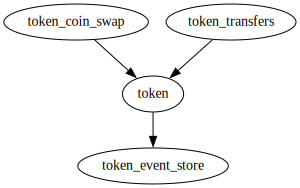
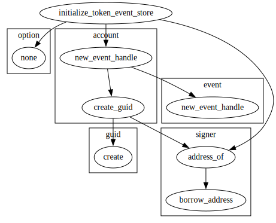
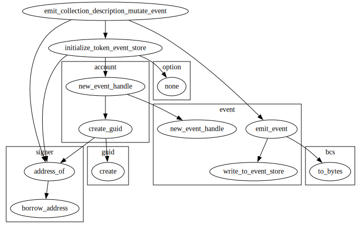
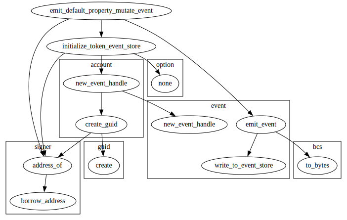
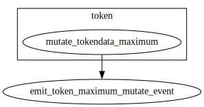

# Module `0x3::token_event_store`

This module provides utils to add and emit new token events that are not in token.move

-  [Struct `CollectionDescriptionMutateEvent`](#0x3_token_event_store_CollectionDescriptionMutateEvent)
-  [Struct `CollectionUriMutateEvent`](#0x3_token_event_store_CollectionUriMutateEvent)
-  [Struct `CollectionMaxiumMutateEvent`](#0x3_token_event_store_CollectionMaxiumMutateEvent)
-  [Struct `OptInTransferEvent`](#0x3_token_event_store_OptInTransferEvent)
-  [Struct `UriMutationEvent`](#0x3_token_event_store_UriMutationEvent)
-  [Struct `DefaultPropertyMutateEvent`](#0x3_token_event_store_DefaultPropertyMutateEvent)
-  [Struct `DescriptionMutateEvent`](#0x3_token_event_store_DescriptionMutateEvent)
-  [Struct `RoyaltyMutateEvent`](#0x3_token_event_store_RoyaltyMutateEvent)
-  [Struct `MaxiumMutateEvent`](#0x3_token_event_store_MaxiumMutateEvent)
-  [Resource `TokenEventStoreV1`](#0x3_token_event_store_TokenEventStoreV1)
-  [Function `initialize_token_event_store`](#0x3_token_event_store_initialize_token_event_store)
-  [Function `emit_collection_uri_mutate_event`](#0x3_token_event_store_emit_collection_uri_mutate_event)
-  [Function `emit_collection_description_mutate_event`](#0x3_token_event_store_emit_collection_description_mutate_event)
-  [Function `emit_collection_maximum_mutate_event`](#0x3_token_event_store_emit_collection_maximum_mutate_event)
-  [Function `emit_token_opt_in_event`](#0x3_token_event_store_emit_token_opt_in_event)
-  [Function `emit_token_uri_mutate_event`](#0x3_token_event_store_emit_token_uri_mutate_event)
-  [Function `emit_default_property_mutate_event`](#0x3_token_event_store_emit_default_property_mutate_event)
-  [Function `emit_token_descrition_mutate_event`](#0x3_token_event_store_emit_token_descrition_mutate_event)
-  [Function `emit_token_royalty_mutate_event`](#0x3_token_event_store_emit_token_royalty_mutate_event)
-  [Function `emit_token_maximum_mutate_event`](#0x3_token_event_store_emit_token_maximum_mutate_event)

<pre><code><b>use</b> <a href="../../aptos-framework/doc/account.md#0x1_account">0x1::account</a>;
<b>use</b> <a href="../../aptos-framework/../aptos-stdlib/doc/any.md#0x1_any">0x1::any</a>;
<b>use</b> <a href="../../aptos-framework/doc/event.md#0x1_event">0x1::event</a>;
<b>use</b> <a href="../../aptos-framework/../aptos-stdlib/../move-stdlib/doc/option.md#0x1_option">0x1::option</a>;
<b>use</b> <a href="../../aptos-framework/../aptos-stdlib/../move-stdlib/doc/signer.md#0x1_signer">0x1::signer</a>;
<b>use</b> <a href="../../aptos-framework/../aptos-stdlib/../move-stdlib/doc/string.md#0x1_string">0x1::string</a>;
<b>use</b> <a href="property_map.md#0x3_property_map">0x3::property_map</a>;
</code></pre>

Show all the modules that "token_event_store" depends on directly or indirectly

Show all the modules that depend on "token_event_store" directly or indirectly

## Struct `CollectionDescriptionMutateEvent`

Event emitted when collection description is mutated

<pre><code><b>struct</b> <a href="token_event_store.md#0x3_token_event_store_CollectionDescriptionMutateEvent">CollectionDescriptionMutateEvent</a> <b>has</b> drop, store
</code></pre>

Fields

<dl>
<dt>
<code>creator_addr: <b>address</b></code>
</dt>
<dd>

</dd>
<dt>
<code>collection_name: <a href="../../aptos-framework/../aptos-stdlib/../move-stdlib/doc/string.md#0x1_string_String">string::String</a></code>
</dt>
<dd>

</dd>
<dt>
<code>old_description: <a href="../../aptos-framework/../aptos-stdlib/../move-stdlib/doc/string.md#0x1_string_String">string::String</a></code>
</dt>
<dd>

</dd>
<dt>
<code>new_description: <a href="../../aptos-framework/../aptos-stdlib/../move-stdlib/doc/string.md#0x1_string_String">string::String</a></code>
</dt>
<dd>

</dd>
</dl>

## Struct `CollectionUriMutateEvent`

Event emitted when collection uri is mutated

<pre><code><b>struct</b> <a href="token_event_store.md#0x3_token_event_store_CollectionUriMutateEvent">CollectionUriMutateEvent</a> <b>has</b> drop, store
</code></pre>

Fields

<dl>
<dt>
<code>creator_addr: <b>address</b></code>
</dt>
<dd>

</dd>
<dt>
<code>collection_name: <a href="../../aptos-framework/../aptos-stdlib/../move-stdlib/doc/string.md#0x1_string_String">string::String</a></code>
</dt>
<dd>

</dd>
<dt>
<code>old_uri: <a href="../../aptos-framework/../aptos-stdlib/../move-stdlib/doc/string.md#0x1_string_String">string::String</a></code>
</dt>
<dd>

</dd>
<dt>
<code>new_uri: <a href="../../aptos-framework/../aptos-stdlib/../move-stdlib/doc/string.md#0x1_string_String">string::String</a></code>
</dt>
<dd>

</dd>
</dl>

## Struct `CollectionMaxiumMutateEvent`

Event emitted when the collection maximum is mutated

<pre><code><b>struct</b> <a href="token_event_store.md#0x3_token_event_store_CollectionMaxiumMutateEvent">CollectionMaxiumMutateEvent</a> <b>has</b> drop, store
</code></pre>

Fields

<dl>
<dt>
<code>creator_addr: <b>address</b></code>
</dt>
<dd>

</dd>
<dt>
<code>collection_name: <a href="../../aptos-framework/../aptos-stdlib/../move-stdlib/doc/string.md#0x1_string_String">string::String</a></code>
</dt>
<dd>

</dd>
<dt>
<code>old_maximum: u64</code>
</dt>
<dd>

</dd>
<dt>
<code>new_maximum: u64</code>
</dt>
<dd>

</dd>
</dl>

## Struct `OptInTransferEvent`

Event emitted when an user opt-in the direct transfer

<pre><code><b>struct</b> <a href="token_event_store.md#0x3_token_event_store_OptInTransferEvent">OptInTransferEvent</a> <b>has</b> drop, store
</code></pre>

Fields

<dl>
<dt>
<code>opt_in: bool</code>
</dt>
<dd>
 True if the user opt in, false if the user opt-out
</dd>
</dl>

## Struct `UriMutationEvent`

Event emitted when the tokendata uri mutates

<pre><code><b>struct</b> <a href="token_event_store.md#0x3_token_event_store_UriMutationEvent">UriMutationEvent</a> <b>has</b> drop, store
</code></pre>

Fields

<dl>
<dt>
<code>creator: <b>address</b></code>
</dt>
<dd>

</dd>
<dt>
<code>collection: <a href="../../aptos-framework/../aptos-stdlib/../move-stdlib/doc/string.md#0x1_string_String">string::String</a></code>
</dt>
<dd>

</dd>
<dt>
<code><a href="token.md#0x3_token">token</a>: <a href="../../aptos-framework/../aptos-stdlib/../move-stdlib/doc/string.md#0x1_string_String">string::String</a></code>
</dt>
<dd>

</dd>
<dt>
<code>old_uri: <a href="../../aptos-framework/../aptos-stdlib/../move-stdlib/doc/string.md#0x1_string_String">string::String</a></code>
</dt>
<dd>

</dd>
<dt>
<code>new_uri: <a href="../../aptos-framework/../aptos-stdlib/../move-stdlib/doc/string.md#0x1_string_String">string::String</a></code>
</dt>
<dd>

</dd>
</dl>

## Struct `DefaultPropertyMutateEvent`

Event emitted when mutating the default the token properties stored at tokendata

<pre><code><b>struct</b> <a href="token_event_store.md#0x3_token_event_store_DefaultPropertyMutateEvent">DefaultPropertyMutateEvent</a> <b>has</b> drop, store
</code></pre>

Fields

<dl>
<dt>
<code>creator: <b>address</b></code>
</dt>
<dd>

</dd>
<dt>
<code>collection: <a href="../../aptos-framework/../aptos-stdlib/../move-stdlib/doc/string.md#0x1_string_String">string::String</a></code>
</dt>
<dd>

</dd>
<dt>
<code><a href="token.md#0x3_token">token</a>: <a href="../../aptos-framework/../aptos-stdlib/../move-stdlib/doc/string.md#0x1_string_String">string::String</a></code>
</dt>
<dd>

</dd>
<dt>
<code>keys: <a href="../../aptos-framework/../aptos-stdlib/../move-stdlib/doc/vector.md#0x1_vector">vector</a>&lt;<a href="../../aptos-framework/../aptos-stdlib/../move-stdlib/doc/string.md#0x1_string_String">string::String</a>&gt;</code>
</dt>
<dd>

</dd>
<dt>
<code>old_values: <a href="../../aptos-framework/../aptos-stdlib/../move-stdlib/doc/vector.md#0x1_vector">vector</a>&lt;<a href="../../aptos-framework/../aptos-stdlib/../move-stdlib/doc/option.md#0x1_option_Option">option::Option</a>&lt;<a href="property_map.md#0x3_property_map_PropertyValue">property_map::PropertyValue</a>&gt;&gt;</code>
</dt>
<dd>
 we allow upsert so the old values might be none
</dd>
<dt>
<code>new_values: <a href="../../aptos-framework/../aptos-stdlib/../move-stdlib/doc/vector.md#0x1_vector">vector</a>&lt;<a href="property_map.md#0x3_property_map_PropertyValue">property_map::PropertyValue</a>&gt;</code>
</dt>
<dd>

</dd>
</dl>

## Struct `DescriptionMutateEvent`

Event emitted when the tokendata description is mutated

<pre><code><b>struct</b> <a href="token_event_store.md#0x3_token_event_store_DescriptionMutateEvent">DescriptionMutateEvent</a> <b>has</b> drop, store
</code></pre>

Fields

<dl>
<dt>
<code>creator: <b>address</b></code>
</dt>
<dd>

</dd>
<dt>
<code>collection: <a href="../../aptos-framework/../aptos-stdlib/../move-stdlib/doc/string.md#0x1_string_String">string::String</a></code>
</dt>
<dd>

</dd>
<dt>
<code><a href="token.md#0x3_token">token</a>: <a href="../../aptos-framework/../aptos-stdlib/../move-stdlib/doc/string.md#0x1_string_String">string::String</a></code>
</dt>
<dd>

</dd>
<dt>
<code>old_description: <a href="../../aptos-framework/../aptos-stdlib/../move-stdlib/doc/string.md#0x1_string_String">string::String</a></code>
</dt>
<dd>

</dd>
<dt>
<code>new_description: <a href="../../aptos-framework/../aptos-stdlib/../move-stdlib/doc/string.md#0x1_string_String">string::String</a></code>
</dt>
<dd>

</dd>
</dl>

## Struct `RoyaltyMutateEvent`

Event emitted when the token royalty is mutated

<pre><code><b>struct</b> <a href="token_event_store.md#0x3_token_event_store_RoyaltyMutateEvent">RoyaltyMutateEvent</a> <b>has</b> drop, store
</code></pre>

Fields

<dl>
<dt>
<code>creator: <b>address</b></code>
</dt>
<dd>

</dd>
<dt>
<code>collection: <a href="../../aptos-framework/../aptos-stdlib/../move-stdlib/doc/string.md#0x1_string_String">string::String</a></code>
</dt>
<dd>

</dd>
<dt>
<code><a href="token.md#0x3_token">token</a>: <a href="../../aptos-framework/../aptos-stdlib/../move-stdlib/doc/string.md#0x1_string_String">string::String</a></code>
</dt>
<dd>

</dd>
<dt>
<code>old_royalty_numerator: u64</code>
</dt>
<dd>

</dd>
<dt>
<code>old_royalty_denominator: u64</code>
</dt>
<dd>

</dd>
<dt>
<code>old_royalty_payee_addr: <b>address</b></code>
</dt>
<dd>

</dd>
<dt>
<code>new_royalty_numerator: u64</code>
</dt>
<dd>

</dd>
<dt>
<code>new_royalty_denominator: u64</code>
</dt>
<dd>

</dd>
<dt>
<code>new_royalty_payee_addr: <b>address</b></code>
</dt>
<dd>

</dd>
</dl>

## Struct `MaxiumMutateEvent`

Event emitted when the token maximum is mutated

<pre><code><b>struct</b> <a href="token_event_store.md#0x3_token_event_store_MaxiumMutateEvent">MaxiumMutateEvent</a> <b>has</b> drop, store
</code></pre>

Fields

<dl>
<dt>
<code>creator: <b>address</b></code>
</dt>
<dd>

</dd>
<dt>
<code>collection: <a href="../../aptos-framework/../aptos-stdlib/../move-stdlib/doc/string.md#0x1_string_String">string::String</a></code>
</dt>
<dd>

</dd>
<dt>
<code><a href="token.md#0x3_token">token</a>: <a href="../../aptos-framework/../aptos-stdlib/../move-stdlib/doc/string.md#0x1_string_String">string::String</a></code>
</dt>
<dd>

</dd>
<dt>
<code>old_maximum: u64</code>
</dt>
<dd>

</dd>
<dt>
<code>new_maximum: u64</code>
</dt>
<dd>

</dd>
</dl>

## Resource `TokenEventStoreV1`

<pre><code><b>struct</b> <a href="token_event_store.md#0x3_token_event_store_TokenEventStoreV1">TokenEventStoreV1</a> <b>has</b> key
</code></pre>

Fields

<dl>
<dt>
<code>collection_uri_mutate_events: <a href="../../aptos-framework/doc/event.md#0x1_event_EventHandle">event::EventHandle</a>&lt;<a href="token_event_store.md#0x3_token_event_store_CollectionUriMutateEvent">token_event_store::CollectionUriMutateEvent</a>&gt;</code>
</dt>
<dd>
 collection mutation events
</dd>
<dt>
<code>collection_maximum_mutate_events: <a href="../../aptos-framework/doc/event.md#0x1_event_EventHandle">event::EventHandle</a>&lt;<a href="token_event_store.md#0x3_token_event_store_CollectionMaxiumMutateEvent">token_event_store::CollectionMaxiumMutateEvent</a>&gt;</code>
</dt>
<dd>

</dd>
<dt>
<code>collection_description_mutate_events: <a href="../../aptos-framework/doc/event.md#0x1_event_EventHandle">event::EventHandle</a>&lt;<a href="token_event_store.md#0x3_token_event_store_CollectionDescriptionMutateEvent">token_event_store::CollectionDescriptionMutateEvent</a>&gt;</code>
</dt>
<dd>

</dd>
<dt>
<code>opt_in_events: <a href="../../aptos-framework/doc/event.md#0x1_event_EventHandle">event::EventHandle</a>&lt;<a href="token_event_store.md#0x3_token_event_store_OptInTransferEvent">token_event_store::OptInTransferEvent</a>&gt;</code>
</dt>
<dd>
 token transfer opt-in event
</dd>
<dt>
<code>uri_mutate_events: <a href="../../aptos-framework/doc/event.md#0x1_event_EventHandle">event::EventHandle</a>&lt;<a href="token_event_store.md#0x3_token_event_store_UriMutationEvent">token_event_store::UriMutationEvent</a>&gt;</code>
</dt>
<dd>
 token mutation events
</dd>
<dt>
<code>default_property_mutate_events: <a href="../../aptos-framework/doc/event.md#0x1_event_EventHandle">event::EventHandle</a>&lt;<a href="token_event_store.md#0x3_token_event_store_DefaultPropertyMutateEvent">token_event_store::DefaultPropertyMutateEvent</a>&gt;</code>
</dt>
<dd>

</dd>
<dt>
<code>description_mutate_events: <a href="../../aptos-framework/doc/event.md#0x1_event_EventHandle">event::EventHandle</a>&lt;<a href="token_event_store.md#0x3_token_event_store_DescriptionMutateEvent">token_event_store::DescriptionMutateEvent</a>&gt;</code>
</dt>
<dd>

</dd>
<dt>
<code>royalty_mutate_events: <a href="../../aptos-framework/doc/event.md#0x1_event_EventHandle">event::EventHandle</a>&lt;<a href="token_event_store.md#0x3_token_event_store_RoyaltyMutateEvent">token_event_store::RoyaltyMutateEvent</a>&gt;</code>
</dt>
<dd>

</dd>
<dt>
<code>maximum_mutate_events: <a href="../../aptos-framework/doc/event.md#0x1_event_EventHandle">event::EventHandle</a>&lt;<a href="token_event_store.md#0x3_token_event_store_MaxiumMutateEvent">token_event_store::MaxiumMutateEvent</a>&gt;</code>
</dt>
<dd>

</dd>
<dt>
<code>extension: <a href="../../aptos-framework/../aptos-stdlib/../move-stdlib/doc/option.md#0x1_option_Option">option::Option</a>&lt;<a href="../../aptos-framework/../aptos-stdlib/doc/any.md#0x1_any_Any">any::Any</a>&gt;</code>
</dt>
<dd>
 This is for adding new events in future
</dd>
</dl>

## Function `initialize_token_event_store`

<pre><code><b>fun</b> <a href="token_event_store.md#0x3_token_event_store_initialize_token_event_store">initialize_token_event_store</a>(acct: &<a href="../../aptos-framework/../aptos-stdlib/../move-stdlib/doc/signer.md#0x1_signer">signer</a>)
</code></pre>

Implementation

<pre><code><b>fun</b> <a href="token_event_store.md#0x3_token_event_store_initialize_token_event_store">initialize_token_event_store</a>(acct: &<a href="../../aptos-framework/../aptos-stdlib/../move-stdlib/doc/signer.md#0x1_signer">signer</a>){
    <b>if</b> (!<b>exists</b>&lt;<a href="token_event_store.md#0x3_token_event_store_TokenEventStoreV1">TokenEventStoreV1</a>&gt;(<a href="../../aptos-framework/../aptos-stdlib/../move-stdlib/doc/signer.md#0x1_signer_address_of">signer::address_of</a>(acct))) {
        <b>move_to</b>(acct, <a href="token_event_store.md#0x3_token_event_store_TokenEventStoreV1">TokenEventStoreV1</a> {
            collection_uri_mutate_events: <a href="../../aptos-framework/doc/account.md#0x1_account_new_event_handle">account::new_event_handle</a>&lt;<a href="token_event_store.md#0x3_token_event_store_CollectionUriMutateEvent">CollectionUriMutateEvent</a>&gt;(acct),
            collection_maximum_mutate_events: <a href="../../aptos-framework/doc/account.md#0x1_account_new_event_handle">account::new_event_handle</a>&lt;<a href="token_event_store.md#0x3_token_event_store_CollectionMaxiumMutateEvent">CollectionMaxiumMutateEvent</a>&gt;(acct),
            collection_description_mutate_events: <a href="../../aptos-framework/doc/account.md#0x1_account_new_event_handle">account::new_event_handle</a>&lt;<a href="token_event_store.md#0x3_token_event_store_CollectionDescriptionMutateEvent">CollectionDescriptionMutateEvent</a>&gt;(acct),
            opt_in_events: <a href="../../aptos-framework/doc/account.md#0x1_account_new_event_handle">account::new_event_handle</a>&lt;<a href="token_event_store.md#0x3_token_event_store_OptInTransferEvent">OptInTransferEvent</a>&gt;(acct),
            uri_mutate_events: <a href="../../aptos-framework/doc/account.md#0x1_account_new_event_handle">account::new_event_handle</a>&lt;<a href="token_event_store.md#0x3_token_event_store_UriMutationEvent">UriMutationEvent</a>&gt;(acct),
            default_property_mutate_events: <a href="../../aptos-framework/doc/account.md#0x1_account_new_event_handle">account::new_event_handle</a>&lt;<a href="token_event_store.md#0x3_token_event_store_DefaultPropertyMutateEvent">DefaultPropertyMutateEvent</a>&gt;(acct),
            description_mutate_events: <a href="../../aptos-framework/doc/account.md#0x1_account_new_event_handle">account::new_event_handle</a>&lt;<a href="token_event_store.md#0x3_token_event_store_DescriptionMutateEvent">DescriptionMutateEvent</a>&gt;(acct),
            royalty_mutate_events: <a href="../../aptos-framework/doc/account.md#0x1_account_new_event_handle">account::new_event_handle</a>&lt;<a href="token_event_store.md#0x3_token_event_store_RoyaltyMutateEvent">RoyaltyMutateEvent</a>&gt;(acct),
            maximum_mutate_events: <a href="../../aptos-framework/doc/account.md#0x1_account_new_event_handle">account::new_event_handle</a>&lt;<a href="token_event_store.md#0x3_token_event_store_MaxiumMutateEvent">MaxiumMutateEvent</a>&gt;(acct),
            extension: <a href="../../aptos-framework/../aptos-stdlib/../move-stdlib/doc/option.md#0x1_option_none">option::none</a>&lt;Any&gt;(),
        });
    };
}
</code></pre>

Show all the functions that "initialize_token_event_store" calls

Show all the functions that call "initialize_token_event_store"

## Function `emit_collection_uri_mutate_event`

Emit the collection uri mutation event

<pre><code><b>public</b>(<b>friend</b>) <b>fun</b> <a href="token_event_store.md#0x3_token_event_store_emit_collection_uri_mutate_event">emit_collection_uri_mutate_event</a>(creator: &<a href="../../aptos-framework/../aptos-stdlib/../move-stdlib/doc/signer.md#0x1_signer">signer</a>, collection: <a href="../../aptos-framework/../aptos-stdlib/../move-stdlib/doc/string.md#0x1_string_String">string::String</a>, old_uri: <a href="../../aptos-framework/../aptos-stdlib/../move-stdlib/doc/string.md#0x1_string_String">string::String</a>, new_uri: <a href="../../aptos-framework/../aptos-stdlib/../move-stdlib/doc/string.md#0x1_string_String">string::String</a>)
</code></pre>

Implementation

<pre><code><b>public</b>(<b>friend</b>) <b>fun</b> <a href="token_event_store.md#0x3_token_event_store_emit_collection_uri_mutate_event">emit_collection_uri_mutate_event</a>(creator: &<a href="../../aptos-framework/../aptos-stdlib/../move-stdlib/doc/signer.md#0x1_signer">signer</a>, collection: String, old_uri: String, new_uri: String) <b>acquires</b> <a href="token_event_store.md#0x3_token_event_store_TokenEventStoreV1">TokenEventStoreV1</a> {
    <b>let</b> <a href="../../aptos-framework/doc/event.md#0x1_event">event</a> = <a href="token_event_store.md#0x3_token_event_store_CollectionUriMutateEvent">CollectionUriMutateEvent</a> {
        creator_addr: <a href="../../aptos-framework/../aptos-stdlib/../move-stdlib/doc/signer.md#0x1_signer_address_of">signer::address_of</a>(creator),
        collection_name: collection,
        old_uri,
        new_uri,
    };
    <a href="token_event_store.md#0x3_token_event_store_initialize_token_event_store">initialize_token_event_store</a>(creator);
    <b>let</b> <a href="token_event_store.md#0x3_token_event_store">token_event_store</a> = <b>borrow_global_mut</b>&lt;<a href="token_event_store.md#0x3_token_event_store_TokenEventStoreV1">TokenEventStoreV1</a>&gt;(<a href="../../aptos-framework/../aptos-stdlib/../move-stdlib/doc/signer.md#0x1_signer_address_of">signer::address_of</a>(creator));
    <a href="../../aptos-framework/doc/event.md#0x1_event_emit_event">event::emit_event</a>&lt;<a href="token_event_store.md#0x3_token_event_store_CollectionUriMutateEvent">CollectionUriMutateEvent</a>&gt;(
        &<b>mut</b> <a href="token_event_store.md#0x3_token_event_store">token_event_store</a>.collection_uri_mutate_events,
        <a href="../../aptos-framework/doc/event.md#0x1_event">event</a>,
    );
}
</code></pre>

Show all the functions that "emit_collection_uri_mutate_event" calls

Show all the functions that call "emit_collection_uri_mutate_event"

## Function `emit_collection_description_mutate_event`

Emit the collection description mutation event

<pre><code><b>public</b>(<b>friend</b>) <b>fun</b> <a href="token_event_store.md#0x3_token_event_store_emit_collection_description_mutate_event">emit_collection_description_mutate_event</a>(creator: &<a href="../../aptos-framework/../aptos-stdlib/../move-stdlib/doc/signer.md#0x1_signer">signer</a>, collection: <a href="../../aptos-framework/../aptos-stdlib/../move-stdlib/doc/string.md#0x1_string_String">string::String</a>, old_description: <a href="../../aptos-framework/../aptos-stdlib/../move-stdlib/doc/string.md#0x1_string_String">string::String</a>, new_description: <a href="../../aptos-framework/../aptos-stdlib/../move-stdlib/doc/string.md#0x1_string_String">string::String</a>)
</code></pre>

Implementation

<pre><code><b>public</b>(<b>friend</b>) <b>fun</b> <a href="token_event_store.md#0x3_token_event_store_emit_collection_description_mutate_event">emit_collection_description_mutate_event</a>(creator: &<a href="../../aptos-framework/../aptos-stdlib/../move-stdlib/doc/signer.md#0x1_signer">signer</a>, collection: String, old_description: String, new_description: String) <b>acquires</b> <a href="token_event_store.md#0x3_token_event_store_TokenEventStoreV1">TokenEventStoreV1</a> {
    <b>let</b> <a href="../../aptos-framework/doc/event.md#0x1_event">event</a> = <a href="token_event_store.md#0x3_token_event_store_CollectionDescriptionMutateEvent">CollectionDescriptionMutateEvent</a> {
        creator_addr: <a href="../../aptos-framework/../aptos-stdlib/../move-stdlib/doc/signer.md#0x1_signer_address_of">signer::address_of</a>(creator),
        collection_name: collection,
        old_description,
        new_description,
    };
    <a href="token_event_store.md#0x3_token_event_store_initialize_token_event_store">initialize_token_event_store</a>(creator);
    <b>let</b> <a href="token_event_store.md#0x3_token_event_store">token_event_store</a> = <b>borrow_global_mut</b>&lt;<a href="token_event_store.md#0x3_token_event_store_TokenEventStoreV1">TokenEventStoreV1</a>&gt;(<a href="../../aptos-framework/../aptos-stdlib/../move-stdlib/doc/signer.md#0x1_signer_address_of">signer::address_of</a>(creator));
    <a href="../../aptos-framework/doc/event.md#0x1_event_emit_event">event::emit_event</a>&lt;<a href="token_event_store.md#0x3_token_event_store_CollectionDescriptionMutateEvent">CollectionDescriptionMutateEvent</a>&gt;(
        &<b>mut</b> <a href="token_event_store.md#0x3_token_event_store">token_event_store</a>.collection_description_mutate_events,
        <a href="../../aptos-framework/doc/event.md#0x1_event">event</a>,
    );
}
</code></pre>

Show all the functions that "emit_collection_description_mutate_event" calls

Show all the functions that call "emit_collection_description_mutate_event"

## Function `emit_collection_maximum_mutate_event`

Emit the collection maximum mutation event

<pre><code><b>public</b>(<b>friend</b>) <b>fun</b> <a href="token_event_store.md#0x3_token_event_store_emit_collection_maximum_mutate_event">emit_collection_maximum_mutate_event</a>(creator: &<a href="../../aptos-framework/../aptos-stdlib/../move-stdlib/doc/signer.md#0x1_signer">signer</a>, collection: <a href="../../aptos-framework/../aptos-stdlib/../move-stdlib/doc/string.md#0x1_string_String">string::String</a>, old_maximum: u64, new_maximum: u64)
</code></pre>

Implementation

<pre><code><b>public</b>(<b>friend</b>) <b>fun</b> <a href="token_event_store.md#0x3_token_event_store_emit_collection_maximum_mutate_event">emit_collection_maximum_mutate_event</a>(creator: &<a href="../../aptos-framework/../aptos-stdlib/../move-stdlib/doc/signer.md#0x1_signer">signer</a>, collection: String, old_maximum: u64, new_maximum: u64) <b>acquires</b> <a href="token_event_store.md#0x3_token_event_store_TokenEventStoreV1">TokenEventStoreV1</a> {
    <b>let</b> <a href="../../aptos-framework/doc/event.md#0x1_event">event</a> = <a href="token_event_store.md#0x3_token_event_store_CollectionMaxiumMutateEvent">CollectionMaxiumMutateEvent</a> {
        creator_addr: <a href="../../aptos-framework/../aptos-stdlib/../move-stdlib/doc/signer.md#0x1_signer_address_of">signer::address_of</a>(creator),
        collection_name: collection,
        old_maximum,
        new_maximum,
    };
    <a href="token_event_store.md#0x3_token_event_store_initialize_token_event_store">initialize_token_event_store</a>(creator);
    <b>let</b> <a href="token_event_store.md#0x3_token_event_store">token_event_store</a> = <b>borrow_global_mut</b>&lt;<a href="token_event_store.md#0x3_token_event_store_TokenEventStoreV1">TokenEventStoreV1</a>&gt;(<a href="../../aptos-framework/../aptos-stdlib/../move-stdlib/doc/signer.md#0x1_signer_address_of">signer::address_of</a>(creator));
    <a href="../../aptos-framework/doc/event.md#0x1_event_emit_event">event::emit_event</a>&lt;<a href="token_event_store.md#0x3_token_event_store_CollectionMaxiumMutateEvent">CollectionMaxiumMutateEvent</a>&gt;(
        &<b>mut</b> <a href="token_event_store.md#0x3_token_event_store">token_event_store</a>.collection_maximum_mutate_events,
        <a href="../../aptos-framework/doc/event.md#0x1_event">event</a>,
    );
}
</code></pre>

Show all the functions that "emit_collection_maximum_mutate_event" calls

Show all the functions that call "emit_collection_maximum_mutate_event"

## Function `emit_token_opt_in_event`

Emit the direct opt-in event

<pre><code><b>public</b>(<b>friend</b>) <b>fun</b> <a href="token_event_store.md#0x3_token_event_store_emit_token_opt_in_event">emit_token_opt_in_event</a>(<a href="../../aptos-framework/doc/account.md#0x1_account">account</a>: &<a href="../../aptos-framework/../aptos-stdlib/../move-stdlib/doc/signer.md#0x1_signer">signer</a>, opt_in: bool)
</code></pre>

Implementation

<pre><code><b>public</b>(<b>friend</b>) <b>fun</b> <a href="token_event_store.md#0x3_token_event_store_emit_token_opt_in_event">emit_token_opt_in_event</a>(<a href="../../aptos-framework/doc/account.md#0x1_account">account</a>: &<a href="../../aptos-framework/../aptos-stdlib/../move-stdlib/doc/signer.md#0x1_signer">signer</a>, opt_in: bool) <b>acquires</b> <a href="token_event_store.md#0x3_token_event_store_TokenEventStoreV1">TokenEventStoreV1</a> {
    <b>let</b> opt_in_event = <a href="token_event_store.md#0x3_token_event_store_OptInTransferEvent">OptInTransferEvent</a> {
      opt_in,
    };
    <a href="token_event_store.md#0x3_token_event_store_initialize_token_event_store">initialize_token_event_store</a>(<a href="../../aptos-framework/doc/account.md#0x1_account">account</a>);
    <b>let</b> <a href="token_event_store.md#0x3_token_event_store">token_event_store</a> = <b>borrow_global_mut</b>&lt;<a href="token_event_store.md#0x3_token_event_store_TokenEventStoreV1">TokenEventStoreV1</a>&gt;(<a href="../../aptos-framework/../aptos-stdlib/../move-stdlib/doc/signer.md#0x1_signer_address_of">signer::address_of</a>(<a href="../../aptos-framework/doc/account.md#0x1_account">account</a>));
    <a href="../../aptos-framework/doc/event.md#0x1_event_emit_event">event::emit_event</a>&lt;<a href="token_event_store.md#0x3_token_event_store_OptInTransferEvent">OptInTransferEvent</a>&gt;(
        &<b>mut</b> <a href="token_event_store.md#0x3_token_event_store">token_event_store</a>.opt_in_events,
        opt_in_event,
    );
}
</code></pre>

Show all the functions that "emit_token_opt_in_event" calls

Show all the functions that call "emit_token_opt_in_event"

## Function `emit_token_uri_mutate_event`

Emit URI mutation event

<pre><code><b>public</b>(<b>friend</b>) <b>fun</b> <a href="token_event_store.md#0x3_token_event_store_emit_token_uri_mutate_event">emit_token_uri_mutate_event</a>(creator: &<a href="../../aptos-framework/../aptos-stdlib/../move-stdlib/doc/signer.md#0x1_signer">signer</a>, collection: <a href="../../aptos-framework/../aptos-stdlib/../move-stdlib/doc/string.md#0x1_string_String">string::String</a>, <a href="token.md#0x3_token">token</a>: <a href="../../aptos-framework/../aptos-stdlib/../move-stdlib/doc/string.md#0x1_string_String">string::String</a>, old_uri: <a href="../../aptos-framework/../aptos-stdlib/../move-stdlib/doc/string.md#0x1_string_String">string::String</a>, new_uri: <a href="../../aptos-framework/../aptos-stdlib/../move-stdlib/doc/string.md#0x1_string_String">string::String</a>)
</code></pre>

Implementation

<pre><code><b>public</b>(<b>friend</b>) <b>fun</b> <a href="token_event_store.md#0x3_token_event_store_emit_token_uri_mutate_event">emit_token_uri_mutate_event</a>(
    creator: &<a href="../../aptos-framework/../aptos-stdlib/../move-stdlib/doc/signer.md#0x1_signer">signer</a>,
    collection: String,
    <a href="token.md#0x3_token">token</a>: String,
    old_uri: String,
    new_uri: String,
) <b>acquires</b> <a href="token_event_store.md#0x3_token_event_store_TokenEventStoreV1">TokenEventStoreV1</a> {
    <b>let</b> creator_addr = <a href="../../aptos-framework/../aptos-stdlib/../move-stdlib/doc/signer.md#0x1_signer_address_of">signer::address_of</a>(creator);

    <b>let</b> <a href="../../aptos-framework/doc/event.md#0x1_event">event</a> = <a href="token_event_store.md#0x3_token_event_store_UriMutationEvent">UriMutationEvent</a> {
        creator: creator_addr,
        collection,
        <a href="token.md#0x3_token">token</a>,
        old_uri,
        new_uri,
    };

    <a href="token_event_store.md#0x3_token_event_store_initialize_token_event_store">initialize_token_event_store</a>(creator);
    <b>let</b> <a href="token_event_store.md#0x3_token_event_store">token_event_store</a> = <b>borrow_global_mut</b>&lt;<a href="token_event_store.md#0x3_token_event_store_TokenEventStoreV1">TokenEventStoreV1</a>&gt;(creator_addr);
    <a href="../../aptos-framework/doc/event.md#0x1_event_emit_event">event::emit_event</a>&lt;<a href="token_event_store.md#0x3_token_event_store_UriMutationEvent">UriMutationEvent</a>&gt;(
        &<b>mut</b> <a href="token_event_store.md#0x3_token_event_store">token_event_store</a>.uri_mutate_events,
        <a href="../../aptos-framework/doc/event.md#0x1_event">event</a>,
    );
}
</code></pre>

Show all the functions that "emit_token_uri_mutate_event" calls

Show all the functions that call "emit_token_uri_mutate_event"

## Function `emit_default_property_mutate_event`

Emit tokendata property map mutation event

<pre><code><b>public</b>(<b>friend</b>) <b>fun</b> <a href="token_event_store.md#0x3_token_event_store_emit_default_property_mutate_event">emit_default_property_mutate_event</a>(creator: &<a href="../../aptos-framework/../aptos-stdlib/../move-stdlib/doc/signer.md#0x1_signer">signer</a>, collection: <a href="../../aptos-framework/../aptos-stdlib/../move-stdlib/doc/string.md#0x1_string_String">string::String</a>, <a href="token.md#0x3_token">token</a>: <a href="../../aptos-framework/../aptos-stdlib/../move-stdlib/doc/string.md#0x1_string_String">string::String</a>, keys: <a href="../../aptos-framework/../aptos-stdlib/../move-stdlib/doc/vector.md#0x1_vector">vector</a>&lt;<a href="../../aptos-framework/../aptos-stdlib/../move-stdlib/doc/string.md#0x1_string_String">string::String</a>&gt;, old_values: <a href="../../aptos-framework/../aptos-stdlib/../move-stdlib/doc/vector.md#0x1_vector">vector</a>&lt;<a href="../../aptos-framework/../aptos-stdlib/../move-stdlib/doc/option.md#0x1_option_Option">option::Option</a>&lt;<a href="property_map.md#0x3_property_map_PropertyValue">property_map::PropertyValue</a>&gt;&gt;, new_values: <a href="../../aptos-framework/../aptos-stdlib/../move-stdlib/doc/vector.md#0x1_vector">vector</a>&lt;<a href="property_map.md#0x3_property_map_PropertyValue">property_map::PropertyValue</a>&gt;)
</code></pre>

Implementation

<pre><code><b>public</b>(<b>friend</b>) <b>fun</b> <a href="token_event_store.md#0x3_token_event_store_emit_default_property_mutate_event">emit_default_property_mutate_event</a>(
    creator: &<a href="../../aptos-framework/../aptos-stdlib/../move-stdlib/doc/signer.md#0x1_signer">signer</a>,
    collection: String,
    <a href="token.md#0x3_token">token</a>: String,
    keys: <a href="../../aptos-framework/../aptos-stdlib/../move-stdlib/doc/vector.md#0x1_vector">vector</a>&lt;String&gt;,
    old_values: <a href="../../aptos-framework/../aptos-stdlib/../move-stdlib/doc/vector.md#0x1_vector">vector</a>&lt;Option&lt;PropertyValue&gt;&gt;,
    new_values: <a href="../../aptos-framework/../aptos-stdlib/../move-stdlib/doc/vector.md#0x1_vector">vector</a>&lt;PropertyValue&gt;,
) <b>acquires</b> <a href="token_event_store.md#0x3_token_event_store_TokenEventStoreV1">TokenEventStoreV1</a> {
    <b>let</b> creator_addr = <a href="../../aptos-framework/../aptos-stdlib/../move-stdlib/doc/signer.md#0x1_signer_address_of">signer::address_of</a>(creator);

    <b>let</b> <a href="../../aptos-framework/doc/event.md#0x1_event">event</a> = <a href="token_event_store.md#0x3_token_event_store_DefaultPropertyMutateEvent">DefaultPropertyMutateEvent</a> {
        creator: creator_addr,
        collection,
        <a href="token.md#0x3_token">token</a>,
        keys,
        old_values,
        new_values,
    };

    <a href="token_event_store.md#0x3_token_event_store_initialize_token_event_store">initialize_token_event_store</a>(creator);
    <b>let</b> <a href="token_event_store.md#0x3_token_event_store">token_event_store</a> = <b>borrow_global_mut</b>&lt;<a href="token_event_store.md#0x3_token_event_store_TokenEventStoreV1">TokenEventStoreV1</a>&gt;(creator_addr);
    <a href="../../aptos-framework/doc/event.md#0x1_event_emit_event">event::emit_event</a>&lt;<a href="token_event_store.md#0x3_token_event_store_DefaultPropertyMutateEvent">DefaultPropertyMutateEvent</a>&gt;(
        &<b>mut</b> <a href="token_event_store.md#0x3_token_event_store">token_event_store</a>.default_property_mutate_events,
        <a href="../../aptos-framework/doc/event.md#0x1_event">event</a>,
    );
}
</code></pre>

Show all the functions that "emit_default_property_mutate_event" calls

Show all the functions that call "emit_default_property_mutate_event"

## Function `emit_token_descrition_mutate_event`

Emit description mutation event

<pre><code><b>public</b>(<b>friend</b>) <b>fun</b> <a href="token_event_store.md#0x3_token_event_store_emit_token_descrition_mutate_event">emit_token_descrition_mutate_event</a>(creator: &<a href="../../aptos-framework/../aptos-stdlib/../move-stdlib/doc/signer.md#0x1_signer">signer</a>, collection: <a href="../../aptos-framework/../aptos-stdlib/../move-stdlib/doc/string.md#0x1_string_String">string::String</a>, <a href="token.md#0x3_token">token</a>: <a href="../../aptos-framework/../aptos-stdlib/../move-stdlib/doc/string.md#0x1_string_String">string::String</a>, old_description: <a href="../../aptos-framework/../aptos-stdlib/../move-stdlib/doc/string.md#0x1_string_String">string::String</a>, new_description: <a href="../../aptos-framework/../aptos-stdlib/../move-stdlib/doc/string.md#0x1_string_String">string::String</a>)
</code></pre>

Implementation

<pre><code><b>public</b>(<b>friend</b>) <b>fun</b> <a href="token_event_store.md#0x3_token_event_store_emit_token_descrition_mutate_event">emit_token_descrition_mutate_event</a>(
    creator: &<a href="../../aptos-framework/../aptos-stdlib/../move-stdlib/doc/signer.md#0x1_signer">signer</a>,
    collection: String,
    <a href="token.md#0x3_token">token</a>: String,
    old_description: String,
    new_description: String,
) <b>acquires</b> <a href="token_event_store.md#0x3_token_event_store_TokenEventStoreV1">TokenEventStoreV1</a> {
    <b>let</b> creator_addr = <a href="../../aptos-framework/../aptos-stdlib/../move-stdlib/doc/signer.md#0x1_signer_address_of">signer::address_of</a>(creator);

    <b>let</b> <a href="../../aptos-framework/doc/event.md#0x1_event">event</a> = <a href="token_event_store.md#0x3_token_event_store_DescriptionMutateEvent">DescriptionMutateEvent</a> {
        creator: creator_addr,
        collection,
        <a href="token.md#0x3_token">token</a>,
        old_description,
        new_description,
    };

    <a href="token_event_store.md#0x3_token_event_store_initialize_token_event_store">initialize_token_event_store</a>(creator);
    <b>let</b> <a href="token_event_store.md#0x3_token_event_store">token_event_store</a> = <b>borrow_global_mut</b>&lt;<a href="token_event_store.md#0x3_token_event_store_TokenEventStoreV1">TokenEventStoreV1</a>&gt;(creator_addr);
    <a href="../../aptos-framework/doc/event.md#0x1_event_emit_event">event::emit_event</a>&lt;<a href="token_event_store.md#0x3_token_event_store_DescriptionMutateEvent">DescriptionMutateEvent</a>&gt;(
        &<b>mut</b> <a href="token_event_store.md#0x3_token_event_store">token_event_store</a>.description_mutate_events,
        <a href="../../aptos-framework/doc/event.md#0x1_event">event</a>,
    );
}
</code></pre>

Show all the functions that "emit_token_descrition_mutate_event" calls

Show all the functions that call "emit_token_descrition_mutate_event"

## Function `emit_token_royalty_mutate_event`

Emit royalty mutation event

<pre><code><b>public</b>(<b>friend</b>) <b>fun</b> <a href="token_event_store.md#0x3_token_event_store_emit_token_royalty_mutate_event">emit_token_royalty_mutate_event</a>(creator: &<a href="../../aptos-framework/../aptos-stdlib/../move-stdlib/doc/signer.md#0x1_signer">signer</a>, collection: <a href="../../aptos-framework/../aptos-stdlib/../move-stdlib/doc/string.md#0x1_string_String">string::String</a>, <a href="token.md#0x3_token">token</a>: <a href="../../aptos-framework/../aptos-stdlib/../move-stdlib/doc/string.md#0x1_string_String">string::String</a>, old_royalty_numerator: u64, old_royalty_denominator: u64, old_royalty_payee_addr: <b>address</b>, new_royalty_numerator: u64, new_royalty_denominator: u64, new_royalty_payee_addr: <b>address</b>)
</code></pre>

Implementation

<pre><code><b>public</b>(<b>friend</b>) <b>fun</b> <a href="token_event_store.md#0x3_token_event_store_emit_token_royalty_mutate_event">emit_token_royalty_mutate_event</a>(
    creator: &<a href="../../aptos-framework/../aptos-stdlib/../move-stdlib/doc/signer.md#0x1_signer">signer</a>,
    collection: String,
    <a href="token.md#0x3_token">token</a>: String,
    old_royalty_numerator: u64,
    old_royalty_denominator: u64,
    old_royalty_payee_addr: <b>address</b>,
    new_royalty_numerator: u64,
    new_royalty_denominator: u64,
    new_royalty_payee_addr: <b>address</b>,
) <b>acquires</b> <a href="token_event_store.md#0x3_token_event_store_TokenEventStoreV1">TokenEventStoreV1</a> {
    <b>let</b> creator_addr = <a href="../../aptos-framework/../aptos-stdlib/../move-stdlib/doc/signer.md#0x1_signer_address_of">signer::address_of</a>(creator);
    <b>let</b> <a href="../../aptos-framework/doc/event.md#0x1_event">event</a> = <a href="token_event_store.md#0x3_token_event_store_RoyaltyMutateEvent">RoyaltyMutateEvent</a> {
        creator: creator_addr,
        collection,
        <a href="token.md#0x3_token">token</a>,
        old_royalty_numerator,
        old_royalty_denominator,
        old_royalty_payee_addr,
        new_royalty_numerator,
        new_royalty_denominator,
        new_royalty_payee_addr,
    };

    <a href="token_event_store.md#0x3_token_event_store_initialize_token_event_store">initialize_token_event_store</a>(creator);
    <b>let</b> <a href="token_event_store.md#0x3_token_event_store">token_event_store</a> = <b>borrow_global_mut</b>&lt;<a href="token_event_store.md#0x3_token_event_store_TokenEventStoreV1">TokenEventStoreV1</a>&gt;(creator_addr);
    <a href="../../aptos-framework/doc/event.md#0x1_event_emit_event">event::emit_event</a>&lt;<a href="token_event_store.md#0x3_token_event_store_RoyaltyMutateEvent">RoyaltyMutateEvent</a>&gt;(
        &<b>mut</b> <a href="token_event_store.md#0x3_token_event_store">token_event_store</a>.royalty_mutate_events,
        <a href="../../aptos-framework/doc/event.md#0x1_event">event</a>,
    );
}
</code></pre>

Show all the functions that "emit_token_royalty_mutate_event" calls

Show all the functions that call "emit_token_royalty_mutate_event"

## Function `emit_token_maximum_mutate_event`

Emit maximum mutation event

<pre><code><b>public</b>(<b>friend</b>) <b>fun</b> <a href="token_event_store.md#0x3_token_event_store_emit_token_maximum_mutate_event">emit_token_maximum_mutate_event</a>(creator: &<a href="../../aptos-framework/../aptos-stdlib/../move-stdlib/doc/signer.md#0x1_signer">signer</a>, collection: <a href="../../aptos-framework/../aptos-stdlib/../move-stdlib/doc/string.md#0x1_string_String">string::String</a>, <a href="token.md#0x3_token">token</a>: <a href="../../aptos-framework/../aptos-stdlib/../move-stdlib/doc/string.md#0x1_string_String">string::String</a>, old_maximum: u64, new_maximum: u64)
</code></pre>

Implementation

<pre><code><b>public</b>(<b>friend</b>) <b>fun</b> <a href="token_event_store.md#0x3_token_event_store_emit_token_maximum_mutate_event">emit_token_maximum_mutate_event</a>(
    creator: &<a href="../../aptos-framework/../aptos-stdlib/../move-stdlib/doc/signer.md#0x1_signer">signer</a>,
    collection: String,
    <a href="token.md#0x3_token">token</a>: String,
    old_maximum: u64,
    new_maximum: u64,
) <b>acquires</b> <a href="token_event_store.md#0x3_token_event_store_TokenEventStoreV1">TokenEventStoreV1</a> {
    <b>let</b> creator_addr = <a href="../../aptos-framework/../aptos-stdlib/../move-stdlib/doc/signer.md#0x1_signer_address_of">signer::address_of</a>(creator);

    <b>let</b> <a href="../../aptos-framework/doc/event.md#0x1_event">event</a> = <a href="token_event_store.md#0x3_token_event_store_MaxiumMutateEvent">MaxiumMutateEvent</a> {
        creator: creator_addr,
        collection,
        <a href="token.md#0x3_token">token</a>,
        old_maximum,
        new_maximum,
    };

    <a href="token_event_store.md#0x3_token_event_store_initialize_token_event_store">initialize_token_event_store</a>(creator);
    <b>let</b> <a href="token_event_store.md#0x3_token_event_store">token_event_store</a> =  <b>borrow_global_mut</b>&lt;<a href="token_event_store.md#0x3_token_event_store_TokenEventStoreV1">TokenEventStoreV1</a>&gt;(creator_addr);
    <a href="../../aptos-framework/doc/event.md#0x1_event_emit_event">event::emit_event</a>&lt;<a href="token_event_store.md#0x3_token_event_store_MaxiumMutateEvent">MaxiumMutateEvent</a>&gt;(
        &<b>mut</b> <a href="token_event_store.md#0x3_token_event_store">token_event_store</a>.maximum_mutate_events,
        <a href="../../aptos-framework/doc/event.md#0x1_event">event</a>,
    );
}
</code></pre>

Show all the functions that "emit_token_maximum_mutate_event" calls

Show all the functions that call "emit_token_maximum_mutate_event"

[move-book]: https://move-language.github.io/move/introduction.html
