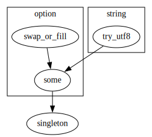
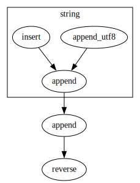
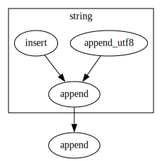
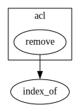
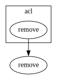
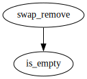

# Module `0x1::vector`

A variable-sized container that can hold any type. Indexing is 0-based, and
vectors are growable. This module has many native functions.
Verification of modules that use this one uses model functions that are implemented
directly in Boogie. The specification language has built-in functions operations such
as <code>singleton_vector</code>. There are some helper functions defined here for specifications in other
modules as well.

>Note: We did not verify most of the
Move functions here because many have loops, requiring loop invariants to prove, and
the return on investment didn't seem worth it for these simple functions.

-  [Constants](#@Constants_0)
-  [Function `empty`](#0x1_vector_empty)
-  [Function `length`](#0x1_vector_length)
-  [Function `borrow`](#0x1_vector_borrow)
-  [Function `push_back`](#0x1_vector_push_back)
-  [Function `borrow_mut`](#0x1_vector_borrow_mut)
-  [Function `pop_back`](#0x1_vector_pop_back)
-  [Function `destroy_empty`](#0x1_vector_destroy_empty)
-  [Function `swap`](#0x1_vector_swap)
-  [Function `singleton`](#0x1_vector_singleton)
-  [Function `reverse`](#0x1_vector_reverse)
-  [Function `append`](#0x1_vector_append)
-  [Function `is_empty`](#0x1_vector_is_empty)
-  [Function `contains`](#0x1_vector_contains)
-  [Function `index_of`](#0x1_vector_index_of)
-  [Function `remove`](#0x1_vector_remove)
-  [Function `swap_remove`](#0x1_vector_swap_remove)
-  [Specification](#@Specification_1)
    -  [Helper Functions](#@Helper_Functions_2)
    -  [Function `singleton`](#@Specification_1_singleton)
    -  [Function `reverse`](#@Specification_1_reverse)
    -  [Function `append`](#@Specification_1_append)
    -  [Function `is_empty`](#@Specification_1_is_empty)
    -  [Function `contains`](#@Specification_1_contains)
    -  [Function `index_of`](#@Specification_1_index_of)
    -  [Function `remove`](#@Specification_1_remove)
    -  [Function `swap_remove`](#@Specification_1_swap_remove)

<pre><code></code></pre>

Show all the modules that "vector" depends on directly or indirectly

Show all the modules that depend on "vector" directly or indirectly

## Constants

The index into the vector is out of bounds

<pre><code><b>const</b> <a href="vector.md#0x1_vector_EINDEX_OUT_OF_BOUNDS">EINDEX_OUT_OF_BOUNDS</a>: u64 = 131072;
</code></pre>

## Function `empty`

Create an empty vector.

<pre><code><b>public</b> <b>fun</b> <a href="vector.md#0x1_vector_empty">empty</a>&lt;Element&gt;(): <a href="vector.md#0x1_vector">vector</a>&lt;Element&gt;
</code></pre>

Implementation

<pre><code><b>native</b> <b>public</b> <b>fun</b> <a href="vector.md#0x1_vector_empty">empty</a>&lt;Element&gt;(): <a href="vector.md#0x1_vector">vector</a>&lt;Element&gt;;
</code></pre>

Show all the functions that "empty" calls

Show all the functions that call "empty"

## Function `length`

Return the length of the vector.

<pre><code><b>public</b> <b>fun</b> <a href="vector.md#0x1_vector_length">length</a>&lt;Element&gt;(v: &<a href="vector.md#0x1_vector">vector</a>&lt;Element&gt;): u64
</code></pre>

Implementation

<pre><code><b>native</b> <b>public</b> <b>fun</b> <a href="vector.md#0x1_vector_length">length</a>&lt;Element&gt;(v: &<a href="vector.md#0x1_vector">vector</a>&lt;Element&gt;): u64;
</code></pre>

Show all the functions that "length" calls

Show all the functions that call "length"

## Function `borrow`

Acquire an immutable reference to the <code>i</code>th element of the vector <code>v</code>.
Aborts if <code>i</code> is out of bounds.

<pre><code><b>public</b> <b>fun</b> <a href="vector.md#0x1_vector_borrow">borrow</a>&lt;Element&gt;(v: &<a href="vector.md#0x1_vector">vector</a>&lt;Element&gt;, i: u64): &Element
</code></pre>

Implementation

<pre><code><b>native</b> <b>public</b> <b>fun</b> <a href="vector.md#0x1_vector_borrow">borrow</a>&lt;Element&gt;(v: &<a href="vector.md#0x1_vector">vector</a>&lt;Element&gt;, i: u64): &Element;
</code></pre>

Show all the functions that "borrow" calls

Show all the functions that call "borrow"

## Function `push_back`

Add element <code>e</code> to the end of the vector <code>v</code>.

<pre><code><b>public</b> <b>fun</b> <a href="vector.md#0x1_vector_push_back">push_back</a>&lt;Element&gt;(v: &<b>mut</b> <a href="vector.md#0x1_vector">vector</a>&lt;Element&gt;, e: Element)
</code></pre>

Implementation

<pre><code><b>native</b> <b>public</b> <b>fun</b> <a href="vector.md#0x1_vector_push_back">push_back</a>&lt;Element&gt;(v: &<b>mut</b> <a href="vector.md#0x1_vector">vector</a>&lt;Element&gt;, e: Element);
</code></pre>

Show all the functions that "push_back" calls

Show all the functions that call "push_back"

## Function `borrow_mut`

Return a mutable reference to the <code>i</code>th element in the vector <code>v</code>.
Aborts if <code>i</code> is out of bounds.

<pre><code><b>public</b> <b>fun</b> <a href="vector.md#0x1_vector_borrow_mut">borrow_mut</a>&lt;Element&gt;(v: &<b>mut</b> <a href="vector.md#0x1_vector">vector</a>&lt;Element&gt;, i: u64): &<b>mut</b> Element
</code></pre>

Implementation

<pre><code><b>native</b> <b>public</b> <b>fun</b> <a href="vector.md#0x1_vector_borrow_mut">borrow_mut</a>&lt;Element&gt;(v: &<b>mut</b> <a href="vector.md#0x1_vector">vector</a>&lt;Element&gt;, i: u64): &<b>mut</b> Element;
</code></pre>

Show all the functions that "borrow_mut" calls

Show all the functions that call "borrow_mut"

## Function `pop_back`

Pop an element from the end of vector <code>v</code>.
Aborts if <code>v</code> is empty.

<pre><code><b>public</b> <b>fun</b> <a href="vector.md#0x1_vector_pop_back">pop_back</a>&lt;Element&gt;(v: &<b>mut</b> <a href="vector.md#0x1_vector">vector</a>&lt;Element&gt;): Element
</code></pre>

Implementation

<pre><code><b>native</b> <b>public</b> <b>fun</b> <a href="vector.md#0x1_vector_pop_back">pop_back</a>&lt;Element&gt;(v: &<b>mut</b> <a href="vector.md#0x1_vector">vector</a>&lt;Element&gt;): Element;
</code></pre>

Show all the functions that "pop_back" calls

Show all the functions that call "pop_back"

## Function `destroy_empty`

Destroy the vector <code>v</code>.
Aborts if <code>v</code> is not empty.

<pre><code><b>public</b> <b>fun</b> <a href="vector.md#0x1_vector_destroy_empty">destroy_empty</a>&lt;Element&gt;(v: <a href="vector.md#0x1_vector">vector</a>&lt;Element&gt;)
</code></pre>

Implementation

<pre><code><b>native</b> <b>public</b> <b>fun</b> <a href="vector.md#0x1_vector_destroy_empty">destroy_empty</a>&lt;Element&gt;(v: <a href="vector.md#0x1_vector">vector</a>&lt;Element&gt;);
</code></pre>

Show all the functions that "destroy_empty" calls

Show all the functions that call "destroy_empty"

## Function `swap`

Swaps the elements at the <code>i</code>th and <code>j</code>th indices in the vector <code>v</code>.
Aborts if <code>i</code> or <code>j</code> is out of bounds.

<pre><code><b>public</b> <b>fun</b> <a href="vector.md#0x1_vector_swap">swap</a>&lt;Element&gt;(v: &<b>mut</b> <a href="vector.md#0x1_vector">vector</a>&lt;Element&gt;, i: u64, j: u64)
</code></pre>

Implementation

<pre><code><b>native</b> <b>public</b> <b>fun</b> <a href="vector.md#0x1_vector_swap">swap</a>&lt;Element&gt;(v: &<b>mut</b> <a href="vector.md#0x1_vector">vector</a>&lt;Element&gt;, i: u64, j: u64);
</code></pre>

Show all the functions that "swap" calls

Show all the functions that call "swap"

## Function `singleton`

Return an vector of size one containing element <code>e</code>.

<pre><code><b>public</b> <b>fun</b> <a href="vector.md#0x1_vector_singleton">singleton</a>&lt;Element&gt;(e: Element): <a href="vector.md#0x1_vector">vector</a>&lt;Element&gt;
</code></pre>

Implementation

<pre><code><b>public</b> <b>fun</b> <a href="vector.md#0x1_vector_singleton">singleton</a>&lt;Element&gt;(e: Element): <a href="vector.md#0x1_vector">vector</a>&lt;Element&gt; {
    <b>let</b> v = <a href="vector.md#0x1_vector_empty">empty</a>();
    <a href="vector.md#0x1_vector_push_back">push_back</a>(&<b>mut</b> v, e);
    v
}
</code></pre>

Show all the functions that "singleton" calls

Show all the functions that call "singleton"

## Function `reverse`

Reverses the order of the elements in the vector <code>v</code> in place.

<pre><code><b>public</b> <b>fun</b> <a href="vector.md#0x1_vector_reverse">reverse</a>&lt;Element&gt;(v: &<b>mut</b> <a href="vector.md#0x1_vector">vector</a>&lt;Element&gt;)
</code></pre>

Implementation

<pre><code><b>public</b> <b>fun</b> <a href="vector.md#0x1_vector_reverse">reverse</a>&lt;Element&gt;(v: &<b>mut</b> <a href="vector.md#0x1_vector">vector</a>&lt;Element&gt;) {
    <b>let</b> len = <a href="vector.md#0x1_vector_length">length</a>(v);
    <b>if</b> (len == 0) <b>return</b> ();

    <b>let</b> front_index = 0;
    <b>let</b> back_index = len -1;
    <b>while</b> (front_index &lt; back_index) {
        <a href="vector.md#0x1_vector_swap">swap</a>(v, front_index, back_index);
        front_index = front_index + 1;
        back_index = back_index - 1;
    }
}
</code></pre>

Show all the functions that "reverse" calls

Show all the functions that call "reverse"

## Function `append`

Pushes all of the elements of the <code>other</code> vector into the <code>lhs</code> vector.

<pre><code><b>public</b> <b>fun</b> <a href="vector.md#0x1_vector_append">append</a>&lt;Element&gt;(lhs: &<b>mut</b> <a href="vector.md#0x1_vector">vector</a>&lt;Element&gt;, other: <a href="vector.md#0x1_vector">vector</a>&lt;Element&gt;)
</code></pre>

Implementation

<pre><code><b>public</b> <b>fun</b> <a href="vector.md#0x1_vector_append">append</a>&lt;Element&gt;(lhs: &<b>mut</b> <a href="vector.md#0x1_vector">vector</a>&lt;Element&gt;, other: <a href="vector.md#0x1_vector">vector</a>&lt;Element&gt;) {
    <a href="vector.md#0x1_vector_reverse">reverse</a>(&<b>mut</b> other);
    <b>while</b> (!<a href="vector.md#0x1_vector_is_empty">is_empty</a>(&other)) <a href="vector.md#0x1_vector_push_back">push_back</a>(lhs, <a href="vector.md#0x1_vector_pop_back">pop_back</a>(&<b>mut</b> other));
    <a href="vector.md#0x1_vector_destroy_empty">destroy_empty</a>(other);
}
</code></pre>

Show all the functions that "append" calls

Show all the functions that call "append"

## Function `is_empty`

Return <code><b>true</b></code> if the vector <code>v</code> has no elements and <code><b>false</b></code> otherwise.

<pre><code><b>public</b> <b>fun</b> <a href="vector.md#0x1_vector_is_empty">is_empty</a>&lt;Element&gt;(v: &<a href="vector.md#0x1_vector">vector</a>&lt;Element&gt;): bool
</code></pre>

Implementation

<pre><code><b>public</b> <b>fun</b> <a href="vector.md#0x1_vector_is_empty">is_empty</a>&lt;Element&gt;(v: &<a href="vector.md#0x1_vector">vector</a>&lt;Element&gt;): bool {
    <a href="vector.md#0x1_vector_length">length</a>(v) == 0
}
</code></pre>

Show all the functions that "is_empty" calls

Show all the functions that call "is_empty"

## Function `contains`

Return true if <code>e</code> is in the vector <code>v</code>.

<pre><code><b>public</b> <b>fun</b> <a href="vector.md#0x1_vector_contains">contains</a>&lt;Element&gt;(v: &<a href="vector.md#0x1_vector">vector</a>&lt;Element&gt;, e: &Element): bool
</code></pre>

Implementation

<pre><code><b>public</b> <b>fun</b> <a href="vector.md#0x1_vector_contains">contains</a>&lt;Element&gt;(v: &<a href="vector.md#0x1_vector">vector</a>&lt;Element&gt;, e: &Element): bool {
    <b>let</b> i = 0;
    <b>let</b> len = <a href="vector.md#0x1_vector_length">length</a>(v);
    <b>while</b> (i &lt; len) {
        <b>if</b> (<a href="vector.md#0x1_vector_borrow">borrow</a>(v, i) == e) <b>return</b> <b>true</b>;
        i = i + 1;
    };
    <b>false</b>
}
</code></pre>

Show all the functions that "contains" calls

Show all the functions that call "contains"

## Function `index_of`

Return <code>(<b>true</b>, i)</code> if <code>e</code> is in the vector <code>v</code> at index <code>i</code>.
Otherwise, returns <code>(<b>false</b>, 0)</code>.

<pre><code><b>public</b> <b>fun</b> <a href="vector.md#0x1_vector_index_of">index_of</a>&lt;Element&gt;(v: &<a href="vector.md#0x1_vector">vector</a>&lt;Element&gt;, e: &Element): (bool, u64)
</code></pre>

Implementation

<pre><code><b>public</b> <b>fun</b> <a href="vector.md#0x1_vector_index_of">index_of</a>&lt;Element&gt;(v: &<a href="vector.md#0x1_vector">vector</a>&lt;Element&gt;, e: &Element): (bool, u64) {
    <b>let</b> i = 0;
    <b>let</b> len = <a href="vector.md#0x1_vector_length">length</a>(v);
    <b>while</b> (i &lt; len) {
        <b>if</b> (<a href="vector.md#0x1_vector_borrow">borrow</a>(v, i) == e) <b>return</b> (<b>true</b>, i);
        i = i + 1;
    };
    (<b>false</b>, 0)
}
</code></pre>

Show all the functions that "index_of" calls

Show all the functions that call "index_of"

## Function `remove`

Remove the <code>i</code>th element of the vector <code>v</code>, shifting all subsequent elements.
This is O(n) and preserves ordering of elements in the vector.
Aborts if <code>i</code> is out of bounds.

<pre><code><b>public</b> <b>fun</b> <a href="vector.md#0x1_vector_remove">remove</a>&lt;Element&gt;(v: &<b>mut</b> <a href="vector.md#0x1_vector">vector</a>&lt;Element&gt;, i: u64): Element
</code></pre>

Implementation

<pre><code><b>public</b> <b>fun</b> <a href="vector.md#0x1_vector_remove">remove</a>&lt;Element&gt;(v: &<b>mut</b> <a href="vector.md#0x1_vector">vector</a>&lt;Element&gt;, i: u64): Element {
    <b>let</b> len = <a href="vector.md#0x1_vector_length">length</a>(v);
    // i out of bounds; <b>abort</b>
    <b>if</b> (i &gt;= len) <b>abort</b> <a href="vector.md#0x1_vector_EINDEX_OUT_OF_BOUNDS">EINDEX_OUT_OF_BOUNDS</a>;

    len = len - 1;
    <b>while</b> (i &lt; len) <a href="vector.md#0x1_vector_swap">swap</a>(v, i, { i = i + 1; i });
    <a href="vector.md#0x1_vector_pop_back">pop_back</a>(v)
}
</code></pre>

Show all the functions that "remove" calls

Show all the functions that call "remove"

## Function `swap_remove`

Swap the <code>i</code>th element of the vector <code>v</code> with the last element and then pop the vector.
This is O(1), but does not preserve ordering of elements in the vector.
Aborts if <code>i</code> is out of bounds.

<pre><code><b>public</b> <b>fun</b> <a href="vector.md#0x1_vector_swap_remove">swap_remove</a>&lt;Element&gt;(v: &<b>mut</b> <a href="vector.md#0x1_vector">vector</a>&lt;Element&gt;, i: u64): Element
</code></pre>

Implementation

<pre><code><b>public</b> <b>fun</b> <a href="vector.md#0x1_vector_swap_remove">swap_remove</a>&lt;Element&gt;(v: &<b>mut</b> <a href="vector.md#0x1_vector">vector</a>&lt;Element&gt;, i: u64): Element {
    <b>assert</b>!(!<a href="vector.md#0x1_vector_is_empty">is_empty</a>(v), <a href="vector.md#0x1_vector_EINDEX_OUT_OF_BOUNDS">EINDEX_OUT_OF_BOUNDS</a>);
    <b>let</b> last_idx = <a href="vector.md#0x1_vector_length">length</a>(v) - 1;
    <a href="vector.md#0x1_vector_swap">swap</a>(v, i, last_idx);
    <a href="vector.md#0x1_vector_pop_back">pop_back</a>(v)
}
</code></pre>

Show all the functions that "swap_remove" calls

Show all the functions that call "swap_remove"

## Specification

### Helper Functions

Check if <code>v1</code> is equal to the result of adding <code>e</code> at the end of <code>v2</code>

<pre><code><b>fun</b> <a href="vector.md#0x1_vector_eq_push_back">eq_push_back</a>&lt;Element&gt;(v1: <a href="vector.md#0x1_vector">vector</a>&lt;Element&gt;, v2: <a href="vector.md#0x1_vector">vector</a>&lt;Element&gt;, e: Element): bool {
    len(v1) == len(v2) + 1 &&
    v1[len(v1)-1] == e &&
    v1[0..len(v1)-1] == v2[0..len(v2)]
}
</code></pre>

Check if <code>v</code> is equal to the result of concatenating <code>v1</code> and <code>v2</code>

<pre><code><b>fun</b> <a href="vector.md#0x1_vector_eq_append">eq_append</a>&lt;Element&gt;(v: <a href="vector.md#0x1_vector">vector</a>&lt;Element&gt;, v1: <a href="vector.md#0x1_vector">vector</a>&lt;Element&gt;, v2: <a href="vector.md#0x1_vector">vector</a>&lt;Element&gt;): bool {
    len(v) == len(v1) + len(v2) &&
    v[0..len(v1)] == v1 &&
    v[len(v1)..len(v)] == v2
}
</code></pre>

Check <code>v1</code> is equal to the result of removing the first element of <code>v2</code>

<pre><code><b>fun</b> <a href="vector.md#0x1_vector_eq_pop_front">eq_pop_front</a>&lt;Element&gt;(v1: <a href="vector.md#0x1_vector">vector</a>&lt;Element&gt;, v2: <a href="vector.md#0x1_vector">vector</a>&lt;Element&gt;): bool {
    len(v1) + 1 == len(v2) &&
    v1 == v2[1..len(v2)]
}
</code></pre>

Check that <code>v1</code> is equal to the result of removing the element at index <code>i</code> from <code>v2</code>.

<pre><code><b>fun</b> <a href="vector.md#0x1_vector_eq_remove_elem_at_index">eq_remove_elem_at_index</a>&lt;Element&gt;(i: u64, v1: <a href="vector.md#0x1_vector">vector</a>&lt;Element&gt;, v2: <a href="vector.md#0x1_vector">vector</a>&lt;Element&gt;): bool {
    len(v1) + 1 == len(v2) &&
    v1[0..i] == v2[0..i] &&
    v1[i..len(v1)] == v2[i + 1..len(v2)]
}
</code></pre>

Check if <code>v</code> contains <code>e</code>.

<pre><code><b>fun</b> <a href="vector.md#0x1_vector_spec_contains">spec_contains</a>&lt;Element&gt;(v: <a href="vector.md#0x1_vector">vector</a>&lt;Element&gt;, e: Element): bool {
    <b>exists</b> x in v: x == e
}
</code></pre>

### Function `singleton`

<pre><code><b>public</b> <b>fun</b> <a href="vector.md#0x1_vector_singleton">singleton</a>&lt;Element&gt;(e: Element): <a href="vector.md#0x1_vector">vector</a>&lt;Element&gt;
</code></pre>

<pre><code><b>aborts_if</b> <b>false</b>;
<b>ensures</b> result == vec(e);
</code></pre>

### Function `reverse`

<pre><code><b>public</b> <b>fun</b> <a href="vector.md#0x1_vector_reverse">reverse</a>&lt;Element&gt;(v: &<b>mut</b> <a href="vector.md#0x1_vector">vector</a>&lt;Element&gt;)
</code></pre>

<pre><code><b>pragma</b> intrinsic = <b>true</b>;
</code></pre>

### Function `append`

<pre><code><b>public</b> <b>fun</b> <a href="vector.md#0x1_vector_append">append</a>&lt;Element&gt;(lhs: &<b>mut</b> <a href="vector.md#0x1_vector">vector</a>&lt;Element&gt;, other: <a href="vector.md#0x1_vector">vector</a>&lt;Element&gt;)
</code></pre>

<pre><code><b>pragma</b> intrinsic = <b>true</b>;
</code></pre>

### Function `is_empty`

<pre><code><b>public</b> <b>fun</b> <a href="vector.md#0x1_vector_is_empty">is_empty</a>&lt;Element&gt;(v: &<a href="vector.md#0x1_vector">vector</a>&lt;Element&gt;): bool
</code></pre>

<pre><code><b>pragma</b> intrinsic = <b>true</b>;
</code></pre>

### Function `contains`

<pre><code><b>public</b> <b>fun</b> <a href="vector.md#0x1_vector_contains">contains</a>&lt;Element&gt;(v: &<a href="vector.md#0x1_vector">vector</a>&lt;Element&gt;, e: &Element): bool
</code></pre>

<pre><code><b>pragma</b> intrinsic = <b>true</b>;
</code></pre>

### Function `index_of`

<pre><code><b>public</b> <b>fun</b> <a href="vector.md#0x1_vector_index_of">index_of</a>&lt;Element&gt;(v: &<a href="vector.md#0x1_vector">vector</a>&lt;Element&gt;, e: &Element): (bool, u64)
</code></pre>

<pre><code><b>pragma</b> intrinsic = <b>true</b>;
</code></pre>

### Function `remove`

<pre><code><b>public</b> <b>fun</b> <a href="vector.md#0x1_vector_remove">remove</a>&lt;Element&gt;(v: &<b>mut</b> <a href="vector.md#0x1_vector">vector</a>&lt;Element&gt;, i: u64): Element
</code></pre>

<pre><code><b>pragma</b> intrinsic = <b>true</b>;
</code></pre>

### Function `swap_remove`

<pre><code><b>public</b> <b>fun</b> <a href="vector.md#0x1_vector_swap_remove">swap_remove</a>&lt;Element&gt;(v: &<b>mut</b> <a href="vector.md#0x1_vector">vector</a>&lt;Element&gt;, i: u64): Element
</code></pre>

<pre><code><b>pragma</b> intrinsic = <b>true</b>;
</code></pre>

[move-book]: https://move-language.github.io/move/introduction.html
